# 1.1 Spring Boot 快速入門

> **第一章導讀**：本章將帶您快速掌握 Spring Boot 的核心概念和開發環境，為後續的 Spring AI 整合學習奠定堅實基礎。

## 🎯 學習目標

完成本章學習後，您將能夠：

- 🎯 **理解 Spring Boot 核心價值**：掌握 Spring Boot 的設計理念和核心優勢
- 🎯 **建立開發環境**：使用 STS4 快速建置專業級開發環境
- 🎯 **建立第一個專案**：使用 Spring Initializr 快速建立專案
- 🎯 **掌握專案結構**：理解 Spring Boot 專案的標準組織方式
- 🎯 **為 Spring AI 做準備**：建立適合 AI 應用開發的基礎架構

---

## 1.1.1 為什麼選擇 Spring Boot？

### Spring Boot 的核心價值

在現代企業級 Java 開發中，Spring Boot 已經成為不可或缺的核心框架，特別是在 AI 應用開發領域。

**傳統 Spring 開發的挑戰**：
- 繁瑣的 XML 配置
- 複雜的依賴管理
- 耗時的環境設定
- 部署配置複雜

**Spring Boot 的解決方案**：
- ✅ **約定優於配置**：減少 90% 的配置工作
- ✅ **自動配置**：智能判斷和配置所需組件
- ✅ **內嵌伺服器**：無需外部伺服器，一鍵啟動
- ✅ **生產就緒**：內建監控、健康檢查等企業級功能
- ✅ **AI 友好**：完美支援 Spring AI 生態系統

### Spring Boot 核心特性

```java
// 傳統 Spring 需要大量配置
// Spring Boot 只需要一個註解
@SpringBootApplication
public class DemoApplication {
    public static void main(String[] args) {
        SpringApplication.run(DemoApplication.class, args);
    }
}
```

**核心設計原則**：
1. **約定優於配置**：遵循標準約定，減少配置工作
2. **開箱即用**：提供預設配置，快速啟動專案
3. **無程式碼生成**：不依賴程式碼生成，保持程式碼清晰
4. **無 XML 配置**：使用註解和 Java 配置

---

## 1.1.2 建立開發環境

### 為什麼選擇 STS4？

STS4 (Spring Tool Suite 4) 是專為 Spring 開發優化的 IDE，特別適合 Spring Boot 和 Spring AI 開發：

**STS4 的優勢**：
- 內建 Spring Initializr 支援
- 智能程式碼提示和自動完成
- 內建 Spring Boot 除錯工具
- 完整的 Spring 生態系統支援
- 為 Spring AI 開發優化

### 環境需求

| 組件 | 版本要求 | 說明 |
|------|----------|------|
| **JDK** | 17 或 21 | Spring Boot 3.x 最低要求 |
| **STS4** | 最新版本 | 內建 Spring Boot 支援 |
| **Maven** | 3.6+ | 內建於 STS4 |
| **記憶體** | 8GB+ | 推薦配置 |

### 安裝步驟

**1. 下載並安裝 JDK**
- 訪問 [Oracle JDK](https://www.oracle.com/java/technologies/downloads/) 或 [OpenJDK](https://openjdk.org/)
- 下載 JDK 17 或 21
- 設定 JAVA_HOME 環境變數

**2. 下載並安裝 STS4**
- 訪問 [Spring Tools 官網](https://spring.io/tools)
- 下載適合您作業系統的版本
- 解壓縮並啟動 STS4

---

## 1.1.3 建立第一個 Spring Boot 專案

### 使用 STS4 內建的 Spring Initializr

**步驟 1：建立新專案**
1. 開啟 STS4
2. 選擇 `File` → `New` → `Spring Starter Project`
3. 或使用快捷鍵 `Ctrl+N`，選擇 `Spring Starter Project`

**步驟 2：專案基本設定**
```
專案設定：
- Name: spring-boot-demo
- Group: com.example.demo
- Artifact: spring-boot-demo
- Package: com.example.demo
- Java Version: 17 或 21
- Packaging: Jar
- Spring Boot Version: 3.2.x (最新穩定版)
```

**步驟 3：選擇依賴**
```
基礎依賴：
☑ Spring Web - 建立 RESTful API
☑ Spring Boot DevTools - 開發工具
☑ Lombok - 簡化程式碼
☑ Validation - 資料驗證
```

**步驟 4：完成建立**
- 點擊 `Finish`
- STS4 會自動下載依賴並建立專案

### 專案結構解析

```
spring-boot-demo/
├── src/main/java/
│   └── com/example/demo/
│       └── DemoApplication.java     # 主程式入口
├── src/main/resources/
│   ├── application.yml              # 配置檔案
│   └── static/                      # 靜態資源
├── src/test/java/                   # 測試程式碼
├── pom.xml                          # Maven 配置
└── README.md                        # 專案說明
```

**核心檔案說明**：

**1. DemoApplication.java**
```java
@SpringBootApplication
public class DemoApplication {
    public static void main(String[] args) {
        SpringApplication.run(DemoApplication.class, args);
    }
}
```

**2. pom.xml**
```xml
<?xml version="1.0" encoding="UTF-8"?>
<project xmlns="http://maven.apache.org/POM/4.0.0">
    <modelVersion>4.0.0</modelVersion>
    
    <parent>
        <groupId>org.springframework.boot</groupId>
        <artifactId>spring-boot-starter-parent</artifactId>
        <version>3.2.0</version>
        <relativePath/>
    </parent>
    
    <groupId>com.example.demo</groupId>
    <artifactId>spring-boot-demo</artifactId>
    <version>0.0.1-SNAPSHOT</version>
    <name>spring-boot-demo</name>
    
    <properties>
        <java.version>17</java.version>
    </properties>
    
    <dependencies>
        <dependency>
            <groupId>org.springframework.boot</groupId>
            <artifactId>spring-boot-starter-web</artifactId>
        </dependency>
        
        <dependency>
            <groupId>org.springframework.boot</groupId>
            <artifactId>spring-boot-devtools</artifactId>
            <scope>runtime</scope>
            <optional>true</optional>
        </dependency>
        
        <dependency>
            <groupId>org.springframework.boot</groupId>
            <artifactId>spring-boot-starter-test</artifactId>
            <scope>test</scope>
        </dependency>
    </dependencies>
    
    <build>
        <plugins>
            <plugin>
                <groupId>org.springframework.boot</groupId>
                <artifactId>spring-boot-maven-plugin</artifactId>
            </plugin>
        </plugins>
    </build>
</project>
```

---

## 1.1.4 第一次啟動

### 啟動應用程式

**方法一：在 STS4 中啟動**
1. 右鍵點擊 `DemoApplication.java`
2. 選擇 `Run As` → `Spring Boot App`

**方法二：使用 Maven 命令**
```bash
# 在專案根目錄執行
mvn spring-boot:run
```

**方法三：使用 Java 命令**
```bash
# 先編譯
mvn clean package

# 執行 JAR 檔案
java -jar target/spring-boot-demo-0.0.1-SNAPSHOT.jar
```

### 驗證啟動成功

**控制台輸出**：
```
  .   ____          _            __ _ _
 /\\ / ___'_ __ _ _(_)_ __  __ _ \ \ \ \
( ( )\___ | '_ | '_| | '_ \/ _` | \ \ \ \
 \\/  ___)| |_)| | | | | || (_| |  ) ) ) )
  '  |____| .__|_| |_|_| |_\__, | / / / /
 =========|_|==============|___/=/_/_/_/
 :: Spring Boot ::                (v3.2.0)

2024-01-15 10:30:00.123  INFO 12345 --- [main] c.e.demo.DemoApplication
Started DemoApplication in 2.345 seconds (JVM running for 3.456)
```

**瀏覽器測試**：
- 開啟瀏覽器
- 訪問 `http://localhost:8080`
- 看到 Whitelabel Error Page 表示啟動成功（因為還沒有定義任何端點）

---

## 1.1.5 為 Spring AI 做準備

### AI 應用的特殊需求

在設計 Spring Boot 應用時，我們需要考慮 Spring AI 的特殊需求：

**配置管理**：
```yaml
# application.yml - 為 AI 服務預留配置
spring:
  application:
    name: spring-boot-demo
  profiles:
    active: dev

# AI 服務配置預留
ai:
  openai:
    api-key: ${OPENAI_API_KEY:}
    model: gpt-3.5-turbo
  timeout: 30s
  max-tokens: 1000
```

**依賴準備**：
```xml
<!-- 為未來的 Spring AI 整合預留 -->
<dependencies>
    <!-- 基礎 Web 支援 -->
    <dependency>
        <groupId>org.springframework.boot</groupId>
        <artifactId>spring-boot-starter-web</artifactId>
    </dependency>
    
    <!-- 資料驗證 -->
    <dependency>
        <groupId>org.springframework.boot</groupId>
        <artifactId>spring-boot-starter-validation</artifactId>
    </dependency>
    
    <!-- JSON 處理 -->
    <dependency>
        <groupId>com.fasterxml.jackson.core</groupId>
        <artifactId>jackson-databind</artifactId>
    </dependency>
    
    <!-- 開發工具 -->
    <dependency>
        <groupId>org.springframework.boot</groupId>
        <artifactId>spring-boot-devtools</artifactId>
        <scope>runtime</scope>
        <optional>true</optional>
    </dependency>
</dependencies>
```

**架構設計考量**：
```java
// 為 AI 服務預留的控制器結構
@RestController
@RequestMapping("/api")
public class DemoController {
    
    @GetMapping("/health")
    public Map<String, String> health() {
        Map<String, String> status = new HashMap<>();
        status.put("status", "UP");
        status.put("timestamp", LocalDateTime.now().toString());
        return status;
    }
    
    // 為未來的 AI 端點預留
    @PostMapping("/ai/chat")
    public ResponseEntity<String> chat(@RequestBody String message) {
        // 預留給 Spring AI 整合
        return ResponseEntity.ok("準備整合 Spring AI");
    }
}
```

### 開發最佳實踐

**1. 專案結構規劃**

```mermaid
graph TD
    A[src/main/java/com/example/demo/] --> B[DemoApplication.java]
    A --> C[controller/]
    A --> D[service/]
    A --> E[model/]
    A --> F[config/]
    A --> G[ai/]

    C -.-> C1[API 控制器]
    D -.-> D1[業務邏輯]
    E -.-> E1[資料模型]
    F -.-> F1[配置類別]
    G -.-> G1[AI 服務相關（預留）]

    style A fill:#e1f5ff
    style B fill:#fff4e1
    style C fill:#f0f0f0
    style D fill:#f0f0f0
    style E fill:#f0f0f0
    style F fill:#f0f0f0
    style G fill:#f0f0f0
```



**2. 配置檔案組織**
```
src/main/resources/
├── application.yml              # 主配置
├── application-dev.yml          # 開發環境
├── application-prod.yml         # 生產環境
└── ai/                         # AI 相關配置（預留）
```

**3. 環境變數管理**
```bash
# 開發環境變數
export SPRING_PROFILES_ACTIVE=dev
export OPENAI_API_KEY=your-api-key
export LOG_LEVEL=DEBUG
```

---

## 📝 本章重點回顧

1. **Spring Boot 核心價值**：理解了約定優於配置的設計理念
2. **開發環境建置**：成功安裝並配置 STS4 開發環境
3. **專案建立**：掌握了使用 Spring Initializr 快速建立專案
4. **專案結構**：了解了 Spring Boot 的標準專案組織方式
5. **AI 整合準備**：為後續 Spring AI 學習奠定了基礎架構

### 下一步學習方向

在下一章中，我們將學習專案架構與配置管理，深入了解如何組織和配置一個生產級的 Spring Boot 應用。

---

**參考資料：**
- [Spring Boot Official Guide](https://spring.io/guides/gs/spring-boot/)
- [Spring Tools 4 Documentation](https://github.com/spring-projects/sts4)
- [Spring Initializr](https://start.spring.io/)