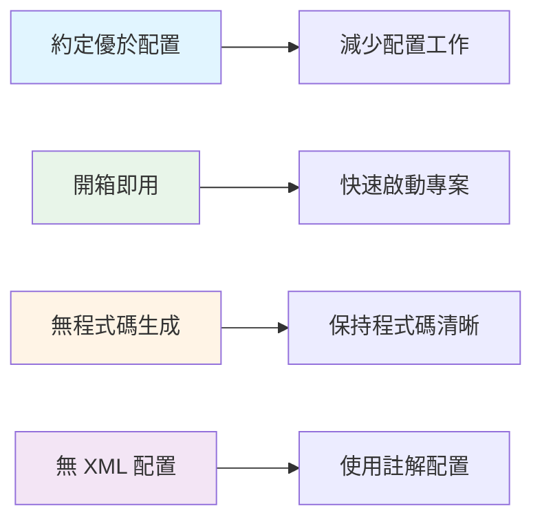
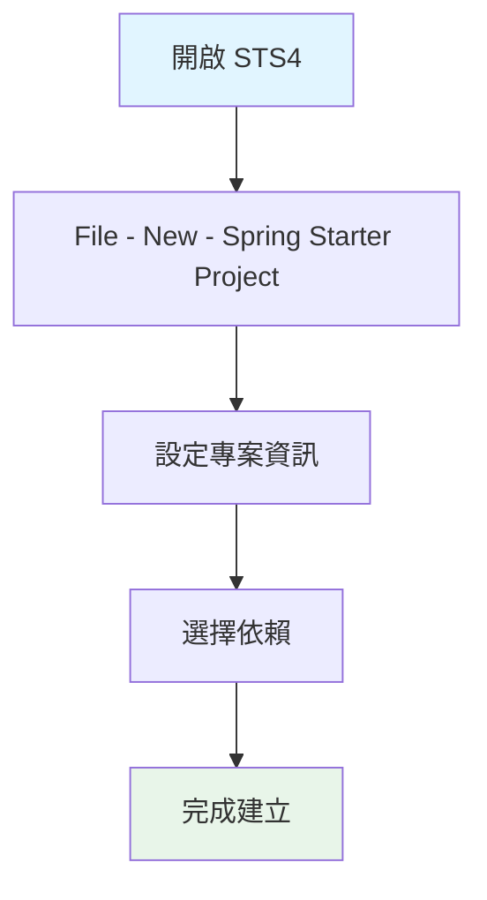
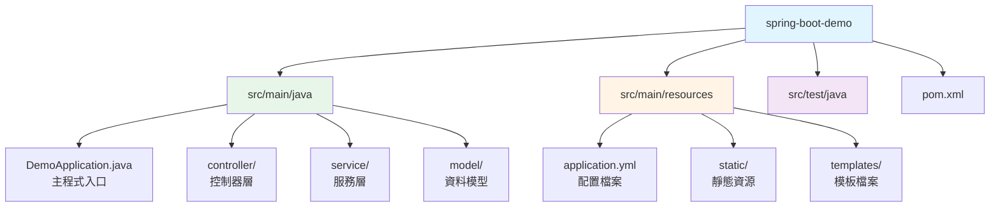
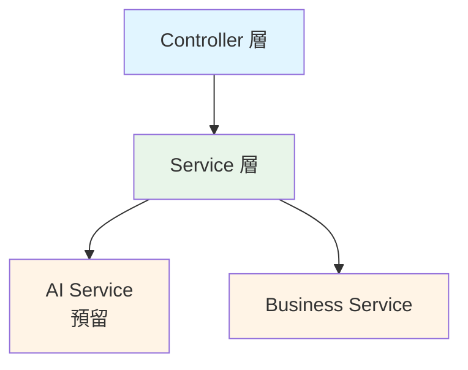

# 1.1 Spring Boot 快速入門

> **對應範例**: `chapter1-spring-boot-basics`
> **難度**: ⭐⭐☆☆☆

---

## 📚 本章概要

本章將帶您快速掌握 Spring Boot 的核心概念和開發環境，為後續的 Spring AI 整合學習奠定堅實基礎。Spring Boot 是現代 Java 企業級開發的首選框架，特別是在 AI 應用開發領域，它提供了完善的生態系統和開箱即用的功能。

**學習目標**:
- 理解 Spring Boot 的設計理念和核心價值
- 建立專業級開發環境（JDK 21 + STS4）
- 使用 Spring Initializr 快速建立專案
- 掌握 Spring Boot 專案的標準結構
- 為 Spring AI 整合做好準備

---

## 🎯 為什麼選擇 Spring Boot？

### 傳統 Spring 開發的痛點

在 Spring Boot 出現之前，開發者需要面對許多挑戰：

```xml
<!-- 傳統 Spring 需要大量 XML 配置 -->
<beans>
    <context:component-scan base-package="com.example"/>
    <mvc:annotation-driven/>
    <bean id="dataSource" class="...">
        <property name="driverClassName" value="..."/>
        <property name="url" value="..."/>
        <!-- 更多繁瑣配置... -->
    </bean>
</beans>
```

**主要問題**:
- ❌ 繁瑣的 XML 配置文件
- ❌ 複雜的依賴版本管理
- ❌ 耗時的環境設定過程
- ❌ 需要外部應用伺服器（Tomcat 等）
- ❌ 部署配置複雜

### Spring Boot 的解決方案

Spring Boot 徹底改變了開發體驗：

```java
// 對應範例: chapter1-spring-boot-basics/.../DemoApplication.java:13

// Spring Boot 只需要一個註解即可啟動完整應用
@SpringBootApplication
public class DemoApplication {
    public static void main(String[] args) {
        SpringApplication.run(DemoApplication.class, args);
    }
}
```

**核心優勢**:
- ✅ **約定優於配置**: 減少 90% 的配置工作
- ✅ **自動配置**: 智能判斷和配置所需組件
- ✅ **內嵌伺服器**: 無需外部伺服器，一鍵啟動
- ✅ **生產就緒**: 內建監控、健康檢查等企業級功能
- ✅ **AI 友好**: 完美支援 Spring AI 生態系統

### Spring Boot 核心設計原則



---

## 🛠️ 建立開發環境

### 為什麼選擇 STS4？

STS4 (Spring Tool Suite 4) 是專為 Spring 開發優化的 IDE，提供以下優勢：

| 功能 | 說明 | 重要性 |
|------|------|--------|
| **Spring Initializr 整合** | IDE 內建立專案 | ⭐⭐⭐ |
| **智能程式碼提示** | Spring 特定的程式碼補全 | ⭐⭐⭐ |
| **Spring Boot Dashboard** | 視覺化管理應用 | ⭐⭐⭐ |
| **Live Bean 視圖** | 即時查看 Bean 狀態 | ⭐⭐ |
| **配置檔案支援** | YAML/Properties 智能提示 | ⭐⭐⭐ |

### 環境需求清單

| 組件 | 版本要求 | 下載連結 | 說明 |
|------|----------|----------|------|
| **JDK** | 17 或 21 | [Oracle JDK](https://www.oracle.com/java/technologies/downloads/) | Spring Boot 3.x 最低要求 |
| **STS4** | 最新版本 | [Spring Tools](https://spring.io/tools) | 內建 Spring Boot 支援 |
| **Maven** | 3.6+ | 內建於 STS4 | 依賴管理工具 |
| **記憶體** | 8GB+ | - | 推薦配置 |

### 安裝步驟

**1. 安裝 JDK**
```bash
# Windows 環境變數設定
JAVA_HOME=D:\java\jdk-21
Path=%JAVA_HOME%\bin;%Path%

# 驗證安裝
java -version
```

**2. 安裝 STS4**
- 下載適合您作業系統的版本
- 解壓縮到指定目錄
- 啟動 `SpringToolSuite4.exe`

---

## 🚀 建立第一個 Spring Boot 專案

### 使用 Spring Initializr

Spring Initializr 是建立 Spring Boot 專案的快速工具，提供兩種使用方式：

**方法一：使用 STS4 內建工具**



**方法二：使用網站 [start.spring.io](https://start.spring.io/)**

### 專案配置說明

**基本設定**:
```
專案設定：
- Name: spring-boot-demo
- Group: com.example.demo
- Artifact: spring-boot-demo
- Package: com.example.demo
- Java Version: 21
- Packaging: Jar
- Spring Boot Version: 3.5.7
```

**必選依賴**:
- ☑ **Spring Web** - 建立 RESTful API
- ☑ **Spring Boot DevTools** - 開發工具（熱重載）
- ☑ **Lombok** - 簡化程式碼
- ☑ **Validation** - 資料驗證

### 專案結構解析

建立完成後的標準結構：



**核心檔案說明**:

**1. 主程式類別 (DemoApplication.java)**
```java
// 對應範例: chapter1-spring-boot-basics/.../DemoApplication.java:13

@SpringBootApplication  // Spring Boot 核心註解
public class DemoApplication {
    public static void main(String[] args) {
        SpringApplication.run(DemoApplication.class, args);
    }
}
```

**2. Maven 配置 (pom.xml 核心片段)**
```xml
<!-- 對應範例: chapter1-spring-boot-basics/pom.xml:9 -->

<parent>
    <groupId>org.springframework.boot</groupId>
    <artifactId>spring-boot-starter-parent</artifactId>
    <version>3.5.7</version>
</parent>

<properties>
    <java.version>21</java.version>
</properties>

<dependencies>
    <!-- Spring Boot Web Starter -->
    <dependency>
        <groupId>org.springframework.boot</groupId>
        <artifactId>spring-boot-starter-web</artifactId>
    </dependency>
</dependencies>
```

**3. 應用配置 (application.yml 基本配置)**
```yaml
# 對應範例: chapter1-spring-boot-basics/.../application.yml:2

server:
  port: 8080

spring:
  application:
    name: spring-boot-demo

logging:
  level:
    com.example.demo: DEBUG
```

---

## 🎬 第一次啟動

### 啟動方式

**方法一：在 STS4 中啟動（推薦）**
1. 右鍵點擊 `DemoApplication.java`
2. 選擇 `Run As` → `Spring Boot App`

**方法二：使用 Maven 命令**
```bash
# Windows PowerShell
mvn spring-boot:run

# 或指定 Java 路徑
mvn --java-home D:\java\jdk-21 spring-boot:run
```

**方法三：執行打包後的 JAR**
```bash
# 編譯打包
mvn clean package

# 執行
java -jar target/spring-boot-demo-0.0.1-SNAPSHOT.jar
```

### 啟動成功驗證

**控制台輸出**:
```
  .   ____          _            __ _ _
 /\\ / ___'_ __ _ _(_)_ __  __ _ \ \ \ \
( ( )\___ | '_ | '_| | '_ \/ _` | \ \ \ \
 \\/  ___)| |_)| | | | | || (_| |  ) ) ) )
  '  |____| .__|_| |_|_| |_\__, | / / / /
 =========|_|==============|___/=/_/_/_/
 :: Spring Boot ::                (v3.5.7)

2025-10-30 10:30:00.123  INFO 12345 --- [main] c.e.demo.DemoApplication
Started DemoApplication in 2.345 seconds
```

**瀏覽器測試**:
- 訪問 `http://localhost:8080`
- 看到 Whitelabel Error Page 表示啟動成功
- （因為還沒有定義任何端點）

---

## 🔧 為 Spring AI 做準備

### AI 應用的特殊需求

在設計 Spring Boot 應用時，我們需要提前考慮 Spring AI 的整合需求：

**1. 配置管理預留**

```yaml
# AI 服務配置預留
ai:
  openai:
    api-key: ${OPENAI_API_KEY:}
    model: gpt-3.5-turbo
    timeout: 30s
    max-tokens: 1000
```

**2. 依賴準備**

```xml
<!-- 基礎依賴已包含 -->
<dependency>
    <groupId>org.springframework.boot</groupId>
    <artifactId>spring-boot-starter-web</artifactId>
</dependency>

<!-- JSON 處理（Spring AI 需要） -->
<dependency>
    <groupId>com.fasterxml.jackson.core</groupId>
    <artifactId>jackson-databind</artifactId>
</dependency>
```

**3. 架構設計考量**



### 開發最佳實踐

**1. 專案結構規劃**

```
src/main/java/com/example/demo/
├── DemoApplication.java          # 主程式入口
├── controller/                   # API 控制器
│   ├── HealthController.java    # 健康檢查
│   └── ai/                      # AI 相關端點（預留）
├── service/                     # 業務邏輯
│   ├── impl/                   # 服務實作
│   └── ai/                     # AI 服務（預留）
├── model/                      # 資料模型
├── config/                     # 配置類別
│   └── AIConfig.java           # AI 配置（預留）
└── util/                       # 工具類別
```

**2. 配置檔案組織**
```
src/main/resources/
├── application.yml              # 主配置
├── application-dev.yml          # 開發環境
├── application-prod.yml         # 生產環境
└── ai/                         # AI 相關配置（預留）
```

**3. 環境變數管理**
```bash
# 開發環境變數
export SPRING_PROFILES_ACTIVE=dev
export OPENAI_API_KEY=your-api-key
export LOG_LEVEL=DEBUG
```

---

## 📝 本章重點回顧

### 核心知識點
1. **Spring Boot 核心價值** - 約定優於配置的設計理念
2. **開發環境建置** - JDK 21 + STS4 專業開發環境
3. **專案建立** - Spring Initializr 快速建立標準專案
4. **專案結構** - 理解 Spring Boot 的標準組織方式
5. **AI 整合準備** - 為 Spring AI 學習奠定基礎架構

### 技術要點
- ✅ `@SpringBootApplication` 是 Spring Boot 的核心註解
- ✅ Maven Parent POM 管理版本和依賴
- ✅ `application.yml` 集中管理應用配置
- ✅ 內嵌 Tomcat 提供一鍵啟動體驗
- ✅ 遵循標準目錄結構便於維護

---

## 🚀 下一步

👉 [1.2 專案架構與配置](./1.2-專案架構與配置.md) - 深入了解分層架構和配置管理
👉 [1.3 核心註解與依賴注入](./1.3-核心註解與依賴注入.md) - 掌握 Spring Boot 核心註解體系

---

## 📚 參考資源

**官方文件**:
- [Spring Boot Official Guide](https://spring.io/guides/gs/spring-boot/)
- [Spring Tools 4 Documentation](https://github.com/spring-projects/sts4)
- [Spring Initializr](https://start.spring.io/)

**範例程式碼**:
- [完整專案程式碼](../../code-examples/chapter1-spring-boot-basics)
- [專案 README](../../code-examples/chapter1-spring-boot-basics/README.md)

---

**相關章節**:
- → 下一章: [1.2 專案架構與配置](./1.2-專案架構與配置.md)
