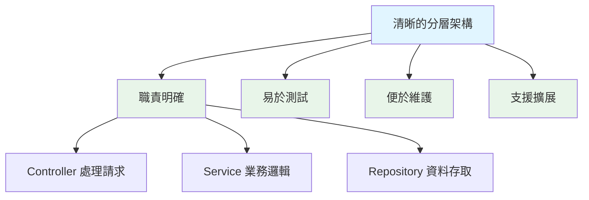
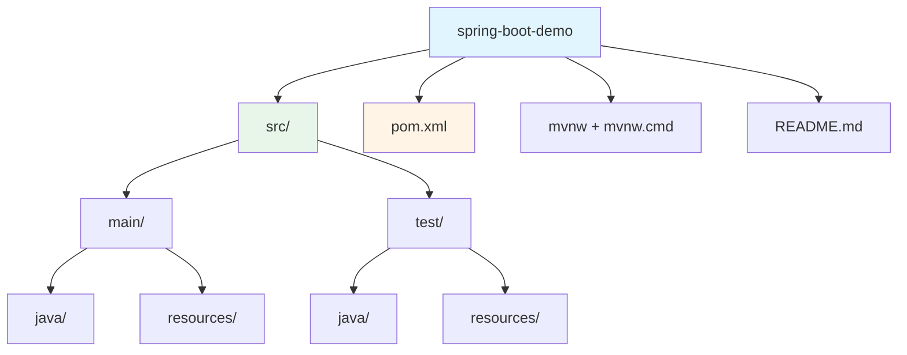
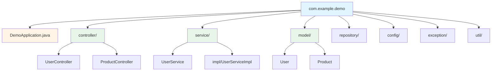
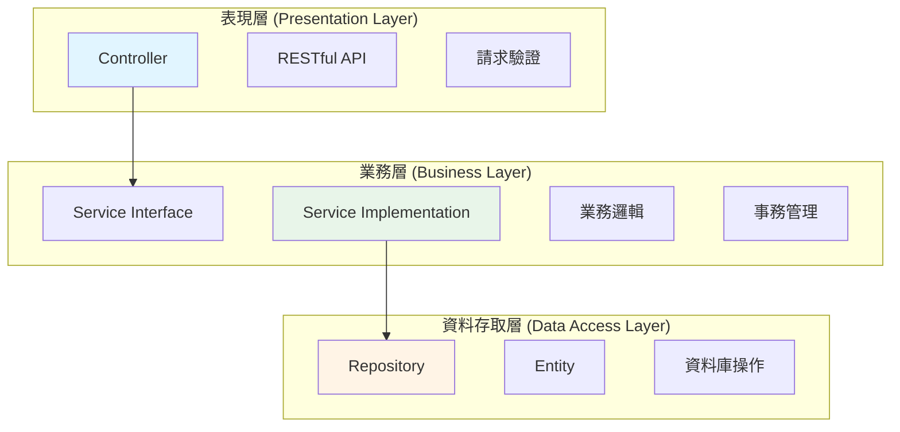
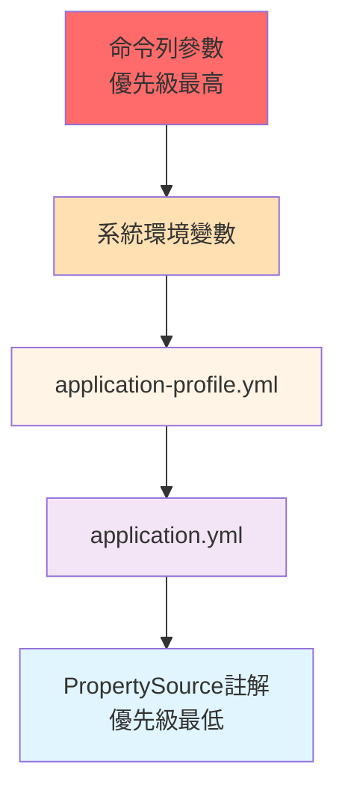
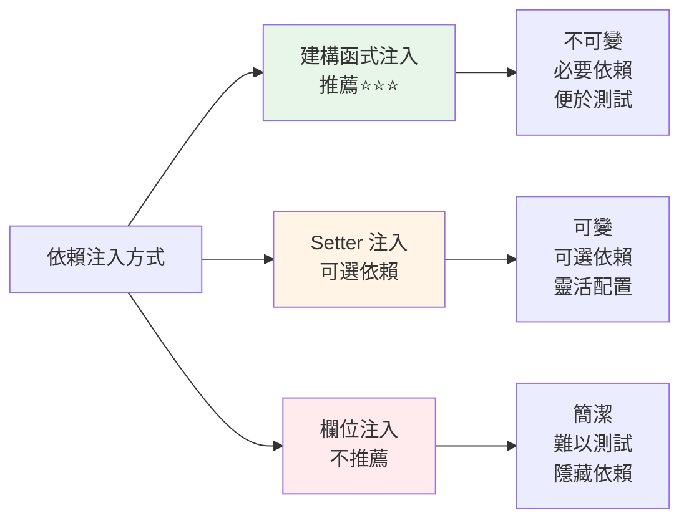
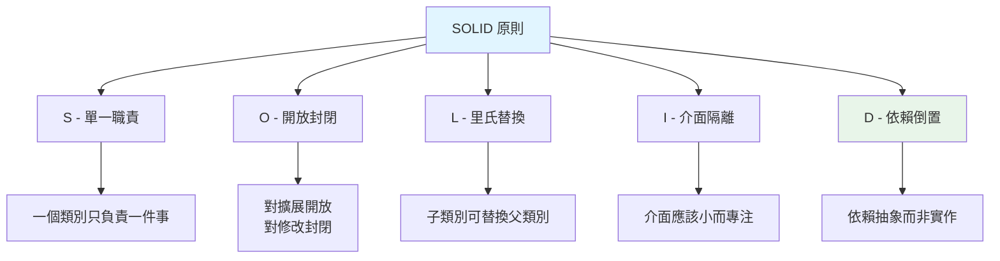
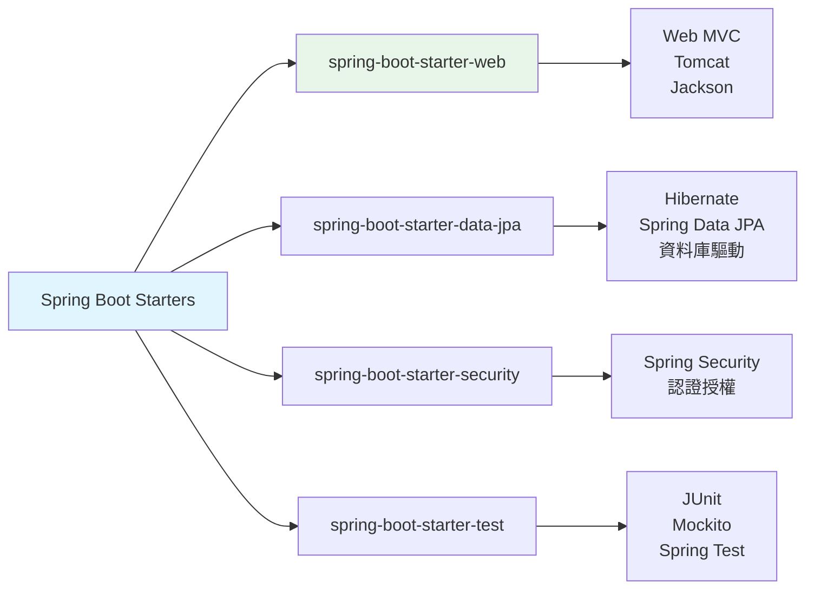
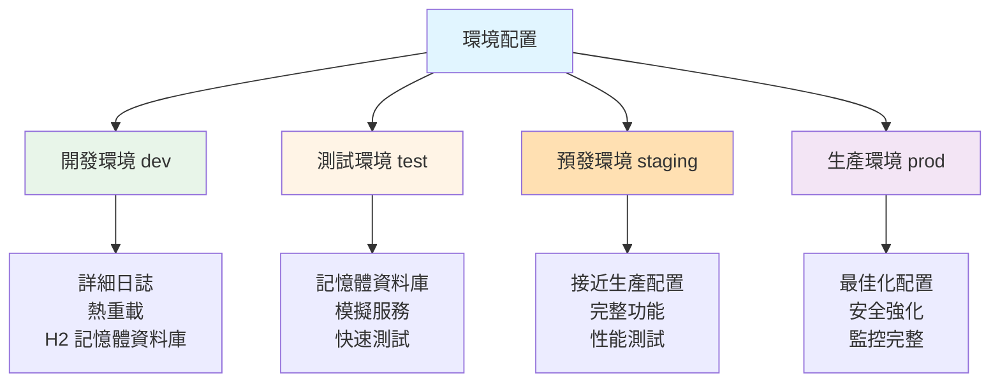

# 1.2 專案架構與配置管理

> **對應範例**: `chapter1-spring-boot-basics`
> **難度**: ⭐⭐⭐☆☆

---

## 📚 本章概要

專案架構是軟體開發的基石。良好的架構設計不僅能提升程式碼可維護性，還能加速團隊協作效率。本章將深入探討 Spring Boot 的標準架構模式、配置管理策略，以及如何建立可擴展的專案結構。

**學習目標**:
- 理解三層架構設計原則
- 掌握 Spring Boot 標準目錄結構
- 學會多環境配置管理
- 了解依賴注入的架構優勢
- 建立可維護的專業級專案

---

## 🎯 為什麼專案架構如此重要？

### 混亂架構的代價

想像接手一個沒有統一架構規範的專案：

```
❌ 混亂的專案結構
project/
├── AllInOneController.java    // 3000 行，包含所有邏輯
├── Utils.java                  // 所有工具方法堆在一起
├── Data.java                   // 資料庫操作混在業務邏輯中
└── Config.properties           // 配置散落各處

問題：
• 難以定位程式碼
• 職責不清晰
• 測試困難
• 難以擴展
```

### Spring Boot 的解決方案



---

## 🏗️ Spring Boot 標準專案結構

### 根目錄結構



**核心目錄說明**:

| 目錄 | 用途 | 重要性 |
|------|------|--------|
| `src/main/java/` | 主要原始碼 | ⭐⭐⭐ |
| `src/main/resources/` | 配置和資源檔案 | ⭐⭐⭐ |
| `src/test/java/` | 測試程式碼 | ⭐⭐⭐ |
| `pom.xml` | Maven 依賴配置 | ⭐⭐⭐ |
| `mvnw` | Maven Wrapper | ⭐⭐ |

### Java 套件結構



**套件組織原則**:
- 按**功能層級**分離（推薦）
- 職責單一，便於維護
- 符合 Spring Boot 約定

---

## 🎨 三層架構設計

### 架構圖



### 各層職責詳解

**1. Controller 層 (表現層)**

```java
// 對應範例: chapter1-spring-boot-basics/.../controller/UserController.java

@RestController
@RequestMapping("/api/users")
public class UserController {

    private final UserService userService;

    // 建構函式注入（推薦）
    public UserController(UserService userService) {
        this.userService = userService;
    }

    @GetMapping
    public ResponseEntity<List<UserResponse>> getAllUsers() {
        // 僅處理 HTTP 請求，委託給 Service 層
        return ResponseEntity.ok(userService.findAllUsers());
    }
}
```

**職責**:
- ✅ 處理 HTTP 請求和回應
- ✅ 參數驗證和綁定
- ✅ 錯誤處理和狀態碼設定
- ❌ **不應包含**業務邏輯

**2. Service 層 (業務層)**

```java
// 對應範例: chapter1-spring-boot-basics/.../service/UserServiceImpl.java:256

@Service
public class UserServiceImpl implements UserService {

    // 業務邏輯實作
    @Override
    public UserResponse createUser(CreateUserRequest request) {
        // 資料轉換
        User user = new User(
            request.getName(),
            request.getEmail(),
            request.getPassword()
        );

        // 業務處理
        user.setId(nextId++);
        users.add(user);

        // 回傳 DTO
        return convertToResponse(user);
    }
}
```

**職責**:
- ✅ 核心業務邏輯處理
- ✅ 事務管理（`@Transactional`）
- ✅ 資料轉換（Entity ↔ DTO）
- ✅ 業務規則驗證
- ❌ **不應直接**操作資料庫

**3. Repository 層 (資料存取層)**

```java
// Spring Data JPA 範例
@Repository
public interface UserRepository extends JpaRepository<User, Long> {

    // Spring Data JPA 自動實作
    Optional<User> findByEmail(String email);

    List<User> findByNameContaining(String keyword);
}
```

**職責**:
- ✅ 資料庫 CRUD 操作
- ✅ 資料查詢和持久化
- ✅ 與 ORM 框架互動
- ❌ **不應包含**業務邏輯

---

## ⚙️ 配置管理策略

### 配置檔案層次結構

```mermaid
graph TD
    A[resources/] --> B[application.yml]
    A --> C[application-dev.yml]
    A --> D[application-test.yml]
    A --> E[application-prod.yml]
    A --> F[static/]
    A --> G[templates/]

    B -.載入順序.-> C
    C -.覆蓋.-> D
    D -.覆蓋.-> E

    style B fill:#e1f5ff
    style C fill:#e8f5e9
    style D fill:#fff4e6
    style E fill:#f3e5f5
```



### application.yml 核心配置

```yaml
# 對應範例: chapter1-spring-boot-basics/.../application.yml

# 伺服器配置
server:
  port: 8080
  servlet:
    context-path: /

# Spring 應用配置
spring:
  application:
    name: user-management-system

  # Profile 設定
  profiles:
    active: ${SPRING_PROFILES_ACTIVE:dev}

# 日誌配置
logging:
  level:
    com.example.demo: DEBUG
    org.springframework.web: INFO
```

### 多環境配置

**開發環境 (application-dev.yml)**:
```yaml
# 開發環境特定配置
server:
  port: 8080

logging:
  level:
    root: DEBUG
    com.example.demo: TRACE

spring:
  devtools:
    restart:
      enabled: true  # 啟用熱重載
```

**生產環境 (application-prod.yml)**:
```yaml
# 生產環境特定配置
server:
  port: 8443
  ssl:
    enabled: true

logging:
  level:
    root: INFO
    com.example.demo: WARN

spring:
  devtools:
    restart:
      enabled: false  # 關閉熱重載
```

### 配置優先級



**優先級順序** (由高到低):
1. **命令列參數**: `--server.port=9090`
2. **系統環境變數**: `SPRING_PROFILES_ACTIVE=prod`
3. **Profile 配置**: `application-prod.yml`
4. **預設配置**: `application.yml`
5. **程式碼配置**: `@PropertySource` 註解

---

## 🔌 依賴注入架構

### 三種注入方式比較



**1. 建構函式注入（最佳實踐）**

```java
@RestController
public class UserController {

    // final 關鍵字確保不可變
    private final UserService userService;
    private final EmailService emailService;

    // Spring 4.3+ 單一建構函式可省略 @Autowired
    public UserController(UserService userService,
                         EmailService emailService) {
        this.userService = userService;
        this.emailService = emailService;
    }
}
```

**優點**:
- ✅ 依賴明確，易於理解
- ✅ 支援 `final`，確保不可變
- ✅ 便於單元測試
- ✅ 避免循環依賴

**2. Setter 注入（可選依賴）**

```java
@Service
public class NotificationService {

    private EmailService emailService;

    @Autowired(required = false)  // 可選依賴
    public void setEmailService(EmailService emailService) {
        this.emailService = emailService;
    }
}
```

**3. 欄位注入（不推薦）**

```java
@RestController
public class UserController {

    @Autowired  // 不推薦：難以測試
    private UserService userService;
}
```

### 依賴管理最佳實踐

**SOLID 原則應用**:



---

## 📦 Maven 專案結構

### POM.xml 核心配置

```xml
<!-- 對應範例: chapter1-spring-boot-basics/pom.xml -->

<!-- Spring Boot Parent -->
<parent>
    <groupId>org.springframework.boot</groupId>
    <artifactId>spring-boot-starter-parent</artifactId>
    <version>3.5.7</version>
</parent>

<!-- 專案資訊 -->
<groupId>com.example</groupId>
<artifactId>chapter1-spring-boot-basics</artifactId>
<version>1.0.0</version>

<!-- Java 版本 -->
<properties>
    <java.version>21</java.version>
</properties>
```

### Spring Boot Starter 依賴



**常用 Starter 說明**:

| Starter | 功能領域 | 包含的主要依賴 |
|---------|----------|----------------|
| `spring-boot-starter-web` | Web 開發 | Spring MVC, Tomcat, Jackson |
| `spring-boot-starter-data-jpa` | JPA 資料存取 | Hibernate, Spring Data JPA |
| `spring-boot-starter-security` | 安全框架 | Spring Security |
| `spring-boot-starter-validation` | 資料驗證 | Hibernate Validator |
| `spring-boot-starter-actuator` | 監控管理 | Metrics, Health Check |

---

## 🌍 環境配置管理

### Profile 配置策略



### 啟用 Profile

**1. 命令列參數**:
```bash
java -jar app.jar --spring.profiles.active=prod
```

**2. 環境變數**:
```bash
export SPRING_PROFILES_ACTIVE=prod
```

**3. application.yml**:
```yaml
spring:
  profiles:
    active: ${SPRING_PROFILES_ACTIVE:dev}  # 預設 dev
```

---

## 📝 本章重點回顧

### 核心知識點
1. **三層架構** - Controller, Service, Repository 職責分離
2. **標準目錄結構** - 遵循 Maven 和 Spring Boot 約定
3. **配置管理** - 多環境配置和優先級策略
4. **依賴注入** - 建構函式注入是最佳實踐
5. **Maven 管理** - 使用 Starter 簡化依賴管理

### 架構設計原則
- ✅ 職責分離：每一層有明確的職責
- ✅ 依賴倒置：依賴抽象而非實作
- ✅ 配置外部化：支援多環境部署
- ✅ 約定優於配置：遵循 Spring Boot 標準
- ✅ 可測試性：使用依賴注入便於測試

---

## 🚀 下一步

👉 [1.3 核心註解與依賴注入](./1.3-核心註解與依賴注入.md) - 深入學習 Spring Boot 註解體系
👉 [1.4 第一個 Spring Boot 應用](./1.4-第一個Spring-Boot應用.md) - 實作完整的使用者管理系統

---

## 📚 參考資源

**官方文件**:
- [Spring Boot Reference Guide](https://docs.spring.io/spring-boot/docs/current/reference/html/)
- [Spring Framework Core](https://docs.spring.io/spring-framework/docs/current/reference/html/core.html)
- [Maven Standard Directory Layout](https://maven.apache.org/guides/introduction/introduction-to-the-standard-directory-layout.html)

**範例程式碼**:
- [完整專案程式碼](../../code-examples/chapter1-spring-boot-basics)

---

**相關章節**:
- ← 上一章: [1.1 Spring Boot 快速入門](./1.1-spring-boot-quickstart.md)
- → 下一章: [1.3 核心註解與依賴注入](./1.3-核心註解與依賴注入.md)
