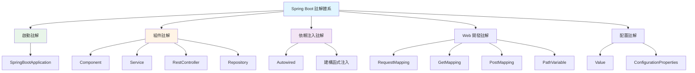
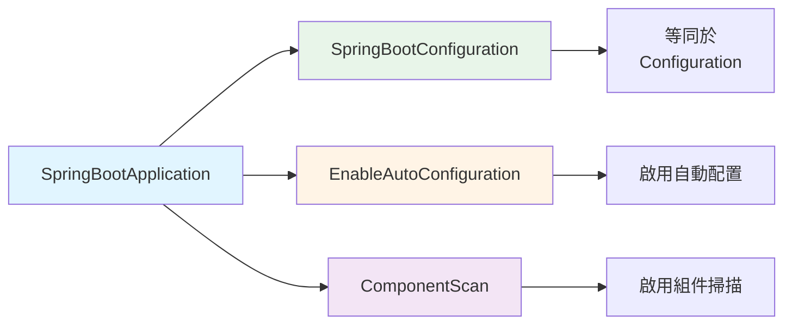
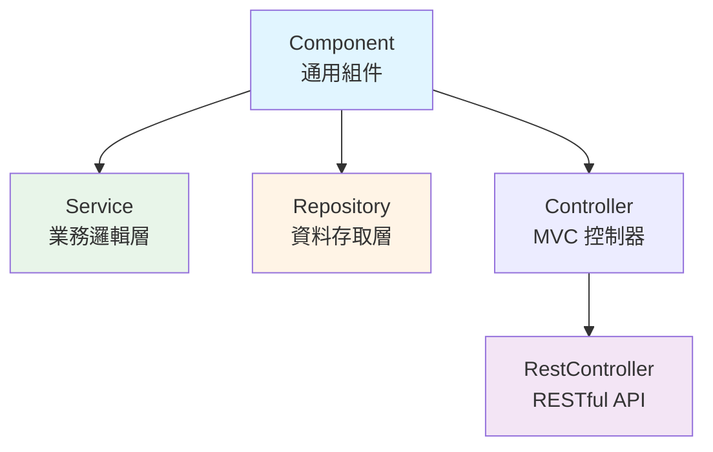
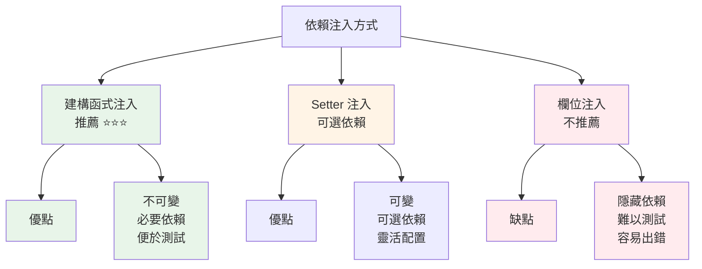
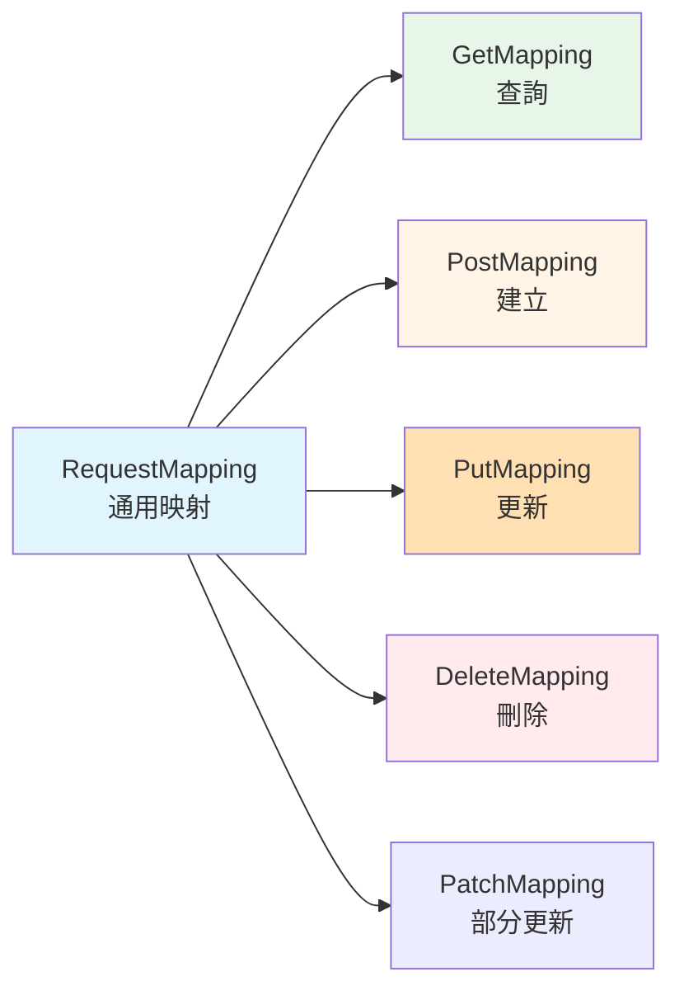
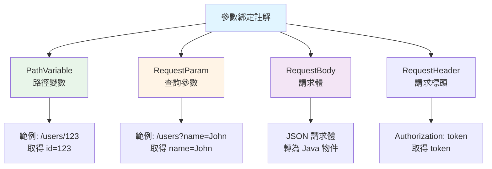

# 1.3 核心註解與依賴注入

> **對應範例**: `chapter1-spring-boot-basics`
> **難度**: ⭐⭐⭐☆☆

---

## 📚 本章概要

Spring Boot 的註解體系是其「約定優於配置」理念的核心實現。通過註解，開發者可以用極少的程式碼實現複雜的功能。本章將深入解析 Spring Boot 的核心註解體系和依賴注入機制，為 Spring AI 應用開發建立堅實的技術基礎。

**學習目標**:
- 掌握 Spring Boot 核心註解（`@SpringBootApplication`, `@RestController`, `@Service` 等）
- 理解依賴注入的原理和最佳實踐
- 學會使用註解建立分層架構
- 熟悉 Web 開發相關註解
- 掌握配置管理註解的使用

---

## 🎯 為什麼需要註解？

### 傳統 XML 配置的痛點

在 Spring Boot 出現之前，開發者需要撰寫大量 XML 配置：

```xml
<!-- 傳統 Spring 配置方式 -->
<beans>
    <!-- 組件掃描 -->
    <context:component-scan base-package="com.example"/>

    <!-- Bean 定義 -->
    <bean id="userService" class="com.example.service.UserServiceImpl">
        <property name="userRepository" ref="userRepository"/>
    </bean>

    <bean id="userRepository" class="com.example.repository.UserRepository"/>

    <!-- 更多繁瑣配置... -->
</beans>
```

**問題**:
- ❌ 配置繁瑣且易出錯
- ❌ XML 與 Java 程式碼分離，難以追蹤
- ❌ 重構困難
- ❌ 編譯期無法檢查錯誤

### Spring Boot 註解的解決方案

```java
// 對應範例: chapter1-spring-boot-basics/.../service/UserServiceImpl.java:15

// 簡潔的註解配置
@Service
public class UserServiceImpl implements UserService {
    // Spring 自動管理和注入
}
```

**優勢**:
- ✅ 程式碼簡潔，易於理解
- ✅ 編譯期檢查，減少錯誤
- ✅ 重構友善
- ✅ IDE 支援完善

---

## 🏗️ Spring Boot 註解體系概覽

### 註解分類架構



### 註解重要性評級

| 類別 | 核心註解 | AI 應用重要性 | 學習優先級 |
|------|----------|---------------|-----------|
| **啟動註解** | `@SpringBootApplication` | ⭐⭐⭐ | 🔥 必學 |
| **組件註解** | `@Service`, `@RestController` | ⭐⭐⭐ | 🔥 必學 |
| **依賴注入** | 建構函式注入 | ⭐⭐⭐ | 🔥 必學 |
| **Web 註解** | `@GetMapping`, `@PostMapping` | ⭐⭐⭐ | 🔥 必學 |
| **配置註解** | `@Value`, `@ConfigurationProperties` | ⭐⭐ | 📖 進階 |

---

## 🚀 核心啟動註解

### @SpringBootApplication

這是 Spring Boot 最重要的**組合註解**：

```java
// 對應範例: chapter1-spring-boot-basics/.../DemoApplication.java:13

@SpringBootApplication
public class DemoApplication {
    public static void main(String[] args) {
        SpringApplication.run(DemoApplication.class, args);
    }
}
```

**等價於以下三個註解的組合**:



**核心功能**:
1. **@SpringBootConfiguration**: 標記為配置類別
2. **@EnableAutoConfiguration**: 根據 classpath 自動配置
3. **@ComponentScan**: 掃描當前套件及子套件的組件

---

## 📦 組件註解

### @Component 系列註解



### 1. @Service - 業務邏輯層

```java
// 對應範例: chapter1-spring-boot-basics/.../service/UserServiceImpl.java:15

@Service  // 標記為業務邏輯層組件
public class UserServiceImpl implements UserService {

    // 業務邏輯實作
    @Override
    public List<UserResponse> findAllUsers() {
        return users.stream()
            .map(this::convertToResponse)
            .collect(Collectors.toList());
    }

    @Override
    public UserResponse createUser(CreateUserRequest request) {
        User user = new User(
            request.getName(),
            request.getEmail(),
            request.getPassword()
        );
        user.setId(nextId++);
        users.add(user);
        return convertToResponse(user);
    }
}
```

**使用場景**:
- ✅ 業務邏輯處理
- ✅ 事務管理
- ✅ 資料轉換（Entity ↔ DTO）
- ✅ 業務規則驗證

### 2. @RestController - API 控制器

```java
// 對應範例: chapter1-spring-boot-basics/.../controller/UserController.java:17

@RestController  // @Controller + @ResponseBody 的組合
@RequestMapping("/api/users")
public class UserController {

    private final UserService userService;

    // 建構函式注入
    public UserController(UserService userService) {
        this.userService = userService;
    }

    @GetMapping
    public ResponseEntity<List<UserResponse>> getAllUsers() {
        return ResponseEntity.ok(userService.findAllUsers());
    }

    @PostMapping
    public ResponseEntity<UserResponse> createUser(
            @Valid @RequestBody CreateUserRequest request) {
        UserResponse user = userService.createUser(request);
        return ResponseEntity.status(HttpStatus.CREATED).body(user);
    }
}
```

**@RestController vs @Controller**:

| 特性 | @RestController | @Controller |
|------|----------------|-------------|
| **用途** | RESTful API | MVC 視圖 |
| **回傳類型** | 自動序列化為 JSON | 視圖名稱 |
| **等價於** | `@Controller` + `@ResponseBody` | 僅 `@Controller` |
| **適用場景** | API 開發 | 傳統 Web 應用 |

### 3. @Repository - 資料存取層

```java
@Repository
public interface UserRepository extends JpaRepository<User, Long> {

    // Spring Data JPA 自動實作
    Optional<User> findByEmail(String email);

    List<User> findByNameContaining(String keyword);
}
```

**特點**:
- ✅ 自動處理資料庫異常轉換
- ✅ 與 Spring Data JPA 完美整合
- ✅ 支援事務管理

---

## 🔌 依賴注入詳解

### 為什麼需要依賴注入？

**問題：沒有依賴注入的程式碼**

```java
// ❌ 緊密耦合，難以測試和維護
public class UserController {

    // 硬編碼依賴
    private UserService userService = new UserServiceImpl();

    public List<User> getUsers() {
        return userService.findAllUsers();
    }
}
```

**問題**:
- ❌ 緊密耦合：Controller 直接依賴具體實作
- ❌ 難以測試：無法替換為 Mock 物件
- ❌ 難以擴展：更換實作需修改程式碼
- ❌ 無法管理生命週期：手動建立物件

**解決方案：使用依賴注入**

```java
// 對應範例: chapter1-spring-boot-basics/.../controller/UserController.java:17

// ✅ 鬆散耦合，易於測試和維護
@RestController
public class UserController {

    private final UserService userService;

    // Spring 自動注入依賴
    public UserController(UserService userService) {
        this.userService = userService;
    }
}
```

**優勢**:
- ✅ 鬆散耦合：依賴抽象而非實作
- ✅ 易於測試：可注入 Mock 物件
- ✅ 易於擴展：更換實作無需修改程式碼
- ✅ 生命週期管理：Spring 容器統一管理

### 三種依賴注入方式



**1. 建構函式注入（最佳實踐）**

```java
@RestController
public class UserController {

    // final 關鍵字確保不可變
    private final UserService userService;
    private final EmailService emailService;

    // Spring 4.3+ 單一建構函式可省略 @Autowired
    public UserController(UserService userService,
                         EmailService emailService) {
        this.userService = userService;
        this.emailService = emailService;
    }
}
```

**優點**:
- ✅ 依賴明確，易於理解
- ✅ 支援 `final`，確保不可變性
- ✅ 便於單元測試
- ✅ 避免循環依賴
- ✅ Spring 4.3+ 可省略 `@Autowired`

**2. Setter 注入（可選依賴）**

```java
@Service
public class NotificationService {

    private EmailService emailService;

    @Autowired(required = false)  // 可選依賴
    public void setEmailService(EmailService emailService) {
        this.emailService = emailService;
    }

    public void sendNotification(String message) {
        if (emailService != null) {
            emailService.send(message);
        }
    }
}
```

**使用場景**:
- 可選的依賴
- 需要在物件建立後設定的依賴

**3. 欄位注入（不推薦）**

```java
@RestController
public class UserController {

    @Autowired  // ❌ 不推薦：難以測試
    private UserService userService;
}
```

**問題**:
- ❌ 無法使用 `final`
- ❌ 難以進行單元測試
- ❌ 隱藏依賴關係
- ❌ 容易造成循環依賴

---

## 🌐 Web 開發核心註解

### HTTP 方法註解



**完整的 CRUD 操作範例**:

```java
// 對應範例: chapter1-spring-boot-basics/.../controller/UserController.java:17

@RestController
@RequestMapping("/api/users")
public class UserController {

    private final UserService userService;

    public UserController(UserService userService) {
        this.userService = userService;
    }

    // GET - 獲取所有使用者
    @GetMapping
    public ResponseEntity<List<UserResponse>> getAllUsers() {
        return ResponseEntity.ok(userService.findAllUsers());
    }

    // GET - 根據 ID 獲取使用者
    @GetMapping("/{id}")
    public ResponseEntity<UserResponse> getUserById(@PathVariable Long id) {
        UserResponse user = userService.findUserById(id);
        return user != null
            ? ResponseEntity.ok(user)
            : ResponseEntity.notFound().build();
    }

    // POST - 建立新使用者
    @PostMapping
    public ResponseEntity<UserResponse> createUser(
            @Valid @RequestBody CreateUserRequest request) {
        UserResponse user = userService.createUser(request);
        return ResponseEntity.status(HttpStatus.CREATED).body(user);
    }

    // PUT - 更新使用者
    @PutMapping("/{id}")
    public ResponseEntity<UserResponse> updateUser(
            @PathVariable Long id,
            @Valid @RequestBody CreateUserRequest request) {
        UserResponse user = userService.updateUser(id, request);
        return user != null
            ? ResponseEntity.ok(user)
            : ResponseEntity.notFound().build();
    }

    // DELETE - 刪除使用者
    @DeleteMapping("/{id}")
    public ResponseEntity<Void> deleteUser(@PathVariable Long id) {
        userService.deleteUser(id);
        return ResponseEntity.noContent().build();
    }
}
```

### 參數綁定註解



**完整範例**:

```java
@RestController
@RequestMapping("/api/search")
public class SearchController {

    private final UserService userService;

    public SearchController(UserService userService) {
        this.userService = userService;
    }

    // @PathVariable - 路徑變數
    @GetMapping("/users/{id}")
    public ResponseEntity<User> getUser(@PathVariable Long id) {
        return ResponseEntity.ok(userService.findById(id));
    }

    // @RequestParam - 查詢參數
    @GetMapping("/users")
    public ResponseEntity<List<User>> searchUsers(
            @RequestParam(required = false) String name,
            @RequestParam(defaultValue = "0") int page,
            @RequestParam(defaultValue = "10") int size) {
        return ResponseEntity.ok(
            userService.search(name, page, size)
        );
    }

    // @RequestBody - 請求體
    @PostMapping("/users")
    public ResponseEntity<User> createUser(
            @Valid @RequestBody CreateUserRequest request) {
        return ResponseEntity.ok(userService.createUser(request));
    }

    // @RequestHeader - 請求標頭
    @GetMapping("/profile")
    public ResponseEntity<User> getCurrentUser(
            @RequestHeader("Authorization") String token) {
        return ResponseEntity.ok(userService.findByToken(token));
    }
}
```

---

## ⚙️ 配置相關註解

### @Value - 屬性注入

```java
@Service
public class ConfigService {

    // 注入配置屬性，支援預設值
    @Value("${app.name:Default App}")
    private String appName;

    @Value("${app.version:1.0.0}")
    private String appVersion;

    @Value("${app.max-users:100}")
    private int maxUsers;

    public String getAppInfo() {
        return String.format(
            "%s v%s (Max Users: %d)",
            appName, appVersion, maxUsers
        );
    }
}
```

### @ConfigurationProperties - 類型安全配置

```java
@ConfigurationProperties(prefix = "app")
@Component
public class AppProperties {

    private String name = "Default App";
    private String version = "1.0.0";
    private int maxUsers = 100;
    private Database database = new Database();

    // Getters and Setters...

    public static class Database {
        private String url;
        private String username;
        private String password;

        // Getters and Setters...
    }
}
```

**對應的 application.yml**:
```yaml
app:
  name: Spring Boot Demo
  version: 2.0.0
  max-users: 500
  database:
    url: jdbc:mysql://localhost:3306/demo
    username: demo_user
    password: demo_pass
```

**@Value vs @ConfigurationProperties**:

| 特性 | @Value | @ConfigurationProperties |
|------|--------|--------------------------|
| **使用方式** | 單一屬性注入 | 批量屬性綁定 |
| **類型安全** | 否 | 是 |
| **支援嵌套** | 否 | 是 |
| **驗證支援** | 有限 | 完整支援 `@Validated` |
| **IDE 提示** | 無 | 有（需配置） |
| **適用場景** | 簡單配置 | 複雜配置結構 |

---

## 🤖 為 Spring AI 做準備

### AI 服務的註解模式

```java
// AI 配置類別
@ConfigurationProperties(prefix = "ai")
@Component
public class AIProperties {

    private OpenAI openai = new OpenAI();

    public static class OpenAI {
        private String apiKey;
        private String model = "gpt-3.5-turbo";
        private int maxTokens = 1000;
        private double temperature = 0.7;

        // Getters and Setters...
    }
}

// AI 服務層
@Service
public class AIService {

    private final AIProperties aiProperties;

    public AIService(AIProperties aiProperties) {
        this.aiProperties = aiProperties;
    }

    public String chat(String message) {
        // 預留給 Spring AI 整合
        String model = aiProperties.getOpenai().getModel();
        return String.format(
            "AI Response (Model: %s): %s",
            model, message
        );
    }
}

// AI 控制器
@RestController
@RequestMapping("/api/ai")
public class AIController {

    private final AIService aiService;

    public AIController(AIService aiService) {
        this.aiService = aiService;
    }

    @PostMapping("/chat")
    public ResponseEntity<String> chat(
            @RequestBody ChatRequest request) {
        String response = aiService.chat(request.getMessage());
        return ResponseEntity.ok(response);
    }
}
```

---

## 📝 本章重點回顧

### 核心註解掌握
1. **@SpringBootApplication** - Spring Boot 應用的入口
2. **@Service** - 業務邏輯層組件
3. **@RestController** - RESTful API 控制器
4. **建構函式注入** - 最佳的依賴注入方式
5. **@GetMapping/@PostMapping** - HTTP 方法映射

### 最佳實踐
- ✅ 優先使用建構函式注入
- ✅ 使用 `final` 確保依賴不可變
- ✅ 使用 `@ConfigurationProperties` 管理複雜配置
- ✅ 適當使用 `@Valid` 進行資料驗證
- ✅ 保持 Controller 層簡潔，業務邏輯放在 Service 層

### 避免的陷阱
- ❌ 避免使用欄位注入 `@Autowired`
- ❌ 避免在 Controller 中處理業務邏輯
- ❌ 避免循環依賴（使用建構函式注入可避免）
- ❌ 避免過度使用 `@Value`（複雜配置用 `@ConfigurationProperties`）

---

## 🚀 下一步

👉 [1.4 第一個 Spring Boot 應用](./1.4-第一個Spring-Boot應用.md) - 實作完整的使用者管理系統

---

## 📚 參考資源

**官方文件**:
- [Spring Boot Annotations](https://docs.spring.io/spring-boot/docs/current/reference/html/using.html#using.auto-configuration)
- [Spring Framework Core](https://docs.spring.io/spring-framework/docs/current/reference/html/core.html)
- [Dependency Injection](https://docs.spring.io/spring-framework/docs/current/reference/html/core.html#beans-dependencies)

**範例程式碼**:
- [完整專案程式碼](../../code-examples/chapter1-spring-boot-basics)

---

**相關章節**:
- ← 上一章: [1.2 專案架構與配置](./1.2-專案架構與配置.md)
- → 下一章: [1.4 第一個 Spring Boot 應用](./1.4-第一個Spring-Boot應用.md)
