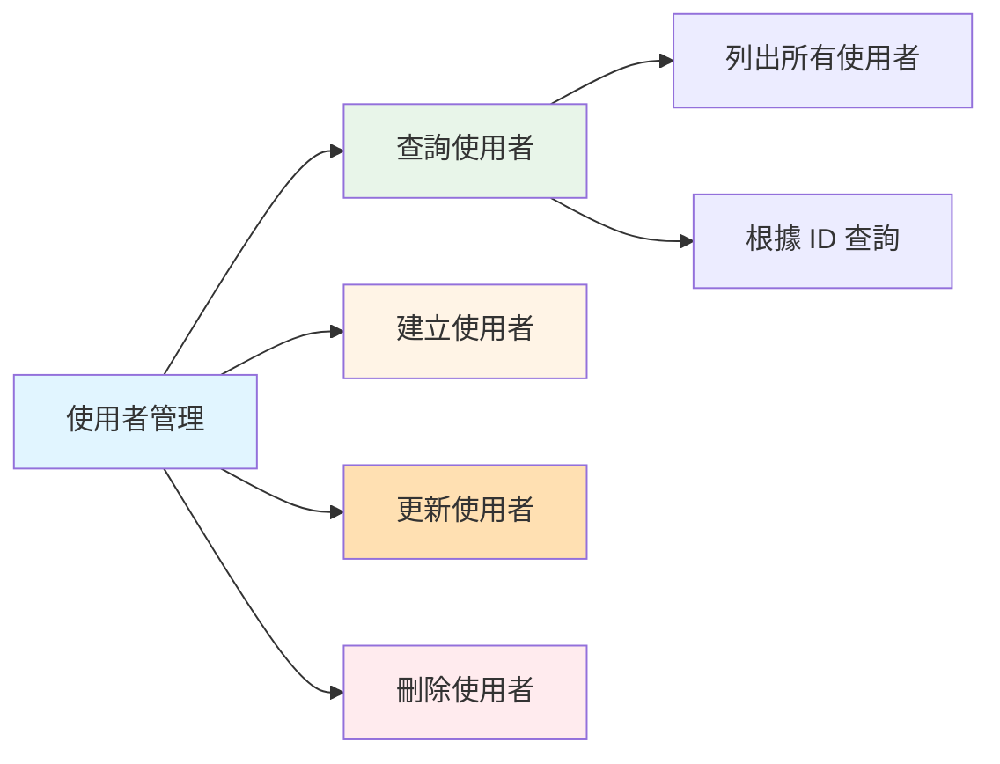
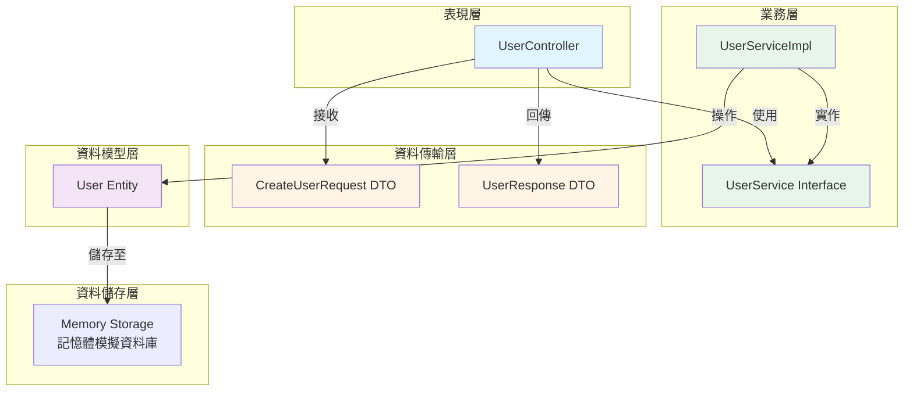
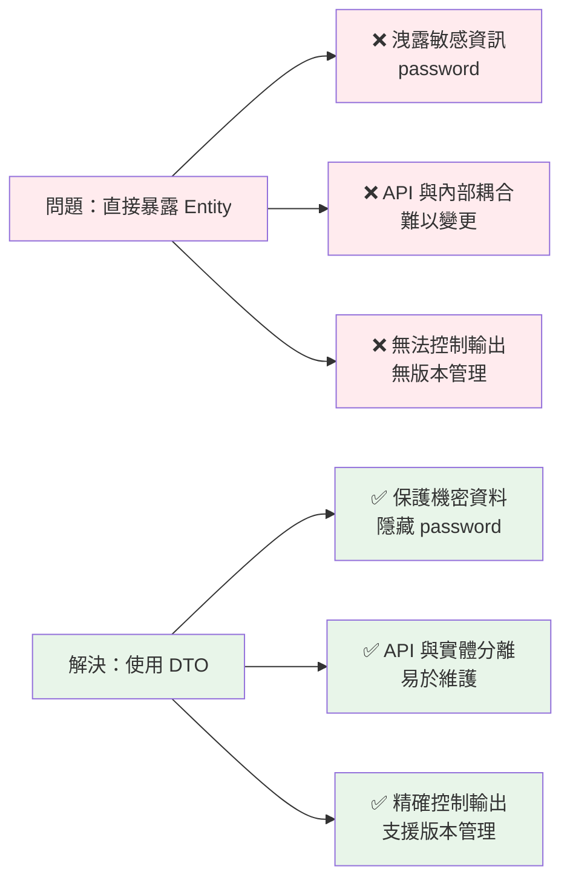
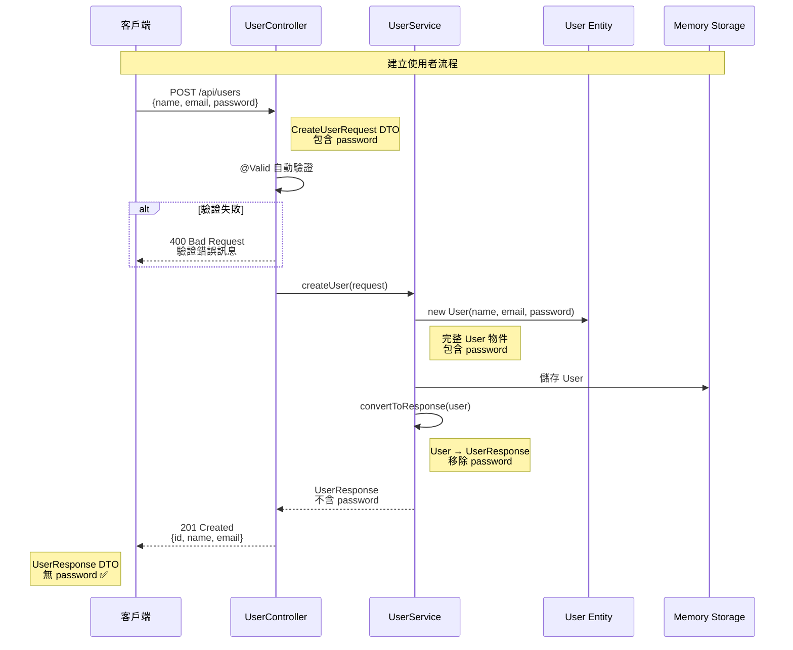
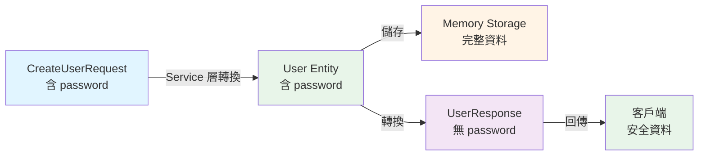
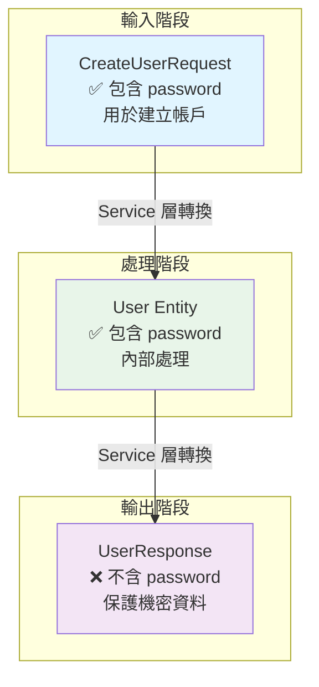
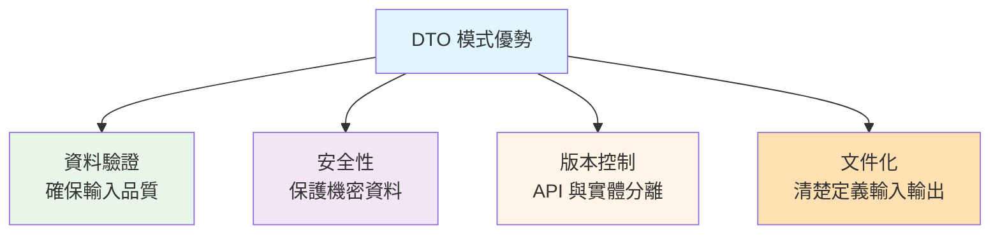

# 1.4 第一個 Spring Boot 應用 - 使用者管理系統

> **對應範例**: `chapter1-spring-boot-basics`
> **難度**: ⭐⭐⭐⭐☆

---

## 📚 本章概要

本章將通過實作一個完整的使用者管理系統，綜合運用前面學習的知識。這個範例展示了現代 Spring Boot 應用的最佳實踐，包括 DTO 模式、資料驗證、安全性設計等企業級開發技巧。

**學習目標**:
- 建立完整的 Spring Boot 應用程式
- 實作 RESTful API 的 CRUD 操作
- 掌握 DTO (Data Transfer Object) 模式
- 學會使用 Bean Validation 進行資料驗證
- 理解 API 安全性設計原則

---

## 🎯 專案需求分析

### 功能需求

**使用者管理系統**需要提供以下功能：



### 非功能需求

- ✅ **安全性**: Response 不包含密碼等機密資訊
- ✅ **資料驗證**: 輸入資料自動驗證
- ✅ **RESTful 設計**: 遵循 REST API 規範
- ✅ **錯誤處理**: 適當的 HTTP 狀態碼
- ✅ **程式碼品質**: 分層清晰，易於維護

---

## 🏗️ 系統架構設計

### 分層架構



### 專案結構

```
chapter1-spring-boot-basics/
├── src/main/java/com/example/demo/
│   ├── DemoApplication.java       # 主程式入口
│   ├── controller/
│   │   └── UserController.java   # REST API 控制器
│   ├── service/
│   │   ├── UserService.java      # 服務介面
│   │   └── UserServiceImpl.java  # 服務實作
│   ├── model/
│   │   └── User.java             # 使用者實體
│   ├── request/
│   │   └── CreateUserRequest.java # 請求 DTO
│   └── response/
│       └── UserResponse.java     # 回應 DTO
└── src/main/resources/
    └── application.yml            # 應用配置
```

---

## 💾 資料模型設計

### User 實體類別

```java
// 對應範例: chapter1-spring-boot-basics/.../model/User.java:12

@Data
@NoArgsConstructor
@AllArgsConstructor
public class User {
    private Long id;
    private String name;
    private String email;
    private String password;  // 機密資料，不應在 API 回應中暴露

    // 自訂建構函式（不包含 id）
    public User(String name, String email, String password) {
        this.name = name;
        this.email = email;
        this.password = password;
    }
}
```

**設計說明**:
- 使用 Lombok `@Data` 自動生成 getter/setter
- 包含完整的使用者資訊（包括密碼）
- 內部使用，不直接暴露給 API

---

## 🔄 DTO 模式實作

### 為什麼需要 DTO？



### CreateUserRequest - 請求 DTO

```java
// 對應範例: chapter1-spring-boot-basics/.../request/CreateUserRequest.java:14

@Data
public class CreateUserRequest {

    @NotBlank(message = "姓名不能為空")
    @Size(min = 2, max = 50, message = "姓名長度必須在 2-50 字元之間")
    private String name;

    @Email(message = "電子郵件格式不正確")
    @NotBlank(message = "電子郵件不能為空")
    private String email;

    @NotBlank(message = "密碼不能為空")
    @Size(min = 6, max = 20, message = "密碼長度必須在 6-20 字元之間")
    private String password;
}
```

**特點**:
- ✅ 完整的資料驗證註解
- ✅ 清楚的錯誤訊息
- ✅ 接收使用者輸入（包括密碼）

### UserResponse - 回應 DTO

```java
// 對應範例: chapter1-spring-boot-basics/.../response/UserResponse.java:12

@Data
@NoArgsConstructor
@AllArgsConstructor
public class UserResponse {
    private Long id;
    private String name;
    private String email;
    // ⚠️ 重要：刻意不包含 password 欄位，確保機密資料安全
}
```

**安全性設計**:
- ✅ 不包含 `password` 欄位
- ✅ 只返回安全的公開資訊
- ✅ 防止機密資料外洩

---

## 🎬 資料流程圖

### 完整的資料流程



### 資料轉換說明



---

## 💼 服務層實作

### UserService 介面

```java
// 對應範例: chapter1-spring-boot-basics/.../service/UserService.java

public interface UserService {
    List<UserResponse> findAllUsers();
    UserResponse findUserById(Long id);
    UserResponse createUser(CreateUserRequest request);
    UserResponse updateUser(Long id, CreateUserRequest request);
    void deleteUser(Long id);
}
```

### UserServiceImpl 實作

```java
// 對應範例: chapter1-spring-boot-basics/.../service/UserServiceImpl.java:15

@Service
public class UserServiceImpl implements UserService {

    // 使用記憶體模擬資料庫
    private final List<User> users = new ArrayList<>();
    private Long nextId = 1L;

    // 初始化測試資料
    public UserServiceImpl() {
        users.add(new User("張小明", "ming@example.com", "password123"));
        users.add(new User("李小華", "hua@example.com", "secret456"));
        users.get(0).setId(nextId++);
        users.get(1).setId(nextId++);
    }

    @Override
    public UserResponse createUser(CreateUserRequest request) {
        // 建立 User 實體
        User user = new User(
            request.getName(),
            request.getEmail(),
            request.getPassword()
        );
        user.setId(nextId++);
        users.add(user);

        // 轉換為安全的 Response DTO
        return convertToResponse(user);
    }

    /**
     * 關鍵方法：User Entity → UserResponse DTO
     * 移除敏感資訊（password）
     */
    private UserResponse convertToResponse(User user) {
        return new UserResponse(
            user.getId(),
            user.getName(),
            user.getEmail()
            // 刻意不包含 password
        );
    }
}
```

---

## 🌐 Controller 層實作

### 完整的 RESTful API

```java
// 對應範例: chapter1-spring-boot-basics/.../controller/UserController.java:17

@RestController
@RequestMapping("/api/users")
public class UserController {

    private final UserService userService;

    // 建構函式注入
    public UserController(UserService userService) {
        this.userService = userService;
    }

    /**
     * 獲取所有使用者
     * GET /api/users
     */
    @GetMapping
    public ResponseEntity<List<UserResponse>> getAllUsers() {
        List<UserResponse> users = userService.findAllUsers();
        return ResponseEntity.ok(users);
    }

    /**
     * 根據 ID 獲取使用者
     * GET /api/users/{id}
     */
    @GetMapping("/{id}")
    public ResponseEntity<UserResponse> getUserById(@PathVariable Long id) {
        UserResponse user = userService.findUserById(id);
        if (user != null) {
            return ResponseEntity.ok(user);
        }
        return ResponseEntity.notFound().build();
    }

    /**
     * 建立新使用者
     * POST /api/users
     * @Valid 啟用自動驗證
     */
    @PostMapping
    public ResponseEntity<UserResponse> createUser(
            @Valid @RequestBody CreateUserRequest request) {
        UserResponse user = userService.createUser(request);
        return ResponseEntity.status(HttpStatus.CREATED).body(user);
    }

    /**
     * 更新使用者
     * PUT /api/users/{id}
     */
    @PutMapping("/{id}")
    public ResponseEntity<UserResponse> updateUser(
            @PathVariable Long id,
            @Valid @RequestBody CreateUserRequest request) {
        UserResponse user = userService.updateUser(id, request);
        if (user != null) {
            return ResponseEntity.ok(user);
        }
        return ResponseEntity.notFound().build();
    }

    /**
     * 刪除使用者
     * DELETE /api/users/{id}
     */
    @DeleteMapping("/{id}")
    public ResponseEntity<Void> deleteUser(@PathVariable Long id) {
        userService.deleteUser(id);
        return ResponseEntity.noContent().build();
    }
}
```

---

## ⚙️ 配置檔案

### application.yml

```yaml
# 對應範例: chapter1-spring-boot-basics/.../application.yml

# 伺服器設定
server:
  port: 8080
  servlet:
    context-path: /

# Spring Boot 應用程式設定
spring:
  application:
    name: User Management System
  mvc:
    throw-exception-if-no-handler-found: true
  web:
    resources:
      add-mappings: false

# 日誌設定
logging:
  level:
    com.example.demo: DEBUG
    org.springframework.web: INFO
  pattern:
    console: "%d{yyyy-MM-dd HH:mm:ss} [%thread] %-5level %logger{36} - %msg%n"
```

---

## 🧪 API 測試

### 測試 API 端點

**1. 獲取所有使用者**
```bash
curl -X GET http://localhost:8080/api/users
```

**回應**:
```json
[
  {
    "id": 1,
    "name": "張小明",
    "email": "ming@example.com"
  },
  {
    "id": 2,
    "name": "李小華",
    "email": "hua@example.com"
  }
]
```

**2. 建立新使用者**
```bash
curl -X POST http://localhost:8080/api/users \
  -H "Content-Type: application/json" \
  -d '{
    "name": "王大明",
    "email": "wang@example.com",
    "password": "password123"
  }'
```

**回應**:
```json
{
  "id": 3,
  "name": "王大明",
  "email": "wang@example.com"
}
```

**⚠️ 注意**: 回應中**不包含** `password` 欄位，這是安全設計的重點！

---

## 🔐 安全性設計

### DTO 模式的安全優勢



### 安全性對比

| 階段 | 包含密碼 | 用途 | 安全考量 |
|------|----------|------|----------|
| **CreateUserRequest** | ✅ 是 | 接收輸入資料 | 需要密碼進行帳戶建立 |
| **User 模型** | ✅ 是 | 內部資料處理 | 完整資料用於業務邏輯 |
| **UserResponse** | ❌ 否 | API 回應 | **保護機密資料不外洩** |

### 實際運作展示

```
客戶端請求:
POST /api/users
{
  "name": "測試使用者",
  "email": "test@example.com",
  "password": "secret123"  ← 輸入時包含密碼
}

↓ Controller 層接收 CreateUserRequest DTO
↓ Service 層處理業務邏輯
↓ 轉換為 UserResponse DTO

API 回應:
{
  "id": 1,
  "name": "測試使用者",
  "email": "test@example.com"
  // password 欄位不存在 ✅ 安全！
}
```

---

## 🎯 關鍵技術說明

### 1. Bean Validation

```java
@NotBlank(message = "姓名不能為空")
@Size(min = 2, max = 50, message = "姓名長度必須在 2-50 字元之間")
private String name;
```

**常用驗證註解**:
- `@NotNull`: 不能為 null
- `@NotBlank`: 不能為空字串
- `@Size(min, max)`: 字串長度限制
- `@Email`: 電子郵件格式驗證
- `@Pattern`: 正則表達式驗證

### 2. ResponseEntity

```java
// 成功回應
return ResponseEntity.ok(user);              // 200 OK

// 建立成功
return ResponseEntity.status(HttpStatus.CREATED).body(user);  // 201 Created

// 找不到資源
return ResponseEntity.notFound().build();    // 404 Not Found

// 刪除成功
return ResponseEntity.noContent().build();   // 204 No Content
```

### 3. DTO 模式的優勢



---

## 📝 本章重點回顧

### 核心技能
1. **建立完整的 Spring Boot 應用** - 從專案結構到執行部署
2. **實作三層架構** - Controller, Service, Model 的職責分離
3. **使用 DTO 模式** - 控制資料流向，提升 API 安全性
4. **實作資料驗證** - 使用 Bean Validation 確保資料品質
5. **RESTful API 設計** - 提供完整的 CRUD 操作端點

### 安全性最佳實踐
- ✅ **輸入驗證**: 使用 `@Valid` 和驗證註解
- ✅ **資料保護**: Response DTO 不包含機密欄位
- ✅ **錯誤處理**: 適當的 HTTP 狀態碼和錯誤訊息
- ✅ **API 設計**: 清晰的端點命名和 RESTful 原則

### 開發效率提升
- 🚀 **自動配置**: Spring Boot 的約定優於配置
- 🚀 **依賴注入**: 建構函式注入確保依賴不可變
- 🚀 **分層架構**: 清晰的程式碼組織和職責分離
- 🚀 **測試友善**: 記憶體資料儲存便於開發和測試

---

## 🚀 下一步學習方向

完成第1章後，您已經掌握了 Spring Boot 的基礎知識。接下來可以學習：

1. **第2章：Spring MVC 與 RESTful API** - 深入學習 Web 開發
2. **第3章：企業級功能** - 資料庫整合、安全性、測試
3. **第4章：Spring AI 入門** - 開始 AI 應用開發之旅

---

## 📚 參考資源

**官方文件**:
- [Spring Boot Reference Guide](https://docs.spring.io/spring-boot/docs/current/reference/html/)
- [Spring Boot Starter Web](https://docs.spring.io/spring-boot/docs/current/reference/html/web.html)
- [Bean Validation Specification](https://beanvalidation.org/)
- [RESTful API Design Best Practices](https://restfulapi.net/)

**範例程式碼**:
- [完整專案程式碼](../../code-examples/chapter1-spring-boot-basics)
- [專案 README](../../code-examples/chapter1-spring-boot-basics/README.md)

---

**相關章節**:
- ← 上一章: [1.3 核心註解與依賴注入](./1.3-核心註解與依賴注入.md)
- → 下一章: 第2章 Spring MVC 與 RESTful API

---

> 💡 **提示**: 本章的完整程式碼可在 `code-examples/chapter1-spring-boot-basics` 目錄中找到，建議動手實作並測試 API 以加深理解。
