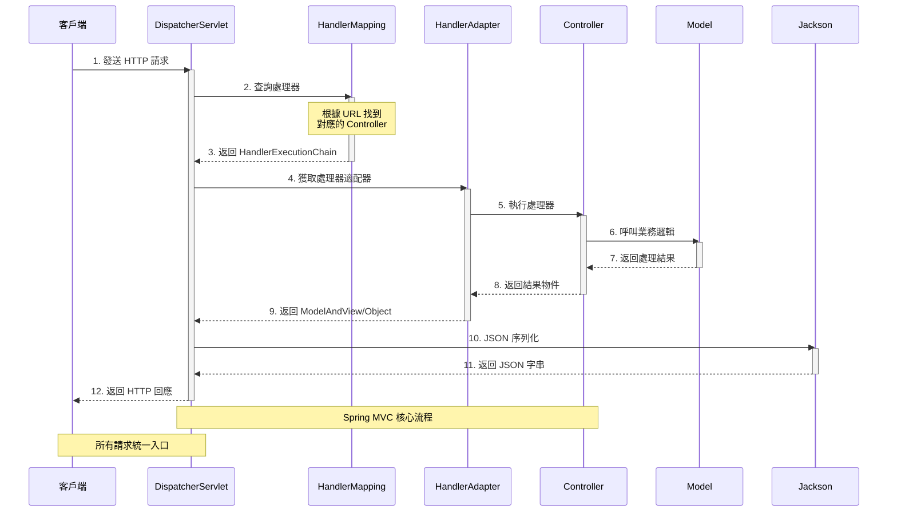
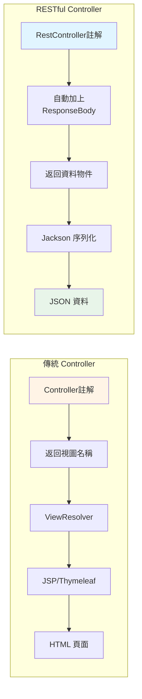
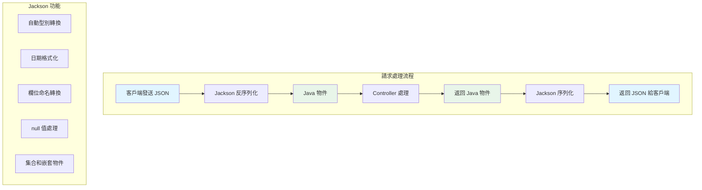
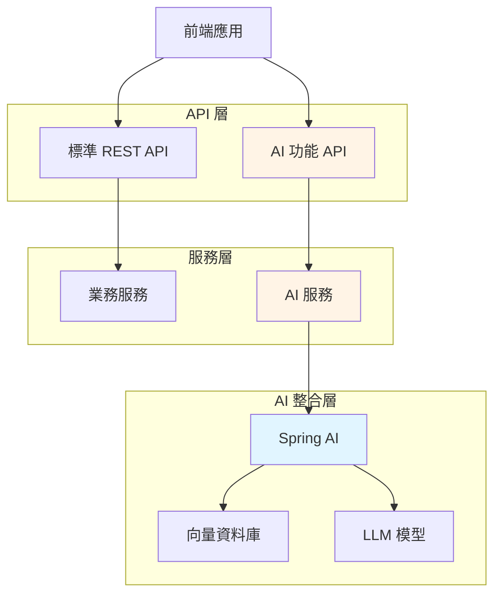

# 2.1 Spring MVC API 開發基礎

> **對應範例**: `chapter2-spring-mvc-api`
> **難度**: ⭐⭐⭐☆☆

---

## 📚 本章概要

本章將深入介紹 Spring MVC 的核心架構，學習如何使用 `@RestController` 建立現代化的 RESTful API。在前後端分離的架構下，Spring Boot 專注於提供 API 服務，輸出 JSON 格式資料供前端框架或其他客戶端使用。

**學習目標**:
- 理解 MVC 三層架構的設計理念
- 掌握 DispatcherServlet 的請求處理流程
- 學會使用 @RestController 建立 API
- 理解 JSON 自動序列化機制
- 為 Spring AI 整合奠定 API 基礎

---

## 🎯 MVC 架構概述

### MVC 三層職責劃分

MVC（Model-View-Controller）是一種經典的軟體架構模式，將應用程式劃分為三個核心組件：


**MVC 三層詳細說明**:

1. **Model（模型層）**:
   - 負責業務邏輯處理和資料管理
   - 包含資料驗證、計算、資料庫操作
   - 與 Controller 解耦，可獨立測試

2. **View（視圖層）**:
   - 負責呈現資料給使用者
   - 傳統：JSP、Thymeleaf 等模板引擎
   - 現代：JSON 資料輸出

3. **Controller（控制器層）**:
   - 接收並處理使用者請求
   - 協調 Model 和 View
   - 控制應用程式流程

---

## 🔄 現代架構：前後端分離

### 架構演進

在現代 Web 應用開發中，**前後端分離**已成為主流架構模式。這種架構下，Spring Boot 的角色發生了重要變化：

**傳統 MVC 架構**:
```
瀏覽器
  ↓ 請求
Spring MVC Controller
  ↓
Model（業務邏輯）
  ↓
View（JSP/Thymeleaf）
  ↓ HTML
瀏覽器顯示頁面
```

**現代前後端分離架構**:
```
前端框架（React/Vue/Angular）
  ↓ HTTP請求
Spring Boot RESTful API
  ↓
Model（業務邏輯）
  ↓ JSON資料
前端框架
  ↓
瀏覽器顯示頁面
```

### 關鍵差異對比

| 特性 | 傳統 Web 開發 | 現代前後端分離開發 |
|------|---------------|-------------------|
| **回應格式** | HTML 頁面（Server-Side Rendering） | JSON 資料（Client-Side Rendering） |
| **客戶端** | 主要是瀏覽器 | 多種客戶端（Web、Mobile、IoT、AI） |
| **狀態管理** | 有狀態（Session） | 無狀態（Stateless，使用 JWT） |
| **資料傳輸** | 表單提交 | JSON/XML 負載 |
| **錯誤處理** | 錯誤頁面 | 結構化錯誤回應（JSON） |
| **開發模式** | 後端包含 View 層 | 後端只提供 API |
| **部署方式** | 整體部署 | 前後端獨立部署 |
| **Spring Boot 角色** | 負責完整的 MVC | 只負責 MC（Model-Controller） |

**為什麼前後端分離？**
- ✅ **職責分離**: 後端專注業務邏輯，前端專注使用者體驗
- ✅ **開發效率**: 前後端團隊可並行開發
- ✅ **技術選型靈活**: 前後端可獨立選擇技術棧
- ✅ **多端支援**: 同一個 API 可供 Web、Mobile、AI 等多種客戶端使用
- ✅ **擴展性強**: 前後端可獨立擴展和部署

> 💡 **本書定位**: 因此本書專注於如何使用 Spring Boot 建立 RESTful API，不涉及傳統 View 技術（JSP、Thymeleaf）的內容。

---

## 🔧 DispatcherServlet 工作流程

### 前端控制器模式

Spring MVC 的核心是 `DispatcherServlet`，它作為前端控制器（Front Controller）負責所有 HTTP 請求的統一分發和處理。這是一種典型的設計模式，將請求處理的通用邏輯集中管理。



**流程詳解**:

1. **請求接收**: DispatcherServlet 接收所有 HTTP 請求
2. **處理器映射**: HandlerMapping 根據 URL 找到對應的 Controller 方法
3. **處理器適配**: HandlerAdapter 適配不同類型的處理器
4. **業務處理**: Controller 執行業務邏輯
5. **結果處理**: 對於 @RestController，直接返回資料物件
6. **JSON 序列化**: Jackson 自動將 Java 物件轉換為 JSON
7. **回應返回**: 將 JSON 資料返回給客戶端

> 💡 **重點**: 在前後端分離架構下，不再需要 ViewResolver 解析視圖，而是直接由 Jackson 序列化為 JSON 返回。

---

## 🎭 @RestController vs @Controller

### 核心差異

在前後端分離的架構下，我們主要使用 `@RestController` 來建立 API：



**註解對比**:

| 特性 | @Controller | @RestController |
|------|-------------|------------------|
| **組成** | 單一註解 | @Controller + @ResponseBody |
| **回應類型** | 視圖名稱（如 "user/list"） | 直接資料（自動轉 JSON） |
| **序列化** | 需手動處理或加 @ResponseBody | 自動 JSON 序列化 |
| **適用場景** | 傳統 Web 應用（SSR） | 前後端分離的 RESTful API ⭐ |
| **View 層** | 需要配置 ViewResolver | 不需要 View 層 |
| **Content-Type** | text/html | application/json |

### 基本範例

```java
// 對應範例: chapter2-spring-mvc-api/.../api/UserRestController.java:15

@RestController
@RequestMapping("/api/v1/users")
public class UserRestController {

    private final UserService userService;

    public UserRestController(UserService userService) {
        this.userService = userService;
    }

    // 取得所有使用者（支援分頁）
    @GetMapping
    public ResponseEntity<PagedResponse<UserDto>> getUsers(
            @RequestParam(defaultValue = "0") int page,
            @RequestParam(defaultValue = "20") int size) {

        Page<User> userPage = userService.findAll(
            PageRequest.of(page, size)
        );

        // 自動轉換為 JSON 格式
        return ResponseEntity.ok(
            PagedResponse.of(userPage, UserDto::from)
        );
    }

    // 根據 ID 取得使用者
    @GetMapping("/{id}")
    public ResponseEntity<UserDto> getUser(@PathVariable Long id) {
        User user = userService.findById(id);
        return ResponseEntity.ok(UserDto.from(user));
    }

    // 建立新使用者
    @PostMapping
    public ResponseEntity<UserDto> createUser(
            @RequestBody @Valid CreateUserRequest request) {

        User user = userService.create(request);

        // 返回 201 Created 和 Location 標頭
        return ResponseEntity
            .created(URI.create("/api/v1/users/" + user.getId()))
            .body(UserDto.from(user));
    }
}
```

**程式碼重點**:
- ✅ `@RestController` 自動將返回值轉換為 JSON
- ✅ 使用 `ResponseEntity<T>` 控制 HTTP 狀態碼和標頭
- ✅ 支援分頁查詢，避免一次返回大量資料
- ✅ POST 請求返回 201 Created 和資源 URI

> 📁 **完整程式碼**: 參考 [code-examples/chapter2-spring-mvc-api/src/main/java/com/example/api/](../../code-examples/chapter2-spring-mvc-api/src/main/java/com/example/api/)

---

## 🔄 JSON 自動處理機制

### Jackson 序列化原理

Spring MVC 透過 Jackson 函式庫實現自動 JSON 序列化和反序列化。這個過程完全自動，無需手動編寫 JSON 轉換程式碼。



### 自動序列化範例

```java
// 對應範例: chapter2-spring-mvc-api/.../api/ProductRestController.java:20

@RestController
@RequestMapping("/api/v1/products")
public class ProductRestController {

    private final ProductService productService;

    // JSON 自動轉換範例
    @PostMapping
    public ResponseEntity<ProductDto> createProduct(
            @RequestBody @Valid CreateProductRequest request) {

        // 請求: JSON → CreateProductRequest 物件（自動反序列化）
        // Jackson 自動將 JSON 轉換為 Java 物件

        Product product = productService.create(request);
        ProductDto dto = ProductDto.from(product);

        // 回應: ProductDto 物件 → JSON（自動序列化）
        // Jackson 自動將 Java 物件轉換為 JSON

        URI location = ServletUriComponentsBuilder
            .fromCurrentRequest()
            .path("/{id}")
            .buildAndExpand(product.getId())
            .toUri();

        return ResponseEntity.created(location).body(dto);
    }

    // 複雜結構自動處理
    @GetMapping("/summary")
    public ResponseEntity<ProductSummary> getProductSummary() {
        ProductSummary summary = ProductSummary.builder()
            .totalProducts(productService.count())
            .categories(productService.getCategories())
            .topProducts(productService.getTopProducts(10))
            .statistics(productService.getStatistics())
            .build();

        // 複雜的嵌套物件也會自動轉為 JSON
        return ResponseEntity.ok(summary);
    }

    // 列表和集合自動處理
    @GetMapping
    public ResponseEntity<List<ProductDto>> getProducts() {
        List<Product> products = productService.findAll();

        // List<ProductDto> 自動轉為 JSON 陣列
        List<ProductDto> dtos = products.stream()
            .map(ProductDto::from)
            .collect(Collectors.toList());

        return ResponseEntity.ok(dtos);
    }
}
```

**JSON 範例**:

**請求 JSON**:
```json
{
  "name": "Spring Boot 實戰",
  "price": 680,
  "category": "書籍",
  "stock": 100,
  "description": "深入學習 Spring Boot"
}
```

**回應 JSON**:
```json
{
  "id": 1,
  "name": "Spring Boot 實戰",
  "price": 680,
  "category": "書籍",
  "stock": 100,
  "description": "深入學習 Spring Boot",
  "createdAt": "2025-10-30T10:30:00",
  "updatedAt": "2025-10-30T10:30:00"
}
```

**自動處理的優點**:
- ✅ **無需手動轉換**: 不需要寫 JSON 解析程式碼
- ✅ **支援複雜結構**: 嵌套物件、集合、Map 等
- ✅ **自動型別轉換**: String、數字、日期等自動轉換
- ✅ **驗證整合**: 搭配 @Valid 進行資料驗證
- ✅ **錯誤提示**: 提供清楚的錯誤訊息

### 自訂 Jackson 配置

```java
// 對應範例: chapter2-spring-mvc-api/.../config/JacksonConfig.java

@Configuration
public class JacksonConfig {

    @Bean
    public ObjectMapper objectMapper() {
        ObjectMapper mapper = new ObjectMapper();

        // 日期格式化
        mapper.setDateFormat(new SimpleDateFormat("yyyy-MM-dd HH:mm:ss"));

        // null 值不序列化
        mapper.setSerializationInclusion(JsonInclude.Include.NON_NULL);

        // 駝峰命名轉下劃線
        mapper.setPropertyNamingStrategy(PropertyNamingStrategies.SNAKE_CASE);

        // 未知屬性不拋異常
        mapper.configure(DeserializationFeature.FAIL_ON_UNKNOWN_PROPERTIES, false);

        return mapper;
    }
}
```

---

## 🚀 為 Spring AI 做準備

### AI 應用的 API 特殊需求

在設計 Spring Boot API 時，我們需要提前考慮 Spring AI 的整合需求。AI 應用通常需要處理大量資料、長時間運算和流式回應。

**架構設計考量**:



### 異步處理支援

AI 模型通常需要較長的處理時間，因此需要支援異步處理：

```java
// 對應範例: chapter2-spring-mvc-api/.../api/AIController.java

@RestController
@RequestMapping("/api/ai")
public class AIController {

    private final AIService aiService;

    // 異步處理 - 適合 AI 長時間運算
    @PostMapping("/process")
    public CompletableFuture<ProcessResult> processAsync(
            @RequestBody ProcessRequest request) {

        return CompletableFuture.supplyAsync(() -> {
            // AI 模型推理可能需要幾秒到幾十秒
            return aiService.process(request);
        });
    }

    // Server-Sent Events - 流式回應
    @GetMapping(value = "/stream", produces = MediaType.TEXT_EVENT_STREAM_VALUE)
    public Flux<String> streamResponse(@RequestParam String prompt) {
        // 適合 LLM 流式輸出
        return aiService.streamGenerate(prompt);
    }
}
```

**核心考量**:
- ✅ **異步處理**: 使用 `CompletableFuture` 或 `@Async` 支援長時間運算
- ✅ **流式回應**: 支援 Server-Sent Events (SSE) 實現流式輸出
- ✅ **多媒體處理**: 支援圖片、音訊、視訊等多媒體內容
- ✅ **錯誤處理**: 完善的重試和容錯機制
- ✅ **監控日誌**: 記錄 AI 模型調用和性能指標

### API 設計預留

```java
// 預留 AI 功能的 API 結構
@RestController
@RequestMapping("/api/v1")
public class UnifiedController {

    // 標準業務 API
    @GetMapping("/products")
    public ResponseEntity<List<ProductDto>> getProducts() {
        // 傳統業務邏輯
    }

    // AI 增強 API（預留）
    @PostMapping("/ai/recommend")
    public ResponseEntity<List<ProductDto>> getAIRecommendations(
            @RequestBody RecommendRequest request) {
        // 未來整合 AI 推薦功能
    }

    // AI 對話 API（預留）
    @PostMapping("/ai/chat")
    public ResponseEntity<ChatResponse> chat(
            @RequestBody ChatRequest request) {
        // 未來整合 LLM 對話功能
    }
}
```

---

## 📝 本節重點回顧

### 核心知識點

1. **MVC 架構** - 理解 Model、View、Controller 三層分離設計
2. **前後端分離** - 掌握現代 Web 應用架構模式
3. **DispatcherServlet** - 理解 Spring MVC 請求處理流程
4. **@RestController** - 學會建立 RESTful API
5. **JSON 自動處理** - 掌握 Jackson 序列化機制
6. **AI 整合準備** - 為 Spring AI 奠定架構基礎

### 技術要點

- ✅ 前後端分離下，Spring Boot 專注於提供 API 服務
- ✅ `@RestController` = `@Controller` + `@ResponseBody`
- ✅ Jackson 自動處理 JSON 序列化/反序列化
- ✅ 使用 `ResponseEntity<T>` 控制 HTTP 狀態碼和標頭
- ✅ 支援異步處理和流式回應，為 AI 整合做準備

---

## 🚀 下一步

👉 [2.2 RESTful API 設計原則](./2.2-restful-api-design.md) - 學習資源導向的 API 設計
👉 [2.3 API 請求與回應處理](./2.3-request-response-handling.md) - 掌握請求參數和統一回應格式

---

## 📚 參考資源

**官方文件**:
- [Spring MVC Reference](https://docs.spring.io/spring-framework/docs/current/reference/html/web.html)
- [Jackson Documentation](https://github.com/FasterXML/jackson-docs)

**範例程式碼**:
- [完整專案程式碼](../../code-examples/chapter2-spring-mvc-api)
- [UserRestController.java](../../code-examples/chapter2-spring-mvc-api/src/main/java/com/example/api/UserRestController.java)
- [ProductRestController.java](../../code-examples/chapter2-spring-mvc-api/src/main/java/com/example/api/ProductRestController.java)

---

**相關章節**:
- ← 上一章: [1.4 第一個 Spring Boot 應用](../chapter1/1.4-第一個Spring-Boot應用.md)
- → 下一章: [2.2 RESTful API 設計原則](./2.2-restful-api-design.md)
