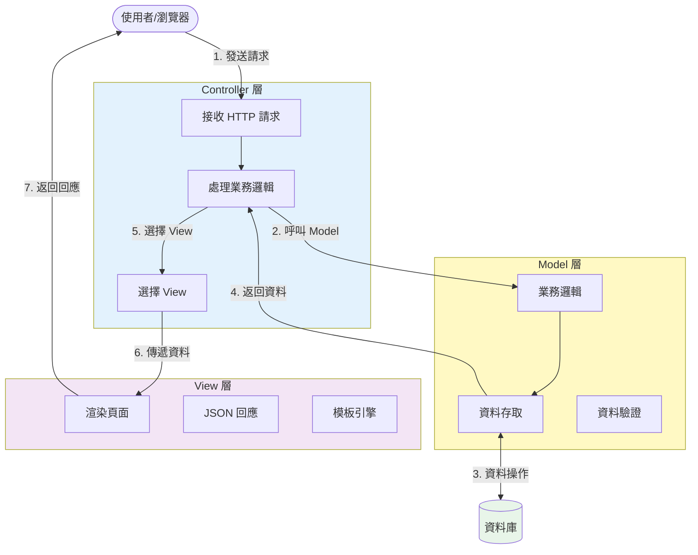
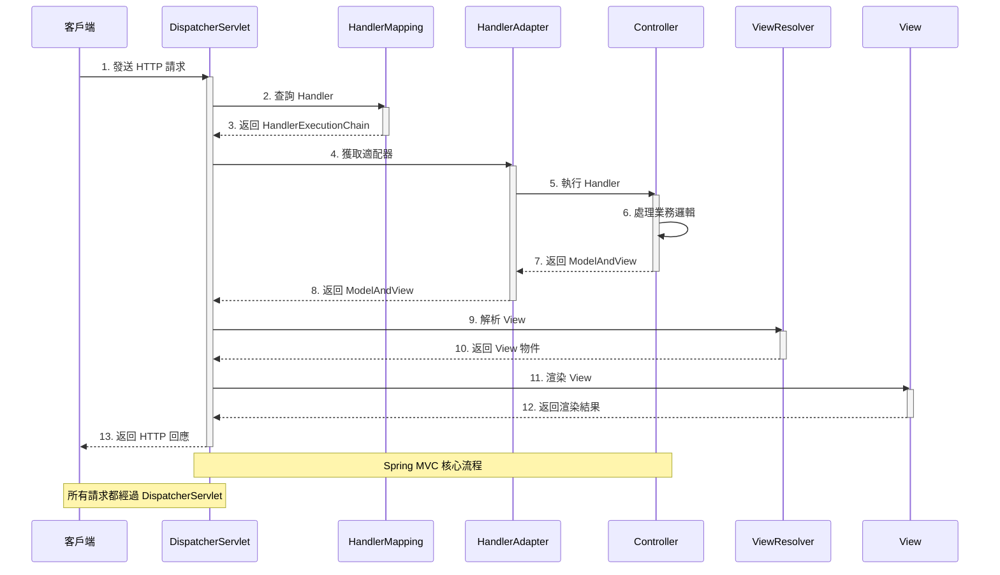

# 2.1 Spring MVC API 開發基礎

> **學習重點**：掌握 Spring MVC 核心架構、@RestController 用法和 JSON 處理機制

---

## 2.1.1 MVC 架構概述

### MVC 三層架構



> 📊 **架構圖說明**：請參考 [images/2.1-mvc-architecture.md](./images/2.1-mvc-architecture.md)

**MVC 三層職責**：

1. **Model（模型）**：業務邏輯和資料處理
2. **View（視圖）**：呈現資料給使用者
3. **Controller（控制器）**：處理使用者輸入並協調 Model 和 View

### 現代架構：View 層的變化

> 📌 **重要觀念**：在傳統 MVC 架構中，View 層由後端負責（如 JSP、Thymeleaf）。但在**現代前後端分離架構**下：

**傳統 MVC**：
```
瀏覽器 → Spring MVC Controller → Model → View (JSP/Thymeleaf) → HTML → 瀏覽器
```

**現代前後端分離**：
```
前端框架(React/Vue) → Spring Boot API → Model → JSON → 前端框架 → 瀏覽器
                        (@RestController)
```

**關鍵差異**：
- ❌ Spring Boot **不再**負責 View 層的渲染
- ✅ Spring Boot **只負責**提供 RESTful API，輸出 JSON 資料
- ✅ View 層由前端框架（React、Vue、Angular）獨立處理
- ✅ Spring MVC 的 Model-View 解耦，專注於 Model-Controller

> 💡 **本書定位**：因此本書專注於如何使用 Spring Boot 建立 RESTful API，不涉及傳統 View 技術（JSP、Thymeleaf）的內容。

---

## 2.1.2 DispatcherServlet 工作流程

Spring MVC 的核心是 DispatcherServlet，它作為前端控制器負責所有 HTTP 請求的統一分發。



> 📊 **流程圖說明**：請參考 [images/2.1-dispatcher-servlet.md](./images/2.1-dispatcher-servlet.md)

---

## 2.1.3 傳統 Web vs API 開發

### 現代開發趨勢：前後端分離

在現代 Web 應用開發中，**前後端分離**已成為主流架構模式：

**前後端分離架構**：
- 🔹 **後端（Spring Boot）**：專注於提供 RESTful API，只輸出 JSON 資料
- 🔹 **前端（React/Vue/Angular）**：負責 UI 呈現和使用者互動
- 🔹 **溝通方式**：透過 HTTP/HTTPS 的 JSON 格式進行資料交換

**為什麼前後端分離？**
- ✅ **職責分離**：後端專注業務邏輯，前端專注使用者體驗
- ✅ **開發效率**：前後端團隊可並行開發
- ✅ **技術選型靈活**：前後端可獨立選擇技術棧
- ✅ **多端支援**：同一個 API 可供 Web、Mobile、AI 等多種客戶端使用

> 💡 **重點**：現代 Spring Boot 開發較少使用傳統的 View（如 JSP、Thymeleaf），而是聚焦於 API 開發，透過 `@RestController` 輸出 JSON 格式資料。

### 架構對比

| 特性 | 傳統 Web 開發 | 現代前後端分離開發 |
|------|---------------|-------------------|
| **回應格式** | HTML 頁面（Server-Side Rendering） | JSON 資料（Client-Side Rendering） |
| **客戶端** | 主要是瀏覽器 | 多種客戶端（Web、Mobile、IoT、AI） |
| **狀態管理** | 有狀態（Session） | 無狀態（Stateless，使用 JWT） |
| **資料傳輸** | 表單提交 | JSON/XML 負載 |
| **錯誤處理** | 錯誤頁面 | 結構化錯誤回應（JSON） |
| **開發模式** | 後端包含 View 層 | 後端只提供 API |
| **部署方式** | 整體部署 | 前後端獨立部署 |

---

## 2.1.4 @RestController vs @Controller

### 核心差異

在前後端分離的架構下，我們主要使用 `@RestController` 來建立 API：

| 特性 | @Controller | @RestController |
|------|-------------|------------------|
| **組成** | 單一註解 | `@Controller` + `@ResponseBody` |
| **回應類型** | 視圖名稱（如 JSP） | 直接資料（JSON/XML） |
| **序列化** | 需手動處理 | 自動 JSON 序列化 |
| **適用場景** | 傳統 Web 應用（SSR） | 前後端分離的 RESTful API ⭐ |
| **View 層** | 需要配置 View Resolver | 不需要 View 層 |

> 💡 **本書重點**：我們專注於 `@RestController` 的使用，因為現代開發以前後端分離為主，Spring Boot 主要負責提供 API，不再處理 View 層的渲染。

### 基本範例

```java
@RestController
@RequestMapping("/api/users")
public class UserController {

    private final UserService userService;

    public UserController(UserService userService) {
        this.userService = userService;
    }

    // 取得所有使用者
    @GetMapping
    public List<User> getUsers() {
        return userService.findAll();
    }

    // 根據 ID 取得使用者
    @GetMapping("/{id}")
    public User getUser(@PathVariable Long id) {
        return userService.findById(id);
    }

    // 建立新使用者
    @PostMapping
    public User createUser(@RequestBody User user) {
        return userService.save(user);
    }
}
```

> 💡 **重點**：使用 `@RestController` 後，所有方法的返回值都會自動轉換為 JSON 格式

> 📁 **完整程式碼**：參考 [code-examples/chapter2-spring-mvc-api/src/main/java/com/example/springmvc/controller/](../../code-examples/chapter2-spring-mvc-api/src/main/java/com/example/springmvc/controller/)

---

## 2.1.5 JSON 自動處理

Spring MVC 透過 Jackson 函式庫實現自動 JSON 序列化和反序列化：

### 自動序列化範例

```java
@RestController
@RequestMapping("/api/products")
public class ProductController {

    // JSON 自動轉換
    @PostMapping
    public Product createProduct(@RequestBody Product product) {
        // 請求：JSON → Product 物件
        return productService.save(product);
        // 回應：Product 物件 → JSON
    }

    // 複雜結構自動處理
    @GetMapping("/summary")
    public Map<String, Object> getProductSummary() {
        Map<String, Object> summary = new HashMap<>();
        summary.put("totalProducts", productService.count());
        summary.put("categories", productService.getCategories());
        return summary; // 自動轉為 JSON
    }
}
```

**自動處理的優點**：
- ✅ 無需手動序列化/反序列化
- ✅ 支援複雜物件結構
- ✅ 自動型別轉換和驗證
- ✅ 提供詳細錯誤訊息

> 📁 **完整範例**：參考 [code-examples/chapter2-spring-mvc-api/](../../code-examples/chapter2-spring-mvc-api/)

---

## 2.1.6 為 Spring AI 做準備

### AI 服務的特殊需求

在設計 API 架構時，需考慮 Spring AI 的特殊需求：

**流式處理支援**：
```java
@RestController
@RequestMapping("/api/ai")
public class AIController {

    // 預留異步處理介面
    @PostMapping("/process")
    public CompletableFuture<ProcessResult> processAsync(@RequestBody ProcessRequest request) {
        return CompletableFuture.supplyAsync(() -> {
            // 適合 AI 長時間運算
            return new ProcessResult("處理完成");
        });
    }
}
```

**核心考量**：
- 支援 Server-Sent Events (SSE) 流式回應
- 多媒體內容處理能力
- 錯誤處理和重試機制
- 異步處理支援

---

## 📝 本節重點

1. ✅ **MVC 架構**：理解 Model、View、Controller 三層分離
2. ✅ **DispatcherServlet**：掌握 Spring MVC 請求處理流程
3. ✅ **@RestController**：學會建立 RESTful API
4. ✅ **JSON 處理**：理解自動序列化/反序列化機制
5. ✅ **AI 整合準備**：為 Spring AI 奠定架構基礎

---

## 🔗 相關資源

- **完整程式碼**：[code-examples/chapter2-spring-mvc-api/](../../code-examples/chapter2-spring-mvc-api/)
- **架構圖表**：[images/](./images/)
- **Spring MVC 文檔**：[Spring MVC Reference](https://docs.spring.io/spring-framework/docs/current/reference/html/web.html)

---

**下一節**：[2.2 RESTful API 設計原則](./2.2-restful-api-design.md)
