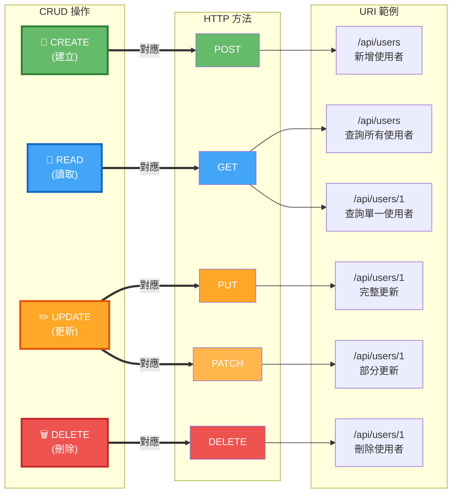
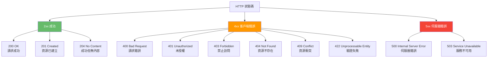

# 2.2 RESTful API 設計原則

> **對應範例**: `chapter2-spring-mvc-api`
> **難度**: ⭐⭐⭐⭐☆

---

## 📚 本章概要

REST（Representational State Transfer）是一種軟體架構風格，定義了一組約束條件和原則。遵循 RESTful 設計原則可以建立出易於理解、維護和擴展的 API。本章將深入探討 REST 架構的核心原則和實踐方法。

**學習目標**:
- 理解 REST 六大核心約束條件
- 掌握 HTTP 方法的語義化使用
- 學會資源導向的 URL 設計
- 理解 HTTP 狀態碼的正確使用
- 實現完整的 CRUD 操作

---

## 🎯 REST 架構約束條件

### REST 六大核心原則

```mermaid
graph TD
    REST[REST 設計原則]

    REST --> P1[資源導向<br/>Resource-Oriented]
    REST --> P2[統一介面<br/>Uniform Interface]
    REST --> P3[無狀態<br/>Stateless]
    REST --> P4[可快取<br/>Cacheable]
    REST --> P5[分層系統<br/>Layered System]
    REST --> P6[超媒體驅動<br/>HATEOAS]

    P1 --> P1A[URI 識別資源]
    P1 --> P1B[資源表現形式]
    P1 --> P1C[JSON/XML]

    P2 --> P2A[HTTP 標準方法]
    P2 --> P2B[GET POST PUT DELETE]
    P2 --> P2C[統一的錯誤處理]

    P3 --> P3A[每個請求獨立]
    P3 --> P3B[不依賴 Session]
    P3 --> P3C[可擴展性強]

    P4 --> P4A[HTTP Cache-Control]
    P4 --> P4B[ETag 機制]
    P4 --> P4C[提升效能]

    P5 --> P5A[客戶端-伺服器分離]
    P5 --> P5B[支援中介層]
    P5 --> P5C[負載平衡]

    P6 --> P6A[超連結導航]
    P6 --> P6B[API 可探索]
    P6 --> P6C[鬆散耦合]

    style REST fill:#ff6b6b,color:#fff
    style P1 fill:#4ecdc4,color:#fff
    style P2 fill:#45b7d1,color:#fff
    style P3 fill:#f9ca24,color:#333
    style P4 fill:#6c5ce7,color:#fff
    style P5 fill:#a29bfe,color:#fff
    style P6 fill:#fd79a8,color:#fff
```

REST 架構由 Roy Fielding 在其博士論文中提出，定義了六個核心約束條件：



### 核心約束詳解

| 約束條件 | 說明 | 優勢 | 實踐方式 |
|----------|------|------|----------|
| **客戶端-伺服器** | 分離使用者介面和資料儲存 | 提高可移植性和可擴展性 | 前後端分離架構 |
| **無狀態** | 每個請求包含完整資訊 | 提高可見性、可靠性、可擴展性 | 使用 JWT Token |
| **可快取** | 回應可標記為可快取 | 提高網路效率和使用者體驗 | Cache-Control 標頭 |
| **統一介面** | 使用統一的介面約束 | 簡化架構，提高可見性 | RESTful API 設計 |
| **分層系統** | 架構由分層組成 | 提高可擴展性和安全性 | 負載均衡、API 閘道 |
| **超媒體驅動** | 使用超連結導航 API | 降低耦合度 | HATEOAS 實現 |

**為什麼要遵循 REST 原則？**
- ✅ **統一標準**: 降低學習成本和溝通成本
- ✅ **可擴展性**: 支援大規模分散式系統
- ✅ **可維護性**: 清晰的架構和職責劃分
- ✅ **多平台支援**: 適用於 Web、Mobile、IoT 等多種客戶端
- ✅ **工具生態**: 豐富的工具和框架支援

> 💡 **實務建議**: 在實際開發中，我們通常實現 REST 的前四個約束（客戶端-伺服器、無狀態、可快取、統一介面），而 HATEOAS（超媒體驅動）在實務中較少完全實現。

---

## 🔄 HTTP 方法語義化使用

### HTTP 方法與 CRUD 對應

HTTP 方法定義了對資源的操作類型。正確使用 HTTP 方法是 RESTful API 設計的關鍵：



### HTTP 方法特性詳解

| HTTP 方法 | 用途 | 冪等性 | 安全性 | 請求 Body | 典型使用場景 |
|-----------|------|--------|--------|-----------|--------------|
| **GET** | 獲取資源 | ✅ 是 | ✅ 是 | ❌ 無 | 查詢資料、獲取列表 |
| **POST** | 建立資源 | ❌ 否 | ❌ 否 | ✅ 有 | 新增資料、提交表單 |
| **PUT** | 更新/替換資源 | ✅ 是 | ❌ 否 | ✅ 有 | 完整更新資源 |
| **PATCH** | 部分更新資源 | ❌ 否* | ❌ 否 | ✅ 有 | 部分欄位更新 |
| **DELETE** | 刪除資源 | ✅ 是 | ❌ 否 | ❌ 無 | 刪除資料 |

> **冪等性說明**: 多次執行相同操作，結果應該相同。例如刪除同一資源多次，第一次成功，後續返回 404，但系統狀態保持一致。

> **安全性說明**: 不會修改資源狀態的操作稱為安全操作。只有 GET 是安全的。

**PUT vs PATCH 的關鍵差異**:

```java
// PUT - 完整更新（必須提供所有欄位）
PUT /api/users/1
{
  "username": "john",
  "email": "john@example.com",
  "phone": "0912345678",
  "address": "台北市信義區"
}
// 如果缺少某個欄位，該欄位會被設為 null 或預設值

// PATCH - 部分更新（只更新指定欄位）
PATCH /api/users/1
{
  "email": "newemail@example.com"
}
// 只更新 email，其他欄位保持不變
```

---

## 💻 完整 CRUD 操作實現

### 標準 RESTful API 設計

```java
// 對應範例: chapter2-spring-mvc-api/.../api/UserRestController.java:15

@RestController
@RequestMapping("/api/v1/users")
@RequiredArgsConstructor
public class UserRestController {

    private final UserService userService;
    private final UserMapper userMapper;

    /**
     * 查詢使用者列表（支援分頁和搜尋）
     * GET /api/v1/users?page=0&size=20&keyword=john
     */
    @GetMapping
    public ResponseEntity<PagedResponse<UserDto>> getUsers(
            @RequestParam(defaultValue = "0") int page,
            @RequestParam(defaultValue = "20") int size,
            @RequestParam(required = false) String keyword) {

        Page<User> userPage = userService.search(
            keyword,
            PageRequest.of(page, size, Sort.by("createdAt").descending())
        );

        PagedResponse<UserDto> response = PagedResponse.of(
            userPage,
            UserDto::from
        );

        return ResponseEntity.ok(response);
    }

    /**
     * 查詢單一使用者
     * GET /api/v1/users/{id}
     */
    @GetMapping("/{id}")
    public ResponseEntity<UserDto> getUserById(@PathVariable Long id) {
        User user = userService.findById(id);
        return ResponseEntity.ok(UserDto.from(user));
    }

    /**
     * 建立新使用者
     * POST /api/v1/users
     *
     * 返回 201 Created 和 Location 標頭
     */
    @PostMapping
    public ResponseEntity<UserDto> createUser(
            @RequestBody @Valid CreateUserRequest request) {

        User user = userService.create(request);
        UserDto dto = UserDto.from(user);

        // 建立 Location 標頭，指向新建立的資源
        URI location = ServletUriComponentsBuilder
            .fromCurrentRequest()
            .path("/{id}")
            .buildAndExpand(user.getId())
            .toUri();

        return ResponseEntity
            .created(location)  // 201 Created
            .body(dto);
    }

    /**
     * 完整更新使用者
     * PUT /api/v1/users/{id}
     *
     * 必須提供所有欄位，缺少的欄位會被清空
     */
    @PutMapping("/{id}")
    public ResponseEntity<UserDto> updateUser(
            @PathVariable Long id,
            @RequestBody @Valid UpdateUserRequest request) {

        User user = userService.update(id, request);
        return ResponseEntity.ok(UserDto.from(user));
    }

    /**
     * 部分更新使用者
     * PATCH /api/v1/users/{id}
     *
     * 只更新提供的欄位，其他欄位保持不變
     */
    @PatchMapping("/{id}")
    public ResponseEntity<UserDto> patchUser(
            @PathVariable Long id,
            @RequestBody Map<String, Object> updates) {

        User user = userService.patch(id, updates);
        return ResponseEntity.ok(UserDto.from(user));
    }

    /**
     * 刪除使用者
     * DELETE /api/v1/users/{id}
     *
     * 返回 204 No Content
     */
    @DeleteMapping("/{id}")
    public ResponseEntity<Void> deleteUser(@PathVariable Long id) {
        userService.delete(id);
        return ResponseEntity.noContent().build();  // 204 No Content
    }

    /**
     * 批次刪除使用者
     * DELETE /api/v1/users?ids=1,2,3
     */
    @DeleteMapping
    public ResponseEntity<Void> deleteUsers(
            @RequestParam List<Long> ids) {

        userService.deleteAll(ids);
        return ResponseEntity.noContent().build();
    }
}
```

**程式碼重點**:
- ✅ **GET 用於查詢**: 支援分頁、排序和搜尋
- ✅ **POST 返回 201**: 建立資源後返回 Created 狀態和 Location 標頭
- ✅ **PUT 完整更新**: 必須提供所有欄位
- ✅ **PATCH 部分更新**: 只更新指定欄位
- ✅ **DELETE 返回 204**: 刪除成功後返回 No Content
- ✅ **使用 @Valid**: 自動驗證請求資料

### 服務層實現範例

```java
// 對應範例: chapter2-spring-mvc-api/.../service/UserService.java

@Service
@RequiredArgsConstructor
public class UserService {

    private final UserRepository userRepository;

    /**
     * 建立使用者
     */
    @Transactional
    public User create(CreateUserRequest request) {
        // 檢查使用者名稱是否已存在
        if (userRepository.existsByUsername(request.getUsername())) {
            throw new DuplicateResourceException("使用者名稱已存在");
        }

        User user = User.builder()
            .username(request.getUsername())
            .email(request.getEmail())
            .phone(request.getPhone())
            .build();

        return userRepository.save(user);
    }

    /**
     * 完整更新使用者
     */
    @Transactional
    public User update(Long id, UpdateUserRequest request) {
        User user = findById(id);

        // PUT 必須更新所有欄位
        user.setUsername(request.getUsername());
        user.setEmail(request.getEmail());
        user.setPhone(request.getPhone());
        user.setAddress(request.getAddress());

        return userRepository.save(user);
    }

    /**
     * 部分更新使用者（使用反射動態更新）
     */
    @Transactional
    public User patch(Long id, Map<String, Object> updates) {
        User user = findById(id);

        // 只更新提供的欄位
        updates.forEach((key, value) -> {
            switch (key) {
                case "email" -> user.setEmail((String) value);
                case "phone" -> user.setPhone((String) value);
                case "address" -> user.setAddress((String) value);
                // 敏感欄位不允許通過 PATCH 更新
                case "password" -> throw new IllegalArgumentException(
                    "密碼不能通過 PATCH 更新"
                );
            }
        });

        return userRepository.save(user);
    }
}
```

> 📁 **完整實作**: 參考 [code-examples/chapter2-spring-mvc-api/](../../code-examples/chapter2-spring-mvc-api/)

---

## 🎨 URL 設計規範

### 資源導向命名原則

RESTful API 的 URL 應該以**資源**為中心，而不是動作。

**✅ 好的設計**:
```
GET    /api/v1/users              # 使用複數名詞
GET    /api/v1/users/123          # 使用 ID 識別資源
GET    /api/v1/users/123/orders   # 使用階層表示關聯
POST   /api/v1/users              # 建立使用 POST
GET    /api/v1/users?status=active  # 使用查詢參數過濾
```

**❌ 應避免的設計**:
```
GET    /api/v1/getUsers           # ❌ 避免動詞
GET    /api/v1/user               # ❌ 避免單數（除非是單例資源）
GET    /api/v1/users?action=get   # ❌ 避免查詢參數表示動作
POST   /api/v1/createUser         # ❌ 避免在 URL 中使用動作
DELETE /api/v1/users/123/delete   # ❌ HTTP 方法已表達動作
```

### URL 設計模式

**1. 集合資源 vs 單一資源**:
```
/api/v1/users          # 集合資源（複數）
/api/v1/users/123      # 單一資源（使用 ID）
```

**2. 階層關係表示**:
```
/api/v1/users/123/orders           # 使用者的訂單
/api/v1/users/123/orders/456       # 使用者的特定訂單
/api/v1/categories/tech/products   # 分類下的產品
```

**3. 過濾、排序、分頁**:
```
/api/v1/products?category=book&price_min=100&price_max=500   # 過濾
/api/v1/products?sort=price&order=desc                        # 排序
/api/v1/products?page=1&size=20                               # 分頁
```

**4. 搜尋資源**:
```
/api/v1/search?q=spring boot       # 全站搜尋
/api/v1/users/search?q=john        # 使用者搜尋
```

**5. 批次操作**:
```
POST   /api/v1/users/batch         # 批次建立
DELETE /api/v1/users?ids=1,2,3     # 批次刪除
```

### 版本控制策略

**方法一：URL 版本控制（推薦）**:
```java
// 對應範例: chapter2-spring-mvc-api/.../api/v1/UserRestController.java

@RestController
@RequestMapping("/api/v1/users")  // 版本 1
public class UserRestControllerV1 { }

@RestController
@RequestMapping("/api/v2/users")  // 版本 2
public class UserRestControllerV2 { }
```

**方法二：標頭版本控制**:
```java
@RestController
@RequestMapping("/api/users")
public class UserRestController {

    @GetMapping(headers = "API-Version=1")
    public ResponseEntity<List<UserDto>> getUsersV1() { }

    @GetMapping(headers = "API-Version=2")
    public ResponseEntity<List<UserDtoV2>> getUsersV2() { }
}
```

**方法三：Accept 標頭版本控制**:
```java
@GetMapping(produces = "application/vnd.company.api-v1+json")
public ResponseEntity<List<UserDto>> getUsersV1() { }
```

> 💡 **推薦**: URL 版本控制最直觀，便於測試和文件化，是最常用的方案。

---

## 📊 HTTP 狀態碼最佳實踐

### 常用狀態碼分類



### 狀態碼使用指南

| 狀態碼 | 說明 | 使用時機 | 回應 Body |
|--------|------|----------|-----------|
| **200 OK** | 請求成功 | GET、PUT、PATCH 成功 | 資源資料 |
| **201 Created** | 已建立資源 | POST 成功建立資源 | 新資源資料 + Location |
| **204 No Content** | 成功但無內容 | DELETE 成功、PUT 不返回內容 | 無 |
| **400 Bad Request** | 錯誤請求 | 請求格式錯誤 | 錯誤詳情 |
| **401 Unauthorized** | 未授權 | 缺少或無效的認證資訊 | 錯誤訊息 |
| **403 Forbidden** | 禁止訪問 | 已認證但權限不足 | 錯誤訊息 |
| **404 Not Found** | 資源不存在 | 找不到指定資源 | 錯誤訊息 |
| **409 Conflict** | 資源衝突 | 資源狀態衝突（如重複建立） | 衝突詳情 |
| **422 Unprocessable Entity** | 無法處理 | 資料驗證失敗 | 驗證錯誤詳情 |
| **500 Internal Server Error** | 伺服器錯誤 | 系統異常 | 錯誤訊息（不洩漏細節） |

### 狀態碼使用範例

```java
// 對應範例: chapter2-spring-mvc-api/.../api/ProductRestController.java:20

@RestController
@RequestMapping("/api/v1/products")
public class ProductRestController {

    // 200 OK - 查詢成功
    @GetMapping("/{id}")
    public ResponseEntity<ProductDto> getProduct(@PathVariable Long id) {
        Product product = productService.findById(id);
        return ResponseEntity.ok(product);  // 200 OK
    }

    // 201 Created - 建立成功
    @PostMapping
    public ResponseEntity<ProductDto> createProduct(
            @RequestBody @Valid CreateProductRequest request) {

        Product product = productService.create(request);

        URI location = ServletUriComponentsBuilder
            .fromCurrentRequest()
            .path("/{id}")
            .buildAndExpand(product.getId())
            .toUri();

        return ResponseEntity
            .created(location)  // 201 Created + Location 標頭
            .body(ProductDto.from(product));
    }

    // 204 No Content - 刪除成功
    @DeleteMapping("/{id}")
    public ResponseEntity<Void> deleteProduct(@PathVariable Long id) {
        productService.delete(id);
        return ResponseEntity.noContent().build();  // 204 No Content
    }

    // 400 Bad Request - 透過 @Valid 自動觸發
    // 422 Unprocessable Entity - 業務驗證失敗
    @PostMapping("/validate")
    public ResponseEntity<ProductDto> validateAndCreate(
            @RequestBody @Valid CreateProductRequest request) {

        // 業務規則驗證
        if (productService.existsByName(request.getName())) {
            throw new BusinessException(
                "產品名稱已存在",
                HttpStatus.UNPROCESSABLE_ENTITY
            );
        }

        Product product = productService.create(request);
        return ResponseEntity.ok(ProductDto.from(product));
    }
}
```

### 全域異常處理

```java
// 對應範例: chapter2-spring-mvc-api/.../exception/GlobalExceptionHandler.java

@RestControllerAdvice
@Slf4j
public class GlobalExceptionHandler {

    // 404 Not Found - 資源不存在
    @ExceptionHandler(ResourceNotFoundException.class)
    public ResponseEntity<ErrorResponse> handleNotFound(
            ResourceNotFoundException ex) {

        log.error("資源不存在: {}", ex.getMessage());

        ErrorResponse error = ErrorResponse.builder()
            .code(HttpStatus.NOT_FOUND.value())
            .message(ex.getMessage())
            .timestamp(LocalDateTime.now())
            .build();

        return ResponseEntity.status(HttpStatus.NOT_FOUND).body(error);
    }

    // 409 Conflict - 資源衝突
    @ExceptionHandler(DuplicateResourceException.class)
    public ResponseEntity<ErrorResponse> handleDuplicate(
            DuplicateResourceException ex) {

        log.error("資源衝突: {}", ex.getMessage());

        ErrorResponse error = ErrorResponse.builder()
            .code(HttpStatus.CONFLICT.value())
            .message(ex.getMessage())
            .timestamp(LocalDateTime.now())
            .build();

        return ResponseEntity.status(HttpStatus.CONFLICT).body(error);
    }

    // 422 Unprocessable Entity - 驗證失敗
    @ExceptionHandler(MethodArgumentNotValidException.class)
    public ResponseEntity<ErrorResponse> handleValidation(
            MethodArgumentNotValidException ex) {

        Map<String, String> errors = new HashMap<>();
        ex.getBindingResult().getFieldErrors().forEach(error ->
            errors.put(error.getField(), error.getDefaultMessage())
        );

        ErrorResponse error = ErrorResponse.builder()
            .code(HttpStatus.UNPROCESSABLE_ENTITY.value())
            .message("資料驗證失敗")
            .errors(errors)
            .timestamp(LocalDateTime.now())
            .build();

        return ResponseEntity
            .status(HttpStatus.UNPROCESSABLE_ENTITY)
            .body(error);
    }

    // 500 Internal Server Error - 系統異常
    @ExceptionHandler(Exception.class)
    public ResponseEntity<ErrorResponse> handleGeneric(Exception ex) {
        log.error("系統異常", ex);

        ErrorResponse error = ErrorResponse.builder()
            .code(HttpStatus.INTERNAL_SERVER_ERROR.value())
            .message("系統錯誤，請稍後再試")
            .timestamp(LocalDateTime.now())
            .build();

        return ResponseEntity
            .status(HttpStatus.INTERNAL_SERVER_ERROR)
            .body(error);
    }
}
```

> 📁 **完整錯誤處理**: 參考 [code-examples/chapter2-spring-mvc-api/src/main/java/com/example/exception/](../../code-examples/chapter2-spring-mvc-api/src/main/java/com/example/exception/)

---

## 📝 本節重點回顧

### 核心知識點

1. **REST 約束** - 理解 REST 六大核心原則及其優勢
2. **HTTP 方法** - 掌握 GET、POST、PUT、PATCH、DELETE 的正確用法和語義
3. **URL 設計** - 學會資源導向的 URL 命名規範和階層設計
4. **狀態碼** - 正確使用 HTTP 狀態碼回應不同情境
5. **版本控制** - 了解 API 版本管理的多種策略
6. **異常處理** - 實現統一的錯誤處理機制

### 技術要點

- ✅ URL 使用名詞（資源），HTTP 方法表達動作
- ✅ GET 是安全且冪等的，不應修改資源狀態
- ✅ POST 用於建立資源，返回 201 Created 和 Location 標頭
- ✅ PUT 用於完整更新，PATCH 用於部分更新
- ✅ DELETE 成功後返回 204 No Content
- ✅ 使用正確的 HTTP 狀態碼表達操作結果
- ✅ 實現全域異常處理，統一錯誤回應格式

---

## 🚀 下一步

👉 [2.3 API 請求與回應處理](./2.3-request-response-handling.md) - 掌握請求參數綁定和統一回應格式

---

## 📚 參考資源

**官方文件**:
- [RESTful API Design Best Practices](https://restfulapi.net/)
- [HTTP Status Codes](https://httpstatuses.com/)
- [RFC 7231 - HTTP/1.1 Semantics](https://tools.ietf.org/html/rfc7231)

**範例程式碼**:
- [完整專案程式碼](../../code-examples/chapter2-spring-mvc-api)
- [UserRestController.java](../../code-examples/chapter2-spring-mvc-api/src/main/java/com/example/api/UserRestController.java)
- [ProductRestController.java](../../code-examples/chapter2-spring-mvc-api/src/main/java/com/example/api/ProductRestController.java)
- [GlobalExceptionHandler.java](../../code-examples/chapter2-spring-mvc-api/src/main/java/com/example/exception/GlobalExceptionHandler.java)

---

**相關章節**:
- ← 上一章: [2.1 Spring MVC API 開發基礎](./2.1-spring-mvc-basics.md)
- → 下一章: [2.3 API 請求與回應處理](./2.3-request-response-handling.md)
