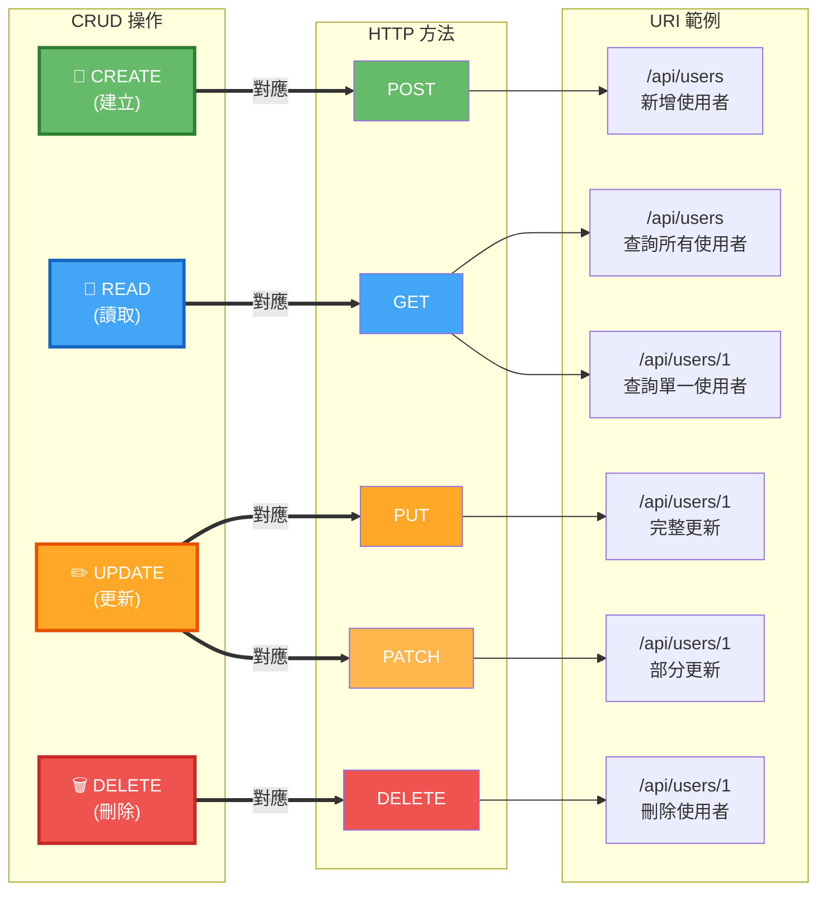

# 2.2 RESTful API 設計原則

> **學習重點**：掌握 REST 架構約束、HTTP 方法語義化使用和資源導向設計

---

## 2.2.1 REST 架構約束條件

### REST 六大核心原則

```mermaid
graph TD
    REST[REST 設計原則]

    REST --> P1[資源導向<br/>Resource-Oriented]
    REST --> P2[統一介面<br/>Uniform Interface]
    REST --> P3[無狀態<br/>Stateless]
    REST --> P4[可快取<br/>Cacheable]
    REST --> P5[分層系統<br/>Layered System]
    REST --> P6[超媒體驅動<br/>HATEOAS]

    P1 --> P1A[URI 識別資源]
    P1 --> P1B[資源表現形式]
    P1 --> P1C[JSON/XML]

    P2 --> P2A[HTTP 標準方法]
    P2 --> P2B[GET POST PUT DELETE]
    P2 --> P2C[統一的錯誤處理]

    P3 --> P3A[每個請求獨立]
    P3 --> P3B[不依賴 Session]
    P3 --> P3C[可擴展性強]

    P4 --> P4A[HTTP Cache-Control]
    P4 --> P4B[ETag 機制]
    P4 --> P4C[提升效能]

    P5 --> P5A[客戶端-伺服器分離]
    P5 --> P5B[支援中介層]
    P5 --> P5C[負載平衡]

    P6 --> P6A[超連結導航]
    P6 --> P6B[API 可探索]
    P6 --> P6C[鬆散耦合]

    style REST fill:#ff6b6b,color:#fff
    style P1 fill:#4ecdc4,color:#fff
    style P2 fill:#45b7d1,color:#fff
    style P3 fill:#f9ca24,color:#333
    style P4 fill:#6c5ce7,color:#fff
    style P5 fill:#a29bfe,color:#fff
    style P6 fill:#fd79a8,color:#fff
```



> 📊 **REST 原則圖**：請參考 [images/2.2-rest-principles.md](./images/2.2-rest-principles.md)

### 核心約束說明

| 約束條件 | 說明 | 優勢 |
|----------|------|------|
| **客戶端-伺服器** | 分離使用者介面和資料儲存 | 提高可移植性和可擴展性 |
| **無狀態** | 每個請求包含完整資訊 | 提高可見性、可靠性、可擴展性 |
| **可快取** | 回應可標記為可快取 | 提高網路效率和使用者體驗 |
| **統一介面** | 使用統一的介面約束 | 簡化架構，提高可見性 |
| **分層系統** | 架構由分層組成 | 提高可擴展性和安全性 |

---

## 2.2.2 HTTP 方法語義化使用

### HTTP 方法與 CRUD 對應



> 📊 **HTTP 方法對應圖**：請參考 [images/2.2-http-methods.md](./images/2.2-http-methods.md)

### 方法特性對照表

| HTTP 方法 | 用途 | 冪等性 | 安全性 | 典型使用場景 |
|-----------|------|--------|--------|--------------|
| **GET** | 獲取資源 | ✅ | ✅ | 查詢資料、獲取列表 |
| **POST** | 建立資源 | ❌ | ❌ | 新增資料、提交表單 |
| **PUT** | 更新/替換資源 | ✅ | ❌ | 完整更新資源 |
| **PATCH** | 部分更新資源 | ❌ | ❌ | 部分欄位更新 |
| **DELETE** | 刪除資源 | ✅ | ❌ | 刪除資料 |

---

## 2.2.3 完整 CRUD 操作實現

### 基礎範例

```java
@RestController
@RequestMapping("/api/v1/users")
public class UserRestController {

    private final UserService userService;

    // 1. 查詢列表 - GET /api/v1/users
    @GetMapping
    public ResponseEntity<List<UserDto>> getUsers(
            @RequestParam(defaultValue = "0") int page,
            @RequestParam(defaultValue = "20") int size) {
        Page<User> userPage = userService.findAll(PageRequest.of(page, size));
        return ResponseEntity.ok(userMapper.toDtoList(userPage.getContent()));
    }

    // 2. 查詢單一資源 - GET /api/v1/users/{id}
    @GetMapping("/{id}")
    public ResponseEntity<UserDto> getUserById(@PathVariable Long id) {
        User user = userService.findById(id);
        return ResponseEntity.ok(userMapper.toDto(user));
    }

    // 3. 建立資源 - POST /api/v1/users
    @PostMapping
    public ResponseEntity<UserDto> createUser(@Valid @RequestBody CreateUserRequest request) {
        User user = userService.create(request);
        return ResponseEntity
                .created(URI.create("/api/v1/users/" + user.getId()))
                .body(userMapper.toDto(user));
    }

    // 4. 完整更新 - PUT /api/v1/users/{id}
    @PutMapping("/{id}")
    public ResponseEntity<UserDto> updateUser(
            @PathVariable Long id,
            @Valid @RequestBody UpdateUserRequest request) {
        User user = userService.update(id, request);
        return ResponseEntity.ok(userMapper.toDto(user));
    }

    // 5. 部分更新 - PATCH /api/v1/users/{id}
    @PatchMapping("/{id}")
    public ResponseEntity<UserDto> patchUser(
            @PathVariable Long id,
            @RequestBody Map<String, Object> updates) {
        User user = userService.patch(id, updates);
        return ResponseEntity.ok(userMapper.toDto(user));
    }

    // 6. 刪除資源 - DELETE /api/v1/users/{id}
    @DeleteMapping("/{id}")
    public ResponseEntity<Void> deleteUser(@PathVariable Long id) {
        userService.delete(id);
        return ResponseEntity.noContent().build();
    }
}
```

> 💡 **設計要點**：
> - GET 用於查詢，應該是安全且冪等的
> - POST 用於建立，返回 201 Created 和 Location 標頭
> - PUT 用於完整更新，必須提供所有欄位
> - PATCH 用於部分更新，只更新指定欄位
> - DELETE 用於刪除，返回 204 No Content

> 📁 **完整實作**：參考 [code-examples/chapter2-spring-mvc-api/src/main/java/com/example/springmvc/controller/](../../code-examples/chapter2-spring-mvc-api/src/main/java/com/example/springmvc/controller/)

---

## 2.2.4 URL 設計規範

### 命名規則

✅ **好的設計**：
```
GET    /api/v1/users              # 使用複數名詞
GET    /api/v1/users/123          # 使用 ID 識別資源
GET    /api/v1/users/123/orders   # 使用階層表示關聯
POST   /api/v1/users              # 建立使用 POST
```

❌ **應避免的設計**：
```
GET    /api/v1/getUsers           # 避免動詞
GET    /api/v1/user               # 避免單數
GET    /api/v1/users?action=get   # 避免查詢參數表示動作
POST   /api/v1/createUser         # 避免在 URL 中使用動作
```

### 版本控制策略

**URL 版本控制**（推薦）：
```java
@RequestMapping("/api/v1/users")  // 版本 1
@RequestMapping("/api/v2/users")  // 版本 2
```

**標頭版本控制**：
```java
@GetMapping(headers = "API-Version=1")
```

---

## 2.2.5 HTTP 狀態碼最佳實踐

### 常用狀態碼

| 狀態碼 | 說明 | 使用場景 |
|--------|------|----------|
| **200 OK** | 成功 | GET、PUT、PATCH 成功 |
| **201 Created** | 已建立 | POST 成功建立資源 |
| **204 No Content** | 無內容 | DELETE 成功 |
| **400 Bad Request** | 錯誤請求 | 請求參數錯誤 |
| **401 Unauthorized** | 未授權 | 需要身份驗證 |
| **403 Forbidden** | 禁止訪問 | 權限不足 |
| **404 Not Found** | 找不到 | 資源不存在 |
| **500 Internal Server Error** | 伺服器錯誤 | 系統異常 |

### 狀態碼使用範例

```java
@RestController
public class ProductController {

    // 200 OK - 查詢成功
    @GetMapping("/products/{id}")
    public ResponseEntity<Product> getProduct(@PathVariable Long id) {
        return ResponseEntity.ok(productService.findById(id));
    }

    // 201 Created - 建立成功
    @PostMapping("/products")
    public ResponseEntity<Product> createProduct(@RequestBody Product product) {
        Product created = productService.create(product);
        return ResponseEntity
                .created(URI.create("/products/" + created.getId()))
                .body(created);
    }

    // 204 No Content - 刪除成功
    @DeleteMapping("/products/{id}")
    public ResponseEntity<Void> deleteProduct(@PathVariable Long id) {
        productService.delete(id);
        return ResponseEntity.noContent().build();
    }

    // 404 Not Found - 資源不存在
    @ExceptionHandler(ResourceNotFoundException.class)
    public ResponseEntity<ErrorResponse> handleNotFound(ResourceNotFoundException ex) {
        return ResponseEntity
                .status(HttpStatus.NOT_FOUND)
                .body(new ErrorResponse(ex.getMessage()));
    }
}
```

> 📁 **完整錯誤處理**：參考 [code-examples/chapter2-spring-mvc-api/src/main/java/com/example/springmvc/exception/](../../code-examples/chapter2-spring-mvc-api/src/main/java/com/example/springmvc/exception/)

---

## 📝 本節重點

1. ✅ **REST 約束**：理解 REST 六大核心原則
2. ✅ **HTTP 方法**：掌握 GET、POST、PUT、PATCH、DELETE 的正確用法
3. ✅ **URL 設計**：學會資源導向的 URL 命名規範
4. ✅ **狀態碼**：正確使用 HTTP 狀態碼回應客戶端
5. ✅ **版本控制**：了解 API 版本管理策略

---

## 🔗 相關資源

- **完整程式碼**：[code-examples/chapter2-spring-mvc-api/](../../code-examples/chapter2-spring-mvc-api/)
- **架構圖表**：[images/](./images/)
- **RESTful API 設計指南**：[RESTful API Design](https://restfulapi.net/)

---

**上一節**：[2.1 Spring MVC API 開發基礎](./2.1-spring-mvc-basics.md)
**下一節**：[2.3 異常處理與統一回應](./2.3-exception-handling.md)
