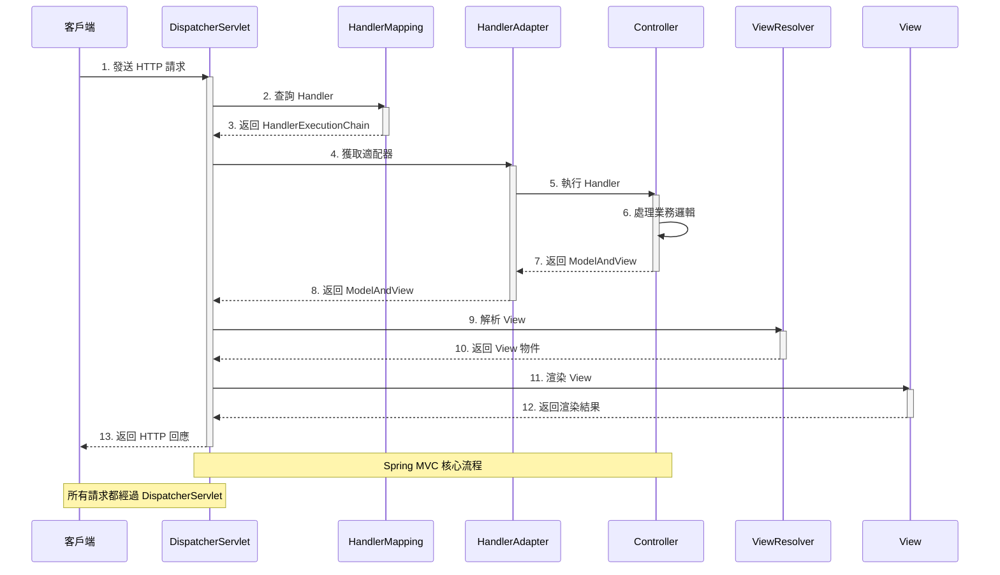

# DispatcherServlet 工作流程

## 說明

DispatcherServlet 是 Spring MVC 的前端控制器（Front Controller），負責接收所有 HTTP 請求並分發給適當的處理器。

## 處理流程

1. **接收請求**：客戶端發送 HTTP 請求到 DispatcherServlet
2. **查詢處理器**：DispatcherServlet 詢問 HandlerMapping 來找到處理請求的 Handler
3. **獲取適配器**：獲取能夠執行該 Handler 的 HandlerAdapter
4. **執行處理器**：HandlerAdapter 調用 Controller 處理業務邏輯
5. **返回模型和視圖**：Controller 返回 ModelAndView 物件
6. **解析視圖**：ViewResolver 根據視圖名稱解析出具體的 View 物件
7. **渲染視圖**：View 渲染頁面並生成最終回應
8. **返回回應**：DispatcherServlet 將結果返回給客戶端

## 核心組件

- **DispatcherServlet**：前端控制器，Spring MVC 的核心
- **HandlerMapping**：處理器映射，決定哪個 Controller 處理請求
- **HandlerAdapter**：處理器適配器，執行 Controller
- **Controller**：控制器，處理業務邏輯
- **ViewResolver**：視圖解析器，解析視圖名稱
- **View**：視圖，渲染最終回應
