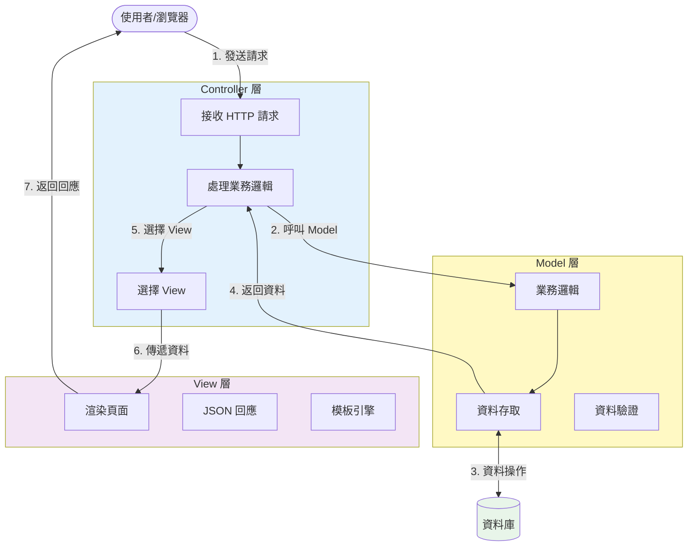

# MVC 架構圖



## 說明

MVC (Model-View-Controller) 是一種軟體架構模式，將應用程式分為三個核心組件：

1. **Model（模型）**：負責業務邏輯和資料處理
2. **View（視圖）**：負責呈現資料給使用者
3. **Controller（控制器）**：負責處理使用者輸入並協調 Model 和 View

## 資料流程

1. 使用者透過瀏覽器發送 HTTP 請求
2. Controller 接收請求並處理業務邏輯
3. Controller 呼叫 Model 進行資料操作
4. Model 與資料庫互動，執行 CRUD 操作
5. Model 將資料返回給 Controller
6. Controller 選擇適當的 View
7. View 渲染頁面或生成 JSON 回應
8. 最終回應返回給使用者

## MVC 三層職責

### Controller（控制器層）
- 接收並解析 HTTP 請求
- 驗證請求參數
- 呼叫 Service 層處理業務邏輯
- 選擇適當的 View 或返回 JSON
- 處理異常和錯誤

**範例**：
```java
@RestController
@RequestMapping("/api/users")
public class UserController {
    @GetMapping("/{id}")
    public ResponseEntity<User> getUser(@PathVariable Long id) {
        User user = userService.findById(id);
        return ResponseEntity.ok(user);
    }
}
```

### Model（模型層）
- 封裝業務邏輯
- 資料驗證和處理
- 與資料庫互動
- 定義資料結構

**範例**：
```java
@Entity
public class User {
    @Id
    @GeneratedValue(strategy = GenerationType.IDENTITY)
    private Long id;

    private String username;
    private String email;
}
```

### View（視圖層）
- 渲染 HTML 頁面（傳統 MVC）
- 返回 JSON/XML（RESTful API）
- 呈現資料給使用者
- 不包含業務邏輯

**範例**：
```json
{
  "id": 1,
  "username": "john",
  "email": "john@example.com"
}
```

## 優點

- **關注點分離**：每層各司其職，易於維護
- **可測試性**：各層可以獨立測試
- **可重用性**：Model 和 View 可以在不同場景重用
- **可擴展性**：容易添加新功能或修改現有功能
- **團隊協作**：不同團隊成員可以專注於不同層

## Spring MVC 實現

在 Spring 框架中，MVC 模式通過以下組件實現：

- **@Controller / @RestController**：定義控制器
- **@Service**：定義服務層（Model 的一部分）
- **@Repository**：定義資料訪問層（Model 的一部分）
- **@Entity**：定義實體類別（Model）
- **ViewResolver**：解析視圖
- **Jackson / Gson**：JSON 序列化（View）
