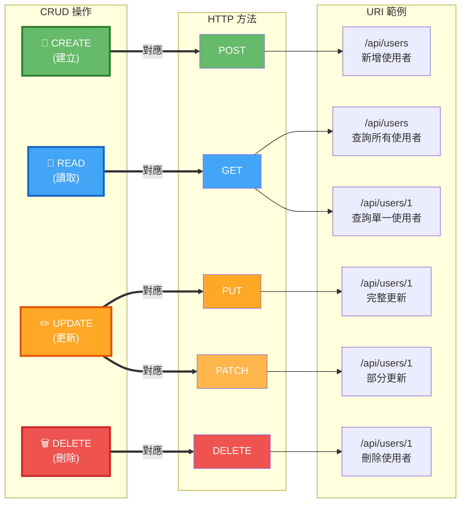

# HTTP 方法與 CRUD 對應



## 說明

RESTful API 使用標準的 HTTP 方法來實現 CRUD（Create、Read、Update、Delete）操作。

## HTTP 方法對應表

| CRUD 操作 | HTTP 方法 | URI 範例 | 說明 |
|-----------|----------|----------|------|
| **Create** | POST | `/api/users` | 新增一個使用者 |
| **Read** | GET | `/api/users` | 取得所有使用者 |
| **Read** | GET | `/api/users/1` | 取得特定使用者 |
| **Update** | PUT | `/api/users/1` | 完整更新使用者 |
| **Update** | PATCH | `/api/users/1` | 部分更新使用者 |
| **Delete** | DELETE | `/api/users/1` | 刪除使用者 |

## 詳細說明

### POST - 建立資源
- **用途**：建立新的資源
- **URI**：集合資源的 URI（如 `/api/users`）
- **請求體**：包含新資源的資料
- **回應**：通常返回 201 Created 和新建立的資源
- **冪等性**：否（多次執行會建立多個資源）

**範例**：
```http
POST /api/users
Content-Type: application/json

{
  "username": "john",
  "email": "john@example.com",
  "fullName": "John Doe"
}
```

### GET - 讀取資源
- **用途**：查詢資源
- **URI**：
  - 集合資源：`/api/users`（取得所有）
  - 單一資源：`/api/users/1`（取得特定）
- **請求體**：無
- **回應**：200 OK 和資源資料
- **冪等性**：是（多次執行結果相同）
- **安全性**：是（不會修改資源）

**範例**：
```http
GET /api/users/1
```

### PUT - 完整更新
- **用途**：完整替換現有資源
- **URI**：單一資源的 URI（如 `/api/users/1`）
- **請求體**：包含資源的完整資料
- **回應**：200 OK 或 204 No Content
- **冪等性**：是（多次執行結果相同）

**範例**：
```http
PUT /api/users/1
Content-Type: application/json

{
  "username": "john_updated",
  "email": "john.new@example.com",
  "fullName": "John Updated"
}
```

### PATCH - 部分更新
- **用途**：部分更新資源
- **URI**：單一資源的 URI（如 `/api/users/1`）
- **請求體**：只包含要更新的欄位
- **回應**：200 OK 或 204 No Content
- **冪等性**：通常是

**範例**：
```http
PATCH /api/users/1
Content-Type: application/json

{
  "email": "john.new@example.com"
}
```

### DELETE - 刪除資源
- **用途**：刪除資源
- **URI**：單一資源的 URI（如 `/api/users/1`）
- **請求體**：無
- **回應**：204 No Content 或 200 OK
- **冪等性**：是（多次刪除同一資源結果相同）

**範例**：
```http
DELETE /api/users/1
```

## PUT vs PATCH

### PUT（完整更新）
- 需要提供資源的所有欄位
- 會替換整個資源
- 未提供的欄位會被設為預設值或 null

### PATCH（部分更新）
- 只需提供要更新的欄位
- 只修改指定的欄位
- 未提供的欄位保持不變

## 狀態碼建議

| 操作 | 成功狀態碼 | 說明 |
|------|-----------|------|
| POST | 201 Created | 資源已建立 |
| GET | 200 OK | 成功取得資源 |
| PUT | 200 OK / 204 No Content | 更新成功 |
| PATCH | 200 OK / 204 No Content | 部分更新成功 |
| DELETE | 204 No Content / 200 OK | 刪除成功 |

## 最佳實踐

1. **使用複數名詞**：`/api/users` 而非 `/api/user`
2. **避免動詞**：使用 HTTP 方法表達動作，URI 只表示資源
3. **一致性**：整個 API 保持一致的命名和結構
4. **版本控制**：`/api/v1/users` 便於未來演進
5. **錯誤處理**：提供清晰的錯誤訊息和適當的狀態碼
