# REST 設計原則

```mermaid
graph TD
    REST[REST 設計原則]

    REST --> P1[資源導向<br/>Resource-Oriented]
    REST --> P2[統一介面<br/>Uniform Interface]
    REST --> P3[無狀態<br/>Stateless]
    REST --> P4[可快取<br/>Cacheable]
    REST --> P5[分層系統<br/>Layered System]
    REST --> P6[超媒體驅動<br/>HATEOAS]

    P1 --> P1A[URI 識別資源]
    P1 --> P1B[資源表現形式]
    P1 --> P1C[JSON/XML]

    P2 --> P2A[HTTP 標準方法]
    P2 --> P2B[GET POST PUT DELETE]
    P2 --> P2C[統一的錯誤處理]

    P3 --> P3A[每個請求獨立]
    P3 --> P3B[不依賴 Session]
    P3 --> P3C[可擴展性強]

    P4 --> P4A[HTTP Cache-Control]
    P4 --> P4B[ETag 機制]
    P4 --> P4C[提升效能]

    P5 --> P5A[客戶端-伺服器分離]
    P5 --> P5B[支援中介層]
    P5 --> P5C[負載平衡]

    P6 --> P6A[超連結導航]
    P6 --> P6B[API 可探索]
    P6 --> P6C[鬆散耦合]

    style REST fill:#ff6b6b,color:#fff
    style P1 fill:#4ecdc4,color:#fff
    style P2 fill:#45b7d1,color:#fff
    style P3 fill:#f9ca24,color:#333
    style P4 fill:#6c5ce7,color:#fff
    style P5 fill:#a29bfe,color:#fff
    style P6 fill:#fd79a8,color:#fff
```

## 說明

REST (Representational State Transfer) 是一種軟體架構風格，定義了一組用於創建 Web 服務的約束條件。

## 六大核心原則

### 1. 資源導向 (Resource-Oriented)
- 使用 URI 唯一識別每個資源
- 資源的表現形式可以是 JSON、XML 等格式
- 關注「是什麼」而非「做什麼」

### 2. 統一介面 (Uniform Interface)
- 使用標準的 HTTP 方法（GET、POST、PUT、DELETE、PATCH）
- 統一的錯誤處理機制
- 自描述的訊息

### 3. 無狀態 (Stateless)
- 每個請求都是獨立的，包含所有必要的資訊
- 伺服器不儲存客戶端的狀態
- 提高系統的可擴展性和可靠性

### 4. 可快取 (Cacheable)
- 支援 HTTP 快取機制（Cache-Control、ETag）
- 減少伺服器負載
- 提升回應速度和使用者體驗

### 5. 分層系統 (Layered System)
- 客戶端和伺服器之間可以有中介層
- 支援負載平衡、快取、安全層等
- 提高系統的可擴展性和安全性

### 6. 超媒體驅動 (HATEOAS)
- Hypermedia As The Engine Of Application State
- 回應中包含相關資源的連結
- API 具有可探索性，客戶端可以動態導航

## 最佳實踐

- 使用名詞而非動詞作為資源名稱
- 使用複數形式表示集合資源
- 使用階層式 URI 結構
- 提供清晰的錯誤訊息
- 版本控制（如 /api/v1/...）
