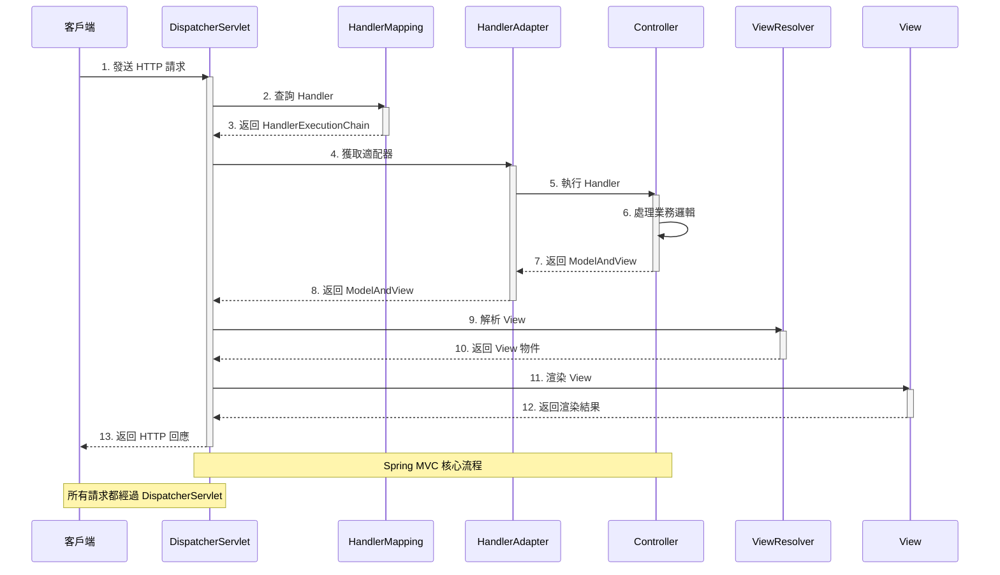
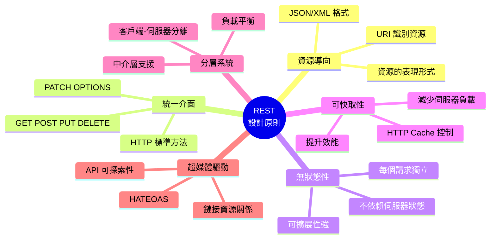
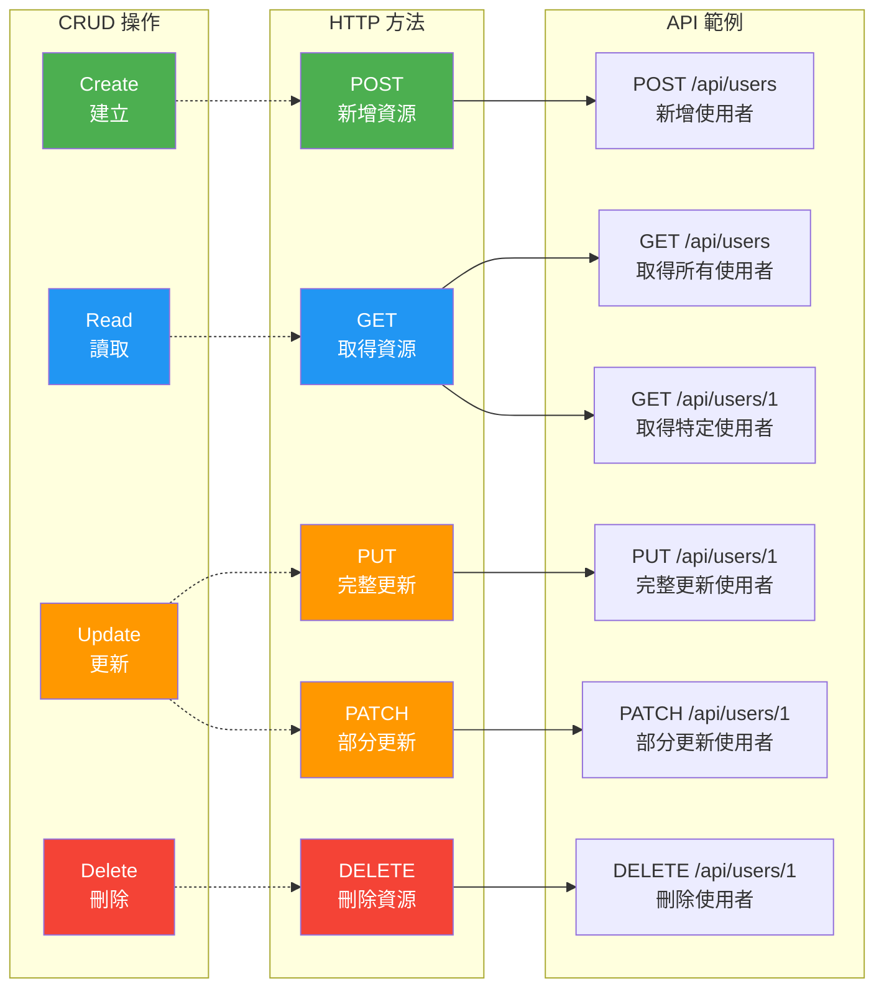
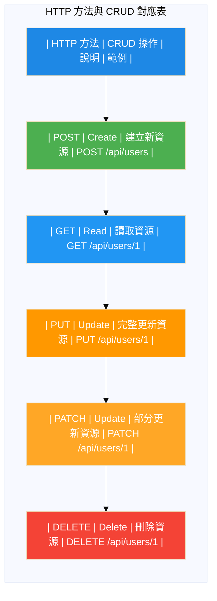
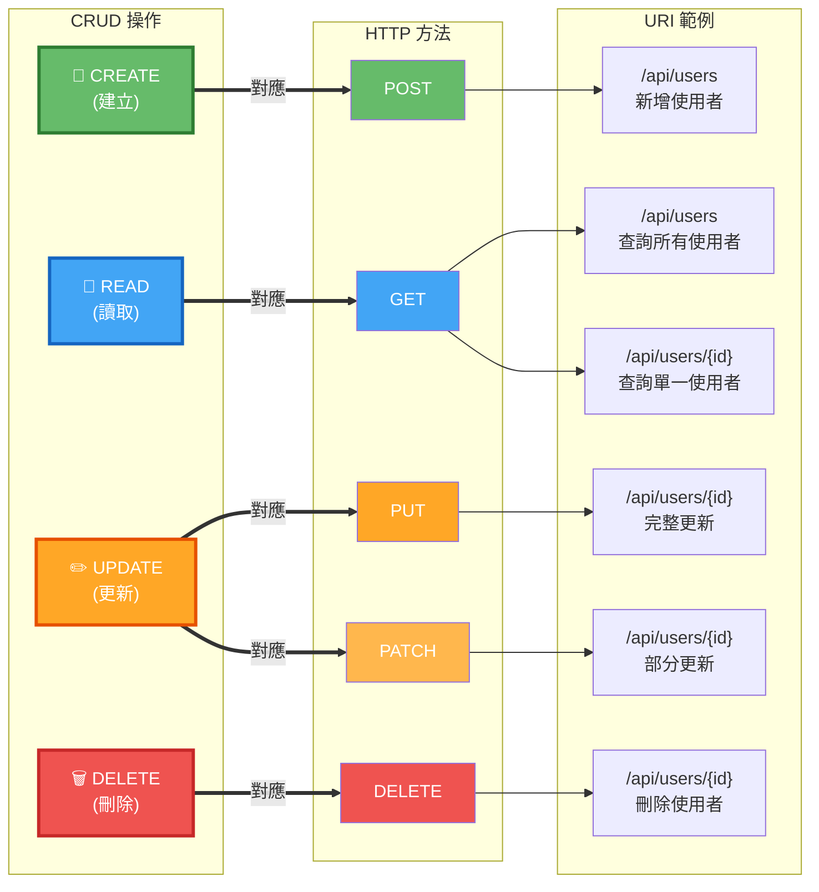

# 第2章架構圖 - Mermaid 版本

本文件包含第2章所需的4張架構圖的 Mermaid 原始碼。

## 使用方式

### 方法1：使用 Mermaid Live Editor（推薦）

1. 訪問：https://mermaid.live/
2. 複製下方的 Mermaid 程式碼
3. 貼到編輯器中
4. 點擊「Download PNG」或「Download SVG」
5. 將圖片重新命名並儲存到 `docs/chapter2/images/` 目錄

### 方法2：使用 VS Code

1. 安裝「Markdown Preview Mermaid Support」擴充套件
2. 在 VS Code 中開啟本檔案
3. 使用 Markdown 預覽功能查看圖表
4. 截圖儲存

### 方法3：使用 Mermaid CLI

```bash
# 安裝 mermaid-cli
npm install -g @mermaid-js/mermaid-cli

# 生成圖片
mmdc -i input.md -o output.png
```

---

## 圖1：MVC 架構圖 (2.1-mvc-architecture.png)

**說明**：展示 Model、View、Controller 三層架構及其交互關係

```mermaid
graph TB
    subgraph "MVC Architecture Pattern"
        User([使用者/瀏覽器])

        subgraph Controller["Controller 層"]
            C1[接收 HTTP 請求]
            C2[處理業務邏輯]
            C3[選擇 View]
        end

        subgraph Model["Model 層"]
            M1[業務邏輯]
            M2[資料存取]
            M3[資料驗證]
        end

        subgraph View["View 層"]
            V1[渲染頁面]
            V2[JSON 回應]
            V3[模板引擎]
        end

        subgraph Database[("資料庫")]
            DB[(Database)]
        end
    end

    User -->|1. 發送請求| C1
    C1 --> C2
    C2 -->|2. 呼叫 Model| M1
    M1 --> M2
    M2 <-->|3. 資料操作| DB
    M2 -->|4. 返回資料| C2
    C2 -->|5. 選擇 View| C3
    C3 -->|6. 傳遞資料| V1
    V1 -->|7. 返回回應| User

    style Controller fill:#e3f2fd
    style Model fill:#fff9c4
    style View fill:#f3e5f5
    style Database fill:#e8f5e9
```

**儲存為**：`2.1-mvc-architecture.png`

---

## 圖2：DispatcherServlet 工作流程 (2.1-dispatcher-servlet.png)

**說明**：展示 Spring MVC 請求處理的完整流程



**儲存為**：`2.1-dispatcher-servlet.png`

---

## 圖3：REST 設計原則 (2.2-rest-principles.png)

**說明**：REST 的核心設計原則和特徵



**儲存為**：`2.2-rest-principles.png`

**替代方案（使用 graph）**：

```mermaid
graph TD
    REST[REST 設計原則]

    REST --> P1[資源導向<br/>Resource-Oriented]
    REST --> P2[統一介面<br/>Uniform Interface]
    REST --> P3[無狀態<br/>Stateless]
    REST --> P4[可快取<br/>Cacheable]
    REST --> P5[分層系統<br/>Layered System]
    REST --> P6[超媒體驅動<br/>HATEOAS]

    P1 --> P1A[URI 識別資源]
    P1 --> P1B[資源表現形式]
    P1 --> P1C[JSON/XML]

    P2 --> P2A[HTTP 標準方法]
    P2 --> P2B[GET POST PUT DELETE]
    P2 --> P2C[統一的錯誤處理]

    P3 --> P3A[每個請求獨立]
    P3 --> P3B[不依賴 Session]
    P3 --> P3C[可擴展性強]

    P4 --> P4A[HTTP Cache-Control]
    P4 --> P4B[ETag 機制]
    P4 --> P4C[提升效能]

    P5 --> P5A[客戶端-伺服器分離]
    P5 --> P5B[支援中介層]
    P5 --> P5C[負載平衡]

    P6 --> P6A[超連結導航]
    P6 --> P6B[API 可探索]
    P6 --> P6C[鬆散耦合]

    style REST fill:#ff6b6b,color:#fff
    style P1 fill:#4ecdc4,color:#fff
    style P2 fill:#45b7d1,color:#fff
    style P3 fill:#f9ca24,color:#333
    style P4 fill:#6c5ce7,color:#fff
    style P5 fill:#a29bfe,color:#fff
    style P6 fill:#fd79a8,color:#fff
```



---

## 圖4：HTTP 方法與 CRUD 對應表 (2.2-http-methods.png)

**說明**：HTTP 方法與 CRUD 操作的對應關係



**替代方案（使用表格）**：



**或使用更清晰的對應圖**：



---

## 📝 生成圖片的步驟

### 使用 Mermaid Live Editor（推薦）

1. **訪問網站**：https://mermaid.live/

2. **圖1 - MVC 架構圖**：
   - 複製上方「圖1」的 Mermaid 程式碼
   - 貼到編輯器
   - 調整主題（可選）：點擊 Actions → Theme → Default/Dark/Forest
   - 下載：Actions → PNG → 儲存為 `2.1-mvc-architecture.png`

3. **圖2 - DispatcherServlet 流程**：
   - 複製「圖2」程式碼
   - 貼到編輯器
   - 下載儲存為 `2.1-dispatcher-servlet.png`

4. **圖3 - REST 原則**：
   - 複製「圖3」程式碼（選擇您喜歡的版本）
   - 貼到編輯器
   - 如果 mindmap 不支援，使用替代方案
   - 下載儲存為 `2.2-rest-principles.png`

5. **圖4 - HTTP 方法對應**：
   - 複製「圖4」程式碼（選擇您喜歡的版本）
   - 貼到編輯器
   - 下載儲存為 `2.2-http-methods.png`

### 使用 VS Code

1. 安裝擴充套件：
   - Markdown Preview Mermaid Support
   - 或 Mermaid Editor

2. 在 VS Code 中：
   - 開啟本檔案
   - 按 `Ctrl+Shift+V` (Windows) 或 `Cmd+Shift+V` (Mac) 預覽
   - 對圖表截圖
   - 儲存為對應檔名

### 圖片品質要求

- **格式**：PNG
- **解析度**：建議 1920x1080 或更高
- **背景**：透明或白色
- **清晰度**：確保文字清晰可讀

---

## ✅ 完成檢查

- [ ] `2.1-mvc-architecture.png` - MVC 架構圖
- [ ] `2.1-dispatcher-servlet.png` - DispatcherServlet 流程圖
- [ ] `2.2-rest-principles.png` - REST 原則圖
- [ ] `2.2-http-methods.png` - HTTP 方法對應圖

**儲存位置**：`E:\Spring_AI_BOOK\docs\chapter2\images\`

---

**建立日期**：2025-10-23
**工具**：Mermaid
**版本**：v1.0
