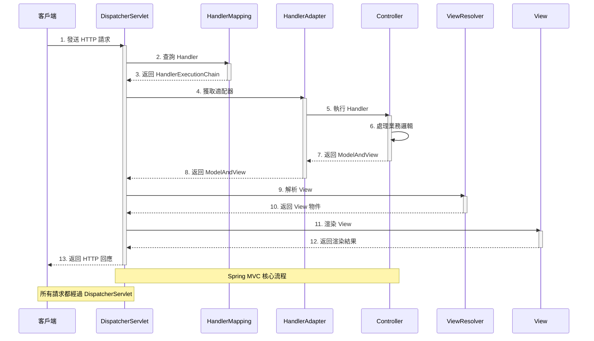
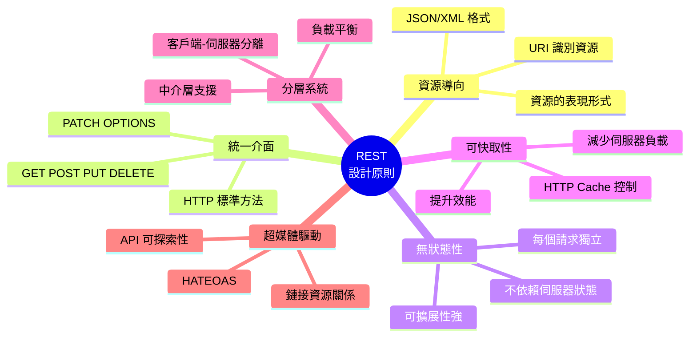
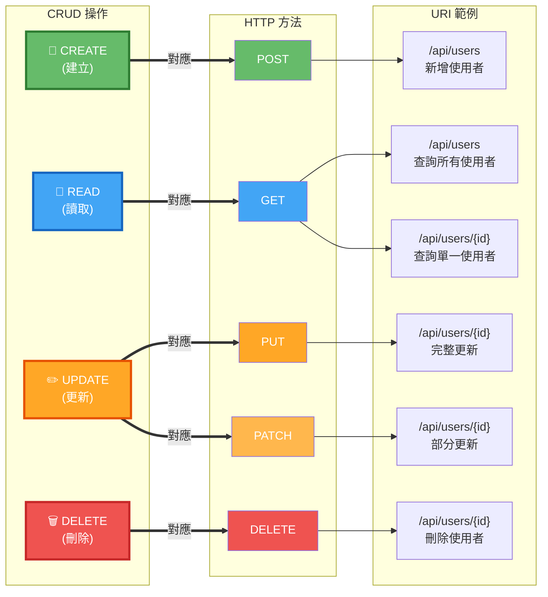

# Mermaid 架構圖快速製作指南

本指南幫助您快速使用 Mermaid 製作第2章需要的4張架構圖。

---

## 🚀 快速開始（5分鐘完成所有圖）

### 步驟1：訪問 Mermaid Live Editor

開啟瀏覽器訪問：**https://mermaid.live/**

### 步驟2：製作圖片

#### 圖1：MVC 架構圖

1. **複製以下程式碼**：

```mermaid
graph TB
    subgraph "MVC Architecture Pattern"
        User([使用者/瀏覽器])

        subgraph Controller["Controller 層"]
            C1[接收 HTTP 請求]
            C2[處理業務邏輯]
            C3[選擇 View]
        end

        subgraph Model["Model 層"]
            M1[業務邏輯]
            M2[資料存取]
            M3[資料驗證]
        end

        subgraph View["View 層"]
            V1[渲染頁面]
            V2[JSON 回應]
            V3[模板引擎]
        end

        subgraph Database[("資料庫")]
            DB[(Database)]
        end
    end

    User -->|1. 發送請求| C1
    C1 --> C2
    C2 -->|2. 呼叫 Model| M1
    M1 --> M2
    M2 <-->|3. 資料操作| DB
    M2 -->|4. 返回資料| C2
    C2 -->|5. 選擇 View| C3
    C3 -->|6. 傳遞資料| V1
    V1 -->|7. 返回回應| User

    style Controller fill:#e3f2fd
    style Model fill:#fff9c4
    style View fill:#f3e5f5
    style Database fill:#e8f5e9
```

2. **貼到編輯器**
3. **下載**：點擊右上角 Actions → PNG
4. **重命名**：`2.1-mvc-architecture.png`
5. **儲存到**：`E:\Spring_AI_BOOK\docs\chapter2\images\`

---

#### 圖2：DispatcherServlet 工作流程

1. **複製以下程式碼**：



2. **下載並儲存為**：`2.1-dispatcher-servlet.png`

---

#### 圖3：REST 設計原則

**選項A（推薦）：使用流程圖**

```mermaid
graph TD
    REST[REST 設計原則]

    REST --> P1[資源導向<br/>Resource-Oriented]
    REST --> P2[統一介面<br/>Uniform Interface]
    REST --> P3[無狀態<br/>Stateless]
    REST --> P4[可快取<br/>Cacheable]
    REST --> P5[分層系統<br/>Layered System]
    REST --> P6[超媒體驅動<br/>HATEOAS]

    P1 --> P1A[URI 識別資源]
    P1 --> P1B[資源表現形式]
    P1 --> P1C[JSON/XML]

    P2 --> P2A[HTTP 標準方法]
    P2 --> P2B[GET POST PUT DELETE]
    P2 --> P2C[統一的錯誤處理]

    P3 --> P3A[每個請求獨立]
    P3 --> P3B[不依賴 Session]
    P3 --> P3C[可擴展性強]

    P4 --> P4A[HTTP Cache-Control]
    P4 --> P4B[ETag 機制]
    P4 --> P4C[提升效能]

    P5 --> P5A[客戶端-伺服器分離]
    P5 --> P5B[支援中介層]
    P5 --> P5C[負載平衡]

    P6 --> P6A[超連結導航]
    P6 --> P6B[API 可探索]
    P6 --> P6C[鬆散耦合]

    style REST fill:#ff6b6b,color:#fff
    style P1 fill:#4ecdc4,color:#fff
    style P2 fill:#45b7d1,color:#fff
    style P3 fill:#f9ca24,color:#333
    style P4 fill:#6c5ce7,color:#fff
    style P5 fill:#a29bfe,color:#fff
    style P6 fill:#fd79a8,color:#fff
```



**選項B：使用心智圖（如果支援）**



**下載並儲存為**：`2.2-rest-principles.png`

---

#### 圖4：HTTP 方法與 CRUD 對應

**推薦版本**：



**下載並儲存為**：`2.2-http-methods.png`

---

## 💡 快速技巧

### 調整主題

在 Mermaid Live Editor 中：
1. 點擊「Actions」
2. 選擇「Theme」
3. 選擇您喜歡的主題：
   - **Default**：淺色背景
   - **Dark**：深色背景
   - **Forest**：綠色主題
   - **Neutral**：中性灰色

### 調整大小

1. 點擊「Actions」
2. 選擇「Config」
3. 調整 `width` 和 `height` 參數

### 匯出選項

- **PNG**：適合文檔（推薦）
- **SVG**：向量圖，可無限縮放
- **Markdown**：包含 Mermaid 程式碼的 Markdown

---

## ✅ 完成檢查

製作完成後，確認：

- [ ] `2.1-mvc-architecture.png` ✅
- [ ] `2.1-dispatcher-servlet.png` ✅
- [ ] `2.2-rest-principles.png` ✅
- [ ] `2.2-http-methods.png` ✅

所有圖片都儲存在：`E:\Spring_AI_BOOK\docs\chapter2\images\`

---

## 🎨 圖片品質要求

- ✅ 格式：PNG
- ✅ 背景：透明或白色
- ✅ 解析度：至少 1920x1080
- ✅ 文字清晰可讀
- ✅ 顏色對比度足夠

---

## 🔗 相關資源

- **Mermaid Live Editor**: https://mermaid.live/
- **Mermaid 官方文檔**: https://mermaid.js.org/
- **完整程式碼**: `ARCHITECTURE_DIAGRAMS.md`

---

**製作時間**：約5分鐘
**難度**：⭐ 簡單
**推薦瀏覽器**：Chrome、Firefox、Edge

祝您製作順利！🎉
