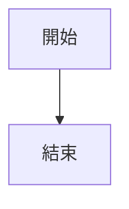

# 第2章 Mermaid 架構圖

本目錄包含第2章所需的4張架構圖，使用 Mermaid 語法直接在 Markdown 文件中呈現。

---

## 📋 圖表清單

### 1. MVC 架構圖
- **檔案**：[2.1-mvc-architecture.md](./2.1-mvc-architecture.md)
- **類型**：流程圖 (graph TB)
- **內容**：展示 Model、View、Controller 三層架構及資料流動

### 2. DispatcherServlet 工作流程
- **檔案**：[2.1-dispatcher-servlet.md](./2.1-dispatcher-servlet.md)
- **類型**：序列圖 (sequenceDiagram)
- **內容**：展示 Spring MVC 請求處理的完整流程

### 3. REST 設計原則
- **檔案**：[2.2-rest-principles.md](./2.2-rest-principles.md)
- **類型**：層級圖 (graph TD)
- **內容**：REST 六大核心原則及其詳細說明

### 4. HTTP 方法與 CRUD 對應
- **檔案**：[2.2-http-methods.md](./2.2-http-methods.md)
- **類型**：流程圖 (flowchart LR)
- **內容**：HTTP 方法與 CRUD 操作的對應關係

---

## 📖 如何查看 Mermaid 圖表

### 方法1：GitHub（推薦）
如果專案託管在 GitHub 上，直接打開 `.md` 檔案即可自動渲染 Mermaid 圖表。

### 方法2：VS Code
1. 安裝擴充套件：
   - **Markdown Preview Mermaid Support**
   - 或 **Mermaid Editor**

2. 開啟 `.md` 檔案

3. 按 `Ctrl+Shift+V` (Windows) 或 `Cmd+Shift+V` (Mac) 預覽

### 方法3：線上工具
1. 訪問 https://mermaid.live/
2. 複製 Mermaid 程式碼（` ```mermaid ... ``` ` 之間的內容）
3. 貼到編輯器中查看

### 方法4：IDE 整合
- **IntelliJ IDEA**：安裝 Mermaid 插件
- **Eclipse**：使用 Markdown 編輯器插件
- **Visual Studio**：內建支援

---

## 🖼️ 如何匯出為圖片

如果需要將 Mermaid 圖表匯出為 PNG/SVG：

### 使用 VS Code
1. 安裝 **Markdown Preview Enhanced** 擴充套件
2. 開啟 `.md` 檔案並預覽
3. 右鍵點擊圖表
4. 選擇「Save as PNG」或「Save as SVG」

### 使用 Mermaid Live Editor
1. 訪問 https://mermaid.live/
2. 複製 Mermaid 程式碼並貼上
3. 點擊「Actions」→「PNG」或「SVG」下載

### 使用 Mermaid CLI
```bash
# 安裝 mermaid-cli
npm install -g @mermaid-js/mermaid-cli

# 轉換為 PNG
mmdc -i 2.1-mvc-architecture.md -o 2.1-mvc-architecture.png

# 轉換為 SVG
mmdc -i 2.1-mvc-architecture.md -o 2.1-mvc-architecture.svg
```

---

## 📝 編輯 Mermaid 圖表

要修改圖表，直接編輯對應的 `.md` 檔案中的 Mermaid 程式碼即可。

**範例**：
```markdown
# 檔案內容

\```
```

修改後儲存，重新載入即可看到更新的圖表。

---

## ✅ 優勢

使用 Mermaid 的優勢：

- ✅ **版本控制友善**：純文字格式，易於追蹤變更
- ✅ **易於維護**：修改程式碼即可更新圖表
- ✅ **一致性高**：所有圖表使用統一的語法和風格
- ✅ **免費開源**：無需付費工具
- ✅ **跨平台**：可在任何支援 Markdown 的環境中使用
- ✅ **整合方便**：與文件整合在一起，不需要單獨管理圖片檔案

---

## 🔗 相關資源

- **Mermaid 官方文件**：https://mermaid.js.org/
- **Mermaid Live Editor**：https://mermaid.live/
- **GitHub Mermaid 支援**：https://github.blog/2022-02-14-include-diagrams-markdown-files-mermaid/
- **VS Code 擴充套件**：搜尋「Mermaid」

---

## 📞 需要協助？

如果圖表無法正常顯示：

1. **確認環境支援**：確保您的 Markdown 查看器支援 Mermaid
2. **檢查語法**：確保 Mermaid 程式碼語法正確
3. **嘗試線上工具**：使用 https://mermaid.live/ 驗證語法
4. **查看文檔**：參考 Mermaid 官方文件

---

**建立日期**：2025-10-23
**工具**：Mermaid
**格式**：Markdown + Mermaid
