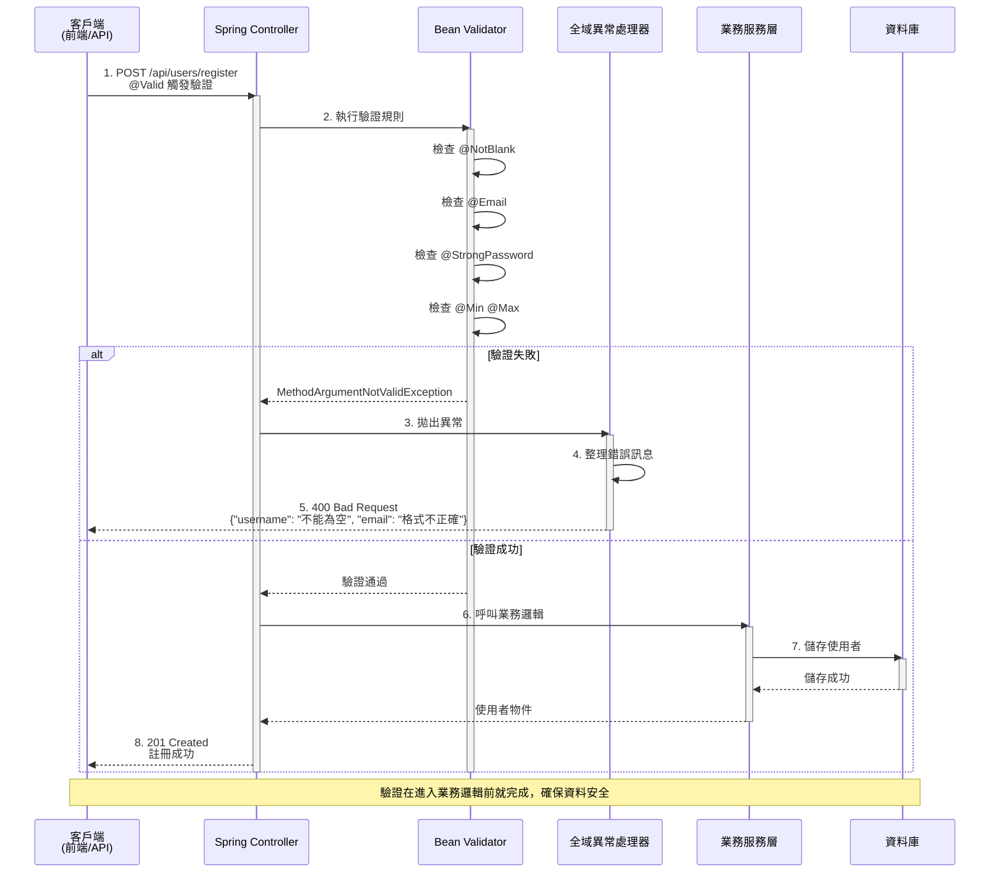
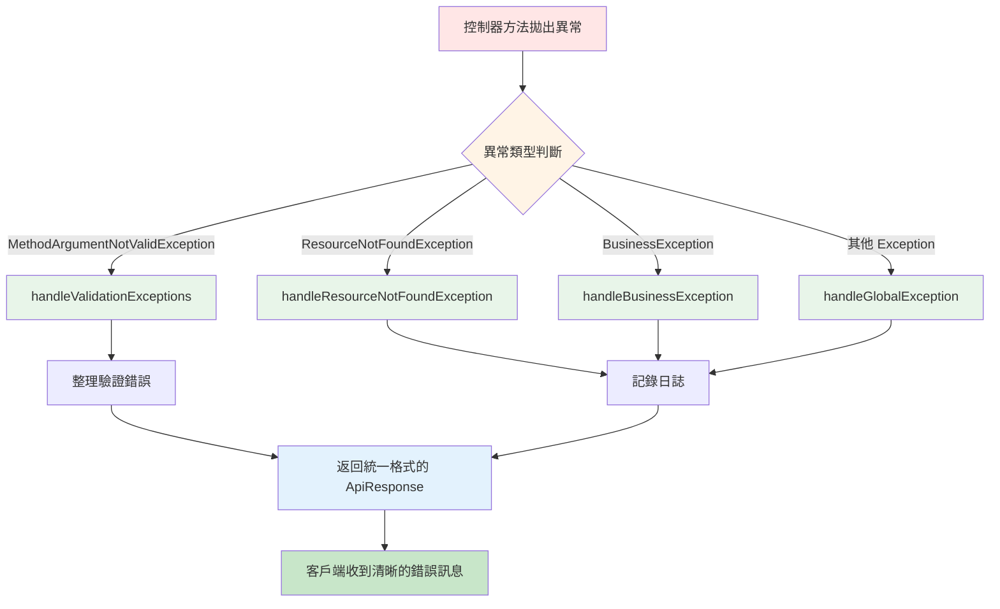
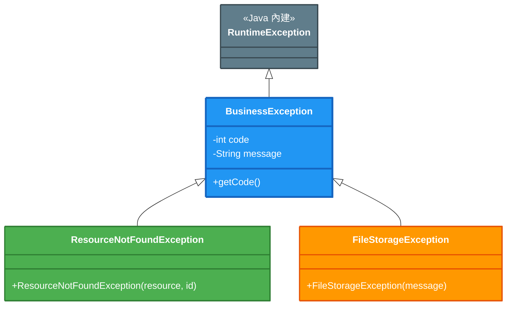

# 3.1 資料驗證與錯誤處理

> **對應章節**: 第3章 - 企業級功能
> **對應範例**: `chapter3-enterprise-features`
> **難度**: ⭐⭐⭐☆☆

---

## 📚 本章概要

資料驗證是確保系統安全性和資料完整性的第一道防線。本章將帶你掌握 Spring Boot 的 Bean Validation 機制、自訂驗證器開發和全域異常處理策略。

**學習目標**:
- 理解資料驗證在 Web 應用中的重要性
- 掌握 Bean Validation 標準驗證註解
- 學會建立自訂驗證器
- 實現統一的全域異常處理機制
- 為 AI 應用建立特殊的驗證策略

> 📌 **與第2章的關聯**：在 [2.3 節](../chapter2/2.3-request-response-handling.md#233-錯誤處理概述)中，我們介紹了錯誤處理的基本概念。本節將深入探討企業級的完整實作。

---

## 🎯 為什麼需要資料驗證？

### 真實場景思考

想像你正在開發一個 AI 驅動的使用者註冊系統：

```
場景 1: 沒有驗證的情況
用戶輸入: username=""  email="invalid"  age=-5
系統行為: 直接儲存到資料庫 → 💥 資料庫錯誤、業務邏輯錯誤

場景 2: 有完善驗證
用戶輸入: username=""  email="invalid"  age=-5
系統行為: 立即攔截並回傳清晰的錯誤訊息 → ✅ 保護資料完整性
```

### 資料驗證的價值

| 驗證類型 | 問題範例 | 後果 | 解決方案 |
|---------|---------|------|---------|
| **完整性驗證** | username 為 null | 資料庫錯誤 | `@NotBlank` |
| **格式驗證** | email 格式錯誤 | 無法發送郵件 | `@Email` |
| **範圍驗證** | age = -5 | 業務邏輯錯誤 | `@Min` `@Max` |
| **安全性驗證** | 密碼太簡單 | 帳號易被破解 | 自訂 `@StrongPassword` |
| **AI 特殊驗證** | 提示詞包含惡意內容 | AI 輸出不當內容 | 自訂內容過濾器 |

---

## 🔍 資料驗證完整流程

### 驗證機制運作原理



### 流程關鍵點說明

| 步驟 | 說明 | 技術細節 |
|-----|------|---------|
| **1. 觸發驗證** | `@Valid` 註解啟動驗證 | Spring AOP 攔截請求 |
| **2. 執行驗證** | Bean Validator 檢查所有規則 | JSR-303/380 標準 |
| **3. 異常處理** | 驗證失敗拋出異常 | `MethodArgumentNotValidException` |
| **4. 錯誤整理** | 全域處理器統一格式 | `@RestControllerAdvice` |
| **5. 回應客戶端** | 返回清晰的錯誤訊息 | 統一 `ApiResponse` 格式 |

---

## 💻 Bean Validation 實作

### 標準驗證註解總覽

| 註解 | 適用類型 | 驗證規則 | 範例 |
|------|----------|---------|------|
| **@NotNull** | 任何類型 | 值不能為 null | `@NotNull Integer age` |
| **@NotBlank** | String | 不能為 null、空字串或只有空白字元 | `@NotBlank String name` |
| **@NotEmpty** | Collection, Map, Array | 不能為 null 或空集合 | `@NotEmpty List<String> tags` |
| **@Size** | String, Collection, Map, Array | 長度或大小限制 | `@Size(min=2, max=50)` |
| **@Min/@Max** | 數值類型 | 數值範圍限制 | `@Min(18) @Max(120)` |
| **@Email** | String | 電子郵件格式驗證 | `@Email String email` |
| **@Pattern** | String | 正規表達式驗證 | `@Pattern(regexp="^[A-Z].*")` |
| **@Positive/@Negative** | 數值類型 | 正數或負數驗證 | `@Positive BigDecimal amount` |
| **@Past/@Future** | Date, LocalDate 等 | 過去或未來時間驗證 | `@Past LocalDate birthday` |

### 使用驗證註解

```java
// 對應範例: chapter3-enterprise-features/src/main/java/com/example/enterprise/dto/UserRegistrationRequest.java:24

/**
 * 使用者註冊請求 DTO
 * 展示完整的資料驗證功能
 */
@Data
public class UserRegistrationRequest {

    @NotBlank(message = "使用者名稱不能為空")
    @Size(min = 2, max = 50, message = "使用者名稱長度必須在 2-50 字元之間")
    private String username;

    @NotBlank(message = "電子郵件不能為空")
    @Email(message = "電子郵件格式不正確")
    private String email;

    @StrongPassword(minLength = 8, requireSpecialChar = true,
            message = "密碼必須至少 8 字元，包含大小寫字母、數字和特殊字元")
    private String password;

    @NotNull(message = "年齡不能為空")
    @Min(value = 18, message = "年齡必須大於等於 18 歲")
    @Max(value = 120, message = "年齡必須小於等於 120 歲")
    private Integer age;
}
```

**驗證規則說明**：
- ✅ `username`: 不能為空，長度 2-50 字元
- ✅ `email`: 必須符合電子郵件格式
- ✅ `password`: 自訂強密碼規則（稍後說明）
- ✅ `age`: 18-120 歲之間

---

### 在控制器中啟用驗證

```java
// 對應範例: chapter3-enterprise-features/src/main/java/com/example/enterprise/controller/UserController.java:87

@RestController
@RequestMapping("/api/users")
public class UserController {

    /**
     * 使用者註冊
     * @Valid 註解觸發驗證，驗證失敗會拋出 MethodArgumentNotValidException
     */
    @PostMapping("/register")
    @ResponseStatus(HttpStatus.CREATED)
    public ApiResponse<User> registerUser(
            @Valid @RequestBody UserRegistrationRequest request) {
        User user = userService.registerUser(request);
        return ApiResponse.success("使用者註冊成功", user);
    }
}
```

**關鍵點**：
- 🔑 `@Valid`: 啟動驗證機制
- 🔑 驗證失敗自動拋出 `MethodArgumentNotValidException`
- 🔑 全域異常處理器統一處理錯誤

**優點**：
- ✅ 無需手動檢查每個欄位
- ✅ 驗證邏輯與業務邏輯分離
- ✅ 統一的錯誤回應格式
- ✅ 易於維護和擴展

---

## 🛠️ 自訂驗證註解

### 為什麼需要自訂驗證器？

標準驗證註解無法涵蓋所有業務場景，例如：

| 業務需求 | 標準註解 | 問題 | 解決方案 |
|---------|---------|------|---------|
| **強密碼驗證** | `@Pattern` | 正規表達式複雜難維護 | `@StrongPassword` |
| **電話號碼格式** | `@Pattern` | 不同國家格式不同 | `@PhoneNumber(region="TW")` |
| **身分證驗證** | 無 | 需要檢查碼演算法 | `@NationalId` |
| **AI 內容過濾** | 無 | 需要關鍵字檢查 | `@SafeContent` |

---

### 建立自訂驗證註解

```java
// 對應範例: chapter3-enterprise-features/src/main/java/com/example/enterprise/validation/StrongPassword.java

/**
 * 強密碼驗證註解
 * 用於驗證密碼強度，確保密碼包含大小寫字母、數字和特殊字元
 */
@Target({ElementType.FIELD, ElementType.PARAMETER})
@Retention(RetentionPolicy.RUNTIME)
@Constraint(validatedBy = StrongPasswordValidator.class)  // 指定驗證器
@Documented
public @interface StrongPassword {

    // 驗證失敗時的錯誤訊息
    String message() default "密碼強度不足";

    // 驗證分組（進階功能）
    Class<?>[] groups() default {};

    // 載荷（進階功能）
    Class<? extends Payload>[] payload() default {};

    // 自訂參數：是否要求特殊字元
    boolean requireSpecialChar() default true;

    // 自訂參數：最小長度
    int minLength() default 8;
}
```

**註解結構說明**：
- 🔸 `@Target`: 指定可以標註的位置（欄位、參數）
- 🔸 `@Constraint`: 指定驗證器類別
- 🔸 `message()`: 必須定義，驗證失敗的錯誤訊息
- 🔸 `groups()` 和 `payload()`: JSR-303 標準要求（通常使用預設值）
- 🔸 自訂參數: 可以靈活配置驗證規則

---

### 實現驗證邏輯

```java
// 對應範例: chapter3-enterprise-features/src/main/java/com/example/enterprise/validation/StrongPasswordValidator.java:25

/**
 * 強密碼驗證器
 * 實現密碼強度檢查邏輯
 */
public class StrongPasswordValidator implements ConstraintValidator<StrongPassword, String> {

    private boolean requireSpecialChar;
    private int minLength;

    /**
     * 初始化：讀取註解參數
     */
    @Override
    public void initialize(StrongPassword annotation) {
        this.requireSpecialChar = annotation.requireSpecialChar();
        this.minLength = annotation.minLength();
    }

    /**
     * 驗證邏輯
     */
    @Override
    public boolean isValid(String password, ConstraintValidatorContext context) {
        if (password == null) {
            return false;
        }

        // 檢查長度
        if (password.length() < minLength) {
            return false;
        }

        // 檢查是否包含大寫字母
        if (!password.matches(".*[A-Z].*")) {
            return false;
        }

        // 檢查是否包含小寫字母
        if (!password.matches(".*[a-z].*")) {
            return false;
        }

        // 檢查是否包含數字
        if (!password.matches(".*\\d.*")) {
            return false;
        }

        // 檢查是否包含特殊字元（如果需要）
        if (requireSpecialChar && !password.matches(".*[!@#$%^&*()_+\\-=\\[\\]{};':,.<>?].*")) {
            return false;
        }

        return true;
    }
}
```

**驗證規則**：
1. ✅ 檢查密碼長度
2. ✅ 檢查是否包含大寫字母
3. ✅ 檢查是否包含小寫字母
4. ✅ 檢查是否包含數字
5. ✅ 檢查是否包含特殊字元（可選）

---

### 使用自訂驗證註解

```java
// 在 DTO 中使用
public class ChangePasswordRequest {

    @NotBlank(message = "舊密碼不能為空")
    private String oldPassword;

    @StrongPassword(
        minLength = 10,              // 最小長度 10
        requireSpecialChar = true,   // 必須包含特殊字元
        message = "新密碼必須至少 10 字元，包含大小寫字母、數字和特殊字元"
    )
    private String newPassword;
}
```

**優勢**：
- ✅ 可重複使用
- ✅ 參數化配置
- ✅ 語義清晰
- ✅ 易於維護

---

## 🎯 全域異常處理

### 為什麼需要全域異常處理？

**沒有統一異常處理的問題**：

```java
// ❌ 每個控制器都要處理異常
@PostMapping("/register")
public ResponseEntity<?> registerUser(@RequestBody UserRequest request) {
    try {
        // 業務邏輯
    } catch (ValidationException e) {
        return ResponseEntity.badRequest().body(e.getMessage());
    } catch (DuplicateException e) {
        return ResponseEntity.status(409).body(e.getMessage());
    } catch (Exception e) {
        return ResponseEntity.status(500).body("系統錯誤");
    }
}
// 問題：代碼重複、格式不一致、難以維護
```

**使用全域異常處理**：

```java
// ✅ 業務邏輯乾淨簡潔
@PostMapping("/register")
public ApiResponse<User> registerUser(@Valid @RequestBody UserRequest request) {
    return ApiResponse.success("註冊成功", userService.register(request));
}
// 優點：異常自動處理、格式統一、易於維護
```

---

### 全域異常處理器實作

```java
// 對應範例: chapter3-enterprise-features/src/main/java/com/example/enterprise/exception/GlobalExceptionHandler.java:30

/**
 * 全域異常處理器
 * 使用 @RestControllerAdvice 統一處理所有控制器的異常
 */
@RestControllerAdvice
@Slf4j
public class GlobalExceptionHandler {

    /**
     * 處理資料驗證異常
     * 當 @Valid 驗證失敗時觸發
     */
    @ExceptionHandler(MethodArgumentNotValidException.class)
    @ResponseStatus(HttpStatus.BAD_REQUEST)
    public ApiResponse<Void> handleValidationExceptions(
            MethodArgumentNotValidException ex,
            WebRequest request) {

        // 收集所有驗證錯誤
        Map<String, String> errors = new HashMap<>();
        ex.getBindingResult().getAllErrors().forEach(error -> {
            String fieldName = ((FieldError) error).getField();
            String errorMessage = error.getDefaultMessage();
            errors.put(fieldName, errorMessage);
        });

        log.warn("資料驗證失敗：{}", errors);

        return ApiResponse.<Void>builder()
                .code(HttpStatus.BAD_REQUEST.value())
                .message("資料驗證失敗")
                .errors(errors)
                .build();
    }

    /**
     * 處理資源不存在異常
     */
    @ExceptionHandler(ResourceNotFoundException.class)
    @ResponseStatus(HttpStatus.NOT_FOUND)
    public ApiResponse<Void> handleResourceNotFoundException(
            ResourceNotFoundException ex,
            WebRequest request) {

        log.warn("資源不存在：{}", ex.getMessage());

        return ApiResponse.<Void>builder()
                .code(HttpStatus.NOT_FOUND.value())
                .message(ex.getMessage())
                .build();
    }

    /**
     * 處理業務邏輯異常
     */
    @ExceptionHandler(BusinessException.class)
    public ApiResponse<Void> handleBusinessException(
            BusinessException ex,
            WebRequest request) {

        log.warn("業務邏輯異常：{}", ex.getMessage());

        return ApiResponse.<Void>builder()
                .code(ex.getCode())
                .message(ex.getMessage())
                .build();
    }

    /**
     * 處理其他未預期的異常
     */
    @ExceptionHandler(Exception.class)
    @ResponseStatus(HttpStatus.INTERNAL_SERVER_ERROR)
    public ApiResponse<Void> handleGlobalException(
            Exception ex,
            WebRequest request) {

        log.error("未預期的異常：{}", ex.getMessage(), ex);

        return ApiResponse.<Void>builder()
                .code(HttpStatus.INTERNAL_SERVER_ERROR.value())
                .message("系統錯誤，請稍後再試")
                .build();
    }
}
```

### 異常處理流程



**處理器說明**：

| 異常類型 | HTTP 狀態碼 | 觸發場景 | 回應內容 |
|---------|-----------|---------|---------|
| `MethodArgumentNotValidException` | 400 | `@Valid` 驗證失敗 | 詳細的欄位錯誤訊息 |
| `ResourceNotFoundException` | 404 | 資源不存在 | 資源名稱和 ID |
| `BusinessException` | 自訂 | 業務邏輯錯誤 | 業務錯誤訊息 |
| `Exception` | 500 | 未預期錯誤 | 通用錯誤訊息 |

**優點**：
- ✅ 統一異常處理邏輯
- ✅ 一致的錯誤回應格式
- ✅ 集中式錯誤日誌記錄
- ✅ 控制器代碼簡潔
- ✅ 易於維護和擴展

---

## 📦 自訂業務異常

### 異常層次結構



### 業務異常基類

```java
// 對應範例: chapter3-enterprise-features/src/main/java/com/example/enterprise/exception/BusinessException.java

/**
 * 業務異常基類
 * 所有業務異常都繼承此類
 */
public class BusinessException extends RuntimeException {

    private final int code;

    public BusinessException(int code, String message) {
        super(message);
        this.code = code;
    }

    public BusinessException(String message) {
        this(400, message);
    }

    public int getCode() {
        return code;
    }
}
```

### 具體業務異常

```java
// 對應範例: chapter3-enterprise-features/src/main/java/com/example/enterprise/exception/ResourceNotFoundException.java

/**
 * 資源不存在異常
 */
public class ResourceNotFoundException extends BusinessException {

    public ResourceNotFoundException(String resource, Object id) {
        super(404, String.format("%s (ID: %s) 不存在", resource, id));
    }
}

/**
 * 檔案儲存異常
 */
public class FileStorageException extends BusinessException {

    public FileStorageException(String message) {
        super(500, message);
    }

    public FileStorageException(String message, Throwable cause) {
        super(500, message);
        initCause(cause);
    }
}
```

### 使用業務異常

```java
// 在服務層使用
@Service
public class UserService {

    public User findById(Long id) {
        return userRepository.findById(id)
            .orElseThrow(() -> new ResourceNotFoundException("使用者", id));
    }

    public void uploadAvatar(MultipartFile file) {
        try {
            // 上傳邏輯
        } catch (IOException e) {
            throw new FileStorageException("檔案上傳失敗", e);
        }
    }
}
```

---

## 🎬 實際應用場景

### 場景 1: 使用者註冊系統

```java
// 完整的使用者註冊流程
@PostMapping("/register")
public ApiResponse<User> registerUser(@Valid @RequestBody UserRegistrationRequest request) {
    // 1. 驗證自動完成（@Valid）
    // 2. 驗證失敗自動返回錯誤訊息（GlobalExceptionHandler）
    // 3. 驗證成功才執行業務邏輯
    User user = userService.registerUser(request);
    return ApiResponse.success("註冊成功", user);
}
```

**API 測試範例**：
```bash
# 測試驗證成功
curl -X POST http://localhost:8080/api/users/register \
  -H "Content-Type: application/json" \
  -d '{
    "username": "kevin123",
    "email": "kevin@example.com",
    "password": "SecurePass123!",
    "fullName": "Kevin Tsai",
    "age": 25
  }'

# 回應：
# {
#   "code": 201,
#   "message": "使用者註冊成功",
#   "data": { "id": 1, "username": "kevin123", ... }
# }

# 測試驗證失敗
curl -X POST http://localhost:8080/api/users/register \
  -H "Content-Type: application/json" \
  -d '{
    "username": "",
    "email": "invalid-email",
    "password": "123",
    "age": 15
  }'

# 回應：
# {
#   "code": 400,
#   "message": "資料驗證失敗",
#   "errors": {
#     "username": "使用者名稱不能為空",
#     "email": "電子郵件格式不正確",
#     "password": "密碼必須至少 8 字元，包含大小寫字母、數字和特殊字元",
#     "age": "年齡必須大於等於 18 歲"
#   }
# }
```

---

### 場景 2: AI 服務的特殊驗證

為 AI 應用建立自訂的內容安全驗證：

```java
/**
 * AI 提示詞安全驗證
 */
@Target({ElementType.FIELD})
@Retention(RetentionPolicy.RUNTIME)
@Constraint(validatedBy = SafeContentValidator.class)
public @interface SafeContent {
    String message() default "內容包含不當資訊";
    Class<?>[] groups() default {};
    Class<? extends Payload>[] payload() default {};
}

/**
 * 內容安全驗證器
 */
public class SafeContentValidator implements ConstraintValidator<SafeContent, String> {

    private static final List<String> FORBIDDEN_KEYWORDS = Arrays.asList(
        "暴力", "仇恨言論", "敏感政治"
    );

    @Override
    public boolean isValid(String content, ConstraintValidatorContext context) {
        if (content == null) return true;

        String lowerContent = content.toLowerCase();
        return FORBIDDEN_KEYWORDS.stream()
                .noneMatch(lowerContent::contains);
    }
}

/**
 * AI 對話請求
 */
public class ChatRequest {

    @NotBlank(message = "訊息不能為空")
    @Size(max = 4000, message = "訊息長度不能超過 4000 字元")
    @SafeContent(message = "訊息包含不當內容")
    private String message;

    @Min(value = 0, message = "溫度值必須大於等於 0")
    @Max(value = 2, message = "溫度值必須小於等於 2")
    private Double temperature = 0.7;
}
```

---

## 📝 重點回顧

### 核心概念

✅ **資料驗證的價值**：在進入業務邏輯前就攔截無效資料，保護系統安全
✅ **Bean Validation**：使用 JSR-303/380 標準註解進行聲明式驗證
✅ **自訂驗證器**：針對特殊業務需求建立可重用的驗證邏輯
✅ **全域異常處理**：使用 `@RestControllerAdvice` 統一處理所有異常
✅ **業務異常層次**：建立清晰的異常繼承結構，便於管理和擴展

### 最佳實踐

| 實踐項目 | 說明 | 範例 |
|---------|------|------|
| **驗證前移** | 在控制器層就完成驗證 | `@Valid @RequestBody` |
| **訊息清晰** | 提供明確的錯誤訊息 | `message = "使用者名稱不能為空"` |
| **統一格式** | 使用統一的回應格式 | `ApiResponse<T>` |
| **分層異常** | 建立清晰的異常層次 | `BusinessException` 基類 |
| **日誌記錄** | 記錄所有異常訊息 | `log.warn()` / `log.error()` |

### 驗證註解速查表

```java
// 字串驗證
@NotBlank          // 不能為 null、空字串或只有空白
@Email             // 電子郵件格式
@Pattern(regexp)   // 正規表達式

// 數值驗證
@NotNull           // 不能為 null
@Min(18)           // 最小值
@Max(120)          // 最大值
@Positive          // 必須為正數

// 集合驗證
@NotEmpty          // 不能為空集合
@Size(min, max)    // 大小範圍

// 時間驗證
@Past              // 必須是過去時間
@Future            // 必須是未來時間

// 自訂驗證
@StrongPassword    // 自訂強密碼驗證
@SafeContent       // 自訂內容安全驗證
```

---

## 🚀 下一步

現在你已經掌握了資料驗證和異常處理，接下來我們將學習：

👉 [3.2 檔案上傳與下載](./3.2-file-upload-download.md) - 處理多媒體檔案
👉 [3.3 API 文件化與測試](./3.3-api-documentation.md) - 使用 Swagger 自動生成文件

---

## 📚 完整範例

本章概念的完整實現請參考：

📁 **chapter3-enterprise-features**
- `src/main/java/com/example/enterprise/dto/UserRegistrationRequest.java` - 驗證註解使用
- `src/main/java/com/example/enterprise/validation/StrongPasswordValidator.java` - 自訂驗證器
- `src/main/java/com/example/enterprise/exception/GlobalExceptionHandler.java` - 全域異常處理
- `src/main/java/com/example/enterprise/controller/UserController.java` - 控制器實作

🔗 **啟動範例**:
```bash
cd code-examples/chapter3-enterprise-features
mvn spring-boot:run
```

🧪 **測試 API**:
```bash
# Swagger UI
http://localhost:8080/swagger-ui.html

# 測試使用者註冊
curl -X POST http://localhost:8080/api/users/register \
  -H "Content-Type: application/json" \
  -d '{"username": "test", "email": "test@example.com", "password": "Pass123!", "fullName": "Test User", "age": 25}'
```

---

## 🔗 參考資源

- **Bean Validation 官方文件**: [beanvalidation.org](https://beanvalidation.org/)
- **Spring Validation 文件**: [Spring Boot Validation](https://docs.spring.io/spring-boot/docs/current/reference/html/web.html#web.servlet.spring-mvc.validation)
- **Hibernate Validator**: [hibernate.org/validator](https://hibernate.org/validator/)

---

**相關章節**:
- ← 上一章: [2.3 請求與回應處理](../chapter2/2.3-request-response-handling.md)
- → 下一節: [3.2 檔案上傳與下載](./3.2-file-upload-download.md)
- 📖 回到目錄: [第3章 README](./README.md)
