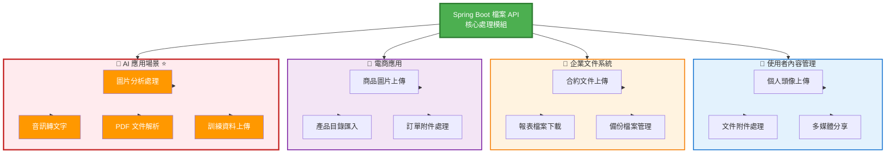
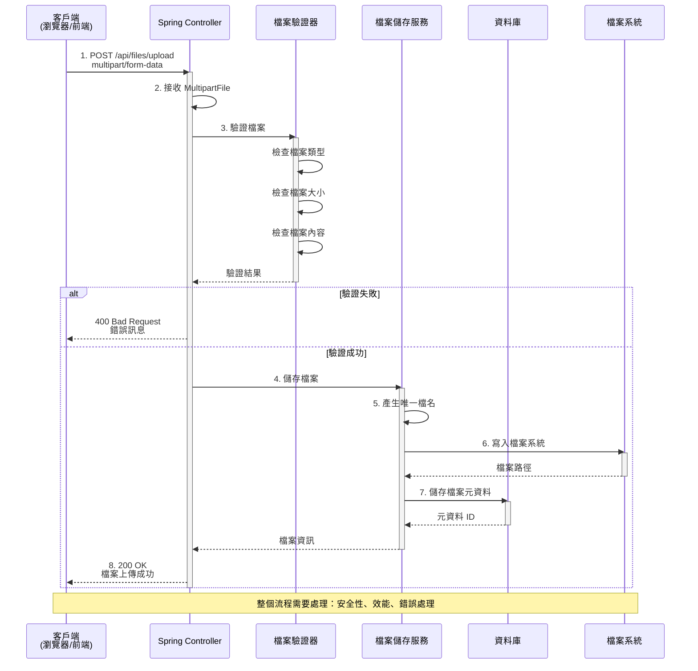

# 3.2 檔案上傳與下載

> **對應章節**: 第3章 - 企業級功能
> **對應範例**: `chapter3-enterprise-features`
> **難度**: ⭐⭐⭐☆☆

---

## 📚 本章概要

檔案處理是現代 Web 應用的基礎功能，特別是在 AI 應用中，多模態輸入（圖片、音訊、文件）的處理至關重要。本章將帶你掌握 Spring Boot 的檔案處理機制、安全性考量和最佳實踐。

**學習目標**:
- 理解 HTTP 檔案上傳的工作原理
- 掌握 MultipartFile 的使用方法
- 實現安全的檔案上傳與下載功能
- 建立完整的檔案元資料管理
- 為 AI 應用的多模態輸入做準備

---

## 3.2.1 檔案處理的重要性

在現代 Web 應用中，檔案處理是一項基礎且重要的功能：

### 常見應用場景



### 場景詳細說明

| 場景類型 | 具體應用 | 技術要求 | Spring AI 整合 |
|---------|---------|---------|---------------|
| **使用者內容** | 個人頭像、簡歷附件 | 檔案大小限制、格式驗證 | 圖片壓縮、內容審核 |
| **企業文件** | 合約、報表、備份 | 安全性、權限控制 | 文件摘要、智能分類 |
| **電商應用** | 商品圖片、批次匯入 | 效能優化、批次處理 | 圖片標籤、商品描述生成 |
| **AI 應用** | 訓練資料、多模態輸入 | 大檔案處理、格式轉換 | 向量化、RAG 知識庫 ⭐ |

> 💡 **重點**：良好的檔案處理機制不僅要考慮功能實現，還要重視安全性、效能和使用者體驗。特別是在 AI 應用中，檔案處理是實現多模態 AI 功能的基礎。

---

## 3.2.2 HTTP 檔案上傳原理

檔案上傳透過 HTTP 的 `multipart/form-data` 編碼方式實現。

### 檔案上傳完整流程



### HTML 表單範例

```html
<!-- 檔案上傳表單 -->
<form method="post" action="/upload" enctype="multipart/form-data">
    <input type="file" name="file" />
    <input type="submit" value="上傳" />
</form>
```

### MultipartFile 核心方法

```java
public interface MultipartFile {
    String getOriginalFilename(); // 取得原始檔案名稱
    String getContentType();      // 取得檔案類型
    long getSize();              // 取得檔案大小
    byte[] getBytes();           // 取得檔案內容
    InputStream getInputStream(); // 取得輸入串流
    void transferTo(File dest);  // 儲存檔案到指定位置
}
```

> 💡 **流程重點**：從接收檔案到儲存完成，需要經過驗證、產生唯一檔名、寫入檔案系統、記錄元資料等多個步驟，確保檔案處理的完整性和安全性。

---

## 3.2.3 檔案上傳配置

### 1. application.yml 配置

```yaml
spring:
  servlet:
    multipart:
      enabled: true                  # 啟用檔案上傳
      max-file-size: 10MB           # 單檔案最大 10MB
      max-request-size: 50MB        # 請求最大 50MB
      file-size-threshold: 2KB      # 記憶體暫存閾值

# 自訂配置
app:
  upload:
    path: ./uploads                 # 檔案儲存路徑
```

### 2. 配置說明

| 配置項目 | 說明 | 預設值 | 建議值 |
|---------|------|--------|--------|
| `max-file-size` | 單檔案最大大小 | 1MB | 10MB |
| `max-request-size` | 請求最大大小 | 10MB | 50MB |
| `file-size-threshold` | 記憶體暫存閾值 | 0 | 2KB |

---

## 💻 檔案上傳實作

### 控制器層：接收檔案

```java
// 對應範例: chapter3-enterprise-features/src/main/java/com/example/enterprise/controller/FileStorageController.java:41

/**
 * 檔案上傳 API
 */
@PostMapping("/upload")
@ResponseStatus(HttpStatus.CREATED)
@Operation(summary = "上傳檔案", description = "上傳單一檔案，支援圖片、文件等多種格式")
public ApiResponse<FileUploadResponse> uploadFile(
        @Parameter(description = "要上傳的檔案", required = true)
        @RequestParam("file") MultipartFile file) {

    // 呼叫服務層處理檔案
    FileUploadResponse response = fileStorageService.storeFile(file);
    return ApiResponse.success("檔案上傳成功", response);
}
```

**關鍵點**：
- 🔑 `@RequestParam("file")`: 接收表單中的檔案
- 🔑 `MultipartFile`: Spring 提供的檔案處理介面
- 🔑 `@ResponseStatus(HttpStatus.CREATED)`: 上傳成功返回 201
- 🔑 控制器只負責接收，具體處理邏輯在服務層

---

### 服務層：檔案儲存邏輯

```java
// 對應範例: chapter3-enterprise-features/src/main/java/com/example/enterprise/service/FileStorageService.java:51

/**
 * 儲存檔案到檔案系統並記錄元資料
 */
@Transactional
public FileUploadResponse storeFile(MultipartFile file) {
    // 1. 驗證檔案
    validateFile(file);

    try {
        // 2. 建立上傳目錄
        Path uploadDir = Paths.get(uploadPath);
        if (!Files.exists(uploadDir)) {
            Files.createDirectories(uploadDir);
        }

        // 3. 產生唯一檔案名稱（UUID + 原始副檔名）
        String originalFilename = StringUtils.cleanPath(file.getOriginalFilename());
        String fileExtension = getFileExtension(originalFilename);
        String storedFilename = UUID.randomUUID().toString() + fileExtension;

        // 4. 儲存檔案到檔案系統
        Path targetLocation = uploadDir.resolve(storedFilename);
        Files.copy(file.getInputStream(), targetLocation, StandardCopyOption.REPLACE_EXISTING);

        // 5. 儲存檔案元資料到資料庫
        FileMetadata metadata = FileMetadata.builder()
                .originalFilename(originalFilename)
                .storedFilename(storedFilename)
                .contentType(file.getContentType())
                .fileSize(file.getSize())
                .filePath(targetLocation.toString())
                .build();

        FileMetadata savedMetadata = fileMetadataRepository.save(metadata);

        log.info("檔案上傳成功：{} -> {}", originalFilename, storedFilename);

        // 6. 建立回應
        return buildFileUploadResponse(savedMetadata);

    } catch (IOException e) {
        throw new FileStorageException("檔案儲存失敗：" + file.getOriginalFilename(), e);
    }
}
```

**處理流程**：
1. ✅ 驗證檔案（檔案類型、大小）
2. ✅ 建立上傳目錄（如果不存在）
3. ✅ 產生唯一檔案名稱（避免衝突）
4. ✅ 儲存檔案到檔案系統
5. ✅ 記錄檔案元資料到資料庫
6. ✅ 返回下載和預覽 URL

**為什麼使用 UUID？**
```
使用時間戳:
  file1.jpg → 1704067200000_file1.jpg  ✅ 唯一
  file2.jpg → 1704067200001_file2.jpg  ✅ 唯一
  問題: 可預測、檔案名稱過長

使用 UUID:
  file1.jpg → a1b2c3d4-e5f6-7890-abcd-ef1234567890.jpg  ✅ 唯一
  file2.jpg → b2c3d4e5-f6g7-8901-bcde-fg2345678901.jpg  ✅ 唯一
  優點: 不可預測、更安全、固定長度
```

---

### 檔案驗證

```java
// 對應範例: chapter3-enterprise-features/src/main/java/com/example/enterprise/service/FileStorageService.java:107

/**
 * 驗證檔案合法性
 */
private void validateFile(MultipartFile file) {
    // 檢查檔案是否為空
    if (file.isEmpty()) {
        throw new FileStorageException("請選擇要上傳的檔案");
    }

    // 檢查檔案類型
    String contentType = file.getContentType();
    if (contentType == null || !allowedTypes.contains(contentType)) {
        throw new FileStorageException("不支援的檔案類型：" + contentType);
    }
}
```

**配置允許的檔案類型**：

```yaml
# application.yml
app:
  upload:
    path: ./uploads
    allowed-types: image/jpeg,image/png,image/gif,application/pdf,text/plain
```

**驗證項目**：
- ✅ 檔案不能為空
- ✅ 檔案類型必須在允許清單中
- ✅ 檔案大小（Spring 配置控制）

---

### 多檔案上傳

```java
/**
 * 多檔案上傳
 */
@PostMapping("/upload-multiple")
public ResponseEntity<ApiResponse<List<String>>> uploadMultipleFiles(
        @RequestParam("files") MultipartFile[] files) {

    List<String> uploadedFiles = new ArrayList<>();

    for (MultipartFile file : files) {
        if (!file.isEmpty()) {
            try {
                String fileName = System.currentTimeMillis() + "_" + file.getOriginalFilename();
                Path filePath = Paths.get(uploadPath).resolve(fileName);
                file.transferTo(filePath.toFile());
                uploadedFiles.add(fileName);
            } catch (IOException e) {
                log.error("檔案上傳失敗: {}", file.getOriginalFilename(), e);
            }
        }
    }

    return ResponseEntity.ok(ApiResponse.success("上傳完成", uploadedFiles));
}
```

---

## 📥 檔案下載實作

### 下載 vs 預覽的差異

| 功能 | HTTP Header | 瀏覽器行為 | 適用場景 |
|------|------------|-----------|---------|
| **下載** | `attachment; filename="..."` | 直接下載到本機 | 文件、壓縮檔 |
| **預覽** | `inline; filename="..."` | 在瀏覽器中開啟 | 圖片、PDF |

### 檔案下載實作

```java
// 對應範例: chapter3-enterprise-features/src/main/java/com/example/enterprise/controller/FileStorageController.java:78

/**
 * 檔案下載
 */
@GetMapping("/download/{filename:.+}")
@Operation(summary = "下載檔案", description = "根據檔案名稱下載檔案")
public ResponseEntity<Resource> downloadFile(
        @PathVariable String filename,
        HttpServletRequest request) {

    // 1. 載入檔案資源
    Resource resource = fileStorageService.loadFileAsResource(filename);

    // 2. 偵測檔案的 MIME 類型
    String contentType = null;
    try {
        contentType = request.getServletContext().getMimeType(resource.getFile().getAbsolutePath());
    } catch (IOException ex) {
        log.info("無法偵測檔案類型");
    }

    // 3. 預設類型
    if (contentType == null) {
        contentType = "application/octet-stream";
    }

    // 4. 返回檔案（下載模式）
    return ResponseEntity.ok()
            .contentType(MediaType.parseMediaType(contentType))
            .header(HttpHeaders.CONTENT_DISPOSITION, "attachment; filename=\"" + resource.getFilename() + "\"")
            .body(resource);
}
```

**關鍵點**：
- 🔑 `attachment`: 告訴瀏覽器下載檔案
- 🔑 `Resource`: Spring 的資源抽象，支援多種來源
- 🔑 Content-Type: 正確設定 MIME 類型

---

### 檔案預覽實作

```java
// 對應範例: chapter3-enterprise-features/src/main/java/com/example/enterprise/controller/FileStorageController.java:116

/**
 * 檔案預覽（在瀏覽器中開啟）
 */
@GetMapping("/preview/{filename:.+}")
@Operation(summary = "預覽檔案", description = "在瀏覽器中預覽檔案（適用於圖片、PDF 等）")
public ResponseEntity<Resource> previewFile(
        @PathVariable String filename,
        HttpServletRequest request) {

    Resource resource = fileStorageService.loadFileAsResource(filename);

    String contentType = null;
    try {
        contentType = request.getServletContext().getMimeType(resource.getFile().getAbsolutePath());
    } catch (IOException ex) {
        log.info("無法偵測檔案類型");
    }

    if (contentType == null) {
        contentType = "application/octet-stream";
    }

    // 使用 inline 讓瀏覽器預覽
    return ResponseEntity.ok()
            .contentType(MediaType.parseMediaType(contentType))
            .header(HttpHeaders.CONTENT_DISPOSITION, "inline; filename=\"" + resource.getFilename() + "\"")
            .body(resource);
}
```

**下載 vs 預覽**：
```
下載檔案：
  Content-Disposition: attachment; filename="report.pdf"
  → 瀏覽器：儲存到下載資料夾

預覽檔案：
  Content-Disposition: inline; filename="report.pdf"
  → 瀏覽器：直接在瀏覽器中開啟 PDF
```

---

### 載入檔案資源

```java
// 對應範例: chapter3-enterprise-features/src/main/java/com/example/enterprise/service/FileStorageService.java:92

/**
 * 載入檔案為 Resource
 */
public Resource loadFileAsResource(String filename) {
    try {
        // 1. 解析檔案路徑並正規化（防止路徑遍歷攻擊）
        Path filePath = Paths.get(uploadPath).resolve(filename).normalize();

        // 2. 建立 Resource
        Resource resource = new UrlResource(filePath.toUri());

        // 3. 檢查檔案是否存在且可讀取
        if (resource.exists() && resource.isReadable()) {
            return resource;
        } else {
            throw new ResourceNotFoundException("檔案不存在或無法讀取：" + filename);
        }
    } catch (MalformedURLException e) {
        throw new FileStorageException("檔案載入失敗：" + filename, e);
    }
}
```

**安全性考量**：
- ✅ `normalize()`: 防止路徑遍歷攻擊（如 `../../etc/passwd`）
- ✅ `isReadable()`: 檢查檔案權限
- ✅ 異常處理：檔案不存在或無法讀取時拋出異常

---

## 🔒 安全性考量

### 常見安全風險

| 風險類型 | 具體威脅 | 防護措施 |
|---------|---------|---------|
| **路徑遍歷** | `../../etc/passwd` | 使用 `normalize()` 清理路徑 |
| **檔案類型偽造** | 上傳 `.exe` 偽裝成 `.jpg` | 檢查 Content-Type 和檔案內容 |
| **檔案大小攻擊** | 上傳 GB 級檔案耗盡磁碟 | 設定 `max-file-size` 限制 |
| **檔案名注入** | `test;rm -rf /.jpg` | 使用 UUID 重新命名 |
| **惡意檔案** | 上傳病毒或惡意腳本 | 整合病毒掃描服務 |

### 安全檢查清單

```java
/**
 * 完整的安全檔案驗證
 */
private void secureValidateFile(MultipartFile file) {
    // 1. 檢查檔案是否為空
    if (file.isEmpty()) {
        throw new FileStorageException("請選擇要上傳的檔案");
    }

    // 2. 檢查檔案大小（Spring 配置會先檢查，這是雙重保險）
    long maxSize = 10 * 1024 * 1024; // 10MB
    if (file.getSize() > maxSize) {
        throw new FileStorageException("檔案大小不能超過 10MB");
    }

    // 3. 檢查檔案類型（Content-Type）
    String contentType = file.getContentType();
    if (contentType == null || !allowedTypes.contains(contentType)) {
        throw new FileStorageException("不支援的檔案類型：" + contentType);
    }

    // 4. 清理檔案名稱（防止路徑注入）
    String filename = StringUtils.cleanPath(file.getOriginalFilename());
    if (filename.contains("..")) {
        throw new FileStorageException("檔案名稱包含非法字元");
    }

    // 5. 檢查檔案副檔名
    String extension = getFileExtension(filename);
    List<String> allowedExtensions = Arrays.asList(".jpg", ".jpeg", ".png", ".pdf");
    if (!allowedExtensions.contains(extension.toLowerCase())) {
        throw new FileStorageException("不支援的檔案副檔名：" + extension);
    }
}
```

**安全最佳實踐**：
- ✅ 永遠重新命名上傳的檔案（使用 UUID）
- ✅ 將上傳目錄設定在 Web 根目錄之外
- ✅ 不要直接使用使用者提供的檔案名
- ✅ 實作多層驗證（Content-Type + 副檔名 + 檔案內容）
- ✅ 定期掃描上傳的檔案

---

## 🎬 實際應用場景

### 場景 1: 使用者頭像上傳

```bash
# 上傳頭像
curl -X POST http://localhost:8080/api/files/upload \
  -F "file=@avatar.jpg"

# 回應：
# {
#   "code": 201,
#   "message": "檔案上傳成功",
#   "data": {
#     "id": 1,
#     "originalFilename": "avatar.jpg",
#     "storedFilename": "a1b2c3d4-e5f6-7890-abcd-ef1234567890.jpg",
#     "contentType": "image/jpeg",
#     "fileSize": 102400,
#     "downloadUrl": "http://localhost:8080/api/files/download/a1b2c3d4-e5f6-7890-abcd-ef1234567890.jpg",
#     "previewUrl": "http://localhost:8080/api/files/preview/a1b2c3d4-e5f6-7890-abcd-ef1234567890.jpg"
#   }
# }

# 預覽頭像（在瀏覽器中開啟）
http://localhost:8080/api/files/preview/a1b2c3d4-e5f6-7890-abcd-ef1234567890.jpg
```

---

### 場景 2: AI 圖片分析

```java
/**
 * AI 圖片分析端點
 * 結合檔案上傳和 AI 處理
 */
@PostMapping("/ai/analyze-image")
public ApiResponse<ImageAnalysisResult> analyzeImage(
        @RequestParam("file") MultipartFile file,
        @RequestParam("prompt") String prompt) {

    // 1. 儲存檔案
    FileUploadResponse uploadResponse = fileStorageService.storeFile(file);

    // 2. 使用 Spring AI 分析圖片
    // ImageAnalysisResult result = aiService.analyzeImage(
    //     uploadResponse.getFilePath(),
    //     prompt
    // );

    // 3. 返回分析結果
    return ApiResponse.success("分析完成", result);
}
```

**測試範例**：
```bash
curl -X POST http://localhost:8080/api/ai/analyze-image \
  -F "file=@product.jpg" \
  -F "prompt=描述這個產品的特徵和用途"
```

---

## 📝 重點回顧

### 核心概念

✅ **HTTP 檔案上傳**：使用 `multipart/form-data` 編碼傳輸檔案
✅ **MultipartFile**：Spring 提供的檔案處理介面，簡化檔案操作
✅ **檔案元資料**：記錄檔案資訊到資料庫，便於管理和追蹤
✅ **安全性優先**：多層驗證確保系統安全
✅ **AI 應用基礎**：為多模態 AI 輸入做準備

### 完整流程回顧


### 最佳實踐

| 實踐項目 | 說明 | 範例 |
|---------|------|------|
| **檔案命名** | 使用 UUID 避免衝突和安全風險 | `UUID.randomUUID() + extension` |
| **路徑清理** | 防止路徑遍歷攻擊 | `StringUtils.cleanPath()` + `normalize()` |
| **類型驗證** | 檢查 Content-Type 和副檔名 | 白名單機制 |
| **大小限制** | Spring 配置 + 程式碼雙重檢查 | `max-file-size: 10MB` |
| **元資料記錄** | 記錄到資料庫便於管理 | `FileMetadata` 實體 |
| **下載安全** | 使用 `Resource` 而非直接讀取 | `UrlResource` |

### MultipartFile 核心方法速查

```java
MultipartFile file;

file.getOriginalFilename()  // 取得原始檔案名稱
file.getContentType()        // 取得檔案 MIME 類型
file.getSize()              // 取得檔案大小（bytes）
file.isEmpty()              // 檢查檔案是否為空
file.getInputStream()        // 取得檔案輸入串流
file.transferTo(dest)        // 儲存到指定位置
```

---

## 🚀 下一步

現在你已經掌握了檔案上傳與下載，接下來我們將學習：

👉 [3.3 API 文件化與測試](./3.3-api-documentation.md) - 使用 Swagger 自動生成 API 文件

---

## 📚 完整範例

本章概念的完整實現請參考：

📁 **chapter3-enterprise-features**
- `src/main/java/com/example/enterprise/controller/FileStorageController.java` - 檔案上傳下載 API
- `src/main/java/com/example/enterprise/service/FileStorageService.java` - 檔案處理服務
- `src/main/java/com/example/enterprise/entity/FileMetadata.java` - 檔案元資料實體
- `src/main/resources/application.yml` - 檔案上傳配置

🔗 **啟動範例**:
```bash
cd code-examples/chapter3-enterprise-features
mvn spring-boot:run
```

🧪 **測試 API**:
```bash
# Swagger UI
http://localhost:8080/swagger-ui.html

# 上傳檔案
curl -X POST http://localhost:8080/api/files/upload \
  -F "file=@test-image.jpg"

# 下載檔案
curl -O http://localhost:8080/api/files/download/檔案名稱.jpg

# 預覽檔案（在瀏覽器中開啟）
http://localhost:8080/api/files/preview/檔案名稱.jpg
```

---

## 🔗 參考資源

- **Spring Boot 官方指南**: [Uploading Files](https://spring.io/guides/gs/uploading-files/)
- **Servlet 3.1 規範**: [Multipart Support](https://javaee.github.io/servlet-spec/downloads/servlet-3.1/Final/servlet-3_1-final.pdf)
- **OWASP 檔案上傳安全**: [File Upload Cheat Sheet](https://cheatsheetseries.owasp.org/cheatsheets/File_Upload_Cheat_Sheet.html)

---

**相關章節**:
- ← 上一節: [3.1 資料驗證與錯誤處理](./3.1-validation-error-handling.md)
- → 下一節: [3.3 API 文件化與測試](./3.3-api-documentation.md)
- 📖 回到目錄: [第3章 README](./README.md)
