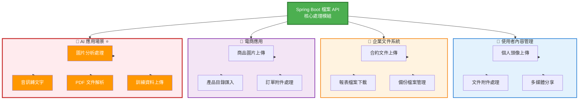
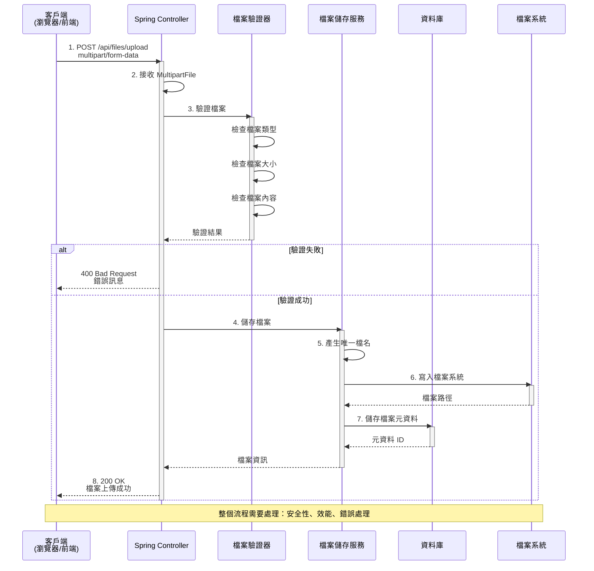

# 3.2 檔案上傳與下載

> **學習重點**：掌握 Spring Boot 檔案處理機制、MultipartFile 使用和安全性考量

---

## 3.2.1 檔案處理的重要性

在現代 Web 應用中，檔案處理是一項基礎且重要的功能：

### 常見應用場景



### 場景詳細說明

| 場景類型 | 具體應用 | 技術要求 | Spring AI 整合 |
|---------|---------|---------|---------------|
| **使用者內容** | 個人頭像、簡歷附件 | 檔案大小限制、格式驗證 | 圖片壓縮、內容審核 |
| **企業文件** | 合約、報表、備份 | 安全性、權限控制 | 文件摘要、智能分類 |
| **電商應用** | 商品圖片、批次匯入 | 效能優化、批次處理 | 圖片標籤、商品描述生成 |
| **AI 應用** | 訓練資料、多模態輸入 | 大檔案處理、格式轉換 | 向量化、RAG 知識庫 ⭐ |

> 💡 **重點**：良好的檔案處理機制不僅要考慮功能實現，還要重視安全性、效能和使用者體驗。特別是在 AI 應用中，檔案處理是實現多模態 AI 功能的基礎。

---

## 3.2.2 HTTP 檔案上傳原理

檔案上傳透過 HTTP 的 `multipart/form-data` 編碼方式實現。

### 檔案上傳完整流程



### HTML 表單範例

```html
<!-- 檔案上傳表單 -->
<form method="post" action="/upload" enctype="multipart/form-data">
    <input type="file" name="file" />
    <input type="submit" value="上傳" />
</form>
```

### MultipartFile 核心方法

```java
public interface MultipartFile {
    String getOriginalFilename(); // 取得原始檔案名稱
    String getContentType();      // 取得檔案類型
    long getSize();              // 取得檔案大小
    byte[] getBytes();           // 取得檔案內容
    InputStream getInputStream(); // 取得輸入串流
    void transferTo(File dest);  // 儲存檔案到指定位置
}
```

> 💡 **流程重點**：從接收檔案到儲存完成，需要經過驗證、產生唯一檔名、寫入檔案系統、記錄元資料等多個步驟，確保檔案處理的完整性和安全性。

---

## 3.2.3 檔案上傳配置

### 1. application.yml 配置

```yaml
spring:
  servlet:
    multipart:
      enabled: true                  # 啟用檔案上傳
      max-file-size: 10MB           # 單檔案最大 10MB
      max-request-size: 50MB        # 請求最大 50MB
      file-size-threshold: 2KB      # 記憶體暫存閾值

# 自訂配置
app:
  upload:
    path: ./uploads                 # 檔案儲存路徑
```

### 2. 配置說明

| 配置項目 | 說明 | 預設值 | 建議值 |
|---------|------|--------|--------|
| `max-file-size` | 單檔案最大大小 | 1MB | 10MB |
| `max-request-size` | 請求最大大小 | 10MB | 50MB |
| `file-size-threshold` | 記憶體暫存閾值 | 0 | 2KB |

---

## 3.2.4 檔案上傳實作

### 單檔案上傳

```java
/**
 * 檔案上傳控制器
 */
@RestController
@RequestMapping("/api/files")
@Slf4j
public class FileUploadController {

    @Value("${app.upload.path:./uploads}")
    private String uploadPath;

    /**
     * 單檔案上傳
     */
    @PostMapping("/upload")
    public ResponseEntity<ApiResponse<FileUploadResponse>> uploadFile(
            @RequestParam("file") MultipartFile file) {

        if (file.isEmpty()) {
            return ResponseEntity.badRequest()
                    .body(ApiResponse.error(400, "請選擇要上傳的檔案"));
        }

        try {
            // 建立上傳目錄
            Path uploadDir = Paths.get(uploadPath);
            if (!Files.exists(uploadDir)) {
                Files.createDirectories(uploadDir);
            }

            // 產生唯一檔案名稱
            String fileName = System.currentTimeMillis() + "_" + file.getOriginalFilename();
            Path filePath = uploadDir.resolve(fileName);

            // 儲存檔案
            file.transferTo(filePath.toFile());

            log.info("檔案上傳成功: {}", fileName);

            FileUploadResponse response = new FileUploadResponse(
                fileName,
                file.getOriginalFilename(),
                file.getSize()
            );

            return ResponseEntity.ok(ApiResponse.success("上傳成功", response));

        } catch (IOException e) {
            log.error("檔案上傳失敗", e);
            return ResponseEntity.status(HttpStatus.INTERNAL_SERVER_ERROR)
                    .body(ApiResponse.error(500, "檔案上傳失敗"));
        }
    }
}
```

### 多檔案上傳

```java
/**
 * 多檔案上傳
 */
@PostMapping("/upload-multiple")
public ResponseEntity<ApiResponse<List<String>>> uploadMultipleFiles(
        @RequestParam("files") MultipartFile[] files) {

    List<String> uploadedFiles = new ArrayList<>();

    for (MultipartFile file : files) {
        if (!file.isEmpty()) {
            try {
                String fileName = System.currentTimeMillis() + "_" + file.getOriginalFilename();
                Path filePath = Paths.get(uploadPath).resolve(fileName);
                file.transferTo(filePath.toFile());
                uploadedFiles.add(fileName);
            } catch (IOException e) {
                log.error("檔案上傳失敗: {}", file.getOriginalFilename(), e);
            }
        }
    }

    return ResponseEntity.ok(ApiResponse.success("上傳完成", uploadedFiles));
}
```

---

## 3.2.5 檔案下載實作

### 檔案下載

```java
/**
 * 檔案下載
 */
@GetMapping("/download/{fileName}")
public ResponseEntity<Resource> downloadFile(@PathVariable String fileName) {

    try {
        Path filePath = Paths.get(uploadPath).resolve(fileName);
        Resource resource = new UrlResource(filePath.toUri());

        if (resource.exists() && resource.isReadable()) {
            return ResponseEntity.ok()
                    .header(HttpHeaders.CONTENT_DISPOSITION,
                           "attachment; filename=\"" + fileName + "\"")
                    .body(resource);
        } else {
            return ResponseEntity.notFound().build();
        }

    } catch (MalformedURLException e) {
        log.error("檔案下載失敗: {}", fileName, e);
        return ResponseEntity.badRequest().build();
    }
}
```

### 檔案預覽

```java
/**
 * 檔案預覽（適用於圖片等媒體檔案）
 */
@GetMapping("/preview/{fileName}")
public ResponseEntity<Resource> previewFile(@PathVariable String fileName) {

    try {
        Path filePath = Paths.get(uploadPath).resolve(fileName);
        Resource resource = new UrlResource(filePath.toUri());

        if (resource.exists() && resource.isReadable()) {
            // 根據檔案副檔名設定 Content-Type
            String contentType = Files.probeContentType(filePath);

            return ResponseEntity.ok()
                    .header(HttpHeaders.CONTENT_TYPE, contentType)
                    .body(resource);
        } else {
            return ResponseEntity.notFound().build();
        }

    } catch (Exception e) {
        log.error("檔案預覽失敗: {}", fileName, e);
        return ResponseEntity.badRequest().build();
    }
}
```

---

## 3.2.6 安全性考量

### 檔案類型驗證

```java
/**
 * 檢查檔案類型是否允許
 */
private boolean isAllowedFileType(MultipartFile file) {
    String contentType = file.getContentType();
    return contentType != null && (
        contentType.startsWith("image/") ||
        contentType.equals("application/pdf") ||
        contentType.equals("text/plain")
    );
}

/**
 * 檢查檔案大小
 */
private boolean isValidFileSize(MultipartFile file) {
    long maxSize = 10 * 1024 * 1024; // 10MB
    return file.getSize() <= maxSize;
}
```

### 錯誤處理

```java
/**
 * 檔案處理異常處理器
 */
@ControllerAdvice
public class FileExceptionHandler {

    @ExceptionHandler(MaxUploadSizeExceededException.class)
    public ResponseEntity<String> handleMaxSizeException(MaxUploadSizeExceededException e) {
        return ResponseEntity.status(HttpStatus.PAYLOAD_TOO_LARGE)
                .body("檔案大小超過限制");
    }

    @ExceptionHandler(MultipartException.class)
    public ResponseEntity<String> handleMultipartException(MultipartException e) {
        return ResponseEntity.badRequest()
                .body("檔案上傳格式錯誤");
    }
}
```

---

## 📝 本節重點

1. ✅ **檔案處理原理**：理解 multipart/form-data 編碼方式
2. ✅ **MultipartFile**：掌握 Spring Boot 檔案處理 API
3. ✅ **配置管理**：正確配置檔案大小和路徑
4. ✅ **上傳下載**：實作單檔案和多檔案處理
5. ✅ **安全性**：檔案類型驗證和大小限制

**最佳實踐**：
- 使用串流處理大檔案
- 實作檔案類型和大小驗證
- 使用唯一檔案名稱避免衝突
- 定期清理暫存檔案

---

## 🔗 相關資源

- **完整程式碼**：[code-examples/chapter3-enterprise-features/](../../code-examples/chapter3-enterprise-features/)
- **檔案控制器**：[FileStorageController.java](../../code-examples/chapter3-enterprise-features/src/main/java/com/example/enterprise/controller/)
- **檔案服務**：[FileStorageService.java](../../code-examples/chapter3-enterprise-features/src/main/java/com/example/enterprise/service/)
- **官方文件**：[Spring Boot File Upload](https://spring.io/guides/gs/uploading-files/)

---

**上一節**：[3.1 資料驗證與錯誤處理](./3.1-validation-error-handling.md)
**下一節**：[3.3 API 文件化](./3.3-api-documentation.md)
**回到目錄**：[第3章 README](./README.md)
