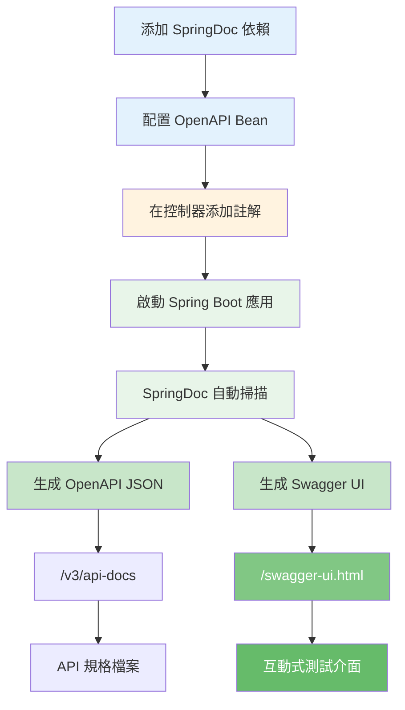
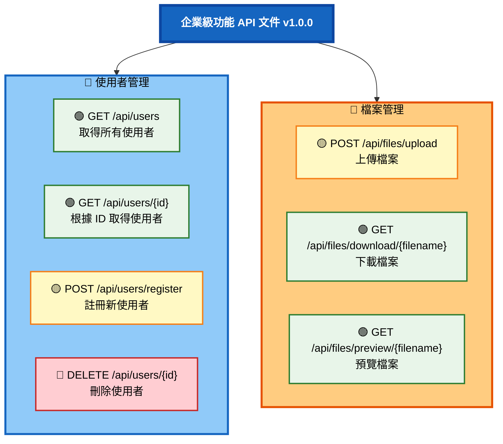

# 3.3 API 文件化與測試

> **對應章節**: 第3章 - 企業級功能
> **對應範例**: `chapter3-enterprise-features`
> **難度**: ⭐⭐☆☆☆

---

## 📚 本章概要

API 文件是前後端協作的橋樑，良好的文件可以大幅提升開發效率。本章將帶你掌握 Swagger/OpenAPI 的整合與使用，學會自動生成專業的 API 文件。

**學習目標**:
- 理解 API 文件在團隊協作中的價值
- 掌握 SpringDoc OpenAPI 的配置與整合
- 學會使用 Swagger 註解豐富 API 文件
- 熟練使用 Swagger UI 測試 API
- 建立完整的 API 文件化流程

---

## 3.3.1 為什麼需要 API 文件？

API 文件就像是「使用指南」，對於開發團隊協作和第三方整合至關重要：

**沒有文件的痛點**：
- ❌ API 做什麼功能不清楚
- ❌ 參數格式不明確
- ❌ 回傳資料結構未知
- ❌ 錯誤碼和處理方式不明

**有文件的優勢**：
- ✅ 前後端協作效率提升
- ✅ 減少溝通成本
- ✅ 新成員快速上手
- ✅ 支援第三方整合

---

## 🔍 Swagger/OpenAPI 工作流程

### 自動化文件生成流程



**流程說明**：
1. ✅ 添加依賴後，SpringDoc 自動整合到 Spring Boot
2. ✅ 配置 OpenAPI Bean 定義 API 基本資訊
3. ✅ 使用註解豐富 API 文件內容
4. ✅ 啟動應用後自動掃描所有控制器
5. ✅ 生成兩種格式：JSON 規格 + 互動式 UI

---

## 💻 整合 Swagger/OpenAPI

> ⚠️ **重要提醒**：Swagger/OpenAPI **並非** Spring Boot 內建功能，而是**第三方套件**，需要手動添加依賴。

### SpringDoc vs Springfox 對比

| 比較項目 | SpringDoc | Springfox |
|---------|-----------|-----------|
| **維護狀態** | ✅ 活躍維護 | ❌ 已停止維護 |
| **Spring Boot 版本** | 3.x | 2.x |
| **OpenAPI 規範** | OpenAPI 3.0 | OpenAPI 2.0 (Swagger) |
| **推薦度** | ⭐⭐⭐⭐⭐ 強烈推薦 | 不推薦新專案使用 |
| **最新版本** | 2.2.0+ | 3.0.0 (2020年停更) |

> 💡 **本書選擇 SpringDoc**：
> - 唯一支援 Spring Boot 3.x 的活躍專案
> - 符合最新的 OpenAPI 3.0 規範
> - 社群活躍，問題回應快速
> - 與 Spring Boot 整合更緊密

---

### 步驟 1: 添加依賴

```xml
<!-- pom.xml -->
<!-- ⚠️ 必須明確指定版本號，SpringDoc 不在 Spring Boot 的依賴管理中 -->
<dependency>
    <groupId>org.springdoc</groupId>
    <artifactId>springdoc-openapi-starter-webmvc-ui</artifactId>
    <version>2.2.0</version>
</dependency>
```

**版本對照表**：

| Spring Boot 版本 | SpringDoc 版本 | 說明 |
|------------------|----------------|------|
| **3.0.x - 3.2.x** | **2.2.0+** | ✅ 本書使用 |
| 3.3.x+ | 2.3.0+ | 最新版本 |
| 2.x | 1.7.0 | 舊版本 |

> 📦 **為什麼必須指定版本？**
> 1. SpringDoc 是第三方套件，不在 Spring Boot BOM 中
> 2. Maven 無法自動解析版本號
> 3. 不同版本支援不同的 Spring Boot 版本

---

### 步驟 2: 配置 OpenAPI

```java
// 對應範例: chapter3-enterprise-features/src/main/java/com/example/enterprise/config/OpenApiConfig.java:25

/**
 * OpenAPI (Swagger) 配置
 */
@Configuration
public class OpenApiConfig {

    @Bean
    public OpenAPI customOpenAPI() {
        return new OpenAPI()
                // API 基本資訊
                .info(new Info()
                        .title("企業級功能 API 文件")
                        .version("1.0.0")
                        .description("展示資料驗證、檔案處理、API 文件化等企業級功能")
                        .contact(new Contact()
                                .name("開發團隊")
                                .email("dev@example.com")
                                .url("https://example.com"))
                        .license(new License()
                                .name("MIT License")
                                .url("https://opensource.org/licenses/MIT")))
                // 伺服器列表
                .servers(Arrays.asList(
                        new Server().url("http://localhost:8080").description("開發環境"),
                        new Server().url("https://api.example.com").description("生產環境")
                ));
    }
}
```

**配置項目說明**：
- 🔸 `title`: API 文件標題
- 🔸 `version`: API 版本號
- 🔸 `description`: API 詳細說明
- 🔸 `contact`: 聯絡資訊
- 🔸 `license`: 授權資訊
- 🔸 `servers`: 伺服器環境列表

---

### 步驟 3: 訪問 Swagger UI

啟動應用後，訪問以下 URL：

| 功能 | URL | 說明 |
|------|-----|------|
| **Swagger UI** | http://localhost:8080/swagger-ui.html | 互動式測試介面 |
| **OpenAPI JSON** | http://localhost:8080/v3/api-docs | API 規格檔案 |
| **OpenAPI YAML** | http://localhost:8080/v3/api-docs.yaml | YAML 格式規格 |

**Swagger UI 介面預覽**：



---

## 📝 使用 Swagger 註解

### 控制器文件化

```java
// 對應範例: chapter3-enterprise-features/src/main/java/com/example/enterprise/controller/UserController.java:30

/**
 * 使用者管理 API
 * 展示如何使用 Swagger 註解豐富 API 文件
 */
@RestController
@RequestMapping("/api/users")
@RequiredArgsConstructor
@Tag(name = "使用者管理", description = "使用者註冊、查詢與刪除 API")
public class UserController {

    private final UserService userService;

    /**
     * 獲取所有使用者
     */
    @GetMapping
    @Operation(summary = "取得所有使用者", description = "查詢系統中所有已註冊的使用者列表")
    @ApiResponses(value = {
            @io.swagger.v3.oas.annotations.responses.ApiResponse(
                    responseCode = "200",
                    description = "查詢成功",
                    content = @Content(schema = @Schema(implementation = ApiResponse.class))
            )
    })
    public ApiResponse<List<User>> getAllUsers() {
        List<User> users = userService.findAll();
        return ApiResponse.success("查詢成功，共 " + users.size() + " 位使用者", users);
    }

    /**
     * 根據 ID 獲取使用者
     */
    @GetMapping("/{id}")
    @Operation(summary = "根據 ID 取得使用者", description = "根據使用者 ID 查詢單一使用者資訊")
    @ApiResponses(value = {
            @io.swagger.v3.oas.annotations.responses.ApiResponse(
                    responseCode = "200",
                    description = "查詢成功"
            ),
            @io.swagger.v3.oas.annotations.responses.ApiResponse(
                    responseCode = "404",
                    description = "使用者不存在"
            )
    })
    public ApiResponse<User> getUserById(
            @Parameter(description = "使用者 ID", required = true)
            @PathVariable Long id) {
        User user = userService.findById(id);
        return ApiResponse.success("查詢成功", user);
    }

    /**
     * 使用者註冊
     */
    @PostMapping("/register")
    @ResponseStatus(HttpStatus.CREATED)
    @Operation(summary = "註冊新使用者", description = "註冊新使用者，需提供使用者名稱、電子郵件和密碼等資訊")
    @ApiResponses(value = {
            @io.swagger.v3.oas.annotations.responses.ApiResponse(
                    responseCode = "201",
                    description = "註冊成功"
            ),
            @io.swagger.v3.oas.annotations.responses.ApiResponse(
                    responseCode = "400",
                    description = "請求資料驗證失敗"
            )
    })
    public ApiResponse<User> registerUser(
            @Parameter(description = "使用者註冊資訊", required = true)
            @Valid @RequestBody UserRegistrationRequest request) {
        User user = userService.registerUser(request);
        return ApiResponse.success("使用者註冊成功", user);
    }
}
```

**註解說明**：
- 🔸 `@Tag`: API 分組標籤
- 🔸 `@Operation`: API 端點描述（摘要和詳細說明）
- 🔸 `@ApiResponses`: 所有可能的回應狀態碼
- 🔸 `@Parameter`: 參數說明
- 🔸 `@Schema`: 資料模型說明

---

### 資料模型文件化

```java
// 對應範例: chapter3-enterprise-features/src/main/java/com/example/enterprise/entity/User.java

/**
 * 使用者實體
 */
@Schema(description = "使用者資訊")
@Entity
@Table(name = "users")
public class User {

    @Schema(description = "使用者 ID", example = "1", accessMode = Schema.AccessMode.READ_ONLY)
    @Id
    @GeneratedValue(strategy = GenerationType.IDENTITY)
    private Long id;

    @Schema(description = "使用者名稱", example = "張小明", requiredMode = Schema.RequiredMode.REQUIRED)
    @Column(unique = true, nullable = false)
    private String username;

    @Schema(description = "電子郵件地址", example = "ming@example.com")
    @Column(unique = true, nullable = false)
    private String email;

    @Schema(description = "建立時間", example = "2024-01-15T10:30:00Z", accessMode = Schema.AccessMode.READ_ONLY)
    private LocalDateTime createdAt;

    // Getters and Setters
}
```

**@Schema 參數說明**：
- `description`: 欄位說明
- `example`: 範例值
- `accessMode`: 存取模式（READ_ONLY、WRITE_ONLY）
- `requiredMode`: 是否必填

---

### Swagger 註解速查表

| 註解 | 適用範圍 | 用途 | 範例 |
|------|---------|------|------|
| **@Tag** | 控制器類別 | API 分組 | `@Tag(name = "使用者管理")` |
| **@Operation** | 控制器方法 | API 端點描述 | `@Operation(summary = "獲取使用者")` |
| **@Parameter** | 方法參數 | 參數說明 | `@Parameter(description = "使用者 ID")` |
| **@Schema** | 類別/欄位 | 資料模型說明 | `@Schema(description = "使用者名稱")` |
| **@ApiResponse** | 控制器方法 | 回應狀態碼說明 | `@ApiResponse(responseCode = "200")` |
| **@ApiResponses** | 控制器方法 | 多個回應狀態碼 | `@ApiResponses(value = {...})` |

---

## 3.3.4 API 測試工具

### 使用 curl 測試

```bash
# GET 請求
curl -X GET "http://localhost:8080/api/users?page=0&size=10"

# POST 請求（JSON）
curl -X POST "http://localhost:8080/api/users" \
     -H "Content-Type: application/json" \
     -d '{"name": "測試使用者", "email": "test@example.com"}'

# 檔案上傳
curl -X POST "http://localhost:8080/api/files/upload" -F "file=@test.jpg"
```

### 使用 Postman 或 Swagger UI 測試

**推薦方式**：
- ✅ **Swagger UI**：內建測試介面（http://localhost:8080/swagger-ui.html）
- ✅ **Postman**：功能完整的 API 測試工具
- ✅ **curl**：命令列快速測試

> 💡 **提示**：Swagger UI 提供即時測試功能，可直接在文件頁面測試 API

---

## 3.3.5 API 測試類型

| 測試類型 | 目的 | 測試範圍 | 適用場景 |
|----------|------|----------|----------|
| **功能測試** | 驗證 API 功能正確性 | 單一 API 端點 | 基本 CRUD 操作 |
| **整合測試** | 驗證系統間協作 | 多個 API 端點 | 業務流程測試 |
| **效能測試** | 驗證回應時間和吞吐量 | 系統負載能力 | 高併發場景 |
| **安全測試** | 驗證安全機制 | 認證授權機制 | 敏感資料保護 |

---

## 🎬 實際應用場景

### 場景 1: 使用 Swagger UI 測試 API

```
1. 啟動應用
   mvn spring-boot:run

2. 打開 Swagger UI
   http://localhost:8080/swagger-ui.html

3. 測試使用者註冊
   展開 "使用者管理" → "POST /api/users/register"
   點擊 "Try it out"
   填寫請求體：
   {
     "username": "kevin123",
     "email": "kevin@example.com",
     "password": "SecurePass123!",
     "fullName": "Kevin Tsai",
     "age": 25
   }
   點擊 "Execute"

4. 查看回應
   Status: 201 Created
   Response body:
   {
     "code": 201,
     "message": "使用者註冊成功",
     "data": {
       "id": 1,
       "username": "kevin123",
       ...
     }
   }
```

---

### 場景 2: 前端開發者使用 API 文件

```javascript
// 前端開發者查看 Swagger UI 後，知道如何呼叫 API

// 1. 查看 API 端點：POST /api/users/register
// 2. 查看請求格式：需要 username、email、password 等欄位
// 3. 查看回應格式：201 成功，400 驗證失敗

// 根據文件撰寫程式碼
async function registerUser(userData) {
  const response = await fetch('http://localhost:8080/api/users/register', {
    method: 'POST',
    headers: {
      'Content-Type': 'application/json'
    },
    body: JSON.stringify(userData)
  });

  if (response.status === 201) {
    const result = await response.json();
    console.log('註冊成功', result.data);
  } else if (response.status === 400) {
    const error = await response.json();
    console.error('驗證失敗', error.errors);
  }
}
```

---

## 📝 重點回顧

### 核心概念

✅ **API 文件的價值**：前後端協作、第三方整合、新人上手的重要工具
✅ **SpringDoc OpenAPI**：Spring Boot 3.x 的標準文件化解決方案
✅ **自動化生成**：透過註解自動生成完整的 API 文件
✅ **互動式測試**：Swagger UI 提供即時測試功能
✅ **標準化規格**：符合 OpenAPI 3.0 標準

### SpringDoc 整合步驟


### Swagger 註解完整清單

| 註解 | 適用範圍 | 用途 | 必填 |
|------|---------|------|------|
| `@Tag` | 類別 | API 分組 | 建議 |
| `@Operation` | 方法 | API 端點描述 | 建議 |
| `@Parameter` | 參數 | 參數說明 | 可選 |
| `@Schema` | 類別/欄位 | 資料模型說明 | 可選 |
| `@ApiResponse` | 方法 | 單一回應說明 | 可選 |
| `@ApiResponses` | 方法 | 多個回應說明 | 建議 |

### 最佳實踐

| 實踐項目 | 說明 | 範例 |
|---------|------|------|
| **完整的描述** | 每個 API 都要有清晰的說明 | `@Operation(summary = "...")` |
| **範例值** | 提供實際可用的範例 | `@Schema(example = "kevin@example.com")` |
| **錯誤碼說明** | 列出所有可能的錯誤碼 | `@ApiResponses` |
| **分組管理** | 使用 Tag 分組 API | `@Tag(name = "使用者管理")` |
| **版本控制** | API 文件包含版本號 | `version = "1.0.0"` |

---

## 🚀 下一步

恭喜！你已經完成第3章的學習，掌握了企業級功能開發的核心技能：

✅ 資料驗證與錯誤處理
✅ 檔案上傳與下載
✅ API 文件化與測試

**接下來**，我們將進入 Spring AI 的世界：

👉 [第4章：Spring AI 入門](../chapter4/README.md) - 開始你的 AI 應用開發之旅

---

## 📚 完整範例

本章概念的完整實現請參考：

📁 **chapter3-enterprise-features**
- `src/main/java/com/example/enterprise/config/OpenApiConfig.java` - Swagger 配置
- `src/main/java/com/example/enterprise/controller/UserController.java` - 完整的註解範例
- `src/main/java/com/example/enterprise/controller/FileStorageController.java` - 檔案 API 文件化
- `pom.xml` - SpringDoc 依賴配置

🔗 **啟動範例**:
```bash
cd code-examples/chapter3-enterprise-features
mvn spring-boot:run
```

🧪 **訪問 Swagger UI**:
```bash
# Swagger UI 互動式文件
http://localhost:8080/swagger-ui.html

# OpenAPI JSON 規格
http://localhost:8080/v3/api-docs

# OpenAPI YAML 規格
http://localhost:8080/v3/api-docs.yaml
```

---

## 🔗 參考資源

- **SpringDoc OpenAPI 官方**：[springdoc.org](https://springdoc.org/)
- **OpenAPI 規範**: [OpenAPI Specification](https://swagger.io/specification/)
- **Swagger UI 文件**: [Swagger UI](https://swagger.io/tools/swagger-ui/)
- **Spring Boot 整合指南**: [SpringDoc Guide](https://springdoc.org/#getting-started)

---

**相關章節**:
- ← 上一節: [3.2 檔案上傳與下載](./3.2-file-upload-download.md)
- → 下一章: [第4章 Spring AI 入門](../chapter4/README.md)
- 📖 回到目錄: [第3章 README](./README.md)
