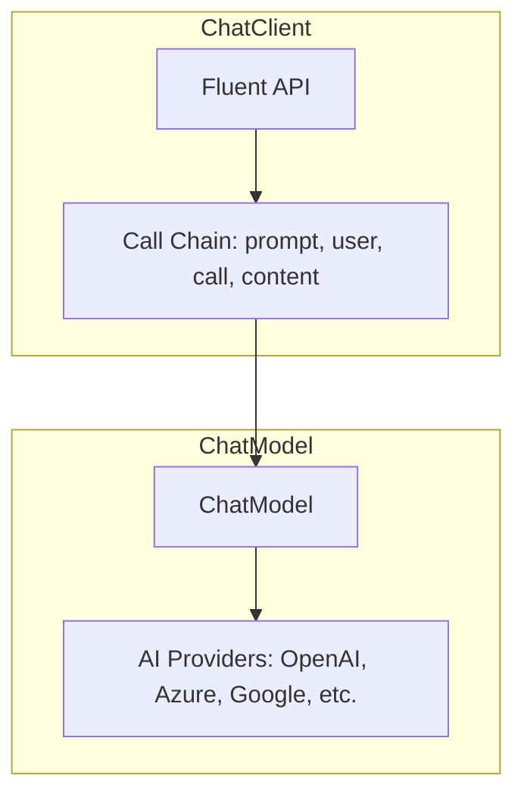

# 4.2 Hello AI World

> **本章重點**：建立第一個 Spring AI 應用程式，體驗 AI 對話的魅力，掌握 ChatClient 和 ChatModel 的基本使用方法。

## 🎯 學習目標

完成本章學習後，您將能夠：

- 🎯 **建立第一個 Spring AI 應用**：使用 Spring Boot 整合 AI 服務
- 🎯 **理解 ChatClient 與 ChatModel**：掌握兩種 AI 介面的差異和使用場景
- 🎯 **實現基本 AI 對話功能**：建立可與 AI 互動的 RESTful API
- 🎯 **配置 Spring AI 環境**：正確設定依賴和配置檔案
- 🎯 **測試 AI 應用程式**：驗證 AI 功能的正確性

---

## 4.2.1 Spring AI 架構概述

### Hello AI World


寫程式不免俗要來個 Hello World，依據開發 Spring Boot 程式的經驗，我們只需定義變數，並透過自動注入的機制就能開始使用，為了測試方便直接寫個 API。

### Spring AI 1.0 GA 架構說明

在 Spring AI 1.0 正式版中，ChatClient 和 ChatModel 的關係如下：



**核心組件說明**：
- **ChatModel**: 提供底層的 AI 模型介面，是與各種 AI 提供商（OpenAI、Azure、Google 等）溝通的核心抽象層
- **ChatClient**: 提供更高級的 Fluent API，類似於 Spring 生態系統中的 RestClient、WebClient 和 JdbcClient，內部依賴 ChatModel 來執行實際的 AI 呼叫

---

## 4.2.2 專案建立與依賴配置

### Maven 依賴配置

首先確保使用最新的 Spring AI 版本。在 `pom.xml` 中加入必要的依賴：

```xml
<!-- 來自 code-examples/chapter4-spring-ai-intro/pom.xml -->
    <!-- ... 省略部分內容 ... -->
    <dependencyManagement>
        <dependencies>
            <dependency>
                <groupId>org.springframework.ai</groupId>
                <artifactId>spring-ai-bom</artifactId>
                <version>${spring-ai.version}</version>
                <type>pom</type>
                <scope>import</scope>
            </dependency>
        </dependencies>
    </dependencyManagement>
    
    <dependencies>
        <!-- Spring AI OpenAI Starter -->
        <dependency>
            <groupId>org.springframework.ai</groupId>
            <artifactId>spring-ai-openai-spring-boot-starter</artifactId>
        </dependency>
        
        <!-- Spring Boot Web Starter -->
        <dependency>
            <groupId>org.springframework.boot</groupId>
            <artifactId>spring-boot-starter-web</artifactId>
        </dependency>
        
        <!-- Lombok for cleaner code -->
        <dependency>
            <groupId>org.projectlombok</groupId>
            <artifactId>lombok</artifactId>
            <optional>true</optional>
        </dependency>
        
        <!-- Spring Boot Test -->
        <dependency>
            <groupId>org.springframework.boot</groupId>
            <artifactId>spring-boot-starter-test</artifactId>
            <scope>test</scope>
        </dependency>
    </dependencies>
    
    <!-- ... 省略部分內容 ... -->
</project>
```

### 配置檔案設定

在 `application.yml` 中設定 AI 服務配置，例如 OpenAI 的 API Key 和模型選擇：

```yaml
# 來自 code-examples/chapter4-spring-ai-intro/src/main/resources/application.yml
spring:
  application:
    name: spring-ai-intro
  ai:
    openai:
      api-key: ${OPENAI_API_KEY}
      base-url: https://api.openai.com
      chat:
        options:
          model: gpt-4o-mini
          temperature: 0.7
          max-tokens: 1000
          stream: true  # 啟用流式輸出

# 應用程式配置
server:
  port: 8080
```

---

## 4.2.3 使用 ChatClient 實現 AI 對話

### 基本 AI 控制器

使用現代化的 ChatClient Fluent API 來建立 AI 對話端點：

```java
// 來自 code-examples/chapter4-spring-ai-intro/src/main/java/com/example/springai/controller/AiController.java
// ... (package and imports omitted for brevity)

@RestController
@RequestMapping("/api/ai")
@RequiredArgsConstructor
@Slf4j
public class AiController {
    
    private final ChatClient chatClient;

    /**
     * 基本 AI 對話端點
     * @param prompt 使用者輸入的提示詞
     * @return AI 的回應
     */
    @GetMapping("/chat")
    public String chat(@RequestParam String prompt) {
        log.info("收到 AI 對話請求：{}", prompt);
        
        String response = chatClient.prompt()
                .user(prompt)
                .call()
                .content();
        
        log.info("AI 回應：{}", response);
        return response;
    }
}
```

### 請求 DTO 類別

用於接收帶有系統提示詞的聊天請求：

```java
// 來自 code-examples/chapter4-spring-ai-intro/src/main/java/com/example/springai/dto/ChatRequest.java
// ... (package and imports omitted for brevity)

@Data
public class ChatRequest {
    private String systemMessage;
    private String userMessage;
}
```

### 程式碼重點說明

**核心註解**：
- **@RestController**: 專門用來開發 API 的標註
- **@RequiredArgsConstructor**: Lombok 提供的快速標註，可幫我們寫一個建構子並將 final 變數當作參數
- **@Slf4j**: Lombok 提供的日誌標註

**ChatClient Fluent API**：
- **chatClient.prompt()**: 開始建立聊天請求的 Fluent API
- **system()**: 設定系統提示詞（定義 AI 的角色和行為）
- **user()**: 設定使用者訊息
- **call()**: 執行同步請求
- **content()**: 取得回應內容

---

## 4.2.4 ChatClient 自動配置與客製化

Spring Boot 會自動為我們配置 ChatClient，但我們也可以透過 `AiConfig` 類別自定義配置，例如設定預設的系統提示詞或創建專用的 ChatClient 實例：

```java
// 來自 code-examples/chapter4-spring-ai-intro/src/main/java/com/example/springai/config/AiConfig.java
// ... (package and imports omitted for brevity)

@Configuration
public class AiConfig {
    
    /**
     * 自定義 ChatClient 配置 (預設)
     */
    @Bean
    public ChatClient chatClient(ChatClient.Builder builder) {
        return builder
                .defaultSystem("你是一個友善且專業的 AI 助手，" +
                             "專門協助 Java Spring Boot 開發。" +
                             "請用繁體中文回答，並提供實用的程式碼範例。")
                .build();
    }
}
```

### 使用特定的 ChatClient

您可以透過 `@Qualifier` 註解來注入特定的 ChatClient 實例：

```java
// 範例：在控制器中使用 codeChatClient
@RestController
@RequestMapping("/api/code")
@RequiredArgsConstructor
public class CodeGeneratorController {
   
    @Qualifier("codeChatClient")
    private final ChatClient codeChatClient;
   
    @GetMapping("/generate")
    public String generateCode(@RequestParam String description) {
        return codeChatClient.prompt()
                .user("請根據以下描述生成 Java 程式碼：" + description)
                .call()
                .content();
    }
}
```

---

## 4.2.5 ChatModel 直接使用方式

如果需要更直接的控制，也可以直接使用 `ChatModel`。`ChatModelService` 示範了如何使用底層的 `ChatModel` API：

```java
// 來自 code-examples/chapter4-spring-ai-intro/src/main/java/com/example/springai/service/ChatModelService.java
// ... (package and imports omitted for brevity)

@Service
@RequiredArgsConstructor
@Slf4j
public class ChatModelService {

    private final ChatModel chatModel;
    /**
     * 簡單字串呼叫
     */
    public String simpleCall(String message) {
        return chatModel.call(message);
    }
}
```

---

## 4.2.6 測試 AI 應用程式

### 使用 Postman / curl 測試

您可以透過 Postman 或 `curl` 命令來測試上述 API 端點。

**基本對話測試**
```bash
curl -X GET "http://localhost:8080/api/ai/chat?prompt=你好，請介紹一下Spring AI"
```

**Hello World 測試**
```bash
curl -X GET "http://localhost:8080/api/ai/hello-world"
```

**帶系統提示詞的對話**
```bash
curl -X POST "http://localhost:8080/api/ai/chat/system" \
     -H "Content-Type: application/json" \
     -d '{
       "systemMessage": "你是一個資深的Java開發專家",
       "userMessage": "請解釋Spring Boot的自動配置原理"
     }'
```

### 單元測試

您可以為控制器編寫單元測試，確保 API 行為符合預期。

```java
//範例：AiController 的單元測試
@SpringBootTest
@AutoConfigureWebMvc
class AiControllerTest {
   
    @Autowired
    private MockMvc mockMvc;
   
    @Test
    void testChatEndpoint() throws Exception {
        mockMvc.perform(get("/api/ai/chat")
                .param("prompt", "Hello"))
                .andExpect(status().isOk())
                .andExpect(content().string(org.hamcrest.Matchers.not(org.hamcrest.Matchers.emptyString())));
    }
}
```

---

## 4.2.7 ChatClient vs ChatModel 使用時機

### 選擇指南

**使用 ChatClient 當你需要**：
- ✅ 複雜的提示詞組合
- ✅ 系統提示詞設定
- ✅ 流式輸出（下一章介紹）
- ✅ 更豐富的 API 功能
- ✅ 現代化的 Fluent API 體驗

**使用 ChatModel 當你需要**：
- ✅ 簡單直接的 AI 呼叫
- ✅ 更底層的控制
- ✅ 原始的 Prompt 物件操作
- ✅ 自定義複雜的提示詞模板

---

## 📝 本章重點回顧

1. **Spring AI 架構理解**：掌握了 ChatClient 與 ChatModel 的關係和差異
2. **專案建立**：學會了配置 Spring AI 依賴和基本設定
3. **ChatClient 使用**：熟練使用現代化的 Fluent API 進行 AI 對話
4. **自定義配置**：了解如何客製化 ChatClient 的行為
5. **測試方法**：掌握了多種測試 AI 應用的方法

### 下一步學習方向

在下一章中，我們將學習如何實現流式輸出，讓 AI 回應像 ChatGPT 一樣即時顯示，大幅提升使用者體驗。

---

**參考資料：**
- [Spring AI ChatClient Documentation](https://docs.spring.io/spring-ai/reference/api/chatclient.html)
- [Spring AI ChatModel Documentation](https://docs.spring.io/spring-ai/reference/api/chatmodel.html)
- [OpenAI Spring Boot Starter](https://docs.spring.io/spring-ai/reference/api/chat/openai-chat.html)
