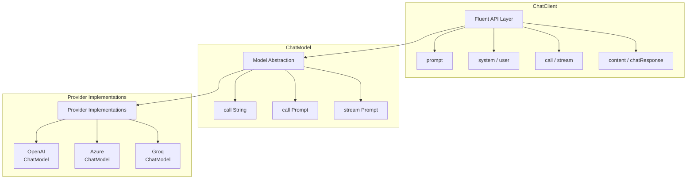

# 4.4 深入瞭解 ChatModel

> **對應章節**: Day14
> **對應範例**: `chapter4-spring-ai-intro`
> **難度**: ⭐⭐⭐⭐☆

---

## 📚 本章概要

ChatModel 是 Spring AI 的核心抽象層，統一了不同 AI 提供商的介面差異。本章將深入探討 ChatModel 的架構設計、參數調校和多模型支援策略。

**學習目標**:
- 理解 ChatModel 與 ChatClient 的完整架構關係
- 掌握 AI 模型參數調校技巧
- 學會建立彈性的多模型支援架構
- 了解不同模型的特性和適用場景
- 實現智能模型路由和容錯機制

---

## 4.4.1 Spring AI 架構全貌

### ChatModel vs ChatClient 關係圖


到目前為止我們做得比直接上 ChatGPT 發問還不如，ChatGPT 起碼還能記住你是誰（不信自己去問），今天我們就來深入了解 Spring AI 1.0 GA 中 ChatClient 和 ChatModel 的完整架構與功能。



### 架構層級說明

**1. ChatClient（高級 API 層）**
- 提供現代化的 Fluent API 介面
- 類似於 Spring 生態系統中的 RestClient、WebClient
- 內建常用功能：系統提示詞、流式輸出、錯誤處理
- 推薦用於大部分應用場景

**2. ChatModel（抽象層）**
- 定義與 AI 模型互動的核心介面
- 提供統一的 API 抽象，隱藏不同提供商的差異
- 支援同步和異步（流式）呼叫
- 適合需要底層控制的場景

**3. Provider Implementations（實現層）**
- 各 AI 服務提供商的具體實現
- 處理特定提供商的 API 協定和認證
- 負責請求轉換和回應解析

---

## 4.4.2 ChatModel 核心介面

`ChatModel` 提供了與 AI 模型互動的底層介面。`ChatModelService` 類別展示了如何直接使用 `ChatModel` 和 `StreamingChatModel` 進行同步和流式呼叫：

```java
// 來自 code-examples/chapter4-spring-ai-intro/src/main/java/com/example/springai/service/ChatModelService.java
// ... (package and imports omitted for brevity)

@Service
@RequiredArgsConstructor
@Slf4j
public class ChatModelService {
    
    private final ChatModel chatModel;
    private final StreamingChatModel streamingChatModel;
    
    /**
     * 簡單字串呼叫
     */
    public String simpleCall(String message) {
        return chatModel.call(message);
    }
    
    /**
     * 使用 Prompt 物件的完整呼叫
     */
    public ChatResponse fullCall(String systemMessage, String userMessage) {
        Prompt prompt = new Prompt(List.of(
            new SystemMessage(systemMessage),
            new UserMessage(userMessage)
        ));
        
        return chatModel.call(prompt);
    }

    // ... 其他 ChatModel 相關方法 ...
}
```

---

## 4.4.3 AI 模型參數配置

您可以透過 `OpenAiChatOptions` 等類別來配置 AI 模型的各種參數，以控制其行為和回應風格。以下是 `AiConfig` 中定義不同聊天選項的範例：

```java
// 來自 code-examples/chapter4-spring-ai-intro/src/main/java/com/example/springai/config/AiConfig.java

@Configuration
public class AiConfig {
    
    /**
     * 預設聊天選項配置
     */
    @Bean
    public OpenAiChatOptions defaultChatOptions() {
        return OpenAiChatOptions.builder()
                .withModel(OpenAiApi.ChatModel.GPT_4_O_MINI.getValue())  // 模型選擇
                .withTemperature(0.7)      // 創意度：0.0-2.0
                .withMaxTokens(1000)       // 最大輸出 token 數
                .withTopP(1.0)            // 核心採樣：0.0-1.0
                .withFrequencyPenalty(0.0) // 頻率懲罰：-2.0-2.0
                .withPresencePenalty(0.0)  // 存在懲罰：-2.0-2.0
                .build();
    }

    /**
     * 創意寫作專用配置
     */
    @Bean("creativeChatOptions")
    public OpenAiChatOptions creativeChatOptions() {
        return OpenAiChatOptions.builder()
                .withModel(OpenAiApi.ChatModel.GPT_4_O.getValue())
                .withTemperature(1.2)      // 高創意度
                .withMaxTokens(2000)       // 較長輸出
                .withTopP(0.9)            // 稍微限制選擇範圍
                .withFrequencyPenalty(0.5) // 避免重複
                .withPresencePenalty(0.3)  // 鼓勵新話題
                .build();
    }

    /**
     * 程式碼生成專用配置
     */
    @Bean("codeChatOptions")
    public OpenAiChatOptions codeChatOptions() {
        return OpenAiChatOptions.builder()
                .withModel(OpenAiApi.ChatModel.GPT_4_O.getValue())
                .withTemperature(0.2)      // 低創意度，更精確
                .withMaxTokens(1500)       // 適中輸出長度
                .withTopP(0.95)           // 較保守的選擇
                .withFrequencyPenalty(0.0) // 不懲罰重複（程式碼可能需要重複結構）
                .withPresencePenalty(0.0)
                .build();
    }
}
```

### 參數詳細說明

| 參數 | 範圍 | 說明 | 使用建議 |
|------|------|------|----------|
| **Temperature** | 0.0-2.0 | 控制回應的隨機性和創意度 | 0.2（精確）、0.7（平衡）、1.2（創意） |
| **Max Tokens** | 1-4096+ | 限制回應的最大長度 | 根據需求設定，注意成本控制 |
| **Top P** | 0.0-1.0 | 核心採樣，控制詞彙選擇範圍 | 0.9-1.0 較常用 |
| **Frequency Penalty** | -2.0-2.0 | 懲罰重複出現的詞彙 | 0.0-0.5 避免過度重複 |
| **Presence Penalty** | -2.0-2.0 | 鼓勵談論新話題 | 0.0-0.3 增加話題多樣性 |

---

## 4.4.4 多模型支援架構

Spring AI 允許您配置和使用多個 AI 模型。在 `AiConfig` 中，您可以定義不同性能和成本效益的模型 Bean，並在應用程式中靈活選擇使用：

```java
// 來自 code-examples/chapter4-spring-ai-intro/src/main/java/com/example/springai/config/AiConfig.java
@Configuration
public class AiConfig {
    
    @Value("${spring.ai.openai.api-key}")
    private String openaiApiKey;
    
    @Value("${spring.ai.groq.api-key:}")
    private String groqApiKey;
    
    /**
     * 高性能模型 - GPT-4o
     */
    @Bean("highPerformanceModel")
    public ChatModel highPerformanceModel() {
        var openAiApi = new OpenAiApi(openaiApiKey);
        var options = OpenAiChatOptions.builder()
            .withModel(OpenAiApi.ChatModel.GPT_4_O.getValue())
            .withTemperature(0.7)
            .withMaxTokens(2000)
            .build();
        return new OpenAiChatModel(openAiApi, options);
    }
    
    /**
     * 經濟型模型 - GPT-4o mini (預設)
     */
    @Bean("economicModel")
    @Primary
    public ChatModel economicModel() {
        var openAiApi = new OpenAiApi(openaiApiKey);
        var options = OpenAiChatOptions.builder()
            .withModel(OpenAiApi.ChatModel.GPT_4_O_MINI.getValue())
            .withTemperature(0.7)
            .withMaxTokens(1000)
            .build();
        return new OpenAiChatModel(openAiApi, options);
    }
    
    /**
     * 高速模型 - Groq
     */
    @Bean("speedModel")
    public ChatModel speedModel() {
        if (groqApiKey == null || groqApiKey.isEmpty()) {
            return economicModel(); // 降級到經濟型模型
        }
        
        var groqApi = new OpenAiApi("https://api.groq.com/openai/v1", groqApiKey);
        var options = OpenAiChatOptions.builder()
            .withModel("llama-3.1-70b-versatile")
            .withTemperature(0.7)
            .withMaxTokens(1000)
            .build();
        return new OpenAiChatModel(groqApi, options);
    }
}
```

### 智能模型路由

您可以實作一個服務來根據不同的業務邏輯（例如任務複雜度、使用者等級）動態選擇合適的 AI 模型。

---

## 📝 本章重點回顧

### Spring AI 架構分層
✅ ChatClient - 高級 Fluent API 層
✅ ChatModel - 核心抽象介面層
✅ Provider Implementations - AI 服務實現層
✅ 三層架構確保靈活性和可維護性

### AI 模型參數調校

| 參數 | 範圍 | 建議值 | 說明 |
|------|------|--------|------|
| **temperature** | 0.0-2.0 | 0.2（精確）<br>0.7（平衡）<br>1.2（創意） | 控制輸出隨機性 |
| **max-tokens** | 1-∞ | 根據需求設定 | 限制輸出長度 |
| **top-p** | 0.0-1.0 | 0.9-1.0 | 核心採樣參數 |
| **frequency-penalty** | -2.0-2.0 | 0.0-0.5 | 避免重複詞彙 |
| **presence-penalty** | -2.0-2.0 | 0.0-0.3 | 鼓勵新話題 |

### 多模型支援策略
```java
// 定義不同性能級別的模型
@Bean("highPerformanceModel")  // GPT-5 - 最強性能
@Bean("economicModel")          // GPT-4o-mini - 經濟實惠
@Bean("speedModel")             // Groq - 高速免費
```

### ChatClient vs ChatModel 選擇

| 場景 | 推薦選擇 | 理由 |
|------|----------|------|
| **一般應用** | ChatClient | Fluent API，易用性高 |
| **流式輸出** | ChatClient | 簡潔的 stream() API |
| **底層控制** | ChatModel | 直接存取 Prompt 物件 |
| **效能關鍵** | ChatModel | 更少的抽象層級 |

### 實作重點
- 使用 `@Primary` 設定預設模型
- 使用 `@Qualifier` 切換特定模型
- 實現智能模型路由降級策略
- 配置不同場景的參數組合

---

## 🚀 下一步

👉 [4.5 前端處理流式輸出](./4.5.md) - 建立完整前後端整合

---

**相關章節**:
- ← 上一章: [4.3 流式輸出](./4.3.md)
- → 下一章: [4.5 前端處理流式輸出](./4.5.md)

**參考資料：**
- [Spring AI ChatModel Documentation](https://docs.spring.io/spring-ai/reference/api/chatmodel.html)
- [OpenAI API Parameters](https://platform.openai.com/docs/api-reference/chat/create)
- [Spring Boot Caching](https://docs.spring.io/spring-boot/docs/current/reference/html/io.html#io.caching)
- [Micrometer Metrics](https://micrometer.io/docs)
