# 4.5 前端該如何處理流式輸出

> **本章重點**：深入探討前端如何優雅地處理 AI 流式輸出，建立完整的前後端整合方案，為使用者提供如同 ChatGPT 般的流暢互動體驗。

## 🎯 學習目標

完成本章學習後，您將能夠：

- 🎯 **掌握 EventSource API**：熟練使用瀏覽器原生的 SSE 接收技術
- 🎯 **實現流式 UI 更新**：建立即時更新的聊天介面
- 🎯 **處理連線管理**：掌握連線建立、維護和錯誤處理
- 🎯 **優化使用者體驗**：實現打字效果、載入狀態等互動細節
- 🎯 **整合現代前端框架**：在 React、Vue 等框架中實現流式功能

---

## 4.5.1 EventSource API 基礎

### 什麼是 Server-Sent Events (SSE)？

Server-Sent Events 是 HTML5 標準的一部分，允許伺服器向瀏覽器推送資料。與 WebSocket 不同，SSE 是單向的（僅伺服器到客戶端），但對於 AI 流式輸出來說已經足夠。

**SSE vs WebSocket vs 輪詢**：

| 特性 | SSE | WebSocket | 輪詢 |
|------|-----|-----------|------|
| **複雜度** | 低 | 中 | 低 |
| **即時性** | 高 | 高 | 低 |
| **資源消耗** | 低 | 中 | 高 |
| **瀏覽器支援** | 廣泛 | 廣泛 | 全部 |
| **自動重連** | 是 | 否 | 否 |
| **適用場景** | 單向推送 | 雙向通訊 | 簡單查詢 |

### EventSource 基本用法

以下是 `frontend-demo/index.html` 中 EventSource 的基本使用範例，展示如何建立連線、監聽訊息和處理錯誤：

```javascript
// 來自 code-examples/chapter4-spring-ai-intro/frontend-demo/index.html
// EventSource 實例
let eventSource = null;

/**
 * 開始流式輸出
 */
function startStreaming() {
    const apiUrl = document.getElementById('apiUrl').value.trim();
    const prompt = document.getElementById('prompt').value.trim();

    if (!prompt) {
        alert('請輸入提示詞');
        return;
    }

    // 清空之前的回應
    document.getElementById('response').textContent = '';

    // 建構完整的 URL（包含查詢參數）
    const fullUrl = `${apiUrl}?prompt=${encodeURIComponent(prompt)}`;
    console.log('連線到:', fullUrl);

    try {
        // 建立 EventSource 連線
        eventSource = new EventSource(fullUrl);

        // 監聽連線開啟事件
        eventSource.onopen = function(event) {
            console.log('✅ EventSource 連線已建立', event);
            // updateStatus('connected');
        };

        // 監聽訊息事件（接收資料）
        eventSource.onmessage = function(event) {
            console.log('📨 收到資料:', event.data);

            // 將接收到的資料附加到回應區域
            const responseDiv = document.getElementById('response');
            responseDiv.textContent += event.data;

            // 自動捲動到底部
            responseDiv.scrollTop = responseDiv.scrollHeight;
        };

        // 監聽錯誤事件
        eventSource.onerror = function(event) {
            console.error('❌ EventSource 錯誤:', event);

            if (eventSource.readyState === EventSource.CLOSED) {
                console.log('🔒 連線已關閉');
                // updateStatus('closed');
                // stopStreaming();
            } else {
                // updateStatus('error');
                alert('連線發生錯誤，請檢查後端服務是否正常運作');
                // stopStreaming();
            }
        };

    } catch (error) {
        console.error('建立 EventSource 失敗:', error);
        alert('建立連線失敗: ' + error.message);
        // stopStreaming();
    }
}

/**
 * 停止流式輸出
 */
function stopStreaming() {
    if (eventSource) {
        eventSource.close();
        eventSource = null;
        console.log('🛑 EventSource 連線已關閉');
    }
}
```

---

## 4.5.2 建立流式聊天介面

### HTML 結構設計

以下是 `frontend-demo/streaming-demo.html` 的核心 HTML 結構，用於建立一個類似 ChatGPT 的聊天介面：

```html
<!-- 來自 code-examples/chapter4-spring-ai-intro/frontend-demo/streaming-demo.html (精簡版) -->
<!DOCTYPE html>
<html lang="zh-TW">
<head>
    <meta charset="UTF-8">
    <meta name="viewport" content="width=device-width, initial-scale=1.0">
    <title>AI 流式聊天介面 - Spring AI</title>
    <style>
        /* ... CSS 樣式 ... */
    </style>
</head>
<body>
    <div class="container">
        <div class="header">
            <div>
                <h1>🤖 AI 智能助手</h1>
                <div class="header-info">Spring AI 流式對話展示</div>
            </div>
            <div class="status-indicator">
                <span class="status-dot" id="statusDot"></span>
                <span id="statusText">未連線</span>
            </div>
        </div>

        <div class="chat-container">
            <div class="messages" id="messages">
                <!-- 歡迎訊息 -->
                <div class="message ai">
                    <div class="message-avatar">AI</div>
                    <div class="message-content">
                        <strong>👋 您好！我是 Spring AI 智能助手</strong><br><br>
                        <!-- ... 歡迎訊息內容 ... -->
                    </div>
                </div>
            </div>

            <div class="input-area">
                <div class="example-prompts">
                    <button class="example-prompt" onclick="setPrompt('什麼是 Spring AI？')">什麼是 Spring AI？</button>
                    <!-- ... 其他範例提示詞 ... -->
                </div>

                <div class="controls">
                    <button class="control-btn" onclick="clearChat()">🗑️ 清除對話</button>
                    <button class="control-btn" id="autoScrollBtn" class="active" onclick="toggleAutoScroll()">📜 自動捲動</button>
                    <button class="control-btn" onclick="exportChat()">💾 匯出對話</button>
                </div>

                <div class="input-wrapper">
                    <textarea
                        id="messageInput"
                        placeholder="輸入您的問題... (Ctrl+Enter 發送)"
                        rows="1"
                    ></textarea>
                    <button class="send-btn" id="sendBtn" onclick="sendMessage()">
                        ➤
                    </button>
                </div>
            </div>
        </div>

        <div class="status-bar">
            <span id="messageCount">訊息數：0</span>
            <span id="apiEndpoint">API: http://localhost:8080</span>
        </div>
    </div>

    <script>
        // ... JavaScript 邏輯 ...
    </script>
</body>
</html>
```

### CSS 樣式設計

`frontend-demo/streaming-demo.html` 內嵌了完整的 CSS 樣式，用於美化聊天介面，實現類似 ChatGPT 的視覺效果。

---

## 4.5.3 JavaScript 流式聊天實現

### 流式輸出流程示意圖

以下是前端處理 AI 流式輸出的整體流程示意圖：

```mermaid
graph TD
    A[使用者發送請求] --> B(前端應用)
    B --> C{建立 EventSource 連線}
    C --> D[後端服務]
    D -- 流式回應 SSE --> E[前端 EventSource 監聽器]
    E -- 接收資料塊 --> F[更新 UI]
    F --> G[顯示 AI 回應]
    G -- 自動捲動 --> H[優化使用者體驗]
    E -- 連線關閉/錯誤 --> I[處理連線狀態]
    I --> J[顯示錯誤或完成訊息]
```



---

以下是 `frontend-demo/streaming-demo.html` 中實現流式聊天功能的 JavaScript 核心邏輯，包括訊息發送、EventSource 連線管理、UI 更新等：

```javascript
// 來自 code-examples/chapter4-spring-ai-intro/frontend-demo/streaming-demo.html
// ... (全域變數和輔助函數省略)

/**
 * 發送訊息
 */
function sendMessage() {
    const input = document.getElementById('messageInput');
    const message = input.value.trim();

    if (!message) {
        return;
    }

    // 顯示使用者訊息
    addUserMessage(message);

    // 清空輸入框
    input.value = '';
    input.style.height = 'auto';

    // 開始 AI 回應
    startAiResponse(message);
}

/**
 * 開始 AI 回應（流式輸出）
 */
function startAiResponse(prompt) {
    const messagesDiv = document.getElementById('messages');

    // 建立 AI 訊息容器
    const messageDiv = document.createElement('div');
    messageDiv.className = 'message ai';
    messageDiv.innerHTML = `
        <div class="message-avatar">AI</div>
        <div class="message-content"></div>
    `;

    messagesDiv.appendChild(messageDiv);
    currentAiMessage = messageDiv.querySelector('.message-content');

    // 顯示輸入中指示器
    showTypingIndicator();

    // 建立 EventSource 連線
    const url = `${API_BASE_URL}?prompt=${encodeURIComponent(prompt)}`;
    console.log('開始連線:', url);

    try {
        eventSource = new EventSource(url);

        // 連線開啟
        eventSource.onopen = function(event) {
            console.log('✅ 連線已建立');
            updateConnectionStatus(true);
            hideTypingIndicator();
        };

        // 接收訊息
        eventSource.onmessage = function(event) {
            const data = event.data;
            console.log('📨 收到資料:', data);

            if (currentAiMessage) {
                currentAiMessage.textContent += data;
                if (autoScroll) {
                    scrollToBottom();
                }
            }
        };

        // 連線錯誤
        eventSource.onerror = function(event) {
            console.error('❌ 連線錯誤:', event);
            hideTypingIndicator();
            updateConnectionStatus(false);
            closeConnection();

            if (currentAiMessage && !currentAiMessage.textContent) {
                currentAiMessage.innerHTML = '<span style="color: red;">⚠️ 連線失敗，請確認後端服務是否正常運作</span>';
            }

            messageCount++;
            updateMessageCount();
            currentAiMessage = null;
        };

        // 自動關閉連線（收到完整回應後）
        setTimeout(() => {
            if (eventSource && eventSource.readyState === EventSource.OPEN) {
                closeConnection();
                messageCount++;
                updateMessageCount();
                currentAiMessage = null;
            }
        }, 30000); // 30秒超時

    } catch (error) {
        console.error('建立連線失敗:', error);
        alert('建立連線失敗: ' + error.message);
        hideTypingIndicator();
    }
}

// ... (其他輔助函數和事件監聽省略)
```


## 📝 本章重點回顧

1. **EventSource API 掌握**：學會了使用瀏覽器原生的 SSE 技術接收流式資料
2. **流式 UI 實現**：建立了完整的聊天介面，包含即時更新和互動效果
3. **連線管理**：掌握了連線建立、維護、錯誤處理和自動重連機制
4. **使用者體驗優化**：實現了打字效果、載入狀態、歷史管理等細節
5. **現代框架整合**：學會了在 React 等框架中整合流式功能

### 技術要點總結

| 技術點 | 重要性 | 實現難度 | 使用場景 |
|--------|--------|----------|----------|
| **EventSource API** | ⭐⭐⭐ | 低 | 所有流式應用 |
| **連線管理** | ⭐⭐⭐ | 中 | 生產環境必需 |
| **錯誤處理** | ⭐⭐⭐ | 中 | 穩定性保證 |
| **UI 即時更新** | ⭐⭐ | 低 | 使用者體驗 |
| **記憶體優化** | ⭐⭐ | 中 | 長時間使用 |
| **自動重連** | ⭐⭐ | 高 | 網路不穩定環境 |

### 最佳實踐建議

1. **始終處理錯誤**：EventSource 連線可能因各種原因中斷
2. **限制訊息數量**：避免長時間使用造成的記憶體洩漏
3. **提供使用者控制**：允許使用者停止流式接收
4. **優雅降級**：在不支援 SSE 的環境中提供替代方案
5. **效能監控**：監控連線狀態和資源使用情況
6. **安全性考量**：使用 createTextNode 避免 XSS 攻擊
7. **重連優化**：加入隨機抖動避免雷擊效應
8. **資源清理**：確保組件卸載時正確關閉連線

### 下一步學習方向

完成第四章的學習後，我們已經掌握了 Spring AI 的基礎知識和流式輸出技術。在第五章中，我們將進入更進階的主題，學習如何建立個性化的 ChatBot，包括提示詞範本、多模態處理等高級功能。

---

**參考資料：**
- [Server-Sent Events - MDN](https://developer.mozilla.org/en-US/docs/Web/API/Server-sent_events)
- [EventSource API - MDN](https://developer.mozilla.org/en-US/docs/Web/API/EventSource)
- [React Hooks Documentation](https://reactjs.org/docs/hooks-intro.html)
- [Web Performance Best Practices](https://web.dev/performance/)

```