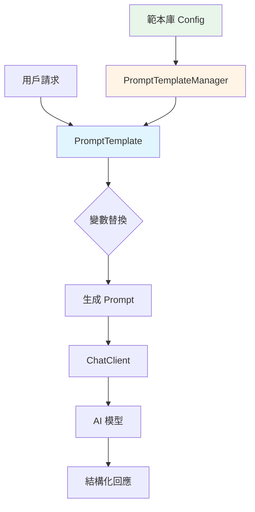
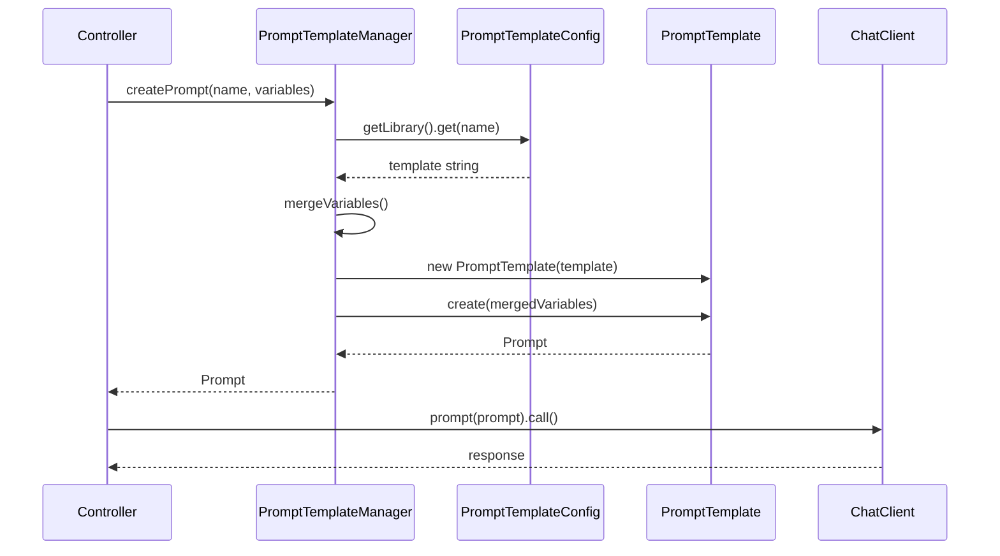

# 5.1 懶得打字問 AI？用提示詞範本吧

> **對應章節**: Day11
> **對應範例**: `chapter5-spring-ai-advanced`
> **難度**: ⭐⭐☆☆☆

---

## 📚 本章概要

提示詞範本（Prompt Template）是 Spring AI 提供的標準化 AI 互動方式。透過參數化的範本設計，我們可以建立可重複使用、品質一致的提示詞系統，避免「Garbage in, Garbage out」的問題。

**學習目標**：
- 理解提示詞範本的核心價值
- 掌握 PromptTemplate 類別的使用方式
- 學會與 ChatClient API 整合
- 建立企業級範本庫管理系統

---

## 5.1.1 為什麼需要提示詞範本？

### Garbage in, Garbage out


**Garbage in, Garbage out** 也適用在 AI 領域。有些人就是不知如何問 AI，得到的解答自然也不具參考價值，這時提示詞範本就派上用場了。

### 提示詞範本的核心價值

**1. 標準化互動模式**

```
❌ 不良提示詞：
"告訴我關於 Spring Boot"

✅ 優質提示詞範本：
"作為一個資深的 Java 開發專家，請詳細說明 {topic} 的核心概念、
主要特性、使用場景，並提供一個實際的程式碼範例。
請用繁體中文回答，並確保內容適合 {experience_level} 開發者。"
```

**對比說明**：
- **不良提示詞**過於簡略，AI 無法理解您需要什麼深度、風格的回答
- **優質範本**明確定義了角色、輸出格式、語言風格和目標受眾
- 透過 `{變數}` 語法，同一個範本可以重複使用於不同主題

**2. 提升回應品質**
- 🎯 **明確的角色設定**：讓 AI 扮演特定專業角色
- 📋 **結構化要求**：指定回應的格式和內容結構
- 🌍 **語言和風格**：統一回應的語言和表達風格
- 🎚️ **難度控制**：根據使用者程度調整內容深度

**3. 提高開發效率**
- 🔄 **可重複使用**：一次設計，多次使用
- 🛠️ **參數化設計**：透過變數動態調整內容
- 📚 **範本庫管理**：建立企業級提示詞資產
- 🚀 **快速部署**：減少重複的提示詞設計工作

### 範本系統架構



**架構說明**：
1. **PromptTemplate**：核心範本類別，負責變數替換
2. **PromptTemplateManager**：範本管理服務，統一管理所有範本
3. **範本庫 Config**：集中配置所有預定義範本
4. **ChatClient**：執行 AI 對話的客戶端

---

## 5.1.2 PromptTemplate 基礎使用

### 基本範本語法

```java
// 對應範例: chapter5-spring-ai-advanced/.../PromptTemplateService.java:71

// 定義範本字串，使用 {變數名} 作為佔位符
String template = """
    作為一個資深的技術專家，請詳細說明 {topic} 的相關知識。

    請包含以下內容：
    1. 核心概念和定義
    2. 主要特性和優勢
    3. 實際應用場景

    目標受眾：{level} 開發者
    回答語言：繁體中文
    """;

// 建立 PromptTemplate 實例
PromptTemplate promptTemplate = new PromptTemplate(template);

// 提供變數值
Map<String, Object> variables = Map.of(
    "topic", "Spring Boot",
    "level", "中級"
);

// 生成最終的 Prompt
Prompt prompt = promptTemplate.create(variables);
```

**實現細節說明**：
- **佔位符語法**：使用 `{變數名}` 定義需要動態替換的部分
- **變數映射**：使用 `Map<String, Object>` 提供實際的變數值
- **類型安全**：變數值會自動轉換為字串進行替換
- **範本複用**：同一個 `PromptTemplate` 實例可以多次使用，只需傳入不同的變數

### 與 ChatClient 整合

```java
// 對應範例: chapter5-spring-ai-advanced/.../controller/TemplateController.java:128

@GetMapping("/explain")
public String explainTopic(
        @RequestParam String topic,
        @RequestParam(defaultValue = "中級") String level) {

    // 使用範本服務建立 Prompt
    Prompt prompt = promptTemplateService.createBasicPrompt(topic, level);

    // 使用 ChatClient 執行對話
    return chatClient.prompt(prompt)
            .call()
            .content();
}

// 簡化的範本使用方式 - ChatClient 內建支援
@GetMapping("/framework")
public String explainFramework(@RequestParam String framework) {
    return chatClient.prompt("請問 {framework} 目前有哪些版本？")
            .user(Map.of("framework", framework))
            .call()
            .content();
}
```

**整合方式對比**：
1. **標準方式**：先建立 `PromptTemplate`，再傳給 `ChatClient`
   - 適合：複雜範本、需要驗證、範本重複使用的場景
2. **簡化方式**：直接在 `ChatClient.prompt()` 中使用變數
   - 適合：簡單的一次性範本使用

> 💡 **完整範例**：詳見 `code-examples/chapter5-spring-ai-advanced/src/main/java/com/example/service/PromptTemplateService.java`

---

## 5.1.3 進階範本設計

### 多參數範本

根據不同場景創建特定用途的範本：

```java
// 對應範例: chapter5-spring-ai-advanced/.../AdvancedPromptService.java:169

/**
 * 程式碼生成範本
 */
public Prompt createCodeGenerationPrompt(String language, String functionality) {
    String template = """
        你是 {language} 開發專家。

        請生成 {functionality} 的程式碼：
        1. 完整程式碼實現
        2. 簡單使用說明
        """;

    PromptTemplate promptTemplate = new PromptTemplate(template);
    return promptTemplate.create(Map.of(
        "language", language,
        "functionality", functionality
    ));
}

/**
 * 錯誤診斷範本
 */
public Prompt createDiagnosisPrompt(String technology, String errorMessage) {
    String template = """
        你是 {technology} 專家，請分析錯誤：

        錯誤訊息：{errorMessage}

        請提供：
        1. 錯誤原因
        2. 解決方法
        """;

    PromptTemplate promptTemplate = new PromptTemplate(template);
    return promptTemplate.create(Map.of(
        "technology", technology,
        "errorMessage", errorMessage
    ));
}
```

**範本設計原則**：
- **單一職責**：每個範本專注於一個特定任務
- **參數化**：將可變部分抽取為參數
- **結構化輸出**：明確指定期望的輸出格式
- **上下文完整**：提供足夠的背景資訊讓 AI 理解任務

### 條件式範本

根據不同條件動態選擇範本：

```java
// 對應範例: chapter5-spring-ai-advanced/.../ConditionalPromptService.java:214

public Prompt createUserSpecificPrompt(String topic, String level) {
    String template = switch (level) {
        case "初級" -> """
            你是耐心的導師。請用簡單語言說明 {topic}：
            1. 基本概念
            2. 為什麼重要
            3. 學習建議
            """;
        case "中級" -> """
            你是技術專家。請說明 {topic}：
            1. 核心原理
            2. 應用場景
            3. 程式碼範例
            """;
        default -> """
            你是資深架構師。請深度分析 {topic}：
            1. 實現原理
            2. 架構設計
            3. 最佳實踐
            """;
    };

    return new PromptTemplate(template).create(Map.of("topic", topic));
}
```

**條件範本的應用場景**：
- **使用者分層**：根據使用者程度提供不同深度的回答
- **多語言支援**：根據語言偏好選擇不同範本
- **業務場景**：根據不同業務流程使用專屬範本

---

## 5.1.4 範本庫管理系統

### 範本配置類

```java
// 對應範例: chapter5-spring-ai-advanced/.../PromptTemplateConfig.java:258

@Data
@Component
@ConfigurationProperties(prefix = "app.prompt.templates")
public class PromptTemplateConfig {

    /**
     * 預定義範本庫
     */
    private Map<String, String> library = Map.of(
        "explain", """
            作為一個 {role} 專家，請詳細說明 {topic}。

            請包含：
            1. 核心概念
            2. 主要特性
            3. 使用場景
            4. 實際範例

            目標受眾：{audience}
            回答語言：{language}
            """,

        "code-review", """
            你是一個資深的 {language} 程式碼審查專家。

            請審查以下程式碼：
            ```{language}
            {code}
            ```

            請提供：
            1. 程式碼品質評估
            2. 潛在問題識別
            3. 改進建議
            4. 最佳實踐建議
            """
    );

    /**
     * 預設參數值
     */
    private Map<String, String> defaults = Map.of(
        "language", "繁體中文",
        "role", "技術專家",
        "audience", "中級開發者"
    );
}
```

**配置設計說明**：
- **集中管理**：所有範本在一個配置類中統一管理
- **預設值**：提供常用參數的預設值，簡化使用
- **外部化配置**：可以透過 `application.yml` 覆寫範本
- **類型安全**：使用 `@ConfigurationProperties` 提供類型檢查

### 範本管理服務

```java
// 對應範例: chapter5-spring-ai-advanced/.../PromptTemplateManager.java:350

@Service
@RequiredArgsConstructor
@Slf4j
public class PromptTemplateManager {

    private final PromptTemplateConfig config;

    /**
     * 根據範本名稱建立 Prompt
     */
    public Prompt createPrompt(String templateName, Map<String, Object> variables) {
        String template = config.getLibrary().get(templateName);
        if (template == null) {
            throw new IllegalArgumentException("範本不存在: " + templateName);
        }

        // 合併預設值和使用者提供的變數
        Map<String, Object> mergedVariables = new HashMap<>(config.getDefaults());
        mergedVariables.putAll(variables);

        log.debug("使用範本 '{}' 建立 Prompt，變數：{}", templateName, mergedVariables);

        PromptTemplate promptTemplate = new PromptTemplate(template);
        return promptTemplate.create(mergedVariables);
    }

    /**
     * 動態註冊新範本
     */
    public void registerTemplate(String name, String template) {
        config.getLibrary().put(name, template);
        log.info("註冊新範本：{}", name);
    }

    /**
     * 獲取所有可用範本名稱
     */
    public Set<String> getAvailableTemplates() {
        return config.getLibrary().keySet();
    }
}
```

**管理服務的核心功能**：
1. **範本查詢**：根據名稱快速獲取範本
2. **變數合併**：自動合併預設值和使用者變數
3. **動態註冊**：支援執行期動態新增範本
4. **範本驗證**：檢查範本語法是否正確

### 範本管理流程



---

## 5.1.5 實際應用範例

### 智能客服範本系統

```java
// 對應範例: chapter5-spring-ai-advanced/.../CustomerServiceController.java:435

@PostMapping("/technical-support")
public String technicalSupport(
        @RequestParam String product,
        @RequestParam String issue,
        @RequestParam(defaultValue = "medium") String severity) {

    // 註冊技術支援範本
    String supportTemplate = """
        你是 {product} 的資深技術支援專家。

        **客戶問題**：{issue}
        **嚴重程度**：{severity}

        請提供專業的技術支援回應：

        ## 🔍 問題理解
        重述並確認問題的核心

        ## 🛠️ 解決方案
        提供具體的解決步驟

        ## 📋 後續追蹤
        建議的後續行動

        請保持專業、友善的語調，用繁體中文回答。
        """;

    templateManager.registerTemplate("technical-support", supportTemplate);

    // 建立並執行 Prompt
    Prompt prompt = templateManager.createPrompt("technical-support", Map.of(
        "product", product,
        "issue", issue,
        "severity", severity
    ));

    return chatClient.prompt(prompt).call().content();
}
```

**應用場景說明**：
- **動態範本註冊**：根據業務需求動態建立範本
- **結構化輸出**：使用 Markdown 格式化輸出
- **參數化問題處理**：將客戶問題標準化處理

### 教育訓練範本系統

```java
// 對應範例: chapter5-spring-ai-advanced/.../EducationController.java:546

@PostMapping("/generate-lesson")
public String generateLesson(
        @RequestParam String subject,
        @RequestParam String level,
        @RequestParam int duration) {

    String lessonTemplate = """
        你是一個經驗豐富的 {subject} 教師。

        請為 {level} 學生設計一堂 {duration} 分鐘的課程：

        ## 📚 課程目標
        明確的學習目標（3-5個）

        ## 🕐 課程大綱
        詳細的時間分配和內容安排

        ## 💡 教學活動
        互動式的教學活動設計

        ## 📝 評量方式
        檢驗學習成效的方法

        請確保內容適合目標學生程度，並具有實用性。
        """;

    templateManager.registerTemplate("lesson-plan", lessonTemplate);

    Prompt prompt = templateManager.createPrompt("lesson-plan", Map.of(
        "subject", subject,
        "level", level,
        "duration", String.valueOf(duration)
    ));

    return chatClient.prompt(prompt).call().content();
}
```

---

## 5.1.6 範本設計最佳實踐

### 設計原則

**1. 清晰的角色定義**
```java
// ✅ 好的範本
String template = """
    你是一個擁有10年經驗的 Spring Boot 架構師，
    專精於微服務架構設計和效能優化。

    請針對 {question} 提供專業建議...
    """;

// ❌ 不好的範本
String template = "請回答 {question}";
```

**2. 結構化輸出格式**
```java
String template = """
    請按照以下格式回答：

    ## 🎯 核心概念
    [簡潔的概念說明]

    ## 🔧 實作方法
    [具體的實作步驟]

    ## 💡 最佳實踐
    [相關的最佳實踐建議]

    ## ⚠️ 注意事項
    [重要的注意事項]
    """;
```

**3. 參數驗證和預設值**
```java
// 對應範例: chapter5-spring-ai-advanced/.../ValidatedPromptService.java:633

public Prompt createValidatedPrompt(String template, Map<String, Object> variables) {
    // 驗證必要參數
    validateRequiredParameters(template, variables);

    // 設定預設值
    Map<String, Object> mergedVariables = applyDefaults(variables);

    // 清理和格式化參數
    Map<String, Object> cleanedVariables = cleanParameters(mergedVariables);

    PromptTemplate promptTemplate = new PromptTemplate(template);
    return promptTemplate.create(cleanedVariables);
}

private Map<String, Object> applyDefaults(Map<String, Object> variables) {
    Map<String, Object> result = new HashMap<>(variables);
    result.putIfAbsent("language", "繁體中文");
    result.putIfAbsent("style", "專業且友善");
    return result;
}
```

### 效能優化策略

```java
// 對應範例: chapter5-spring-ai-advanced/.../OptimizedPromptService.java:701

@Service
public class OptimizedPromptService {

    // 快取編譯後的範本
    private final Map<String, PromptTemplate> templateCache = new ConcurrentHashMap<>();

    /**
     * 快取範本以提升效能
     */
    public Prompt createCachedPrompt(
            String templateKey,
            String templateContent,
            Map<String, Object> variables) {

        PromptTemplate template = templateCache.computeIfAbsent(templateKey, key -> {
            log.debug("編譯並快取範本：{}", key);
            return new PromptTemplate(templateContent);
        });

        return template.create(variables);
    }

    /**
     * 批次處理多個範本
     */
    public List<Prompt> createBatchPrompts(
            String templateContent,
            List<Map<String, Object>> variablesList) {

        PromptTemplate template = new PromptTemplate(templateContent);

        return variablesList.parallelStream()
            .map(template::create)
            .collect(Collectors.toList());
    }
}
```

**效能優化技巧**：
1. **範本快取**：編譯後的範本可以重複使用
2. **並行處理**：使用 `parallelStream()` 批次處理
3. **變數預處理**：在送入範本前先驗證和清理變數
4. **按需載入**：只載入使用到的範本

---

## 📝 本章重點回顧

1. **提示詞範本的價值**：理解了「Garbage in, Garbage out」原則和範本的重要性
2. **PromptTemplate 使用**：掌握了基本和進階的範本建立方法
3. **ChatClient 整合**：學會了將範本與現代化的 ChatClient API 結合
4. **範本庫管理**：建立了企業級的範本管理系統
5. **最佳實踐**：掌握了範本設計、驗證和優化的最佳實踐

### 關鍵技術要點

| 技術點 | 重要性 | 實現難度 | 使用場景 |
|--------|--------|----------|----------|
| **基礎範本** | ⭐⭐⭐ | 低 | 所有 AI 應用 |
| **參數化設計** | ⭐⭐⭐ | 中 | 動態內容生成 |
| **範本庫管理** | ⭐⭐ | 中 | 企業級應用 |
| **條件式範本** | ⭐⭐ | 高 | 複雜業務邏輯 |
| **效能優化** | ⭐ | 中 | 高併發場景 |

### 實務建議

**何時使用提示詞範本**：
- ✅ 需要重複執行相同類型的 AI 任務
- ✅ 需要確保 AI 回應的一致性和品質
- ✅ 有多個開發人員使用相同的 AI 功能
- ✅ 需要根據不同條件動態調整提示詞

**何時不需要範本**：
- ❌ 簡單的一次性問答
- ❌ 探索性的 AI 實驗
- ❌ 使用者自由輸入的場景

### 下一步學習方向

在下一章中，我們將學習如何處理多模態資料，讓 AI 不僅能理解文字，還能處理圖片、音訊等多種媒體格式，進一步提升 ChatBot 的智能化程度。

---

**參考資料：**
- [Spring AI Prompt Template Documentation](https://docs.spring.io/spring-ai/reference/api/prompt.html)
- [ChatClient API Reference](https://docs.spring.io/spring-ai/reference/api/chatclient.html)
- [Prompt Engineering Best Practices](https://platform.openai.com/docs/guides/prompt-engineering)
- 完整範例程式碼：`code-examples/chapter5-spring-ai-advanced`
