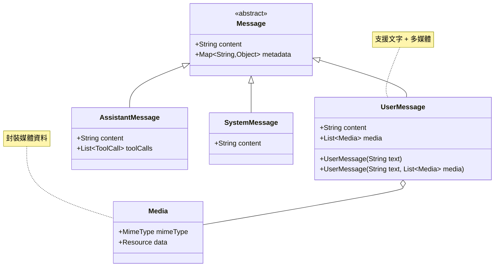
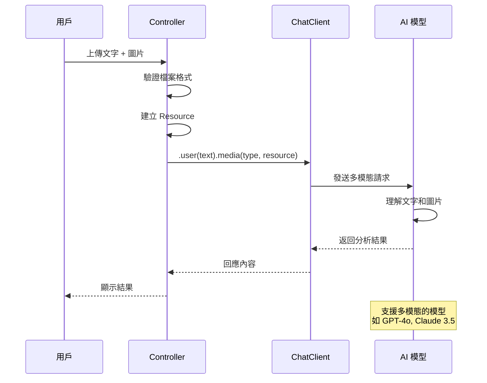
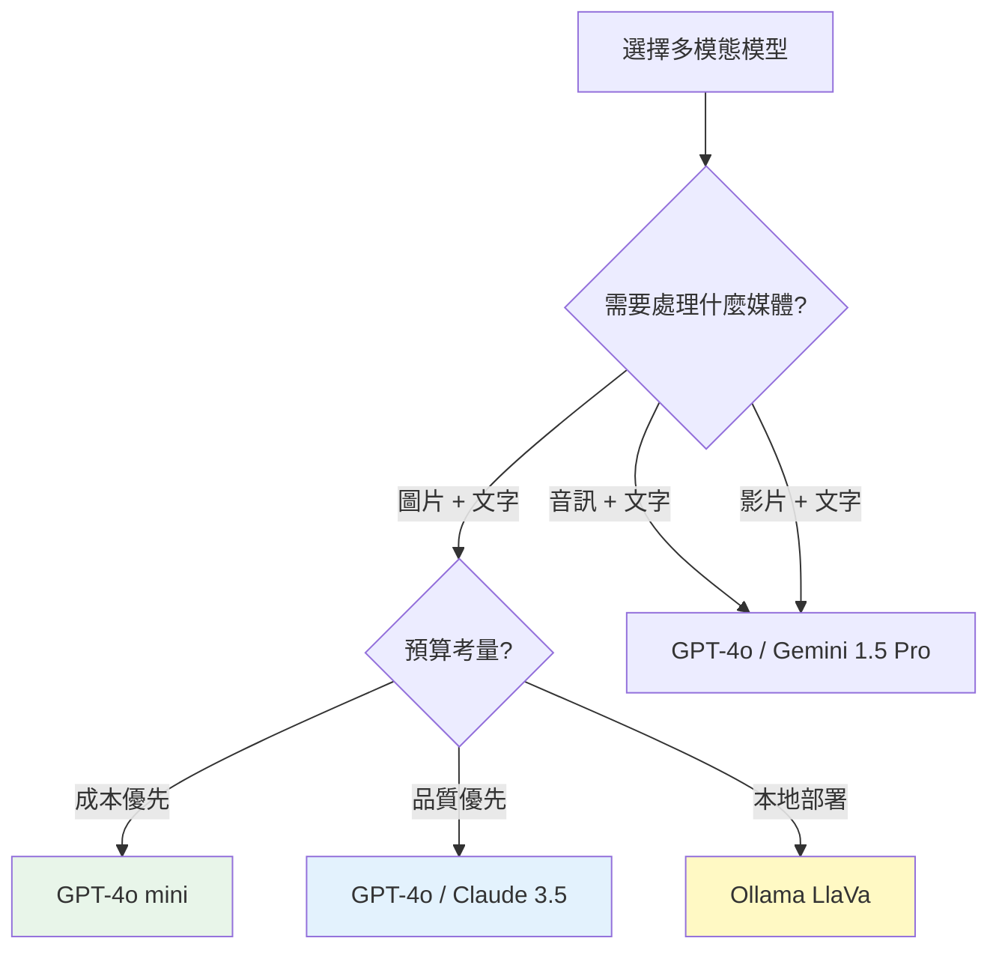

# 5.2 如何跟 ChatGPT 一樣處理多模態資料

> **對應章節**: Day12
> **對應範例**: `chapter5-spring-ai-advanced`
> **難度**: ⭐⭐⭐☆☆

---

## 📚 本章概要

多模態（Multimodality）是指 AI 系統能夠同時處理多種類型的資料輸入，如文字、圖片、音訊、影片等。Spring AI 透過統一的 API 設計，讓開發者能夠輕鬆建立如同 ChatGPT 般強大的多模態應用。

**學習目標**：
- 理解多模態 AI 的核心概念和價值
- 掌握 Spring AI 的多模態架構設計
- 學會選擇和使用支援多模態的 AI 模型
- 實現圖片、音訊等多媒體檔案的分析功能
- 建立企業級的多模態處理系統

---

## 5.2.1 什麼是多模態 AI？

### 多模態就是同時提供兩種以上資料源


**多模態（Multimodality）** 是指 AI 系統能夠同時處理和理解多種不同類型的資料輸入，如文字、圖片、音訊、影片等。這種能力讓 AI 更接近人類的感知方式，能夠綜合多種感官資訊來理解和回應。

### Spring AI 中的多模態架構

還記得 Message 這張 UML 圖片嗎？在 UserMessage 中其實是可以包含多媒體檔案的：



**架構說明**：
- **UserMessage** 可以包含文字內容和多個 Media 物件
- **Media** 封裝了媒體類型（MimeType）和資料（Resource）
- Spring AI 自動處理不同媒體格式的序列化和傳輸

**重要說明**：雖然 UserMessage 類別支援直接傳入 Media 物件，但在實際開發中，**建議使用 ChatClient 的 fluent API**，因為它提供了更好的開發體驗和錯誤處理。

### 多模態的核心價值

**1. 更豐富的互動體驗**
- 📸 **視覺理解**：分析圖片內容、識別物體、理解場景
- 🎵 **聽覺處理**：語音轉文字、音樂分析、聲音識別
- 🎬 **影片分析**：動作識別、場景理解、內容摘要
- 📄 **文件處理**：OCR 文字識別、表格分析、版面理解

**2. 更準確的理解能力**
- 🔍 **上下文增強**：結合多種資訊源提供更準確的分析
- 🧠 **語義理解**：透過視覺和文字的結合提升理解深度
- 🎯 **精確回應**：基於多模態資訊提供更精確的答案

**3. 更廣泛的應用場景**
- 🏥 **醫療診斷**：結合影像和病歷資料進行輔助診斷
- 🛒 **電商應用**：商品圖片分析和推薦
- 📚 **教育培訓**：多媒體教材的智能分析和問答
- 🏭 **工業檢測**：設備圖片分析和故障診斷

### 多模態處理流程



---

## 5.2.2 支援多模態的 AI 模型

### 主流模型能力對比

目前有支援多模態的模型如下，其他模型送出多媒體檔案時可是會出現錯誤的：

| 模型提供商 | 模型名稱 | 圖像 | 音頻 | 視頻 | 文件 | 成本效益 | 推薦場景 |
|-----------|---------|------|------|------|------|----------|----------|
| **OpenAI** | GPT-4o | ✅ | ✅ | ✅ | ✅ | 高 | 全方位多模態應用 |
| **OpenAI** | GPT-4o mini | ✅ | ❌ | ❌ | ✅ | 極高 | 圖片分析、文件處理 |
| **OpenAI** | GPT-4 Vision | ✅ | ❌ | ❌ | ✅ | 中 | 圖片分析專用 |
| **Anthropic** | Claude 3.5 Sonnet | ✅ | ❌ | ❌ | ✅ | 高 | 圖片+文字分析 |
| **Anthropic** | Claude 3 Opus | ✅ | ❌ | ❌ | ✅ | 中 | 複雜圖片理解 |
| **Google** | Gemini 1.5 Pro | ✅ | ✅ | ✅ | ✅ | 中 | 多媒體內容分析 |
| **Google** | Gemini Pro Vision | ✅ | ❌ | ❌ | ✅ | 高 | 圖片識別 |
| **Ollama** | LlaVa | ✅ | ❌ | ❌ | ❌ | 極高(本地) | 本地圖片分析 |
| **Ollama** | Bakllava | ✅ | ❌ | ❌ | ❌ | 極高(本地) | 本地多模態 |

### 輸入輸出格式支援表

| Input | Output | Examples | 適用場景 |
|-------|--------|----------|----------|
| **Language/Code/Images** | Language/Code | GPT-4o, Gemini 1.5 Pro | 多模態問答、程式碼分析 |
| **Language/Code** | Language/Code | GPT-3.5, Claude 3 Haiku | 純文字對話 |
| **Language** | Image | DALL-E 3, Midjourney | 文字生成圖片 |
| **Language/Image** | Image | Stable Diffusion | 圖片編輯、風格轉換 |
| **Language** | Audio | OpenAI TTS, ElevenLabs | 文字轉語音 |
| **Audio** | Language | OpenAI Whisper | 語音轉文字 |
| **Text** | Numbers | Embedding Models | 向量化、相似度計算 |

### 模型選擇建議

```java
// 對應範例: chapter5-spring-ai-advanced/.../config/MultimodalModelConfig.java

@Configuration
public class MultimodalModelConfig {

    @Value("${spring.ai.openai.api-key}")
    private String openaiApiKey;

    /**
     * 根據使用場景選擇合適的模型
     */
    @Bean
    @Primary
    public ChatModel primaryMultimodalModel() {
        // GPT-4o mini：性價比最高的圖片分析模型
        return OpenAiChatModel.builder()
            .apiKey(openaiApiKey)
            .modelName("gpt-4o-mini")
            .temperature(0.3)  // 較低溫度確保分析準確性
            .maxTokens(1500)
            .build();
    }

    /**
     * 高精度圖片分析模型
     */
    @Bean("highAccuracyModel")
    public ChatModel highAccuracyModel() {
        // GPT-4o：最強多模態能力
        return OpenAiChatModel.builder()
            .apiKey(openaiApiKey)
            .modelName("gpt-4o")
            .temperature(0.2)
            .maxTokens(2000)
            .build();
    }

    /**
     * 本地多模態模型（節省成本）
     */
    @Bean("localModel")
    @ConditionalOnProperty(name = "app.ai.local.enabled", havingValue = "true")
    public ChatModel localMultimodalModel() {
        // Ollama LlaVa：本地免費方案
        return OllamaChatModel.builder()
            .baseUrl("http://localhost:11434")
            .model("llava")
            .build();
    }
}
```

**模型選擇決策樹**：



---

## 5.2.3 圖片分析功能實現

### 基礎圖片上傳和分析

```java
// 對應範例: chapter5-spring-ai-advanced/.../MultimodalController.java:175

@RestController
@RequestMapping("/api/multimodal")
@RequiredArgsConstructor
@Slf4j
public class MultimodalController {

    private final ChatClient chatClient;

    /**
     * 基礎圖片分析
     */
    @PostMapping(value = "/image-analysis", consumes = MediaType.MULTIPART_FORM_DATA_VALUE)
    public String analyzeImage(
            @RequestParam("file") MultipartFile file,
            @RequestParam("message") String message) {

        try {
            // 1. 驗證檔案類型
            if (!isValidImageFile(file)) {
                return "❌ 不支援的圖片格式。支援：JPEG, PNG, GIF, WebP";
            }

            // 2. 建立 Resource 和 MimeType
            Resource imageResource = file.getResource();
            MimeType mimeType = MimeTypeUtils.parseMimeType(file.getContentType());

            log.info("分析圖片：{}，大小：{} bytes",
                    file.getOriginalFilename(), file.getSize());

            // 3. 使用 ChatClient 進行多模態分析
            String response = chatClient.prompt()
                    .user(u -> u.text(message)
                            .media(mimeType, imageResource))
                    .call()
                    .content();

            return response;

        } catch (Exception e) {
            log.error("圖片分析失敗", e);
            return "❌ AI 分析失敗：" + e.getMessage();
        }
    }

    /**
     * 驗證圖片檔案格式
     */
    private boolean isValidImageFile(MultipartFile file) {
        String contentType = file.getContentType();
        return contentType != null && (
            contentType.equals("image/jpeg") ||
            contentType.equals("image/png") ||
            contentType.equals("image/gif") ||
            contentType.equals("image/webp")
        );
    }
}
```

**實現要點**：
1. **檔案驗證**：檢查檔案類型和大小，避免處理無效檔案
2. **Resource 建立**：使用 Spring 的 Resource 抽象處理檔案
3. **MimeType 解析**：正確設定媒體類型，讓 AI 識別檔案格式
4. **錯誤處理**：提供清晰的錯誤訊息和日誌記錄

### 進階圖片分析功能

```java
// 對應範例: chapter5-spring-ai-advanced/.../MultimodalController.java:220

/**
 * 批次圖片分析
 */
@PostMapping(value = "/batch-analysis", consumes = MediaType.MULTIPART_FORM_DATA_VALUE)
public List<ImageAnalysisResult> batchAnalyzeImages(
        @RequestParam("files") List<MultipartFile> files,
        @RequestParam("analysisType") String analysisType) {

    return files.parallelStream()
            .map(file -> {
                try {
                    Resource imageResource = file.getResource();
                    MimeType mimeType = MimeTypeUtils.parseMimeType(
                            file.getContentType());

                    String prompt = buildAnalysisPrompt(analysisType);

                    String result = chatClient.prompt()
                            .user(u -> u.text(prompt)
                                    .media(mimeType, imageResource))
                            .call()
                            .content();

                    return new ImageAnalysisResult(
                            file.getOriginalFilename(),
                            true,
                            result
                    );

                } catch (Exception e) {
                    log.error("批次分析失敗：{}", file.getOriginalFilename(), e);
                    return new ImageAnalysisResult(
                            file.getOriginalFilename(),
                            false,
                            "分析失敗：" + e.getMessage()
                    );
                }
            })
            .collect(Collectors.toList());
}

/**
 * 根據分析類型建立提示詞
 */
private String buildAnalysisPrompt(String analysisType) {
    return switch (analysisType.toLowerCase()) {
        case "object-detection" ->
            "請識別圖片中的所有物體，並列出它們的位置和類型。";
        case "scene-understanding" ->
            "請描述圖片的場景，包括環境、氛圍和主要元素。";
        case "text-extraction" ->
            "請提取圖片中的所有文字內容，保持原有格式。";
        case "quality-assessment" ->
            "請評估圖片的品質，包括清晰度、構圖和色彩。";
        default ->
            "請詳細分析這張圖片的內容。";
    };
}
```

**批次處理的關鍵技術**：
1. **並行處理**：使用 `parallelStream()` 提升處理效率
2. **錯誤隔離**：單個檔案失敗不影響其他檔案
3. **結果追蹤**：記錄每個檔案的處理狀態
4. **動態提示詞**：根據分析類型調整提示詞

---

## 5.2.4 多媒體檔案處理

### 音訊檔案分析

```java
// 對應範例: chapter5-spring-ai-advanced/.../AudioAnalysisController.java

@RestController
@RequestMapping("/api/audio")
@RequiredArgsConstructor
public class AudioAnalysisController {

    private final ChatClient chatClient;

    /**
     * 音訊內容分析（需要支援音訊的模型如 GPT-4o）
     */
    @PostMapping("/analyze")
    public String analyzeAudio(
            @RequestParam("file") MultipartFile file,
            @RequestParam(value = "message", defaultValue = "請分析這個音訊") String message) {

        try {
            // 驗證音訊檔案格式
            if (!isValidAudioFile(file)) {
                return "❌ 不支援的音訊格式。支援：MP3, WAV, MP4, OGG";
            }

            // 建立 Resource 和 MimeType
            Resource audioResource = file.getResource();
            MimeType mimeType = MimeTypeUtils.parseMimeType(file.getContentType());

            log.info("分析音訊：{}，大小：{} bytes",
                    file.getOriginalFilename(), file.getSize());

            // 使用 ChatClient 進行音訊分析
            return chatClient.prompt()
                    .user(u -> u.text(message)
                            .media(mimeType, audioResource))
                    .call()
                    .content();

        } catch (Exception e) {
            log.error("音訊分析失敗", e);
            return "❌ 音訊分析失敗：" + e.getMessage();
        }
    }

    private boolean isValidAudioFile(MultipartFile file) {
        String contentType = file.getContentType();
        return contentType != null && (
            contentType.equals("audio/mpeg") ||
            contentType.equals("audio/wav") ||
            contentType.equals("audio/mp4") ||
            contentType.equals("audio/ogg")
        );
    }
}
```

### 文件智能分析

```java
/**
 * PDF 文件分析
 */
@PostMapping("/document-analysis")
public DocumentAnalysisResult analyzeDocument(
        @RequestParam("file") MultipartFile file,
        @RequestParam(value = "task", defaultValue = "summarize") String task) {

    try {
        Resource documentResource = file.getResource();
        MimeType mimeType = MimeTypeUtils.parseMimeType(file.getContentType());

        String prompt = switch (task) {
            case "summarize" -> "請總結這份文件的重點內容。";
            case "extract-data" -> "請提取文件中的關鍵資料和數據。";
            case "qa" -> "請列出文件中的常見問題和答案。";
            default -> "請分析這份文件。";
        };

        String analysis = chatClient.prompt()
                .user(u -> u.text(prompt)
                        .media(mimeType, documentResource))
                .call()
                .content();

        return new DocumentAnalysisResult(
                file.getOriginalFilename(),
                task,
                analysis,
                LocalDateTime.now()
        );

    } catch (Exception e) {
        log.error("文件分析失敗", e);
        throw new RuntimeException("文件分析失敗：" + e.getMessage());
    }
}
```

---

## 5.2.5 企業級應用場景

### 智能客服圖片問答

```java
@Service
@RequiredArgsConstructor
@Slf4j
public class CustomerServiceMultimodalService {

    private final ChatClient chatClient;

    /**
     * 客服圖片問題處理
     */
    public CustomerServiceResponse handleImageQuery(
            MultipartFile productImage,
            String customerQuestion) {

        try {
            Resource imageResource = productImage.getResource();
            MimeType mimeType = MimeTypeUtils.parseMimeType(
                    productImage.getContentType());

            String systemPrompt = """
                你是一個專業的客服人員。客戶上傳了產品圖片並提出問題。
                請根據圖片內容和問題提供專業、友善的回答。

                回答格式：
                1. 問題理解
                2. 圖片分析
                3. 解決方案
                4. 後續建議
                """;

            String response = chatClient.prompt()
                    .system(systemPrompt)
                    .user(u -> u.text(customerQuestion)
                            .media(mimeType, imageResource))
                    .call()
                    .content();

            log.info("客服圖片問答完成：{}", customerQuestion);

            return new CustomerServiceResponse(
                    true,
                    response,
                    "image-analysis",
                    LocalDateTime.now()
            );

        } catch (Exception e) {
            log.error("客服圖片問答失敗", e);
            return new CustomerServiceResponse(
                    false,
                    "抱歉，圖片分析失敗，請稍後再試或聯繫人工客服。",
                    "error",
                    LocalDateTime.now()
            );
        }
    }
}
```

---

## 📝 本章重點回顧

1. **多模態概念理解**：掌握了多模態 AI 的核心價值和應用場景
2. **模型選擇策略**：了解了各種 AI 模型的多模態能力和適用場景
3. **圖片分析實現**：建立了完整的圖片上傳、分析和批次處理功能
4. **多媒體處理**：實現了音訊、文件等多種媒體格式的分析功能
5. **企業級應用**：設計了客服等實際業務場景的解決方案

### 技術要點總結

| 技術點 | 重要性 | 實現難度 | 使用場景 |
|--------|--------|----------|----------|
| **圖片分析** | ⭐⭐⭐ | 中 | 所有視覺 AI 應用 |
| **文件 OCR** | ⭐⭐⭐ | 中 | 企業文件處理 |
| **音訊處理** | ⭐⭐ | 高 | 語音應用、內容分析 |
| **批次處理** | ⭐⭐ | 中 | 大量檔案處理 |
| **錯誤處理** | ⭐⭐⭐ | 中 | 生產環境穩定性 |

### 最佳實踐建議

**1. 檔案處理**
- ✅ 始終驗證檔案格式、大小和內容
- ✅ 使用 Spring 的 Resource 抽象
- ✅ 正確設定 MimeType
- ✅ 實現完善的錯誤處理

**2. 效能優化**
- ✅ 批次處理使用並行流
- ✅ 限制單次上傳檔案大小
- ✅ 使用非同步處理大檔案
- ✅ 實現檔案快取機制

**3. 安全考量**
- ✅ 驗證檔案類型和大小
- ✅ 防止路徑遍歷攻擊
- ✅ 清理暫存檔案
- ✅ 注意隱私保護

### 實務技巧

```java
// ✅ 好的實踐：完整的錯誤處理
try {
    Resource resource = file.getResource();
    MimeType mimeType = MimeTypeUtils.parseMimeType(file.getContentType());

    return chatClient.prompt()
        .user(u -> u.text(message).media(mimeType, resource))
        .call()
        .content();

} catch (IOException e) {
    log.error("檔案讀取失敗", e);
    return "檔案處理失敗";
} catch (Exception e) {
    log.error("AI 分析失敗", e);
    return "分析失敗，請稍後再試";
}

// ❌ 不好的實踐：缺少錯誤處理
return chatClient.prompt()
    .user(u -> u.text(message).media(mimeType, file.getResource()))
    .call()
    .content();  // 可能拋出異常導致系統崩潰
```

### 下一步學習方向

在下一章中，我們將學習如何使用 Spring AI 生成圖片，探索 AI 的創作能力，建立完整的圖片生成和編輯功能。

---

**參考資料：**
- [Spring AI Multimodality Documentation](https://docs.spring.io/spring-ai/reference/api/multimodality.html)
- [OpenAI Vision API](https://platform.openai.com/docs/guides/vision)
- [Anthropic Claude Vision](https://docs.anthropic.com/claude/docs/vision)
- [Google Gemini Multimodal](https://ai.google.dev/docs/multimodal_concepts)
- 完整範例程式碼：`code-examples/chapter5-spring-ai-advanced`
