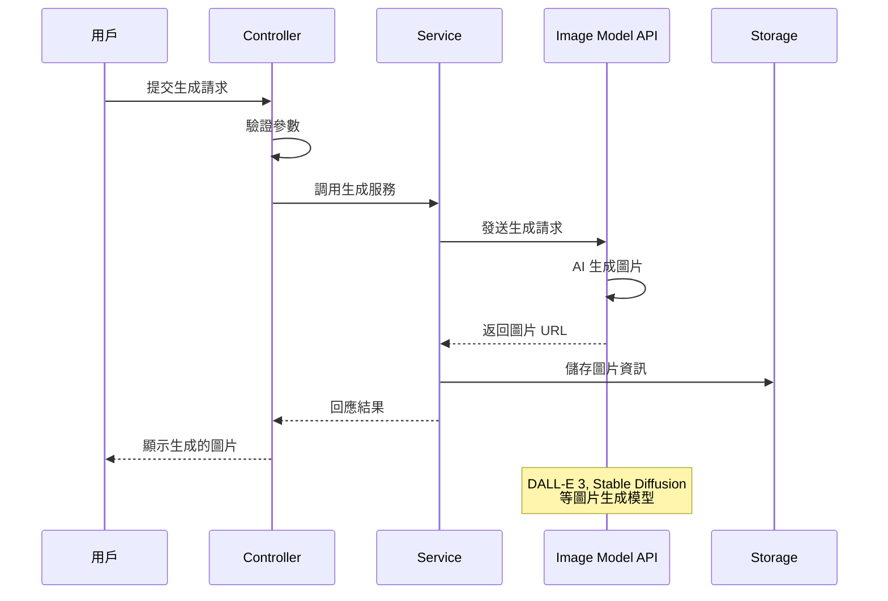
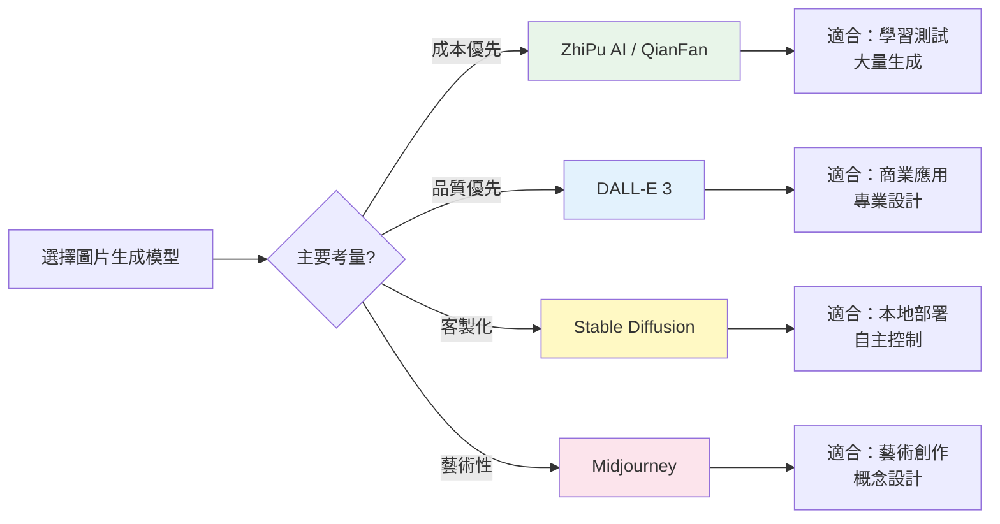

# 5.3 透過 Spring AI 生成美女圖

> **對應章節**: Day12
> **對應範例**: `chapter5-image-generation`
> **難度**: ⭐⭐⭐☆☆

---

## 📚 本章概要

AI 圖片生成技術正在徹底改變創意產業。透過 Spring AI 的圖片生成 API，我們可以輕鬆建立文字轉圖片（Text-to-Image）應用，從概念設計到商業插圖，AI 都能在幾秒鐘內生成高品質的圖片。

**學習目標**：
- 理解 AI 圖片生成的核心原理和應用場景
- 掌握 Spring AI 的圖片生成 API 使用方式
- 學會選擇合適的圖片生成模型
- 實現完整的圖片生成和管理功能
- 建立企業級的圖片生成服務架構

---

## 5.3.1 AI 圖片生成的革命性影響

### 文生圖 AI 將會是最大圖庫


昨天學了如何上傳圖片給 AI 辨識，今天我們讓 AI 來產生圖片吧！AI 圖片生成技術正在徹底改變創意產業，從概念設計到商業插圖，AI 都能在幾秒鐘內生成高品質的圖片。

### AI 圖片生成的核心價值

**1. 創意無限制**
- 🎨 **即時創作**：從文字描述到視覺呈現，幾秒鐘完成
- 🌈 **風格多樣**：支援寫實、卡通、油畫、水彩等各種風格
- 🔄 **快速迭代**：輕鬆調整和優化創作內容
- 💡 **靈感激發**：AI 能提供意想不到的創意組合

**2. 成本效益顯著**
- 💰 **降低成本**：無需聘請專業設計師或購買版權圖片
- ⏰ **節省時間**：從數天的設計週期縮短到幾分鐘
- 📈 **規模化生產**：批次生成大量圖片內容
- 🎯 **客製化程度高**：精確符合特定需求

**3. 應用場景廣泛**
- 🛒 **電商應用**：商品展示圖、廣告素材、品牌視覺
- 📚 **內容創作**：部落格配圖、社群媒體素材、簡報圖片
- 🎮 **遊戲開發**：角色設計、場景概念圖、道具素材
- 🏢 **企業應用**：行銷素材、產品原型、視覺化報告

### 圖片生成工作流程



---

## 5.3.2 Spring AI 支援的圖片生成模型

### 主要支援的 AI 服務商

| 服務商 | 模型 | 特色 | 成本 | 推薦度 | 適用場景 |
|--------|------|------|------|--------|----------|
| **OpenAI** | DALL-E 3 | 高品質、理解複雜指令 | 高 | ⭐⭐⭐⭐⭐ | 專業設計、商業用途 |
| **Stability AI** | Stable Diffusion | 開源、可本地部署 | 中 | ⭐⭐⭐⭐ | 自主控制、客製化 |
| **ZhiPu AI** | CogView-3 | 中文友善、便宜 | 低 | ⭐⭐⭐ | 學習測試、中文內容 |
| **QianFan** | 文心一言 | 百度服務、本土化 | 低 | ⭐⭐ | 大陸市場應用 |
| **Midjourney** | V6 | 藝術性強、社群活躍 | 中 | ⭐⭐⭐⭐ | 藝術創作、概念設計 |

### 成本效益分析



**成本排序（每張圖片）**：
1. ZhiPu AI: 免費額度 + ¥0.01-0.05
2. Stability AI: $0.002-0.01
3. QianFan: ¥0.02-0.08
4. Midjourney: $0.05-0.15
5. OpenAI DALL-E 3: $0.040-0.080

### 模型能力對比

| 能力維度 | DALL-E 3 | Stable Diffusion | CogView-3 | 文心一言 |
|----------|----------|------------------|-----------|----------|
| **圖片品質** | 9/10 | 8/10 | 7/10 | 6/10 |
| **指令理解** | 9/10 | 7/10 | 8/10 | 7/10 |
| **中文支援** | 7/10 | 6/10 | 9/10 | 9/10 |
| **生成速度** | 8/10 | 9/10 | 8/10 | 7/10 |
| **風格多樣性** | 8/10 | 9/10 | 7/10 | 6/10 |
| **成本效益** | 6/10 | 9/10 | 9/10 | 8/10 |

---

## 5.3.3 OpenAI DALL-E 3 整合

### 專案配置

```yaml
# 對應範例: chapter5-image-generation/src/main/resources/application.yml

spring:
  application:
    name: spring-ai-image-generation
  ai:
    openai:
      api-key: ${OPENAI_API_KEY}
      image:
        options:
          model: dall-e-3
          size: 1024x1024
          quality: standard
          style: natural
          response-format: url
```

**配置說明**：
- **model**: `dall-e-3` 或 `dall-e-2`
- **size**: `1024x1024`, `1024x1792`, `1792x1024`
- **quality**: `standard` 或 `hd`（高清，成本更高）
- **style**: `natural`（自然）或 `vivid`（鮮豔）
- **response-format**: `url` 或 `b64_json`

### 圖片生成服務實現

```java
// 對應範例: chapter5-image-generation/.../ImageGenerationServiceImpl.java:28

@Service
@RequiredArgsConstructor
@Slf4j
public class ImageGenerationServiceImpl implements ImageGenerationService {

    private final ImageModel imageModel;

    /**
     * 基礎圖片生成
     */
    @Override
    public ImageGenerationResponse generateImage(ImageGenerationRequest request) {
        try {
            log.info("開始生成圖片：{}", request.getPrompt());

            // 建立圖片生成選項
            ImageOptions options = ImageOptionsBuilder.builder()
                    .withModel("dall-e-3")
                    .withWidth(request.getWidth())
                    .withHeight(request.getHeight())
                    .withQuality(request.getQuality())
                    .withStyle(request.getStyle())
                    .build();

            // 建立提示詞
            ImagePrompt imagePrompt = new ImagePrompt(
                    request.getPrompt(),
                    options
            );

            // 生成圖片
            ImageResponse response = imageModel.call(imagePrompt);

            // 提取圖片 URL
            String imageUrl = response.getResult()
                    .getOutput()
                    .getUrl();

            log.info("圖片生成成功：{}", imageUrl);

            return ImageGenerationResponse.builder()
                    .success(true)
                    .imageUrl(imageUrl)
                    .prompt(request.getPrompt())
                    .model("dall-e-3")
                    .timestamp(LocalDateTime.now())
                    .build();

        } catch (Exception e) {
            log.error("圖片生成失敗", e);
            return ImageGenerationResponse.builder()
                    .success(false)
                    .error("圖片生成失敗：" + e.getMessage())
                    .timestamp(LocalDateTime.now())
                    .build();
        }
    }
}
```

**實現要點**：
1. **ImageOptions 建立**：設定圖片大小、品質、風格等參數
2. **ImagePrompt 建立**：包含提示詞和選項
3. **調用 ImageModel**：執行圖片生成
4. **提取結果**：從 ImageResponse 中取得圖片 URL
5. **錯誤處理**：捕獲異常並提供友善的錯誤訊息

### REST API 實現

```java
// 對應範例: chapter5-image-generation/.../ImageGenerationController.java:30

@RestController
@RequestMapping("/api/images")
@RequiredArgsConstructor
@Slf4j
public class ImageGenerationController {

    private final ImageGenerationService imageGenerationService;

    /**
     * 生成圖片
     */
    @PostMapping("/generate")
    public ResponseEntity<ImageGenerationResponse> generateImage(
            @RequestBody @Valid ImageGenerationRequest request) {

        log.info("收到圖片生成請求：{}", request.getPrompt());

        ImageGenerationResponse response = imageGenerationService
                .generateImage(request);

        return response.isSuccess()
                ? ResponseEntity.ok(response)
                : ResponseEntity.status(HttpStatus.INTERNAL_SERVER_ERROR)
                        .body(response);
    }

    /**
     * 批次生成圖片
     */
    @PostMapping("/batch-generate")
    public ResponseEntity<List<ImageGenerationResponse>> batchGenerate(
            @RequestBody List<String> prompts) {

        log.info("批次生成 {} 張圖片", prompts.size());

        List<ImageGenerationResponse> responses = prompts.stream()
                .map(prompt -> {
                    ImageGenerationRequest request = ImageGenerationRequest.builder()
                            .prompt(prompt)
                            .width(1024)
                            .height(1024)
                            .quality("standard")
                            .style("natural")
                            .build();
                    return imageGenerationService.generateImage(request);
                })
                .collect(Collectors.toList());

        return ResponseEntity.ok(responses);
    }
}
```

---

## 5.3.4 進階功能實現

### 產品圖片生成服務

```java
// 對應範例: chapter5-image-generation/.../ImageGenerationServiceImpl.java:80

/**
 * 產品圖片生成（帶提示詞優化）
 */
@Override
public ProductImageResponse generateProductImage(ProductImageRequest request) {
    try {
        log.info("生成產品圖片：{} - {}",
                request.getProductName(), request.getCategory());

        // 建立優化的提示詞
        String optimizedPrompt = buildProductPrompt(request);

        // 建立圖片選項
        ImageOptions options = ImageOptionsBuilder.builder()
                .withModel("dall-e-3")
                .withWidth(1024)
                .withHeight(1024)
                .withQuality("hd")  // 產品圖使用高品質
                .withStyle("natural")
                .build();

        // 生成圖片
        ImagePrompt imagePrompt = new ImagePrompt(optimizedPrompt, options);
        ImageResponse response = imageModel.call(imagePrompt);

        String imageUrl = response.getResult().getOutput().getUrl();

        log.info("產品圖片生成成功：{}", imageUrl);

        return ProductImageResponse.builder()
                .success(true)
                .productName(request.getProductName())
                .category(request.getCategory())
                .imageUrl(imageUrl)
                .prompt(optimizedPrompt)
                .generatedAt(LocalDateTime.now())
                .build();

    } catch (Exception e) {
        log.error("產品圖片生成失敗", e);
        return ProductImageResponse.builder()
                .success(false)
                .error("生成失敗：" + e.getMessage())
                .generatedAt(LocalDateTime.now())
                .build();
    }
}

/**
 * 建立優化的產品提示詞
 */
private String buildProductPrompt(ProductImageRequest request) {
    StringBuilder prompt = new StringBuilder();

    prompt.append("A professional product photo of ")
            .append(request.getProductName());

    if (request.getCategory() != null) {
        prompt.append(" (").append(request.getCategory()).append(")");
    }

    if (request.getStyle() != null) {
        prompt.append(", ").append(request.getStyle()).append(" style");
    }

    if (request.getBackground() != null) {
        prompt.append(", on ").append(request.getBackground())
                .append(" background");
    }

    prompt.append(", high quality, detailed, professional lighting, "
            + "commercial photography, 4K resolution");

    if (request.getAdditionalDetails() != null) {
        prompt.append(", ").append(request.getAdditionalDetails());
    }

    return prompt.toString();
}
```

**提示詞優化策略**：
1. **專業術語**：使用 "professional product photo"、"commercial photography"
2. **品質描述**：加入 "high quality"、"4K resolution"
3. **細節控制**：指定背景、光線、風格等
4. **客製化**：根據產品類別調整描述

### 圖片品質優化配置

```java
// 對應範例: chapter5-image-generation/.../ImageModelConfig.java

@Configuration
public class ImageModelConfig {

    /**
     * 標準品質圖片生成模型
     */
    @Bean
    @Primary
    public ImageOptions defaultImageOptions() {
        return ImageOptionsBuilder.builder()
                .withModel("dall-e-3")
                .withWidth(1024)
                .withHeight(1024)
                .withQuality("standard")
                .withStyle("natural")
                .build();
    }

    /**
     * 高品質圖片生成模型（用於重要場合）
     */
    @Bean("hdImageOptions")
    public ImageOptions hdImageOptions() {
        return ImageOptionsBuilder.builder()
                .withModel("dall-e-3")
                .withWidth(1024)
                .withHeight(1792)  // 直式高解析度
                .withQuality("hd")
                .withStyle("vivid")
                .build();
    }
}
```

---

## 5.3.5 最佳實踐

### 提示詞工程技巧

```java
/**
 * 提示詞優化器
 */
@Service
public class PromptOptimizer {

    /**
     * 優化圖片生成提示詞
     */
    public String optimizePrompt(String userPrompt, String purpose) {
        StringBuilder optimized = new StringBuilder();

        // 根據用途添加前綴
        String prefix = switch (purpose.toLowerCase()) {
            case "product" -> "A professional product photograph of ";
            case "portrait" -> "A high-quality portrait of ";
            case "landscape" -> "A stunning landscape photo of ";
            case "abstract" -> "An abstract artistic representation of ";
            default -> "";
        };

        optimized.append(prefix).append(userPrompt);

        // 添加品質描述
        optimized.append(", high resolution, detailed, "
                + "professional quality, beautiful lighting");

        // 根據用途添加後綴
        String suffix = switch (purpose.toLowerCase()) {
            case "product" -> ", white background, commercial photography";
            case "portrait" -> ", natural lighting, bokeh background";
            case "landscape" -> ", golden hour, cinematic";
            case "abstract" -> ", vibrant colors, creative composition";
            default -> "";
        };

        optimized.append(suffix);

        return optimized.toString();
    }
}
```

### 錯誤處理和重試機制

```java
/**
 * 帶重試機制的圖片生成
 */
@Service
public class RobustImageGenerationService {

    private final ImageModel imageModel;
    private static final int MAX_RETRIES = 3;

    public ImageGenerationResponse generateWithRetry(
            ImageGenerationRequest request) {

        int retries = 0;
        Exception lastException = null;

        while (retries < MAX_RETRIES) {
            try {
                ImagePrompt prompt = createImagePrompt(request);
                ImageResponse response = imageModel.call(prompt);

                return ImageGenerationResponse.builder()
                        .success(true)
                        .imageUrl(response.getResult().getOutput().getUrl())
                        .build();

            } catch (Exception e) {
                lastException = e;
                retries++;
                log.warn("圖片生成失敗，第 {} 次重試", retries);

                if (retries < MAX_RETRIES) {
                    try {
                        Thread.sleep(1000 * retries);  // 指數退避
                    } catch (InterruptedException ie) {
                        Thread.currentThread().interrupt();
                        break;
                    }
                }
            }
        }

        log.error("圖片生成最終失敗", lastException);
        return ImageGenerationResponse.builder()
                .success(false)
                .error("生成失敗，已重試 " + MAX_RETRIES + " 次")
                .build();
    }
}
```

---

## 📝 本章重點回顧

1. **圖片生成理解**：掌握了 AI 圖片生成的原理和應用場景
2. **模型選擇**：了解了不同圖片生成模型的特點和成本
3. **API 實現**：建立了完整的圖片生成 REST API
4. **進階功能**：實現了產品圖片生成和提示詞優化
5. **最佳實踐**：掌握了錯誤處理和品質優化技巧

### 技術要點總結

| 技術點 | 重要性 | 實現難度 | 使用場景 |
|--------|--------|----------|----------|
| **基礎生成** | ⭐⭐⭐ | 低 | 所有圖片生成應用 |
| **提示詞優化** | ⭐⭐⭐ | 中 | 提升生成品質 |
| **批次處理** | ⭐⭐ | 中 | 大量圖片生成 |
| **錯誤處理** | ⭐⭐⭐ | 中 | 生產環境穩定性 |
| **成本控制** | ⭐⭐ | 低 | 商業應用 |

### 最佳實踐建議

**1. 提示詞設計**
- ✅ 使用專業術語提升品質
- ✅ 明確指定風格和細節
- ✅ 根據用途優化提示詞
- ✅ 測試不同的描述方式

**2. 成本優化**
- ✅ 根據需求選擇品質等級
- ✅ 使用快取避免重複生成
- ✅ 批次處理降低單價
- ✅ 監控 API 使用量

**3. 品質控制**
- ✅ 驗證生成結果
- ✅ 提供重新生成選項
- ✅ 儲存成功的提示詞
- ✅ 建立提示詞資料庫

### 實務技巧

```java
// ✅ 好的實踐：詳細的提示詞
String prompt = "A professional product photo of a modern wireless headphone, "
        + "black color, on white background, "
        + "professional lighting, commercial photography, "
        + "high resolution, 4K quality, detailed texture";

// ❌ 不好的實踐：過於簡單
String prompt = "headphone";

// ✅ 好的實踐：完整的錯誤處理
try {
    ImageResponse response = imageModel.call(prompt);
    return response.getResult().getOutput().getUrl();
} catch (Exception e) {
    log.error("圖片生成失敗", e);
    return fallbackImageUrl;  // 提供備用圖片
}
```

### 下一步學習方向

在下一章中，我們將學習圖片編輯功能，包括圖片修改、風格轉換等進階技術，進一步擴展 AI 圖片處理能力。

---

**參考資料：**
- [Spring AI Image Generation Documentation](https://docs.spring.io/spring-ai/reference/api/image.html)
- [OpenAI DALL-E API](https://platform.openai.com/docs/guides/images)
- [Stability AI Documentation](https://platform.stability.ai/docs)
- 完整範例程式碼：`code-examples/chapter5-image-generation`
