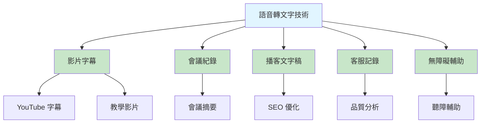
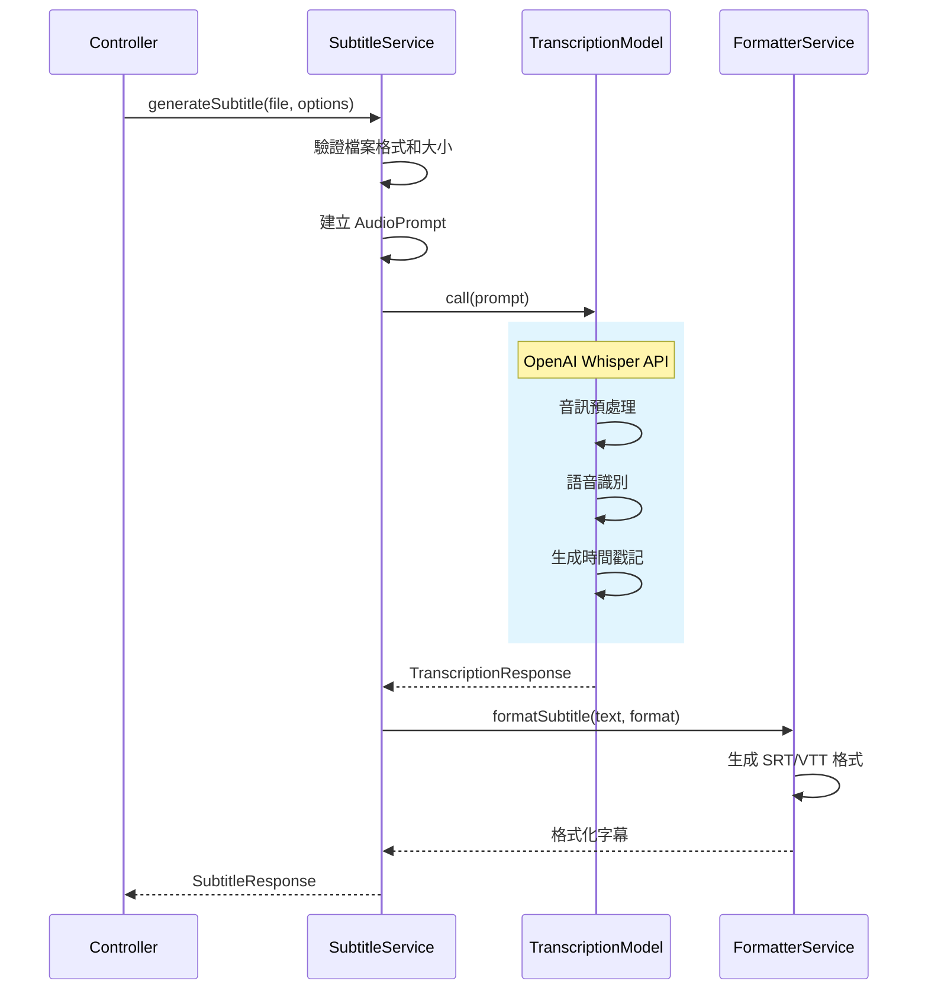
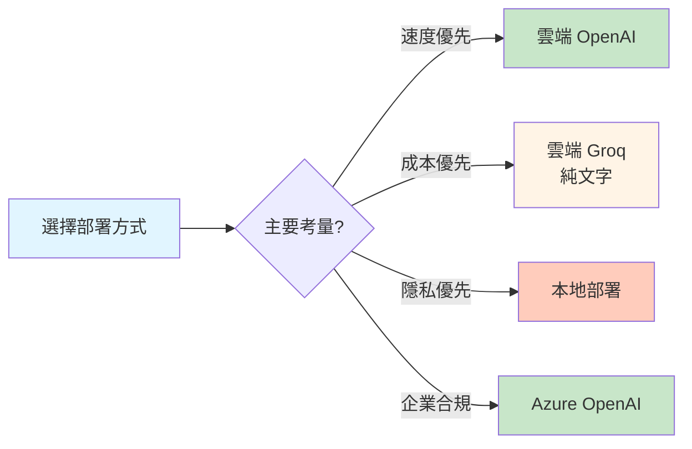

# 5.4 語音轉文字 - AI 字幕生成系統

> **對應章節**: Day12
> **對應範例**: `chapter5-spring-ai-advanced`
> **難度**: ⭐⭐⭐☆☆

---

## 📚 本章概要

語音轉文字 (Speech-to-Text, STT) 是將音訊內容轉換為文字的技術。透過 Spring AI 整合 OpenAI Whisper 模型,可以快速建立專業的字幕生成系統,大幅提升影片製作和內容處理效率。

**學習目標**:
- 理解語音轉文字技術原理
- 掌握 Spring AI AudioTranscriptionModel
- 實現多格式字幕生成 (SRT、VTT、JSON)
- 建立企業級字幕生成服務

---

## 🎯 為什麼需要 AI 字幕生成?

### 手動字幕的痛點

**傳統字幕製作流程**:
1. 👂 反覆播放音訊聽內容
2. ⌨️ 手動輸入文字
3. ⏱️ 調整時間軸對齊
4. 🔄 校對和修正錯誤
5. 💾 輸出多種格式

**時間成本**: 1 小時影片需要 4-6 小時製作字幕

### AI vs 傳統對比

| 比較項目 | 傳統人工 | AI 自動生成 | 優勢 |
|----------|----------|-------------|------|
| **速度** | 4-6 小時/小時影片 | 2-5 分鐘/小時影片 | 快 50-100 倍 |
| **成本** | $50-100/小時 | $0.36/小時 | 節省 80%+ |
| **準確度** | 95-98% | 90-95% | 需人工校對 |
| **支援語言** | 有限 | 99+ 語言 | 廣泛支援 |
| **時間戳記** | 手動調整 | 自動生成 | 精確對齊 |

### 應用場景



---

## 🏗️ Spring AI 語音轉文字架構

### AudioTranscriptionModel 介面

```java
// Spring AI 語音轉文字核心介面
public interface AudioTranscriptionModel {

    // 轉譯音訊
    AudioTranscriptionResponse call(AudioTranscriptionPrompt prompt);

    // 串流轉譯（部分模型支援）
    Flux<AudioTranscriptionResponse> stream(AudioTranscriptionPrompt prompt);
}

// 轉譯選項配置
public class OpenAiAudioTranscriptionOptions {
    private String model;              // 模型: whisper-1
    private String language;           // 語言: zh, en, ja, etc.
    private String responseFormat;     // 格式: json, verbose_json, text, srt, vtt
    private Float temperature;         // 溫度: 0.0 ~ 1.0
    private List<String> timestampGranularities; // 時間戳記粒度
}
```

### 工作流程



---

## 🎤 Whisper 模型介紹

### 模型特性

**OpenAI Whisper** 是目前最先進的開源語音識別模型:

- ✅ **多語言支援**: 99+ 種語言
- ✅ **高準確度**: 英文 WER < 3%, 中文約 5-10%
- ✅ **時間戳記**: 精確到字詞級別
- ✅ **雜訊抑制**: 良好的抗噪能力
- ✅ **口音識別**: 支援各種口音

### 服務商比較

| 服務商 | 模型 | 成本 | 時間戳記 | 適用場景 |
|--------|------|------|----------|----------|
| **OpenAI** | whisper-1 | $0.006/分鐘 | ✅ 完整 | 商業應用、高品質 |
| **Azure** | whisper-1 | $0.006/分鐘 | ✅ 完整 | 企業部署、合規 |
| **Groq** | whisper-large | 免費 | ❌ 無 | 純文字轉錄 |
| **本地部署** | whisper-* | 硬體成本 | ✅ 完整 | 隱私敏感、離線 |

**成本計算**:
```
30 分鐘影片 = $0.18
1 小時影片 = $0.36
100 小時影片 = $36
```

### 雲端 vs 本地部署



---

## 💻 配置與實現

### 應用配置

```yaml
# 對應範例: chapter5-spring-ai-advanced/src/main/resources/application.yml

spring:
  ai:
    openai:
      api-key: ${OPENAI_API_KEY}
      audio:
        transcription:
          options:
            model: whisper-1
            response-format: verbose_json  # 包含時間戳記
            temperature: 0.0               # 最確定的結果
            language: zh                   # 指定語言提升準確度

  # 檔案上傳配置
  servlet:
    multipart:
      max-file-size: 25MB     # Whisper API 限制
      max-request-size: 25MB
      enabled: true

# 自訂配置
app:
  subtitle:
    output-directory: ./subtitles
    supported-formats:
      - srt
      - vtt
      - json
      - txt
    max-duration: 3600  # 最大處理時長（秒）
```

### 基礎字幕生成

```java
// 對應範例: chapter5-spring-ai-advanced/.../service/SubtitleGenerationService.java:28

@Service
@RequiredArgsConstructor
@Slf4j
public class SubtitleGenerationService {

    private final AudioTranscriptionModel transcriptionModel;

    /**
     * 基礎字幕生成
     */
    public SubtitleResponse generateSubtitle(
            MultipartFile file,
            String format,
            String language) {

        // 建立轉譯選項
        OpenAiAudioTranscriptionOptions options =
            OpenAiAudioTranscriptionOptions.builder()
                .withModel("whisper-1")
                .withResponseFormat("verbose_json")
                .withTemperature(0.0f)
                .withLanguage(language != null ? language : "zh")
                .withTimestampGranularities(List.of("word", "segment"))
                .build();

        // 建立音訊資源
        Resource audioResource = createAudioResource(file);

        // 建立轉譯請求
        AudioTranscriptionPrompt prompt =
            new AudioTranscriptionPrompt(audioResource, options);

        // 執行轉譯
        AudioTranscriptionResponse response =
            transcriptionModel.call(prompt);

        String transcriptionResult = response.getResult().getOutput();

        // 格式化字幕
        String formattedSubtitle =
            formatterService.formatSubtitle(transcriptionResult, format);

        return SubtitleResponse.builder()
                .success(true)
                .fileName(file.getOriginalFilename())
                .format(format)
                .language(language)
                .content(formattedSubtitle)
                .fileSize(file.getSize())
                .timestamp(LocalDateTime.now())
                .build();
    }

    /**
     * 將 MultipartFile 轉換為 Resource
     */
    private Resource createAudioResource(MultipartFile file) throws IOException {
        Path tempFile = Files.createTempFile("audio-", ".tmp");
        file.transferTo(tempFile.toFile());
        return new FileSystemResource(tempFile.toFile());
    }
}
```

**實現要點**:
1. ✅ 使用 `AudioTranscriptionModel` 進行轉譯
2. ✅ `verbose_json` 格式包含時間戳記資訊
3. ✅ 指定語言可提升 10-15% 準確度
4. ✅ 溫度設為 0.0 獲得最穩定結果

### 字幕格式化服務

```java
// 對應範例: chapter5-spring-ai-advanced/.../service/SubtitleFormatterService.java:15

@Service
@Slf4j
public class SubtitleFormatterService {

    /**
     * 將轉譯結果格式化為指定字幕格式
     */
    public String formatSubtitle(String transcriptionJson, String format) {
        try {
            ObjectMapper mapper = new ObjectMapper();
            WhisperResponse whisperResponse =
                mapper.readValue(transcriptionJson, WhisperResponse.class);

            return switch (format.toLowerCase()) {
                case "srt" -> formatToSRT(whisperResponse);
                case "vtt" -> formatToVTT(whisperResponse);
                case "json" -> transcriptionJson;
                case "txt" -> formatToPlainText(whisperResponse);
                default -> throw new IllegalArgumentException(
                    "不支援的格式: " + format);
            };

        } catch (Exception e) {
            log.error("字幕格式化失敗", e);
            throw new RuntimeException("字幕格式化失敗: " + e.getMessage());
        }
    }

    /**
     * 格式化為 SRT 格式
     */
    private String formatToSRT(WhisperResponse response) {
        StringBuilder srt = new StringBuilder();
        List<Segment> segments = response.getSegments();

        for (int i = 0; i < segments.size(); i++) {
            Segment segment = segments.get(i);

            // 序號
            srt.append(i + 1).append("\n");

            // 時間軸
            srt.append(formatTime(segment.getStart()))
               .append(" --> ")
               .append(formatTime(segment.getEnd()))
               .append("\n");

            // 文字內容
            srt.append(segment.getText().trim()).append("\n\n");
        }

        return srt.toString();
    }

    /**
     * 格式化為 VTT 格式
     */
    private String formatToVTT(WhisperResponse response) {
        StringBuilder vtt = new StringBuilder();
        vtt.append("WEBVTT\n\n");

        List<Segment> segments = response.getSegments();

        for (Segment segment : segments) {
            vtt.append(formatTime(segment.getStart()))
               .append(" --> ")
               .append(formatTime(segment.getEnd()))
               .append("\n");

            vtt.append(segment.getText().trim()).append("\n\n");
        }

        return vtt.toString();
    }

    /**
     * 格式化時間戳記
     * 將秒數轉換為 HH:MM:SS,mmm 格式
     */
    private String formatTime(double seconds) {
        int hours = (int) (seconds / 3600);
        int minutes = (int) ((seconds % 3600) / 60);
        int secs = (int) (seconds % 60);
        int millis = (int) ((seconds % 1) * 1000);

        return String.format("%02d:%02d:%02d,%03d",
            hours, minutes, secs, millis);
    }

    /**
     * 格式化為純文字
     */
    private String formatToPlainText(WhisperResponse response) {
        return response.getText();
    }
}
```

### REST API 實現

```java
// 對應範例: chapter5-spring-ai-advanced/.../controller/SubtitleController.java:22

@RestController
@RequestMapping("/api/subtitle")
@RequiredArgsConstructor
@Slf4j
public class SubtitleController {

    private final SubtitleGenerationService subtitleService;

    /**
     * 基礎字幕生成
     */
    @PostMapping(value = "/generate",
                 consumes = MediaType.MULTIPART_FORM_DATA_VALUE)
    public ResponseEntity<SubtitleResponse> generateSubtitle(
            @RequestParam("file") MultipartFile file,
            @RequestParam(value = "format", defaultValue = "srt") String format,
            @RequestParam(value = "language", required = false) String language) {

        try {
            // 驗證檔案
            validateAudioFile(file);

            log.info("開始生成字幕: {}, 格式: {}", file.getOriginalFilename(), format);

            SubtitleResponse response =
                subtitleService.generateSubtitle(file, format, language);

            return ResponseEntity.ok(response);

        } catch (Exception e) {
            log.error("字幕生成失敗", e);

            return ResponseEntity.badRequest().body(
                SubtitleResponse.builder()
                    .success(false)
                    .error(e.getMessage())
                    .fileName(file.getOriginalFilename())
                    .build()
            );
        }
    }

    /**
     * 批次字幕生成
     */
    @PostMapping(value = "/batch-generate",
                 consumes = MediaType.MULTIPART_FORM_DATA_VALUE)
    public ResponseEntity<List<SubtitleResponse>> batchGenerate(
            @RequestParam("files") MultipartFile[] files,
            @RequestParam(value = "format", defaultValue = "srt") String format) {

        try {
            log.info("批次生成字幕: {} 個檔案", files.length);

            List<SubtitleResponse> responses =
                subtitleService.batchGenerateSubtitles(
                    Arrays.asList(files), format);

            return ResponseEntity.ok(responses);

        } catch (Exception e) {
            log.error("批次生成失敗", e);
            return ResponseEntity.badRequest().build();
        }
    }

    /**
     * 驗證音訊檔案
     */
    private void validateAudioFile(MultipartFile file) {
        if (file.isEmpty()) {
            throw new IllegalArgumentException("檔案不能為空");
        }

        // 檢查檔案大小（25MB 限制）
        if (file.getSize() > 25 * 1024 * 1024) {
            throw new IllegalArgumentException(
                "檔案大小超過 25MB 限制");
        }

        // 檢查檔案類型
        String contentType = file.getContentType();
        if (contentType == null || !isAudioFile(contentType)) {
            throw new IllegalArgumentException(
                "不支援的檔案類型: " + contentType);
        }
    }

    private boolean isAudioFile(String contentType) {
        return contentType.startsWith("audio/") ||
               contentType.startsWith("video/");
    }
}
```

---

## 📊 字幕格式說明

### SRT 格式

```
1
00:00:00,000 --> 00:00:03,500
歡迎來到 Spring AI 教學

2
00:00:03,500 --> 00:00:07,200
今天我們要學習語音轉文字技術

3
00:00:07,200 --> 00:00:11,000
使用 OpenAI Whisper 模型生成字幕
```

**特點**:
- ✅ 最廣泛支援的字幕格式
- ✅ 結構簡單易解析
- ✅ 支援所有主流播放器

### VTT 格式

```
WEBVTT

00:00:00.000 --> 00:00:03.500
歡迎來到 Spring AI 教學

00:00:03.500 --> 00:00:07.200
今天我們要學習語音轉文字技術

00:00:07.200 --> 00:00:11.000
使用 OpenAI Whisper 模型生成字幕
```

**特點**:
- ✅ HTML5 標準格式
- ✅ 支援樣式和定位
- ✅ 網頁播放器首選

### JSON 格式

```json
{
  "task": "transcribe",
  "language": "zh",
  "duration": 180.5,
  "text": "完整轉譯文字...",
  "segments": [
    {
      "id": 0,
      "start": 0.0,
      "end": 3.5,
      "text": "歡迎來到 Spring AI 教學",
      "words": [...]
    }
  ]
}
```

**特點**:
- ✅ 包含完整詳細資訊
- ✅ 支援字詞級別時間戳記
- ✅ 便於程式化處理

---

## 💡 最佳實踐

### 1. 音訊預處理

```java
/**
 * 音訊品質優化
 */
public Resource preprocessAudio(MultipartFile file) {
    try {
        // 轉換為 WAV 格式（可選）
        // 降噪處理（可選）
        // 標準化音量（可選）

        // 簡化實現：直接使用原檔案
        return file.getResource();

    } catch (Exception e) {
        throw new RuntimeException("音訊預處理失敗", e);
    }
}
```

**建議**:
- ✅ 使用高品質音訊（128kbps+）
- ✅ 移除背景音樂和噪音
- ✅ 標準化音量到 -3dB ~ 0dB
- ❌ 避免過度壓縮和失真

### 2. 語言設定優化

```java
/**
 * 智能語言檢測
 */
public String detectLanguage(MultipartFile file) {
    // 方案1: 使用短片段檢測
    // 先用無語言參數轉譯一小段,根據結果判斷

    // 方案2: 根據檔案名稱推測
    String filename = file.getOriginalFilename();
    if (filename != null) {
        if (filename.contains("_zh") || filename.contains("中文")) {
            return "zh";
        } else if (filename.contains("_en")) {
            return "en";
        }
    }

    // 預設返回中文
    return "zh";
}
```

**語言代碼**:
- `zh` - 中文（簡繁通用）
- `en` - 英文
- `ja` - 日文
- `ko` - 韓文
- `es` - 西班牙文

### 3. 錯誤處理與重試

```java
/**
 * 帶重試機制的字幕生成
 */
public SubtitleResponse generateWithRetry(
        MultipartFile file,
        String format,
        int maxRetries) {

    int attempts = 0;
    Exception lastException = null;

    while (attempts < maxRetries) {
        try {
            return generateSubtitle(file, format, null);

        } catch (Exception e) {
            lastException = e;
            attempts++;

            if (attempts < maxRetries) {
                log.warn("字幕生成失敗，重試 {}/{}", attempts, maxRetries);

                try {
                    Thread.sleep(2000 * attempts); // 指數退避
                } catch (InterruptedException ie) {
                    Thread.currentThread().interrupt();
                    break;
                }
            }
        }
    }

    throw new RuntimeException("字幕生成失敗", lastException);
}
```

### 4. 批次處理優化

```java
/**
 * 非同步批次字幕生成
 */
@Async
public CompletableFuture<SubtitleResponse> generateAsync(
        MultipartFile file, String format) {

    return CompletableFuture.supplyAsync(() ->
        generateSubtitle(file, format, null)
    );
}

/**
 * 並行處理多個檔案
 */
public List<SubtitleResponse> batchGenerateParallel(
        List<MultipartFile> files, String format) {

    List<CompletableFuture<SubtitleResponse>> futures =
        files.stream()
            .map(file -> generateAsync(file, format))
            .collect(Collectors.toList());

    // 等待所有任務完成
    CompletableFuture.allOf(
        futures.toArray(new CompletableFuture[0])
    ).join();

    // 收集結果
    return futures.stream()
            .map(CompletableFuture::join)
            .collect(Collectors.toList());
}
```

---

## 📝 重點回顧

### 語音轉文字的價值
✅ **效率提升**: 比手動快 50-100 倍
✅ **成本降低**: 節省 80%+ 成本
✅ **多語言**: 支援 99+ 種語言
✅ **高準確度**: 中文識別率 90-95%
✅ **自動時間軸**: 精確到字詞級別

### 技術要點
- **AudioTranscriptionModel**: Spring AI 轉譯核心
- **Whisper 模型**: OpenAI 最先進的 STT 模型
- **格式支援**: SRT、VTT、JSON、TXT
- **語言優化**: 指定語言提升準確度
- **批次處理**: 非同步處理提升效率

### 應用場景
- 🎬 影片字幕生成
- 📝 會議記錄轉錄
- 🎙️ 播客文字稿
- 📞 客服記錄分析
- ♿ 無障礙輔助服務

---

## 🚀 下一步

👉 [5.5 文字轉語音](./5.5.md) - 學習 AI 配音技術
👉 [5.6 Function Calling 基礎](./5.6.md) - AI 工具調用入門

---

**相關章節**:
- ← 上一章: [5.3 圖片生成](./5.3.md)
- → 下一章: [5.5 文字轉語音](./5.5.md)

**參考資料**:
- [Spring AI Audio Transcription](https://docs.spring.io/spring-ai/reference/api/audio/transcriptions/)
- [OpenAI Whisper API](https://platform.openai.com/docs/guides/speech-to-text)
- [SRT Format Specification](https://en.wikipedia.org/wiki/SubRip)
- [WebVTT Standard](https://www.w3.org/TR/webvtt1/)
