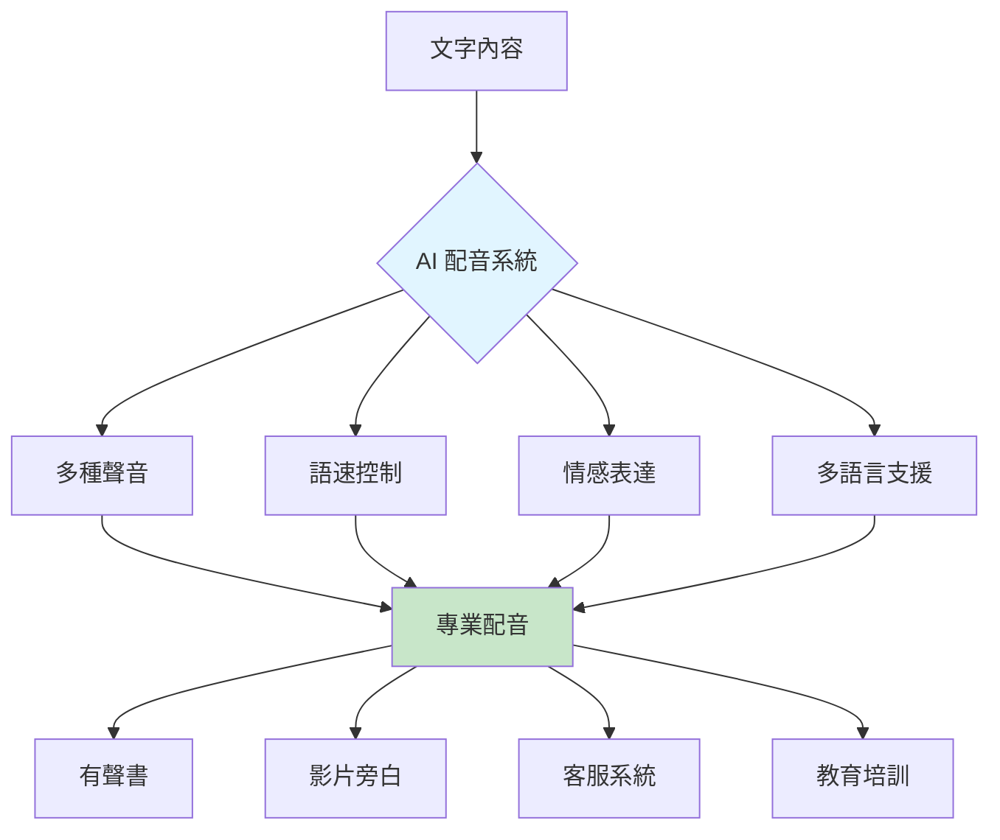
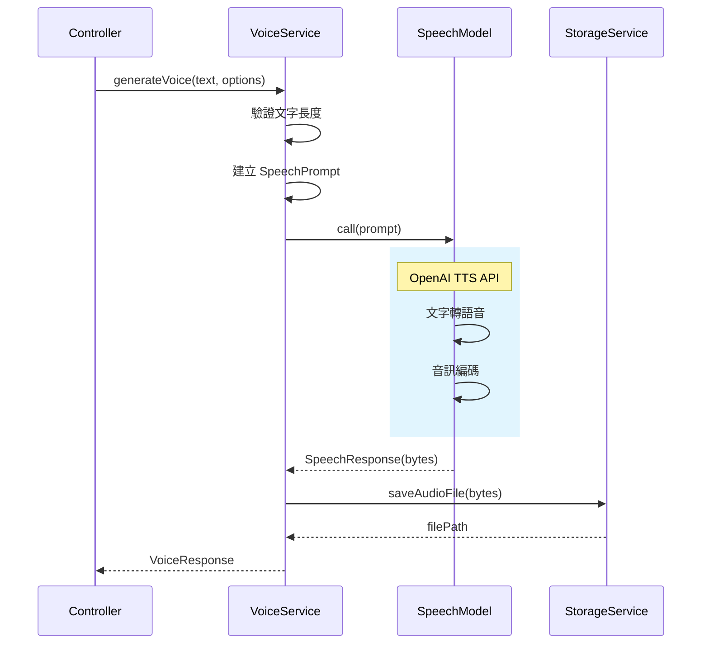
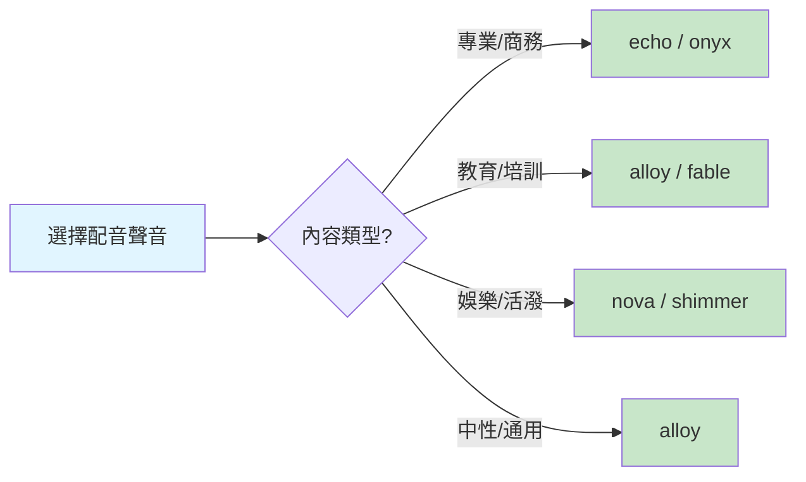

# 5.5 文字轉語音 - AI 配音系統

> **對應章節**: Day13
> **對應範例**: `chapter5-voice-generation`
> **難度**: ⭐⭐⭐☆☆

---

## 📚 本章概要

文字轉語音 (Text-to-Speech, TTS) 是 Spring AI 提供的企業級語音合成功能。透過整合 OpenAI TTS、Azure Speech 等服務,讓應用能快速生成高品質的語音內容,大幅降低配音成本並提升製作效率。

**學習目標**:
- 理解 TTS 技術原理與應用場景
- 掌握 Spring AI SpeechModel 的使用
- 實現多聲音、多語速的語音生成
- 建立完整的 AI 配音服務系統

---

## 🎯 為什麼需要 AI 配音?

### 成本與效率革命

傳統配音 vs AI 配音對比:

| 比較項目 | 傳統配音 | AI 配音 | 優勢 |
|----------|----------|---------|------|
| **成本** | $50-200/分鐘 | $0.015/1K字元 | 節省 95%+ |
| **速度** | 數天製作 | 即時生成 | 快 100+ 倍 |
| **一致性** | 人為變化 | 完全一致 | 品質穩定 |
| **可調性** | 需重錄 | 隨時調整 | 彈性極高 |
| **語言** | 有限 | 多語言 | 支援廣泛 |

### AI 配音的核心價值



**應用場景**:
- 📚 **教育培訓**: 線上課程、有聲書製作
- 🎬 **影片製作**: YouTube 旁白、廣告配音
- 🤖 **智能客服**: 語音回應、IVR 系統
- 🎮 **遊戲開發**: 角色配音、劇情對話
- 📢 **行銷推廣**: 產品介紹、廣告宣傳

---

## 🏗️ Spring AI 語音生成架構

### SpeechModel 介面

```java
// Spring AI 語音生成核心介面
public interface SpeechModel extends Model<SpeechPrompt, SpeechResponse> {

    // 生成語音
    SpeechResponse call(SpeechPrompt prompt);

    // 非同步生成
    Flux<SpeechResponse> stream(SpeechPrompt prompt);
}

// 語音選項配置
public class OpenAiAudioSpeechOptions {
    private String model;              // 模型: tts-1, tts-1-hd
    private Voice voice;               // 聲音選擇
    private AudioResponseFormat format; // 格式: mp3, opus, aac, flac
    private Float speed;               // 語速: 0.25 ~ 4.0
}
```

### 工作流程



---

## 🎤 OpenAI TTS 模型與聲音

### 模型選擇

Spring AI 主要支援 OpenAI 和 Azure OpenAI 的 TTS 服務:

| 模型 | 品質 | 速度 | 成本 | 適用場景 |
|------|------|------|------|----------|
| **tts-1** | 標準 | 快 | $0.015/1K | 大量生成、即時應用 |
| **tts-1-hd** | 高品質 | 中 | $0.030/1K | 專業製作、商業用途 |

### 聲音選項

OpenAI 提供 6 種不同風格的聲音:

| 聲音 | 特色 | 適用場景 |
|------|------|----------|
| **alloy** | 中性、清晰 | 新聞播報、教學內容 |
| **echo** | 男性、沉穩 | 商業簡報、紀錄片 |
| **fable** | 女性、溫暖 | 故事講述、客服 |
| **onyx** | 男性、深沉 | 廣告配音、專業旁白 |
| **nova** | 女性、活潑 | 娛樂內容、青少年節目 |
| **shimmer** | 女性、柔和 | 冥想引導、放鬆內容 |

**選擇建議**:


---

## 💻 配置與實現

### 應用配置

```yaml
# 對應範例: chapter5-voice-generation/src/main/resources/application.yml

spring:
  ai:
    openai:
      api-key: ${OPENAI_API_KEY}
      audio:
        speech:
          options:
            model: tts-1-hd        # 使用高品質模型
            voice: alloy           # 預設聲音
            response-format: mp3   # 音訊格式
            speed: 1.0             # 正常語速

# 自訂配置
app:
  voice:
    max-text-length: 4096          # 最大文字長度
    output-directory: ./voices     # 音訊儲存目錄
    supported-formats:             # 支援的格式
      - mp3
      - opus
      - aac
      - flac
```

### 基礎語音生成

```java
// 對應範例: chapter5-voice-generation/.../service/VoiceGenerationService.java:35

@Service
@RequiredArgsConstructor
@Slf4j
public class VoiceGenerationService {

    private final SpeechModel speechModel;

    /**
     * 基礎語音生成
     */
    public byte[] generateVoice(String text, String voice, Float speed) {
        // 建立語音選項
        OpenAiAudioSpeechOptions options = OpenAiAudioSpeechOptions.builder()
                .model("tts-1-hd")
                .voice(Voice.valueOf(voice.toUpperCase()))
                .responseFormat(AudioResponseFormat.MP3)
                .speed(speed)
                .build();

        // 建立語音請求
        SpeechPrompt prompt = new SpeechPrompt(text, options);

        // 執行語音生成
        SpeechResponse response = speechModel.call(prompt);

        return response.getResult().getOutput();
    }
}
```

**實現要點**:
1. ✅ 使用 `SpeechModel` 進行語音生成
2. ✅ 透過 `OpenAiAudioSpeechOptions` 配置選項
3. ✅ 回應為 byte[] 可直接儲存或串流傳輸
4. ⚠️ 需處理文字長度限制（4096 字元）

### 進階語音服務

```java
// 對應範例: chapter5-voice-generation/.../service/VoiceGenerationService.java:85

/**
 * 進階語音生成（含儲存）
 */
public VoiceResponse generateAdvancedVoice(VoiceRequest request) {
    // 驗證文字長度
    if (request.getText().length() > 4096) {
        throw new IllegalArgumentException("文字長度超過限制");
    }

    // 建立選項
    OpenAiAudioSpeechOptions options = OpenAiAudioSpeechOptions.builder()
            .model(request.getModel())
            .voice(Voice.valueOf(request.getVoice().toUpperCase()))
            .responseFormat(AudioResponseFormat.valueOf(
                request.getFormat().toUpperCase()))
            .speed(request.getSpeed())
            .build();

    // 生成語音
    SpeechPrompt prompt = new SpeechPrompt(request.getText(), options);
    SpeechResponse response = speechModel.call(prompt);
    byte[] audioData = response.getResult().getOutput();

    // 儲存檔案（可選）
    String filePath = null;
    if (request.isSaveFile()) {
        filePath = storageService.saveAudioFile(
            audioData,
            request.getText(),
            request.getVoice(),
            request.getFormat()
        );
    }

    // 建立回應
    return VoiceResponse.builder()
            .success(true)
            .audioData(audioData)
            .filePath(filePath)
            .fileSize((long) audioData.length)
            .duration(estimateDuration(request.getText(), request.getSpeed()))
            .timestamp(LocalDateTime.now())
            .build();
}

/**
 * 估算音訊時長
 */
private double estimateDuration(String text, Float speed) {
    // 平均每分鐘約 150 個英文單詞，中文約 250 字
    int charCount = text.length();
    double baseMinutes = charCount / 250.0;  // 假設中文
    return (baseMinutes * 60) / speed;       // 轉換為秒並調整語速
}
```

### REST API 實現

```java
// 對應範例: chapter5-voice-generation/.../controller/VoiceController.java:28

@RestController
@RequestMapping("/api/voice")
@RequiredArgsConstructor
public class VoiceController {

    private final VoiceGenerationService voiceService;

    /**
     * 簡易語音生成（回傳音訊串流）
     */
    @GetMapping("/generate")
    public ResponseEntity<byte[]> generateVoice(
            @RequestParam String text,
            @RequestParam(defaultValue = "alloy") String voice,
            @RequestParam(defaultValue = "1.0") Float speed) {

        byte[] audioData = voiceService.generateVoice(text, voice, speed);

        HttpHeaders headers = new HttpHeaders();
        headers.setContentType(MediaType.parseMediaType("audio/mpeg"));
        headers.setContentDisposition(
            ContentDisposition.inline()
                .filename("voice.mp3")
                .build()
        );

        return ResponseEntity.ok()
                .headers(headers)
                .body(audioData);
    }

    /**
     * 進階語音生成（含完整資訊）
     */
    @PostMapping("/generate-advanced")
    public VoiceResponse generateAdvancedVoice(
            @RequestBody @Valid VoiceRequest request) {

        return voiceService.generateAdvancedVoice(request);
    }

    /**
     * 批次語音生成
     */
    @PostMapping("/batch-generate")
    public List<VoiceResponse> batchGenerate(
            @RequestBody List<VoiceRequest> requests) {

        return requests.stream()
                .map(voiceService::generateAdvancedVoice)
                .collect(Collectors.toList());
    }
}
```

---

## 📊 成本與效益分析

### OpenAI TTS 定價

**定價標準** (2024):
- **tts-1**: $0.015 / 1K characters
- **tts-1-hd**: $0.030 / 1K characters

**成本計算範例**:

| 場景 | 文字量 | 模型 | 成本 | 傳統配音成本 | 節省 |
|------|--------|------|------|--------------|------|
| 1分鐘旁白 | 250字 | tts-1-hd | $0.0075 | $100 | 99.99% |
| 10分鐘教學 | 2,500字 | tts-1-hd | $0.075 | $500 | 99.98% |
| 1小時有聲書 | 15,000字 | tts-1-hd | $0.45 | $3,000 | 99.98% |
| 100個產品介紹 | 50,000字 | tts-1 | $0.75 | $10,000 | 99.99% |

**實際案例**:
```
某線上教育平台使用 AI 配音：
- 每月製作 500 個 5 分鐘教學影片
- 文字量：約 125,000 字/月
- AI 配音成本：$1.875/月 (tts-1)
- 傳統配音成本：$25,000/月
- 每年節省：$276,000+
```

---

## 💡 最佳實踐

### 1. 文字預處理

```java
/**
 * 優化文字以獲得更好的語音效果
 */
public String preprocessText(String text) {
    return text
        // 數字轉換
        .replaceAll("(\\d+)", " $1 ")

        // 標點符號優化（增加停頓）
        .replaceAll("([。！？])", "$1 ")

        // 移除多餘空白
        .replaceAll("\\s+", " ")
        .trim();
}
```

**建議**:
- ✅ 將數字轉為文字（"100" → "一百"）
- ✅ 適當使用標點符號增加停頓感
- ✅ 避免過長的句子（建議 < 100 字）
- ❌ 不要使用特殊符號或表情符號

### 2. 聲音與語速選擇

```java
/**
 * 根據內容類型自動選擇聲音
 */
public VoiceConfig autoSelectVoice(String contentType) {
    return switch (contentType) {
        case "news" -> new VoiceConfig("alloy", 1.0f);
        case "story" -> new VoiceConfig("fable", 0.9f);
        case "commercial" -> new VoiceConfig("onyx", 1.1f);
        case "tutorial" -> new VoiceConfig("echo", 0.95f);
        default -> new VoiceConfig("alloy", 1.0f);
    };
}
```

**語速建議**:
- 📖 **教學內容**: 0.9 ~ 0.95 (稍慢,便於理解)
- 🎬 **廣告配音**: 1.0 ~ 1.1 (正常偏快,有活力)
- 📚 **有聲書**: 0.85 ~ 0.9 (慢速,適合長時間聆聽)
- 📰 **新聞播報**: 1.0 (標準速度)

### 3. 錯誤處理與重試

```java
/**
 * 帶重試機制的語音生成
 */
public byte[] generateVoiceWithRetry(String text, int maxRetries) {
    int attempts = 0;
    Exception lastException = null;

    while (attempts < maxRetries) {
        try {
            return generateVoice(text, "alloy", 1.0f);
        } catch (Exception e) {
            lastException = e;
            attempts++;

            if (attempts < maxRetries) {
                log.warn("語音生成失敗，重試 {}/{}", attempts, maxRetries);
                try {
                    Thread.sleep(1000 * attempts); // 指數退避
                } catch (InterruptedException ie) {
                    Thread.currentThread().interrupt();
                    break;
                }
            }
        }
    }

    throw new RuntimeException("語音生成失敗", lastException);
}
```

### 4. 快取策略

```java
@Service
public class VoiceCacheService {

    private final Cache<String, byte[]> voiceCache =
        Caffeine.newBuilder()
            .maximumSize(1000)
            .expireAfterWrite(24, TimeUnit.HOURS)
            .build();

    public byte[] getOrGenerateVoice(String text, String voice) {
        String cacheKey = text + ":" + voice;

        return voiceCache.get(cacheKey, key -> {
            log.info("快取未命中，生成新語音");
            return voiceService.generateVoice(text, voice, 1.0f);
        });
    }
}
```

**快取建議**:
- ✅ 快取常用的固定內容（如問候語、提示音）
- ✅ 使用 MD5 或 SHA-256 作為快取 key
- ⚠️ 注意音訊檔案大小，避免記憶體溢位
- ⚠️ 考慮使用 Redis 進行分散式快取

---

## 📝 重點回顧

### AI 配音的價值
✅ **成本優勢**: 相比傳統配音節省 95%+ 成本
✅ **效率提升**: 從數天縮短到幾秒鐘
✅ **品質穩定**: AI 生成的聲音一致性高
✅ **靈活調整**: 隨時修改無需重錄
✅ **規模化生產**: 輕鬆處理大量配音需求

### 技術要點
- **SpeechModel**: Spring AI 語音生成核心介面
- **語音選項**: 6 種聲音 × 2 種模型 × 4 種格式
- **文字預處理**: 優化文字以獲得更好效果
- **成本控制**: 使用快取減少重複生成

### 應用場景
- 📚 教育: 線上課程、有聲書
- 🎬 媒體: 影片旁白、廣告配音
- 🤖 客服: 語音回應、IVR 系統
- 🎮 遊戲: 角色配音、劇情對話

---

## 🚀 下一步

👉 [5.6 語音轉文字](./5.6.md) - 學習 Speech-to-Text 技術
👉 [5.7 Function Calling](./5.7.md) - 讓 AI 調用外部工具

---

**相關章節**:
- ← 上一章: [5.4 圖片編輯](./5.4.md)
- → 下一章: [5.6 語音轉文字](./5.6.md)

**參考資料**:
- [Spring AI Audio Speech](https://docs.spring.io/spring-ai/reference/api/audio/speech/)
- [OpenAI Text-to-Speech API](https://platform.openai.com/docs/guides/text-to-speech)
- [Audio Format Specifications](https://en.wikipedia.org/wiki/Audio_file_format)
