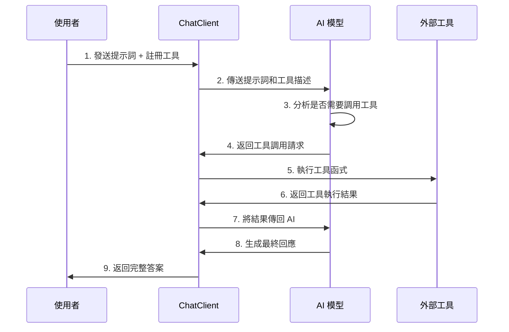

# 5.6 Function Calling (上) - 請支援 AI

> **本章重點**：學習 Spring AI 的 Tool Calling 技術，讓 AI 能夠調用外部工具和服務，突破 AI 的固有限制，實現更強大的功能整合和即時資料存取。

## 🎯 學習目標

完成本章學習後，您將能夠：

- 🎯 **理解 Tool Calling 原理**：掌握 AI 工具調用的核心概念和工作流程
- 🎯 **識別 AI 的限制**：了解 LLM 的弱點和 Tool Calling 的解決方案
- 🎯 **實現基礎工具調用**：建立第一個 Tool Calling 功能
- 🎯 **設計工具介面**：掌握 @Tool 註解的使用和最佳實踐
- 🎯 **整合 ChatClient API**：使用最新的 Spring AI 1.1 API 進行工具整合

---

## 5.6.1 AI 的弱點與挑戰

### AI 不是萬能的


雖然 AI 很神奇，不過它不是萬能的，遇到以下幾種問題 AI 就沒轍：

### LLM 的四大限制

**1. 記憶限制**
- 🧠 **無狀態推論**：LLM 是一種無狀態推論模型
- 💭 **偽記憶現象**：雖然跟 ChatGPT 對話似乎能記住對話內容，實際上它是根據你送出的資料來推論結果
- 🔄 **上下文依賴**：每次對話都需要重新提供完整的上下文資訊
- 📝 **會話管理**：需要外部系統來管理對話歷史和狀態

**2. 即時資料限制**
- ⏰ **訓練資料截止點**：LLM 預訓練資料會在一個時間點後關閉
- 📰 **無法獲取最新資訊**：之後所發生的事情 AI 就無法回答
- 🏅 **實例說明**：問 AI「2024 巴黎奧運中華隊得了幾面金牌」，AI 不是不知道就是隨便編一個答案
- 🔍 **解決方案**：需要透過 API 調用獲取即時資料

**3. 數學運算限制**
- 🔢 **語言模型本質**：LLM 顧名思義就是一種語言模型
- 📚 **文科生現象**：就跟文科生數理普遍不好一樣
- ➕ **基礎運算錯誤**：有些簡單的加減法甚至會算錯
- ⚠️ **不保證準確性**：就連 ChatGPT 也不敢跟你保證算出的答案一定是對的

**4. 企業內部資料限制**
- 🏢 **私有資料無法訓練**：預訓練只能取得公開資料
- 🔒 **企業資訊保密**：企業不可能公開自己的內部資訊
- 🛠️ **Fine-tuning 成本高**：常見作法是透過 fine tuning，但耗時費力
- 💡 **RAG 解決方案**：透過檢索增強生成技術整合企業資料

### Tool Calling 的解決方案

| AI 限制 | Tool Calling 解決方案 | 實現方式 |
|---------|----------------------|----------|
| **記憶限制** | 外部記憶系統 | 資料庫、快取系統 |
| **即時資料** | API 調用 | REST API、WebSocket |
| **數學運算** | 計算工具 | 計算器、數學庫 |
| **企業資料** | 資料庫查詢 | SQL、NoSQL、搜尋引擎 |

---

## 5.6.2 Tool Calling 核心概念

### 什麼是 Tool Calling？

**Tool Calling**（也稱為 Function Calling）就像是 AI 的外掛系統，除了能透過 Tool 取得即時資料外，一些複雜的運算或是需要分析的部分，也可以透過 Tool 來呼叫外部函式取得結果。

### Tool Calling 調用流程


**完整調用流程**：



**各步驟詳細說明**：

1. **註冊工具**：發送提示詞時告訴 AI 有哪些 Tool 可以調用
```java
return ChatClient.create(chatModel)
    .prompt(prompt)
    .tools(new DateTimeTools())  // 註冊可用工具
    .call()
    .content();
```

2. **工具匹配**：AI 查看是否有與提示詞相關的 Tool 描述
```java
@Tool(description = "Get the current date and time")
String getCurrentDateTime() {
    return LocalDateTime.now().toString();
}
```

3. **執行工具**：找到匹配的 Tool 後執行並調用其資訊
4. **結果整合**：將 Tool 回傳的資料以內部訊息格式傳送給 AI
5. **生成回應**：AI 根據提示詞以及 Tool 回傳結果生成最終答案

### Spring AI 1.1 的重大更新

**新舊 API 對比**：

| 比較項目 | 舊版 Function Calling | 新版 Tool Calling |
|----------|----------------------|-------------------|
| **API 名稱** | Function Calling | Tool Calling |
| **註解** | `@Function` | `@Tool` |
| **註冊方式** | 複雜的配置 | 直接傳入實例 |
| **類型安全** | 較弱 | 更強 |
| **易用性** | 複雜 | 簡化 |
| **效能** | 一般 | 優化 |

**遷移建議**：
- ✅ **新專案**：直接使用 Tool Calling API
- 🔄 **舊專案**：逐步遷移到新 API
- 📚 **學習重點**：掌握 @Tool 註解和 ChatClient 整合

---

## 5.6.3 第一個 Tool Calling 實現

### 專案建立與配置

**Maven 依賴**：

```xml
<!-- 使用 Spring AI BOM 管理版本 -->
<dependencyManagement>
    <dependencies>
        <dependency>
            <groupId>org.springframework.ai</groupId>
            <artifactId>spring-ai-bom</artifactId>
            <version>1.0.0</version>
            <type>pom</type>
            <scope>import</scope>
        </dependency>
    </dependencies>
</dependencyManagement>

<dependencies>
    <!-- Spring AI OpenAI Starter -->
    <dependency>
            <groupId>org.springframework.ai</groupId>
            <artifactId>spring-ai-openai-spring-boot-starter</artifactId>
        </dependency>
    
    <!-- Spring Boot Web -->
    <dependency>
        <groupId>org.springframework.boot</groupId>
        <artifactId>spring-boot-starter-web</artifactId>
    </dependency>
    
    <!-- Lombok -->
    <dependency>
        <groupId>org.projectlombok</groupId>
        <artifactId>lombok</artifactId>
        <optional>true</optional>
    </dependency>
</dependencies>
```

**應用程式配置**：

```yaml
# application.yml
spring:
  ai:
    openai:
      api-key: ${OPENAI_API_KEY}
      chat:
        options:
          model: gpt-4o-mini  # 支援 Tool Calling 的模型
          temperature: 0.1

# 日誌配置
logging:
  level:
    org.springframework.ai: DEBUG
```

### 基礎工具類別實現

**程式目標**：詢問目前時間，返回真實的日期及時間

**步驟 1：撰寫 Tool 類別**

```java
/**
 * 日期時間工具類別
 * 提供當前時間查詢功能
 */
@Component
public class DateTimeTools {
    
    /**
     * 獲取當前日期和時間
     * @return 格式化的當前日期時間字串
     */
    @Tool(description = "Get the current date and time in Taiwan (Asia/Taipei timezone)")
    public String getCurrentDateTime() {
        LocalDateTime now = LocalDateTime.now();
        DateTimeFormatter formatter = DateTimeFormatter.ofPattern("yyyy年MM月dd日 HH:mm:ss");
        
        return String.format("當前時間：%s（台灣時間）", now.format(formatter));
    }
    
    /**
     * 獲取指定格式的當前時間
     * @param format 時間格式（如：yyyy-MM-dd HH:mm:ss）
     * @return 格式化的時間字串
     */
    @Tool(description = "Get current time in specified format")
    public String getCurrentTimeWithFormat(String format) {
        try {
            LocalDateTime now = LocalDateTime.now();
            DateTimeFormatter formatter = DateTimeFormatter.ofPattern(format);
            return now.format(formatter);
        } catch (Exception e) {
            return "時間格式錯誤，請使用正確的格式，例如：yyyy-MM-dd HH:mm:ss";
        }
    }
    
    /**
     * 獲取當前時間戳
     * @return Unix 時間戳
     */
    @Tool(description = "Get current Unix timestamp")
    public String getCurrentTimestamp() {
        long timestamp = System.currentTimeMillis() / 1000;
        return String.format("當前時間戳：%d", timestamp);
    }
    
    /**
     * 獲取當前是星期幾
     * @return 星期資訊
     */
    @Tool(description = "Get current day of week")
    public String getCurrentDayOfWeek() {
        LocalDateTime now = LocalDateTime.now();
        String[] weekDays = {"星期一", "星期二", "星期三", "星期四", "星期五", "星期六", "星期日"};
        int dayOfWeek = now.getDayOfWeek().getValue() - 1;
        
        return String.format("今天是%s", weekDays[dayOfWeek]);
    }
}
```

**步驟 2：建立 ChatClient 控制器**

```java
package com.example.controller;

import com.example.tools.DateTimeTools;
import lombok.RequiredArgsConstructor;
import lombok.extern.slf4j.Slf4j;
import org.springframework.ai.chat.client.ChatClient;
import org.springframework.ai.chat.model.ChatModel;
import org.springframework.web.bind.annotation.*;

import java.time.LocalDateTime;
import java.util.List;

@RestController
@RequestMapping("/api/tool-calling")
@RequiredArgsConstructor
@Slf4j
public class ToolCallingController {
    
    private final ChatModel chatModel;
    private final DateTimeTools dateTimeTools;
    
    /**
     * 基礎 Tool Calling 示例
     * @param prompt 使用者提示詞
     * @return AI 回應（可能包含工具調用結果）
     */
    @GetMapping("/basic")
    public String basicToolCalling(@RequestParam String prompt) {
        try {
            log.info("收到 Tool Calling 請求：{}", prompt);
            
            // 使用新的 ChatClient API 整合工具
            String response = ChatClient.create(chatModel)
                    .prompt(prompt)
                    .tools(dateTimeTools)  // 直接傳入 Tool 實例
                    .call()
                    .content();
            
            log.info("Tool Calling 回應：{}", response);
            return response;
            
        } catch (Exception e) {
            log.error("Tool Calling 執行失敗", e);
            return "Tool Calling 執行失敗：" + e.getMessage();
        }
    }
    
    /**
     * 多工具整合示例
     * @param prompt 使用者提示詞
     * @return AI 回應
     */
    @GetMapping("/multi-tools")
    public String multiToolCalling(@RequestParam String prompt) {
        try {
            // 可以同時註冊多個工具
            String response = ChatClient.create(chatModel)
                    .prompt(prompt)
                    .tools(dateTimeTools)  // 可以添加更多工具
                    .call()
                    .content();
            
            return response;
            
        } catch (Exception e) {
            log.error("多工具調用失敗", e);
            return "多工具調用失敗：" + e.getMessage();
        }
    }
    
    /**
     * 工具調用詳細資訊
     * @param prompt 使用者提示詞
     * @return 包含調用詳情的回應
     */
    @PostMapping("/detailed")
    public ToolCallingResponse detailedToolCalling(@RequestBody ToolCallingRequest request) {
        try {
            long startTime = System.currentTimeMillis();
            
            String response = ChatClient.create(chatModel)
                    .prompt(request.getPrompt())
                    .tools(dateTimeTools)
                    .call()
                    .content();
            
            long endTime = System.currentTimeMillis();
            
            return ToolCallingResponse.builder()
                    .success(true)
                    .prompt(request.getPrompt())
                    .response(response)
                    .executionTime(endTime - startTime)
                    .toolsUsed(List.of("DateTimeTools"))
                    .timestamp(LocalDateTime.now())
                    .build();
            
        } catch (Exception e) {
            log.error("詳細工具調用失敗", e);
            
            return ToolCallingResponse.builder()
                    .success(false)
                    .prompt(request.getPrompt())
                    .error(e.getMessage())
                    .timestamp(LocalDateTime.now())
                    .build();
        }
    }
}
```

### 請求和回應 DTO

```java
package com.example.dto;

import lombok.Data;
import lombok.Builder;
import java.time.LocalDateTime;
import java.util.List;

@Data
public class ToolCallingRequest {
    private String prompt;
    private List<String> enabledTools;
    private boolean includeDetails;
}

@Data
@Builder
public class ToolCallingResponse {
    private boolean success;
    private String prompt;
    private String response;
    private Long executionTime;
    private List<String> toolsUsed;
    private String error;
    private LocalDateTime timestamp;
}
```

---
## 5.6.4 Tool 設計最佳實踐

### @Tool 註解詳解

**基本語法**：

```java
@Tool(description = "工具功能描述")
public String toolMethod(參數列表) {
    // 工具實現邏輯
    return "結果";
}
```

**重要原則**：

1. **描述要清晰**：AI 根據描述決定是否調用工具
2. **參數要明確**：支援基本類型和簡單物件
3. **返回值要有意義**：AI 會將返回值整合到回應中
4. **異常要處理**：避免工具調用失敗影響整體流程

### 進階工具設計

**帶參數的工具**：

```java
@Component
public class CalculatorTools {
    
    /**
     * 基本數學運算
     * @param operation 運算類型（add, subtract, multiply, divide）
     * @param a 第一個數字
     * @param b 第二個數字
     * @return 運算結果
     */
    @Tool(description = "Perform basic mathematical operations: add, subtract, multiply, divide")
    public String calculate(String operation, double a, double b) {
        try {
            double result = switch (operation.toLowerCase()) {
                case "add" -> a + b;
                case "subtract" -> a - b;
                case "multiply" -> a * b;
                case "divide" -> {
                    if (b == 0) {
                        yield Double.NaN;
                    }
                    yield a / b;
                }
                default -> throw new IllegalArgumentException("不支援的運算：" + operation);
            };
            
            if (Double.isNaN(result)) {
                return "錯誤：除數不能為零";
            }
            
            return String.format("%.2f %s %.2f = %.2f", a, getOperationSymbol(operation), b, result);
            
        } catch (Exception e) {
            return "計算錯誤：" + e.getMessage();
        }
    }
    
    /**
     * 複雜數學運算
     * @param expression 數學表達式（如："2 + 3 * 4"）
     * @return 計算結果
     */
    @Tool(description = "Evaluate complex mathematical expressions")
    public String evaluateExpression(String expression) {
        try {
            // 這裡可以整合數學表達式解析器
            // 為了簡化，這裡只做基本示例
            return "表達式 '" + expression + "' 的計算功能正在開發中";
        } catch (Exception e) {
            return "表達式計算錯誤：" + e.getMessage();
        }
    }
    
    private String getOperationSymbol(String operation) {
        return switch (operation.toLowerCase()) {
            case "add" -> "+";
            case "subtract" -> "-";
            case "multiply" -> "×";
            case "divide" -> "÷";
            default -> "?";
        };
    }
}
```

**物件參數工具**：

```java
@Component
public class WeatherTools {
    
    /**
     * 查詢天氣資訊
     * @param location 地點資訊
     * @return 天氣資訊
     */
    @Tool(description = "Get weather information for a specific location")
    public String getWeather(WeatherRequest location) {
        try {
            // 模擬天氣 API 調用
            return String.format("地點：%s\n天氣：%s\n溫度：%d°C\n濕度：%d%%",
                    location.getCity(),
                    "晴天",
                    25,
                    60);
        } catch (Exception e) {
            return "天氣查詢失敗：" + e.getMessage();
        }
    }
    
    @Data
    public static class WeatherRequest {
        private String city;
        private String country;
        private String unit = "celsius";  // celsius, fahrenheit
    }
}
```

### 工具組合和管理

**工具管理服務**：

```java

@Service
@RequiredArgsConstructor
public class ToolManagementService {
    
    private final DateTimeTools dateTimeTools;
    private final CalculatorTools calculatorTools;
    private final WeatherTools weatherTools;
    
    /**
     * 根據場景獲取工具組合
     * @param scenario 應用場景
     * @return 工具列表
     */
    public List<Object> getToolsForScenario(String scenario) {
        return switch (scenario.toLowerCase()) {
            case "basic" -> List.of(dateTimeTools);
            case "math" -> List.of(dateTimeTools, calculatorTools);
            case "weather" -> List.of(dateTimeTools, weatherTools);
            case "all" -> List.of(dateTimeTools, calculatorTools, weatherTools);
            default -> List.of(dateTimeTools);
        };
    }
    
    /**
     * 智能工具選擇
     * @param prompt 使用者提示詞
     * @return 推薦的工具列表
     */
    public List<Object> selectToolsForPrompt(String prompt) {
        List<Object> selectedTools = new ArrayList<>();
        
        // 基於關鍵字選擇工具
        if (containsTimeKeywords(prompt)) {
            selectedTools.add(dateTimeTools);
        }
        
        if (containsMathKeywords(prompt)) {
            selectedTools.add(calculatorTools);
        }
        
        if (containsWeatherKeywords(prompt)) {
            selectedTools.add(weatherTools);
        }
        
        // 如果沒有匹配的工具，返回基礎工具
        if (selectedTools.isEmpty()) {
            selectedTools.add(dateTimeTools);
        }
        
        return selectedTools;
    }
    
    private boolean containsTimeKeywords(String prompt) {
        String[] timeKeywords = {"時間", "日期", "現在", "當前", "今天", "time", "date", "now"};
        return Arrays.stream(timeKeywords)
                .anyMatch(keyword -> prompt.toLowerCase().contains(keyword.toLowerCase()));
    }
    
    private boolean containsMathKeywords(String prompt) {
        String[] mathKeywords = {"計算", "加", "減", "乘", "除", "數學", "運算", "calculate", "math"};
        return Arrays.stream(mathKeywords)
                .anyMatch(keyword -> prompt.toLowerCase().contains(keyword.toLowerCase()));
    }
    
    private boolean containsWeatherKeywords(String prompt) {
        String[] weatherKeywords = {"天氣", "氣溫", "下雨", "晴天", "weather", "temperature"};
        return Arrays.stream(weatherKeywords)
                .anyMatch(keyword -> prompt.toLowerCase().contains(keyword.toLowerCase()));
    }
}
```
---

## 📝 本章重點回顧

1. **AI 限制理解**：掌握了 LLM 在記憶、即時資料、數學運算和企業資料方面的限制
2. **Tool Calling 原理**：理解了工具調用的完整流程和核心概念
3. **Spring AI 1.1 新特性**：學會了使用最新的 @Tool 註解和 ChatClient API
4. **基礎工具實現**：建立了第一個可用的 Tool Calling 功能
5. **最佳實踐掌握**：了解了工具設計、管理和測試的最佳實踐

### 技術要點總結

| 技術點 | 重要性 | 實現難度 | 使用場景 |
|--------|--------|----------|----------|
| **@Tool 註解** | ⭐⭐⭐ | 低 | 所有工具調用 |
| **ChatClient 整合** | ⭐⭐⭐ | 低 | AI 對話系統 |
| **參數處理** | ⭐⭐ | 中 | 複雜工具功能 |
| **工具組合** | ⭐⭐ | 中 | 多功能應用 |
| **錯誤處理** | ⭐⭐ | 中 | 生產環境 |
| **效能優化** | ⭐ | 高 | 高併發場景 |

### 常見問題和解決方案

**Q1：工具沒有被調用？**
- 檢查 @Tool 描述是否清晰
- 確認模型支援 Tool Calling（如 GPT-4o-mini）
- 驗證工具註冊是否正確

**Q2：工具調用失敗？**
- 檢查參數類型是否支援
- 確認異常處理是否完善
- 查看日誌輸出的錯誤資訊

**Q3：回應不包含工具結果？**
- 確認工具返回值有意義
- 檢查 AI 是否正確整合了工具結果
- 調整提示詞使其更明確

### 下一步學習方向

在下一章中，我們將學習更進階的 Function Calling 技術，包括企業資料整合、複雜工具鏈和實際業務場景應用。

---

**參考資料：**
- [Spring AI Tool Calling Documentation](https://docs.spring.io/spring-ai/reference/api/tools.html)
- [OpenAI Function Calling Guide](https://platform.openai.com/docs/guides/function-calling)
- [Spring AI 1.1 Migration Guide](https://docs.spring.io/spring-ai/reference/upgrade-notes.html)
- [Tool Calling Best Practices](https://docs.spring.io/spring-ai/reference/concepts.html#_function_calling)