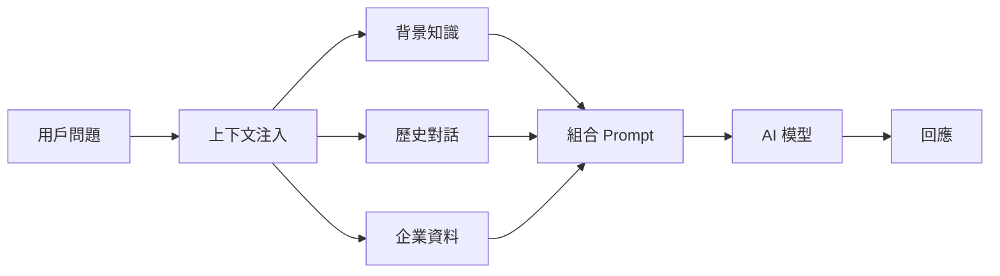
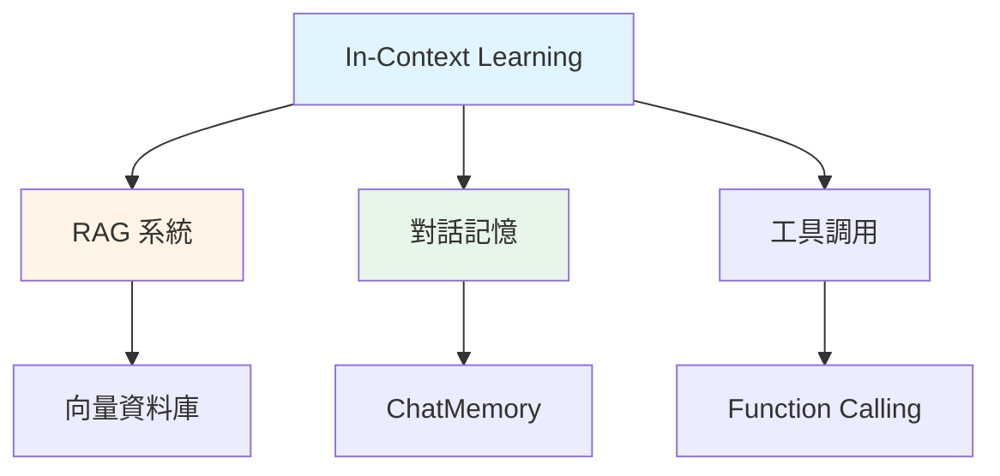

# 6.1 In-Context Learning (情境學習)

> **對應章節**: Day16
> **對應範例**: `chapter6-memory-core`
> **難度**: ⭐⭐☆☆☆

---

## 📚 本章概要

In-Context Learning (ICL) 是理解 AI 記憶系統的基礎。本章將帶你理解 AI 如何在不更新模型參數的情況下,透過上下文資訊來適應新任務,以及如何在 Spring AI 中實現這個機制。

**學習目標**:
- 理解 In-Context Learning 的核心概念
- 掌握上下文注入的三種方式
- 學會使用 System Message 提供背景知識
- 了解 Spring AI 1.1 的改進

---

## 🎯 為什麼需要 In-Context Learning?

### AI 的無狀態特性

AI 模型本身是**無狀態推論**引擎,這意味著:

```
第一次對話: "我叫Kevin"      → AI: "你好,Kevin!"
第二次對話: "我叫什麼名字?"   → AI: "抱歉,我不知道你的名字"
```

每次對話都是獨立的,AI 不會記住之前說過的話。這就像一個失憶症患者,每次見面都需要重新介紹自己。

### In-Context Learning 的解決方案

In-Context Learning 透過**在每次請求中攜帶相關上下文**來解決這個問題:

```
請求內容:
  上下文: "我叫Kevin"
  問題: "我叫什麼名字?"

AI回應: "你叫Kevin"
```

---

## 🔍 In-Context Learning 核心概念

### 什麼是 In-Context Learning?

In-Context Learning 最初在 GPT-3 論文中被提出,它是一種讓語言模型根據給定實例理解任務的方式。

**核心特點**:

1. **無需參數更新**: 不改變模型內部參數,直接利用已有知識
2. **上下文理解**: 理解輸入的上下文(詞彙、語法、語義關係)
3. **快速適應**: 只需少量示例就能適應新任務
4. **靈活性**: 適用於各種複雜的語言任務

### 工作原理



### In-Context Learning vs Fine-tuning

| 比較項目 | In-Context Learning | Fine-tuning |
|---------|---------------------|-------------|
| 參數更新 | ❌ 不需要 | ✅ 需要 |
| 訓練成本 | 💰 極低 | 💰💰💰 很高 |
| 適應速度 | ⚡ 即時 | 🐌 需要數小時/數天 |
| 資料需求 | 📄 少量示例即可 | 📚 需要大量標註資料 |
| 適用場景 | 快速原型、企業知識庫 | 特定領域、長期優化 |

---

## 💻 實現方式

### 方式 1: 基礎上下文注入

最簡單的方式是在用戶問題前加入背景資訊:

```java
// 對應範例: chapter6-memory-core/src/main/java/.../service/ChatMemoryService.java:116

@Service
public class ChatMemoryService {

    @Autowired
    private ChatClient chatClient;

    public String chatWithContext(String userQuestion) {
        // 注入上下文資訊
        String contextualPrompt = """
            背景資訊: Spring AI 是 Spring 生態系統中用於開發 AI 應用的框架

            用戶問題: %s
            """.formatted(userQuestion);

        return chatClient.prompt()
            .user(contextualPrompt)
            .call()
            .content();
    }
}
```

**優點**: 簡單直接,容易理解
**缺點**: 每次都要手動組裝,不夠優雅

---

### 方式 2: 使用 System Message

System Message 是更專業的做法,可以設定 AI 的「人設」和背景知識:

```java
// 對應範例: chapter6-memory-core/src/main/java/.../config/ChatClientConfig.java:29

@Configuration
public class ChatClientConfig {

    @Bean
    public ChatClient enterpriseChatClient(ChatModel chatModel) {
        return ChatClient.builder(chatModel)
            .defaultSystem("""
                你是一個企業內部 AI 助手,具備以下知識:

                技術專家:
                - Spring AI 專家: Kevin,擁有20年Java開發經驗
                - 前端專家: 張小美,React與Vue.js專家

                公司技術棧:
                - 後端: Spring Boot 3.2
                - 前端: React 18
                - 資料庫: PostgreSQL

                請根據這些資訊回答問題,保持專業和準確。
                """)
            .build();
    }
}
```

**使用方式**:
```java
@Service
public class EnterpriseService {

    @Autowired
    private ChatClient enterpriseChatClient;

    public String askQuestion(String question) {
        // System Message 會自動加入到每次對話中
        return enterpriseChatClient.prompt()
            .user(question)
            .call()
            .content();
    }
}
```

**優點**:
- ✅ 一次設定,全局生效
- ✅ 角色與知識分離清晰
- ✅ Spring AI 推薦的最佳實踐

---

### 方式 3: 動態上下文注入

根據問題內容動態選擇相關上下文:

```java
// 對應範例: chapter6-memory-core (概念範例)

@Service
public class SmartContextService {

    private final Map<String, String> knowledgeBase = Map.of(
        "spring-ai", "Spring AI 是用於開發 AI 應用的 Spring 框架...",
        "chatclient", "ChatClient 是 Spring AI 1.1 引入的新 API...",
        "advisor", "Advisor 是 Spring AI 的插件系統..."
    );

    public String chatWithSmartContext(String question) {
        // 1. 根據問題關鍵字找到相關知識
        String relevantContext = findRelevantContext(question);

        // 2. 組合上下文與問題
        String prompt = """
            參考資訊: %s

            問題: %s

            請根據參考資訊回答問題。
            """.formatted(relevantContext, question);

        // 3. 調用 AI
        return chatClient.prompt()
            .user(prompt)
            .call()
            .content();
    }

    private String findRelevantContext(String question) {
        // 簡單的關鍵字匹配(實際應用中可使用向量搜尋)
        return knowledgeBase.entrySet().stream()
            .filter(entry -> question.toLowerCase()
                .contains(entry.getKey()))
            .map(Map.Entry::getValue)
            .findFirst()
            .orElse("沒有找到相關資訊");
    }
}
```

**優點**:
- ✅ 只提供相關資訊,節省 Token
- ✅ 可擴展性高
- ✅ 為 RAG 系統打下基礎

---

## 🆕 Spring AI 1.1 的改進

### 更簡潔的 API

```java
// ❌ 舊版本 (Spring AI 1.0)
ChatResponse response = chatModel.call(new Prompt(List.of(
    new SystemMessage("你是專家"),
    new UserMessage("問題")
)));
String answer = response.getResult().getOutput().getContent();

// ✅ 新版本 (Spring AI 1.1+)
String answer = chatClient.prompt()
    .system("你是專家")
    .user("問題")
    .call()
    .content();
```

**改進點**:
- 🔄 流暢的鏈式 API
- 📝 更直觀的方法命名
- 🎯 減少樣板代碼

### 內建 Advisor 支援

Spring AI 1.1 引入了 Advisor 機制,可以自動處理上下文注入:

```java
@Bean
public ChatClient smartChatClient(ChatModel chatModel) {
    return ChatClient.builder(chatModel)
        .defaultAdvisors(
            // 自動處理上下文注入的 Advisor
            new ContextEnhancementAdvisor(knowledgeBase)
        )
        .build();
}
```

我們將在 [6.4 Advisor 自定義開發](./6.4-Advisor-自定義開發.md) 深入探討。

---

## 🎬 實際應用場景

### 1. 企業知識庫助手

```java
@Bean
public ChatClient companyAssistant(ChatModel chatModel) {
    return ChatClient.builder(chatModel)
        .defaultSystem("""
            你是XX公司的AI助手,了解以下資訊:

            公司規章:
            - 年假制度: 入職滿一年享有7天年假
            - 遠端工作: 每週最多2天

            福利制度:
            - 健康檢查: 每年一次
            - 學習補助: 每人每年$10,000

            請根據這些資訊回答員工問題。
            """)
        .build();
}
```

### 2. 技術支援機器人

```java
@Bean
public ChatClient techSupportBot(ChatModel chatModel) {
    return ChatClient.builder(chatModel)
        .defaultSystem("""
            你是技術支援機器人,專精於:

            故障排除:
            - Spring Boot 應用啟動失敗
            - 資料庫連線問題
            - API 呼叫錯誤

            常見解決方案:
            - 檢查 application.yml 配置
            - 確認資料庫服務啟動
            - 查看日誌檔案

            請提供清晰的步驟指引。
            """)
        .build();
}
```

### 3. 客服對話系統

結合歷史對話的上下文:

```java
public String customerService(String conversationId, String question) {
    // 1. 獲取歷史對話
    List<Message> history = chatMemory.get(conversationId);

    // 2. 組合上下文
    String context = history.stream()
        .map(msg -> msg.getContent())
        .collect(Collectors.joining("\n"));

    // 3. 發送完整上下文給 AI
    return chatClient.prompt()
        .system("你是客服人員,請根據對話歷史提供協助")
        .user("""
            對話歷史:
            %s

            新問題: %s
            """.formatted(context, question))
        .call()
        .content();
}
```

---

## 🔗 與其他概念的關係



- **RAG 系統** ([6.2 RAG 基礎概念](./6.2-RAG-基礎概念.md)): 透過向量檢索自動找到相關上下文
- **對話記憶** ([6.3 ChatMemory 短期記憶系統](./6.3-ChatMemory-短期記憶系統.md)): 將歷史對話作為上下文
- **工具調用**: AI 根據上下文決定是否調用外部工具

---

## 📝 重點回顧

### 核心概念
✅ AI 本身是無狀態的,每次對話都是獨立的
✅ In-Context Learning 透過攜帶上下文讓 AI 具備「記憶」
✅ 不需要更新模型參數,只需提供相關資訊

### 三種實現方式
1. **基礎注入**: 手動組裝上下文和問題
2. **System Message**: 設定全局背景知識(推薦)
3. **動態注入**: 根據問題選擇相關上下文

### Spring AI 1.1 優勢
- 🔄 更簡潔的 Fluent API
- 🎯 內建 Advisor 機制
- 📦 開箱即用的最佳實踐

---

## 🚀 下一步

現在你已經理解了 In-Context Learning 的基本概念,接下來我們將學習:

👉 [6.2 RAG 基礎概念](./6.2-RAG-基礎概念.md) - 如何自動檢索相關上下文
👉 [6.3 ChatMemory 短期記憶系統](./6.3-ChatMemory-短期記憶系統.md) - 如何管理對話歷史

---

## 📚 完整範例

本章概念的完整實現請參考:

📁 **chapter6-memory-core**
- `src/main/java/com/example/memory/config/ChatClientConfig.java` - ChatClient 配置
- `src/main/java/com/example/memory/service/ChatMemoryService.java` - 對話服務
- `src/main/java/com/example/memory/controller/ChatController.java` - REST API

🔗 **啟動範例**:
```bash
cd code-examples/chapter6-ai-memory/chapter6-memory-core
mvn spring-boot:run
```

🧪 **測試 API**:
```bash
curl http://localhost:8080/api/chat/health
```

---

**相關章節**:
- ← 上一章: [第5章 Spring AI 進階功能](../../chapter5/README.md)
- → 下一章: [6.2 RAG 基礎概念](./6.2-RAG-基礎概念.md)
