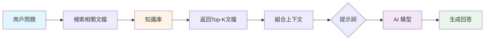
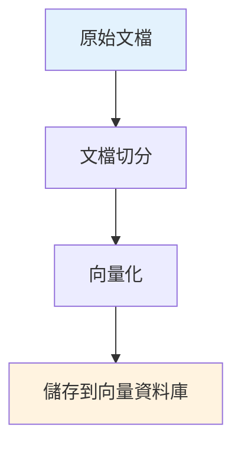
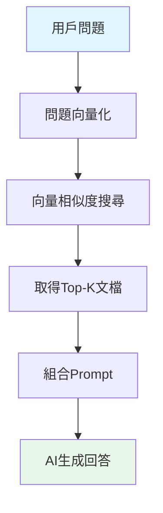
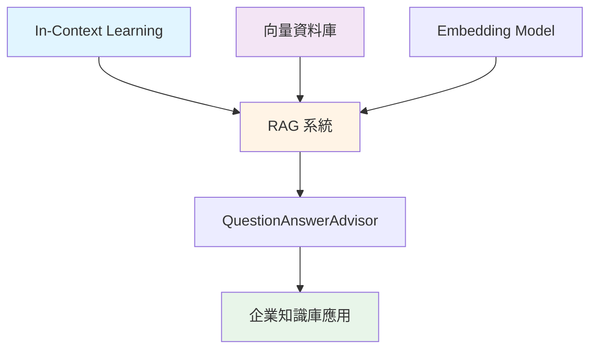

# 6.2 RAG 基礎概念 (檢索增強生成)

> **對應章節**: Day16
> **對應範例**: `chapter6-memory-core`
> **難度**: ⭐⭐⭐☆☆

---

## 📚 本章概要

RAG (Retrieval-Augmented Generation, 檢索增強生成) 是當前最實用的 AI 應用架構之一。它結合了資訊檢索和生成式 AI 的優點,讓 AI 能夠基於企業自有的知識庫來回答問題。

**學習目標**:
- 理解 RAG 的核心概念與工作流程
- 掌握 RAG 與 Fine-tuning 的差異
- 學會使用 Spring AI 實現簡單的 RAG 系統
- 了解 QuestionAnswerAdvisor 的使用

---

## 🎯 什麼是 RAG?

### 核心問題

AI 模型都有**知識截止日期**,例如:
- GPT-4 的知識截止於 2023年4月
- 不知道你公司的內部規章
- 不了解最新的產品資訊

**傳統方案的問題**:
```
❌ 直接問AI: "我們公司的年假制度是什麼?"
   回答: "抱歉,我不知道貴公司的年假制度。"

❌ Fine-tuning: 成本高、時間長、每次更新都要重新訓練
```

**RAG 的解決方案**:
```
✅ RAG系統:
   1. 先從公司知識庫檢索相關文件
   2. 將文件內容和問題一起提供給AI
   3. AI根據檢索到的文件生成答案

   回答: "根據公司規章,入職滿一年享有7天年假..."
```

---

## 🔍 RAG 工作流程

### 基本流程圖



### 詳細步驟

**1. 建立知識庫階段** (離線準備)


**2. 查詢應答階段** (線上處理)


---

## 💡 RAG vs Fine-tuning vs Prompt Engineering

### 三種方法對比

| 比較項目 | RAG | Fine-tuning | Prompt Engineering |
|---------|-----|-------------|-------------------|
| **實現難度** | ⭐⭐⭐ 中等 | ⭐⭐⭐⭐⭐ 困難 | ⭐ 簡單 |
| **成本** | 💰💰 中等 | 💰💰💰💰 很高 | 💰 低 |
| **知識更新** | ⚡ 即時 | 🐌 需重新訓練 | ⚡ 即時 |
| **準確性** | ✅ 高 | ✅✅ 很高 | ⚠️ 中等 |
| **適用場景** | 企業知識庫、FAQ | 特定領域專業任務 | 簡單任務、原型 |
| **可追溯性** | ✅ 可追溯來源 | ❌ 無法追溯 | ⚠️ 依賴上下文 |

### 選擇建議

```java
// 使用 RAG 的場景
✅ 企業內部知識庫查詢
✅ 產品文檔問答系統
✅ 法規政策諮詢
✅ 技術支援機器人
✅ 需要引用來源的場景

// 使用 Fine-tuning 的場景
✅ 特定風格的文本生成(如法律文書)
✅ 專業領域術語理解(如醫療診斷)
✅ 長期固定的任務
✅ 對回答風格有嚴格要求

// 使用 Prompt Engineering 的場景
✅ 快速原型開發
✅ 一般性對話
✅ 簡單的文本處理
```

---

## 💻 Spring AI 中的 RAG 實現

### 方式 1: 手動實現簡單 RAG

```java
// 對應範例: chapter6-memory-core (概念範例)

@Service
public class SimpleRAGService {

    @Autowired
    private ChatClient chatClient;

    // 簡化的知識庫 (實際應用中使用向量資料庫)
    private final Map<String, String> knowledgeBase = Map.of(
        "spring-ai", """
            Spring AI 是 Spring 生態系統的 AI 框架,提供:
            - 統一的 API 介面
            - 多種 AI 模型支援 (OpenAI, Azure, Anthropic)
            - 向量資料庫整合
            - 自動配置與 Spring Boot 整合
            """,
        "rag", """
            RAG (檢索增強生成) 工作流程:
            1. 問題向量化
            2. 相似度搜尋
            3. 檢索Top-K文檔
            4. 組合上下文
            5. AI生成回答
            """
    );

    public String askQuestion(String question) {
        // 步驟1: 檢索相關文檔
        String relevantDoc = retrieveRelevantDocument(question);

        // 步驟2: 組合提示詞
        String prompt = buildPrompt(question, relevantDoc);

        // 步驟3: 調用AI生成回答
        return chatClient.prompt()
            .user(prompt)
            .call()
            .content();
    }

    /**
     * 檢索相關文檔
     * (簡化版本,實際應使用向量相似度搜尋)
     */
    private String retrieveRelevantDocument(String question) {
        // 簡單的關鍵字匹配
        return knowledgeBase.entrySet().stream()
            .filter(entry -> question.toLowerCase()
                .contains(entry.getKey()))
            .map(Map.Entry::getValue)
            .findFirst()
            .orElse("未找到相關文檔");
    }

    /**
     * 組合提示詞
     */
    private String buildPrompt(String question, String document) {
        return """
            請根據以下參考資料回答問題:

            【參考資料】
            %s

            【問題】
            %s

            【要求】
            1. 僅根據參考資料回答
            2. 如果資料中沒有相關資訊,請明確說明
            3. 回答要準確、簡潔
            """.formatted(document, question);
    }
}
```

**使用範例**:
```java
@RestController
@RequestMapping("/api/rag")
public class RAGController {

    @Autowired
    private SimpleRAGService ragService;

    @GetMapping("/ask")
    public String ask(@RequestParam String question) {
        return ragService.askQuestion(question);
    }
}
```

---

### 方式 2: 使用 QuestionAnswerAdvisor

Spring AI 1.1 提供了內建的 RAG 支援:

```java
// 對應範例: chapter6-memory-core/src/main/java/.../config/ChatClientConfig.java

@Configuration
public class RAGConfig {

    /**
     * 配置帶有RAG功能的ChatClient
     */
    @Bean
    public ChatClient ragChatClient(
            ChatClient.Builder builder,
            VectorStore vectorStore) {

        return builder
            .defaultAdvisors(
                // QuestionAnswerAdvisor 自動處理RAG流程
                new QuestionAnswerAdvisor(vectorStore, SearchRequest.defaults()
                    .withTopK(5)                    // 檢索前5個最相關文檔
                    .withSimilarityThreshold(0.75)  // 相似度門檻
                )
            )
            .build();
    }

    /**
     * 向量資料庫配置
     * (這裡使用簡單的記憶體版本,生產環境應使用持久化方案)
     */
    @Bean
    public VectorStore vectorStore(EmbeddingModel embeddingModel) {
        // 實際應用中替換為 PostgreSQL、Neo4j 等
        return new SimpleVectorStore(embeddingModel);
    }
}
```

**使用方式**:
```java
@Service
public class EnterpriseRAGService {

    @Autowired
    @Qualifier("ragChatClient")
    private ChatClient ragChatClient;

    public String askWithRAG(String question) {
        // QuestionAnswerAdvisor 會自動:
        // 1. 將問題向量化
        // 2. 從VectorStore搜尋相關文檔
        // 3. 組合上下文和問題
        // 4. 調用AI生成回答
        return ragChatClient.prompt()
            .user(question)
            .call()
            .content();
    }
}
```

---

## 🎬 實際應用場景

### 1. 企業FAQ系統

```java
@Service
public class CompanyFAQService {

    @Autowired
    private ChatClient ragChatClient;

    @Autowired
    private VectorStore vectorStore;

    /**
     * 初始化FAQ知識庫
     */
    @PostConstruct
    public void initializeFAQ() {
        List<Document> faqDocuments = List.of(
            new Document("""
                Q: 年假制度是什麼?
                A: 入職滿一年享有7天年假,滿三年10天,滿五年15天。
                """),
            new Document("""
                Q: 如何申請遠端工作?
                A: 填寫遠端工作申請表,經主管核准後即可。每週最多2天。
                """),
            new Document("""
                Q: 健康檢查福利?
                A: 公司每年提供一次免費健康檢查,可選擇合作醫院。
                """)
        );

        // 將FAQ文檔加入向量資料庫
        vectorStore.add(faqDocuments);
    }

    public String answerFAQ(String question) {
        return ragChatClient.prompt()
            .user(question)
            .call()
            .content();
    }
}
```

### 2. 技術文檔助手

```java
@Service
public class TechDocsAssistant {

    public void loadTechnicalDocuments() {
        // 從文件系統載入Markdown文檔
        List<Document> docs = loadMarkdownFiles("docs/technical/");

        // 文檔切分 (長文檔切成小塊)
        List<Document> chunks = splitDocuments(docs, 500); // 每塊500字

        // 儲存到向量資料庫
        vectorStore.add(chunks);
    }

    private List<Document> splitDocuments(List<Document> docs, int chunkSize) {
        List<Document> chunks = new ArrayList<>();

        for (Document doc : docs) {
            String content = doc.getContent();
            int start = 0;

            while (start < content.length()) {
                int end = Math.min(start + chunkSize, content.length());
                String chunk = content.substring(start, end);

                chunks.add(new Document(
                    chunk,
                    Map.of("source", doc.getMetadata().get("source"))
                ));

                start = end;
            }
        }

        return chunks;
    }
}
```

### 3. 客戶支援機器人

```java
@Service
public class CustomerSupportBot {

    @Autowired
    private ChatClient ragChatClient;

    public SupportResponse handleCustomerQuery(String query) {
        // RAG查詢
        String answer = ragChatClient.prompt()
            .user(query)
            .call()
            .content();

        // 獲取引用來源
        List<String> sources = extractSources(answer);

        return SupportResponse.builder()
            .answer(answer)
            .sources(sources)
            .confidence(calculateConfidence(answer))
            .build();
    }

    private List<String> extractSources(String answer) {
        // 從回答中提取引用的文檔來源
        // 這需要在prompt中要求AI註明來源
        return List.of(); // 簡化實現
    }
}
```

---

## 🔧 RAG 系統優化技巧

### 1. 提示詞優化

```java
private String buildOptimizedPrompt(String question, List<Document> docs) {
    String context = docs.stream()
        .map(doc -> doc.getContent())
        .collect(Collectors.joining("\n---\n"));

    return """
        你是一個專業的客服助手。請根據以下參考資料回答問題。

        【參考資料】
        %s

        【問題】
        %s

        【回答要求】
        1. 僅使用參考資料中的資訊
        2. 如果資料不足以回答問題,請誠實說明
        3. 在回答中引用具體的資料來源
        4. 保持回答簡潔、專業
        5. 如果有多個相關資訊,請整合後回答

        【回答格式】
        答案: [你的回答]
        來源: [引用的資料編號]
        """.formatted(context, question);
}
```

### 2. 文檔預處理

```java
@Service
public class DocumentPreprocessor {

    /**
     * 清理和標準化文檔
     */
    public Document cleanDocument(Document doc) {
        String content = doc.getContent();

        // 移除多餘空白
        content = content.replaceAll("\\s+", " ");

        // 移除特殊字符
        content = content.replaceAll("[^\\p{L}\\p{N}\\s.,!?;:]", "");

        // 添加元數據
        Map<String, Object> metadata = new HashMap<>(doc.getMetadata());
        metadata.put("processedAt", LocalDateTime.now());
        metadata.put("wordCount", content.split("\\s+").length);

        return new Document(content, metadata);
    }
}
```

### 3. 檢索策略優化

```java
@Service
public class AdvancedRAGService {

    public String askWithHybridRetrieval(String question) {
        // 混合檢索: 向量搜尋 + 關鍵字搜尋
        List<Document> vectorResults = vectorStore.similaritySearch(
            SearchRequest.query(question).withTopK(3)
        );

        List<Document> keywordResults = keywordSearch(question, 3);

        // 合併去重
        Set<Document> allDocs = new HashSet<>();
        allDocs.addAll(vectorResults);
        allDocs.addAll(keywordResults);

        // 重新排序
        List<Document> reranked = rerank(new ArrayList<>(allDocs), question);

        // 使用前5個文檔生成回答
        return generateAnswer(question, reranked.subList(0, 5));
    }
}
```

---

## 🔗 與其他概念的關係



- **In-Context Learning** ([6.1](./6.1-In-Context-Learning.md)): RAG 是 ICL 的自動化實現
- **向量資料庫** ([6.5](./6.5-向量資料庫選擇指南.md)): RAG 的核心基礎設施
- **ChatMemory** ([6.3](./6.3-ChatMemory-短期記憶系統.md)): 可與 RAG 結合使用

---

## 📝 重點回顧

### RAG 核心概念
✅ 檢索增強生成 = 資訊檢索 + AI 生成
✅ 解決 AI 知識截止日期問題
✅ 可追溯答案來源,提高可信度

### RAG 基本流程
1. **離線**: 文檔處理 → 向量化 → 儲存
2. **線上**: 問題檢索 → 組合上下文 → AI生成

### Spring AI 實現方式
- **手動實現**: 靈活但需要更多代碼
- **QuestionAnswerAdvisor**: 開箱即用,推薦方案

### 適用場景
✅ 企業知識庫、FAQ系統
✅ 技術文檔助手
✅ 客戶支援機器人

---

## 🚀 下一步

了解 RAG 基礎概念後,接下來將學習:

👉 [6.3 ChatMemory 短期記憶系統](./6.3-ChatMemory-短期記憶系統.md) - 管理對話歷史
👉 [6.5 向量資料庫選擇指南](./6.5-向量資料庫選擇指南.md) - RAG 的基礎設施
👉 [6.7 VectorStoreChatMemoryAdvisor](./6.7-VectorStoreChatMemoryAdvisor.md) - RAG + 記憶的結合

---

## 📚 完整範例

本章概念的完整實現請參考:

📁 **chapter6-memory-core**
- 基礎 RAG 實現範例
- QuestionAnswerAdvisor 配置

📁 **chapter6-memory-vector**
- 完整的向量資料庫整合
- 生產級 RAG 系統

🔗 **啟動範例**:
```bash
cd code-examples/chapter6-ai-memory/chapter6-memory-core
mvn spring-boot:run
```

---

**相關章節**:
- ← 上一章: [6.1 In-Context Learning](./6.1-In-Context-Learning.md)
- → 下一章: [6.3 ChatMemory 短期記憶系統](./6.3-ChatMemory-短期記憶系統.md)
