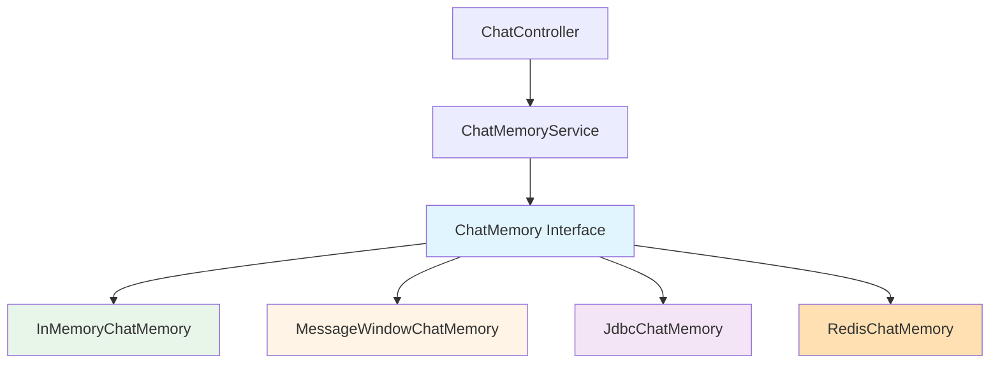

# 6.3 ChatMemory 短期記憶系統

> **對應章節**: Day17
> **對應範例**: `chapter6-memory-core`
> **難度**: ⭐⭐⭐☆☆

---

## 📚 本章概要

ChatMemory 是 Spring AI 提供的企業級對話記憶管理系統。它解決了傳統「土炮記憶」的諸多問題,提供對話隔離、容量管理、持久化儲存等企業級功能。

**學習目標**:
- 理解 ChatMemory 架構設計
- 掌握 MessageChatMemoryAdvisor 和 PromptChatMemoryAdvisor 的差異
- 學會配置不同的儲存後端
- 了解記憶容量管理策略

---

## 🎯 為什麼需要 ChatMemory?

### 土炮記憶的問題

最簡單的做法是用 List 儲存對話:

```java
// ❌ 土炮做法的問題
@RestController
public class BadMemoryController {

    private List<Message> memMessage = new ArrayList<>(); // 問題多多!

    @GetMapping("/chat")
    public String chat(@RequestParam String prompt) {
        memMessage.add(new UserMessage(prompt));

        String response = chatClient.prompt()
            .messages(memMessage)
            .call()
            .content();

        memMessage.add(new AssistantMessage(response));
        return response;
    }
}
```

**問題清單**:
1. ❌ **無對話隔離**: 所有用戶共用同一個 List
2. ❌ **無容量管理**: List 會無限增長,最終記憶體爆炸
3. ❌ **無持久化**: 應用重啟後記憶全部丟失
4. ❌ **併發不安全**: 多用戶同時請求會造成資料混亂
5. ❌ **無可觀測性**: 無法監控記憶使用狀況

### ChatMemory 的解決方案

```java
// ✅ Spring AI 企業級方案
@Service
public class ProperMemoryService {

    @Autowired
    private ChatMemory chatMemory; // 企業級記憶管理

    public String chat(String conversationId, String message) {
        return chatClient.prompt()
            .advisors(MessageChatMemoryAdvisor.builder(chatMemory)
                .conversationId(conversationId)    // 對話隔離
                .lastN(20)                         // 容量管理
                .build())
            .user(message)
            .call()
            .content();
    }
}
```

---

## 🏗️ ChatMemory 架構設計

### 核心介面

```java
// Spring AI ChatMemory 介面
public interface ChatMemory {
    // 新增訊息
    void add(String conversationId, Message message);
    void addAll(String conversationId, List<Message> messages);

    // 取得訊息
    List<Message> get(String conversationId);
    List<Message> getRecent(String conversationId, int limit);

    // 管理對話
    void clear(String conversationId);
    boolean exists(String conversationId);
    long count(String conversationId);
}
```

### 架構分層



---

## 💻 InMemoryChatMemory 實現

### 基本實現

```java
// 對應範例: chapter6-memory-core/.../memory/InMemoryChatMemory.java:17

@Component
public class InMemoryChatMemory implements ChatMemory {

    // 使用 ConcurrentHashMap 確保線程安全
    private final Map<String, List<Message>> conversations
        = new ConcurrentHashMap<>();

    @Override
    public void add(String conversationId, Message message) {
        conversations
            .computeIfAbsent(conversationId, k -> new ArrayList<>())
            .add(message);
    }

    @Override
    public List<Message> get(String conversationId) {
        return conversations.getOrDefault(
            conversationId,
            Collections.emptyList()
        );
    }

    @Override
    public List<Message> getRecent(String conversationId, int limit) {
        List<Message> messages = get(conversationId);
        int start = Math.max(0, messages.size() - limit);
        return new ArrayList<>(messages.subList(start, messages.size()));
    }

    @Override
    public void clear(String conversationId) {
        conversations.remove(conversationId);
    }
}
```

**特點**:
- ✅ 線程安全 (ConcurrentHashMap)
- ✅ 對話隔離 (conversationId 作為 key)
- ✅ 開發環境首選
- ⚠️ 無持久化 (重啟丟失)

---

## 🪟 MessageWindowChatMemory (滑動視窗)

### 為什麼需要滑動視窗?

```
問題: 對話太長會怎樣?

第1輪: "你好" → 2 tokens
第2輪: "介紹Spring AI" → 100 tokens
...
第50輪: 總計 5000 tokens ← 成本高、回應慢
第100輪: 總計 10000 tokens ← 超過模型限制!
```

### 滑動視窗策略

```java
// 對應範例: chapter6-memory-core/.../memory/MessageWindowChatMemory.java

public class MessageWindowChatMemory implements ChatMemory {

    private final ChatMemory delegate;
    private final int maxMessages; // 最大保留訊息數

    public MessageWindowChatMemory(ChatMemory delegate, int maxMessages) {
        this.delegate = delegate;
        this.maxMessages = maxMessages;
    }

    @Override
    public List<Message> get(String conversationId) {
        List<Message> allMessages = delegate.get(conversationId);

        // 只返回最近的 N 條訊息
        if (allMessages.size() <= maxMessages) {
            return allMessages;
        }

        int start = allMessages.size() - maxMessages;
        return new ArrayList<>(allMessages.subList(start, allMessages.size()));
    }

    @Override
    public void add(String conversationId, Message message) {
        delegate.add(conversationId, message);

        // 自動清理舊訊息
        List<Message> messages = delegate.get(conversationId);
        if (messages.size() > maxMessages * 2) { // 超過2倍時清理
            List<Message> recentMessages = messages.subList(
                messages.size() - maxMessages,
                messages.size()
            );
            delegate.clear(conversationId);
            delegate.addAll(conversationId, recentMessages);
        }
    }
}
```

**配置方式**:
```java
// 對應範例: chapter6-memory-core/.../config/ChatMemoryConfig.java:64

@Bean
public ChatMemory chatMemory(InMemoryChatMemory inMemory) {
    return new MessageWindowChatMemory(
        inMemory,
        50  // 保留最近50條訊息
    );
}
```

---

## 🎭 兩種 Advisor 的差異

### MessageChatMemoryAdvisor

將對話歷史作為 **Message 集合** 加入:

```java
// 實際發送給 AI 的內容
List<Message> messages = [
    UserMessage("我叫Kevin"),
    AssistantMessage("你好,Kevin!"),
    UserMessage("我叫什麼名字?")  // ← 新問題
];

// AI 能看到完整的對話結構
```

**優點**:
- ✅ 保留完整對話結構
- ✅ AI 能區分用戶和助手的訊息
- ✅ Spring AI 推薦方案

**使用方式**:
```java
@Service
public class ChatService {

    public String chat(String conversationId, String message) {
        return chatClient.prompt()
            .advisors(MessageChatMemoryAdvisor.builder(chatMemory)
                .conversationId(conversationId)
                .build())
            .user(message)
            .call()
            .content();
    }
}
```

### PromptChatMemoryAdvisor

將對話歷史作為 **文字** 加入 System Message:

```java
// 實際發送給 AI 的內容
SystemMessage: """
對話歷史:
用戶: 我叫Kevin
助手: 你好,Kevin!
"""

UserMessage: "我叫什麼名字?"
```

**優點**:
- ✅ 更節省 tokens
- ✅ 可自定義格式

**使用方式**:
```java
@Service
public class ChatService {

    public String chat(String conversationId, String message) {
        return chatClient.prompt()
            .advisors(PromptChatMemoryAdvisor.builder(chatMemory)
                .conversationId(conversationId)
                .promptTemplate("""
                    歷史對話:
                    {history}

                    請根據歷史回答問題。
                    """)
                .build())
            .user(message)
            .call()
            .content();
    }
}
```

---

## 🗄️ 多種儲存後端

### 1. InMemory (開發環境)

```yaml
# application.yml
memory:
  storage-type: memory
```

**特點**:
- ✅ 最簡單
- ✅ 速度最快
- ❌ 重啟丟失

### 2. Window + InMemory (開發環境)

```yaml
memory:
  storage-type: window
  window-size: 50
```

**特點**:
- ✅ 自動容量管理
- ✅ 開發環境推薦
- ❌ 重啟丟失

### 3. JDBC (生產環境)

```java
@Bean
@ConditionalOnProperty(name = "memory.storage-type", havingValue = "jdbc")
public ChatMemory jdbcChatMemory(DataSource dataSource) {
    return new JdbcChatMemory(dataSource);
}
```

```yaml
memory:
  storage-type: jdbc

spring:
  datasource:
    url: jdbc:postgresql://localhost:5432/chatdb
    username: postgres
    password: password
```

**特點**:
- ✅ 持久化儲存
- ✅ 可跨實例共享
- ✅ 生產環境推薦

### 4. Redis (高併發)

```java
@Bean
@ConditionalOnProperty(name = "memory.storage-type", havingValue = "redis")
public ChatMemory redisChatMemory(RedisTemplate<String, Object> redis) {
    return new RedisChatMemory(redis);
}
```

```yaml
memory:
  storage-type: redis

spring:
  redis:
    host: localhost
    port: 6379
```

**特點**:
- ✅ 高性能
- ✅ 支援分散式
- ✅ 大規模應用推薦

---

## 🎬 完整使用範例

### 配置 ChatClient

```java
@Configuration
public class ChatConfig {

    @Bean
    public ChatClient memoryChatClient(
            ChatModel chatModel,
            ChatMemory chatMemory) {

        return ChatClient.builder(chatModel)
            .defaultAdvisors(
                MessageChatMemoryAdvisor.builder(chatMemory)
                    .order(1)  // 最高優先級
                    .build()
            )
            .build();
    }
}
```

### 服務層使用

```java
@Service
public class ConversationService {

    @Autowired
    private ChatClient memoryChatClient;

    @Autowired
    private ChatMemory chatMemory;

    /**
     * 發送訊息
     */
    public String sendMessage(String conversationId, String message) {
        return memoryChatClient.prompt()
            .advisors(a -> a.param(CONVERSATION_ID, conversationId))
            .user(message)
            .call()
            .content();
    }

    /**
     * 獲取對話歷史
     */
    public List<Message> getHistory(String conversationId) {
        return chatMemory.get(conversationId);
    }

    /**
     * 清除對話
     */
    public void clearConversation(String conversationId) {
        chatMemory.clear(conversationId);
    }
}
```

### Controller 層

```java
// 對應範例: chapter6-memory-core/.../controller/ChatController.java:38

@RestController
@RequestMapping("/api/chat")
public class ChatController {

    @Autowired
    private ConversationService conversationService;

    @PostMapping("/conversation/{conversationId}")
    public ChatResponse chat(
            @PathVariable String conversationId,
            @RequestBody ChatRequest request) {

        String response = conversationService.sendMessage(
            conversationId,
            request.getMessage()
        );

        return ChatResponse.success(conversationId, response);
    }

    @GetMapping("/conversation/{conversationId}/history")
    public List<Message> getHistory(@PathVariable String conversationId) {
        return conversationService.getHistory(conversationId);
    }

    @DeleteMapping("/conversation/{conversationId}")
    public void clearConversation(@PathVariable String conversationId) {
        conversationService.clearConversation(conversationId);
    }
}
```

---

## 📝 重點回顧

### ChatMemory 解決的問題
✅ 對話隔離 - 每個 conversationId 獨立
✅ 容量管理 - MessageWindowChatMemory 自動清理
✅ 持久化 - 支援 JDBC、Redis 等後端
✅ 併發安全 - 使用 ConcurrentHashMap
✅ 可觀測性 - 內建監控和日誌

### 兩種 Advisor
- **MessageChatMemoryAdvisor**: 保留完整對話結構(推薦)
- **PromptChatMemoryAdvisor**: 節省 tokens,可自定義格式

### 儲存後端選擇
- **開發**: InMemory 或 Window
- **生產**: JDBC 或 Redis
- **大規模**: Redis + Cluster

---

## 🚀 下一步

👉 [6.4 Advisor 自定義開發](./6.4-Advisor-自定義開發.md) - 深入了解 Advisor 機制
👉 [6.7 VectorStoreChatMemoryAdvisor](./6.7-VectorStoreChatMemoryAdvisor.md) - 向量記憶系統

---

**相關章節**:
- ← 上一章: [6.2 RAG 基礎概念](./6.2-RAG-基礎概念.md)
- → 下一章: [6.4 Advisor 自定義開發](./6.4-Advisor-自定義開發.md)
