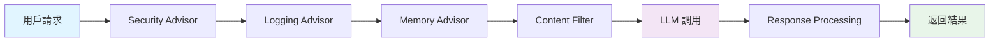
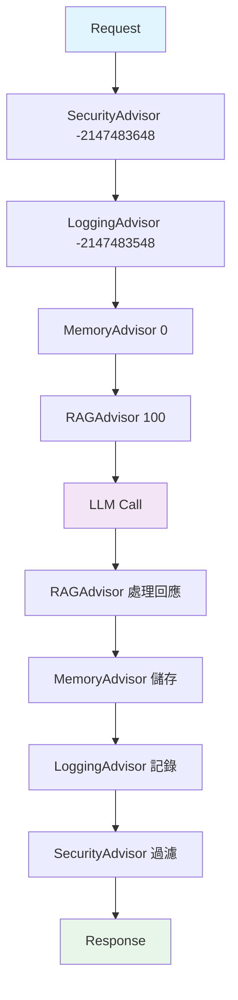

# 6.4 Advisor 自定義開發

> **對應章節**: Day19, Day20
> **對應範例**: `chapter6-memory-core`
> **難度**: ⭐⭐⭐⭐☆

---

## 📚 本章概要

Advisor 是 Spring AI 的插件系統,採用責任鏈模式讓開發者能夠在 AI 調用前後插入自定義邏輯。本章將深入探討如何開發自己的 Advisor。

**學習目標**:
- 理解 Advisor 責任鏈模式
- 掌握 CallAdvisor 和 StreamAdvisor 的差異
- 學會開發自定義 Advisor
- 了解 Advisor 執行順序控制

---

## 🎯 什麼是 Advisor?

### AOP 在 AI 領域的應用



Advisor 就像 Spring AOP,可以在不修改業務代碼的情況下增強功能:
- 🔒 **安全檢查**: 過濾敏感詞
- 📝 **日誌記錄**: 記錄請求和回應
- 💾 **記憶管理**: 自動載入對話歷史
- 📊 **監控統計**: Token 使用量追蹤

---

## 🆕 Spring AI 1.0+ 新版 API

### 核心介面

```java
// 基礎介面
public interface Advisor extends Ordered {
    String getName();     // Advisor 名稱
    int getOrder();       // 執行順序
}

// 非串流場景
public interface CallAdvisor extends Advisor {
    ChatClientResponse adviseCall(
        ChatClientRequest request,
        CallAdvisorChain chain
    );
}

// 串流場景
public interface StreamAdvisor extends Advisor {
    Flux<ChatClientResponse> adviseStream(
        ChatClientRequest request,
        StreamAdvisorChain chain
    );
}
```

### 新舊 API 對比

| 項目 | 舊版 API (已廢棄) | 新版 API (當前) |
|------|------------------|----------------|
| 介面 | RequestResponseAdvisor | CallAdvisor / StreamAdvisor |
| 請求物件 | AdvisedRequest | ChatClientRequest |
| 回應物件 | ChatResponse | ChatClientResponse |
| 上下文 | Map<String, Object> | adviseContext() |
| 鏈處理 | 隱式 | 明確的 chain.nextCall() |

---

## 💻 實戰: TokenUsageLogAdvisor

### 需求分析

我們要開發一個 Advisor 來:
1. 記錄每次對話的輸入輸出
2. 統計 Token 使用量
3. 同時支援串流和非串流

### 完整實現

```java
// 對應範例: chapter6-memory-core/.../advisor/LoggingAdvisor.java (概念)

@Slf4j
public class TokenUsageLogAdvisor implements CallAdvisor, StreamAdvisor {

    @Override
    public String getName() {
        return "TokenUsageLogAdvisor";
    }

    @Override
    public int getOrder() {
        return 0; // 數值越小越先執行
    }

    /**
     * 處理非串流調用
     */
    @Override
    public ChatClientResponse adviseCall(
            ChatClientRequest request,
            CallAdvisorChain chain) {

        // 調用前: 記錄請求
        String conversationId = (String) request.adviseContext()
            .get("conversationId");
        String userMessage = request.userText();

        log.info("=== Request Start ===");
        log.info("Conversation: {}", conversationId);
        log.info("User Message: {}", userMessage);

        // 調用 LLM
        long startTime = System.currentTimeMillis();
        ChatClientResponse response = chain.nextCall(request);
        long duration = System.currentTimeMillis() - startTime;

        // 調用後: 記錄回應和 Token 使用
        String aiMessage = response.chatResponse()
            .getResult()
            .getOutput()
            .getContent();

        log.info("AI Response: {}", aiMessage);
        log.info("Duration: {}ms", duration);

        // 記錄 Token 使用量
        Usage usage = response.chatResponse()
            .getMetadata()
            .getUsage();

        if (usage != null) {
            log.info("Token Usage:");
            log.info("  - Prompt: {}", usage.getPromptTokens());
            log.info("  - Generation: {}", usage.getGenerationTokens());
            log.info("  - Total: {}", usage.getTotalTokens());
        }

        log.info("=== Request End ===");

        return response;
    }

    /**
     * 處理串流調用
     */
    @Override
    public Flux<ChatClientResponse> adviseStream(
            ChatClientRequest request,
            StreamAdvisorChain chain) {

        String conversationId = (String) request.adviseContext()
            .get("conversationId");

        log.info("=== Stream Start === Conversation: {}", conversationId);

        return chain.nextStream(request)
            .doOnNext(response -> {
                // 每個串流片段都可以處理
                String chunk = response.chatResponse()
                    .getResult()
                    .getOutput()
                    .getContent();
                log.debug("Stream chunk: {}", chunk);
            })
            .doOnComplete(() -> {
                log.info("=== Stream Complete === Conversation: {}",
                    conversationId);
            })
            .doOnError(error -> {
                log.error("Stream error: {}", error.getMessage());
            });
    }
}
```

### 使用方式

**方式1: 執行時添加**
```java
@Service
public class ChatService {

    @Autowired
    private ChatClient chatClient;

    public String chat(String conversationId, String message) {
        return chatClient.prompt()
            .advisors(
                new TokenUsageLogAdvisor(),  // 自定義 Advisor
                MessageChatMemoryAdvisor.builder(chatMemory).build()
            )
            .advisors(a -> a.param("conversationId", conversationId))
            .user(message)
            .call()
            .content();
    }
}
```

**方式2: 建構時預設** (推薦)
```java
@Configuration
public class ChatConfig {

    @Bean
    public ChatClient chatClient(ChatModel chatModel) {
        return ChatClient.builder(chatModel)
            .defaultAdvisors(
                new TokenUsageLogAdvisor(),
                MessageChatMemoryAdvisor.builder(chatMemory).build()
            )
            .build();
    }
}
```

---

## 🔢 Advisor 執行順序

### Order 值的意義

```java
public class AdvisorOrderExample {

    // Order 值越小越先執行
    public static final int SECURITY = Ordered.HIGHEST_PRECEDENCE;      // -2147483648
    public static final int LOGGING = Ordered.HIGHEST_PRECEDENCE + 100; // -2147483548
    public static final int MEMORY = 0;                                  // 0
    public static final int RAG = 100;                                   // 100
    public static final int FILTER = Ordered.LOWEST_PRECEDENCE;          // 2147483647
}
```

### 執行流程



### 配置範例

```java
@Bean
public ChatClient enterpriseChatClient(ChatModel chatModel) {
    return ChatClient.builder(chatModel)
        .defaultAdvisors(
            // 順序1: 安全檢查
            new SecurityAdvisor() {
                @Override
                public int getOrder() {
                    return Ordered.HIGHEST_PRECEDENCE;
                }
            },
            // 順序2: 日誌記錄
            new TokenUsageLogAdvisor() {
                @Override
                public int getOrder() {
                    return Ordered.HIGHEST_PRECEDENCE + 100;
                }
            },
            // 順序3: 記憶載入
            MessageChatMemoryAdvisor.builder(chatMemory)
                .order(0)
                .build(),
            // 順序4: RAG 檢索
            QuestionAnswerAdvisor.builder(vectorStore)
                .order(100)
                .build()
        )
        .build();
}
```

---

## 🎬 進階範例

### 1. 內容過濾 Advisor

```java
public class ContentFilterAdvisor implements CallAdvisor, StreamAdvisor {

    private final List<String> bannedWords = List.of("敏感詞1", "敏感詞2");

    @Override
    public ChatClientResponse adviseCall(
            ChatClientRequest request,
            CallAdvisorChain chain) {

        String userMessage = request.userText();

        // 檢查敏感詞
        if (containsBannedWords(userMessage)) {
            throw new IllegalArgumentException("內容包含敏感詞");
        }

        // 繼續鏈
        ChatClientResponse response = chain.nextCall(request);

        // 檢查回應
        String aiResponse = response.chatResponse()
            .getResult()
            .getOutput()
            .getContent();

        if (containsBannedWords(aiResponse)) {
            // 替換敏感內容
            String filtered = filterContent(aiResponse);
            // 創建新的回應 (簡化示意)
            return response; // 實際需要構造新的 ChatClientResponse
        }

        return response;
    }

    private boolean containsBannedWords(String text) {
        return bannedWords.stream()
            .anyMatch(word -> text.contains(word));
    }

    @Override
    public String getName() {
        return "ContentFilterAdvisor";
    }

    @Override
    public int getOrder() {
        return Ordered.HIGHEST_PRECEDENCE; // 最高優先級
    }
}
```

### 2. 費用追蹤 Advisor

```java
@Component
public class CostTrackingAdvisor implements CallAdvisor {

    @Autowired
    private MeterRegistry meterRegistry;

    private final Counter requestCounter;
    private final Timer responseTimer;

    public CostTrackingAdvisor(MeterRegistry meterRegistry) {
        this.meterRegistry = meterRegistry;
        this.requestCounter = Counter.builder("ai.requests")
            .description("Total AI requests")
            .register(meterRegistry);

        this.responseTimer = Timer.builder("ai.response.time")
            .description("AI response time")
            .register(meterRegistry);
    }

    @Override
    public ChatClientResponse adviseCall(
            ChatClientRequest request,
            CallAdvisorChain chain) {

        requestCounter.increment();

        Timer.Sample sample = Timer.start(meterRegistry);
        ChatClientResponse response = chain.nextCall(request);
        sample.stop(responseTimer);

        // 記錄 Token 成本
        Usage usage = response.chatResponse().getMetadata().getUsage();
        if (usage != null) {
            Gauge.builder("ai.tokens.total", usage, Usage::getTotalTokens)
                .register(meterRegistry);
        }

        return response;
    }

    @Override
    public String getName() {
        return "CostTrackingAdvisor";
    }

    @Override
    public int getOrder() {
        return 1000;
    }
}
```

### 3. 快取 Advisor

```java
@Component
public class CacheAdvisor implements CallAdvisor {

    private final Map<String, ChatClientResponse> cache
        = new ConcurrentHashMap<>();

    @Override
    public ChatClientResponse adviseCall(
            ChatClientRequest request,
            CallAdvisorChain chain) {

        String cacheKey = generateCacheKey(request);

        // 檢查快取
        if (cache.containsKey(cacheKey)) {
            log.info("Cache hit for key: {}", cacheKey);
            return cache.get(cacheKey);
        }

        // 調用 LLM
        ChatClientResponse response = chain.nextCall(request);

        // 儲存到快取
        cache.put(cacheKey, response);

        return response;
    }

    private String generateCacheKey(ChatClientRequest request) {
        return request.userText().hashCode() + "";
    }

    @Override
    public String getName() {
        return "CacheAdvisor";
    }

    @Override
    public int getOrder() {
        return -100; // 在記憶載入之前
    }
}
```

---

## 📝 重點回顧

### Advisor 核心概念
✅ 採用責任鏈模式,可串接多個 Advisor
✅ 分為 CallAdvisor (非串流) 和 StreamAdvisor (串流)
✅ 透過 Order 控制執行順序

### 開發要點
1. **實現介面**: CallAdvisor 和/或 StreamAdvisor
2. **設定順序**: 透過 getOrder() 方法
3. **呼叫鏈**: 使用 chain.nextCall() 繼續執行
4. **上下文**: 透過 adviseContext 共享資料

### 常見應用
- 🔒 安全過濾
- 📝 日誌記錄
- 💰 成本追蹤
- 🗄️ 快取機制
- 📊 監控統計

---

## 🚀 下一步

👉 [6.5 向量資料庫選擇指南](./6.5-向量資料庫選擇指南.md) - RAG 基礎設施
👉 [6.8 智能記憶摘要系統](./6.8-智能記憶摘要系統.md) - 進階 Advisor 應用

---

**相關章節**:
- ← 上一章: [6.3 ChatMemory 短期記憶系統](./6.3-ChatMemory-短期記憶系統.md)
- → 下一章: [6.5 向量資料庫選擇指南](./6.5-向量資料庫選擇指南.md)
