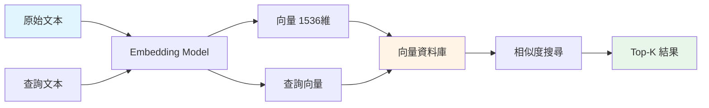
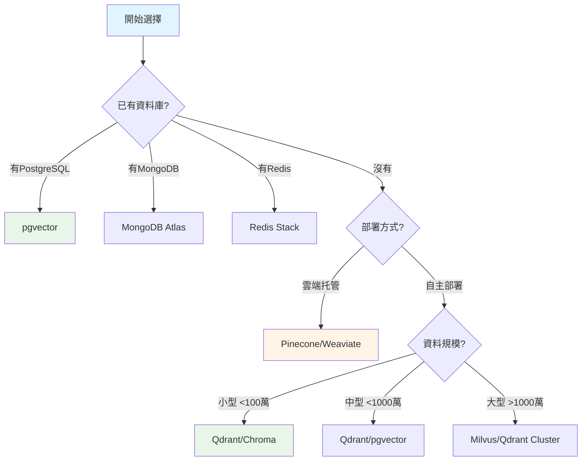

# 6.5 向量資料庫選擇指南

> **對應章節**: Day21
> **對應範例**: `chapter6-memory-vector`
> **難度**: ⭐⭐⭐☆☆

---

## 📚 本章概要

Spring AI 1.0 GA 支援超過 20 種向量資料庫,如何選擇適合企業需求的方案是實現 RAG 系統的關鍵。本章提供完整的選擇指南和部署方案。

**學習目標**:
- 了解向量資料庫的基本概念
- 掌握 Spring AI 支援的主流向量資料庫
- 學會根據場景選擇合適的方案
- 了解 Docker Compose 快速部署

---

## 🎯 什麼是向量資料庫?

### 傳統資料庫 vs 向量資料庫

```
傳統SQL查詢:
SELECT * FROM products WHERE name LIKE '%Spring%'
→ 只能找到包含 "Spring" 這個字的商品

向量資料庫查詢:
search("Spring 框架開發")
→ 可以找到: "Spring Boot"、"Java 框架"、"後端開發" 等語義相關的內容
```

### 核心概念



**向量化範例**:
```
文本: "Spring AI 很棒"
向量: [0.123, -0.456, 0.789, ..., 0.321] (1536維)

文本: "Spring AI is great"
向量: [0.125, -0.452, 0.791, ..., 0.319] (相似!)
```

---

## 📊 Spring AI 1.1 支援的向量資料庫

### 完整清單

| 類別 | 資料庫 | 特點 | 適用場景 |
|------|--------|------|---------|
| **專用向量DB** | Pinecone | ☁️ 雲端托管、自動擴展 | 雲端優先、大規模 |
| | Qdrant | ⚡ 高性能、開源 | 自主部署、高QPS |
| | Weaviate | 🔍 語義搜尋、GraphQL | 知識圖譜 |
| | Milvus | 📈 超大規模、分散式 | 億級資料 |
| | Chroma | 🎨 簡單易用、內嵌 | 快速原型 |
| **傳統DB+向量** | pgvector | 🐘 PostgreSQL 擴展 | 已有 PG 環境 |
| | Redis | ⚡ 快取+向量 | 高性能快取 |
| | Elasticsearch | 🔍 全文+向量 | 混合搜尋 |
| | MongoDB | 🍃 文檔+向量 | 已有 Mongo 環境 |
| **圖形DB** | Neo4j | 🕸️ 圖譜+向量 | 知識圖譜、關係 |
| **雲端方案** | Azure Cosmos | ☁️ Azure 生態 | Azure 用戶 |
| | AWS OpenSearch | ☁️ AWS 生態 | AWS 用戶 |

### 配置範例

```yaml
# application.yml - 向量資料庫配置
spring:
  ai:
    vectorstore:
      # === 專用向量資料庫 ===
      pinecone:
        api-key: ${PINECONE_API_KEY}
        environment: us-east1-gcp
        index-name: knowledge-base

      qdrant:
        url: http://localhost:6333
        api-key: ${QDRANT_API_KEY}
        collection-name: documents

      weaviate:
        url: http://localhost:8080
        api-key: ${WEAVIATE_API_KEY}
        class-name: Document

      # === 傳統資料庫+向量 ===
      pgvector:
        url: jdbc:postgresql://localhost:5432/vectordb
        username: postgres
        password: ${DB_PASSWORD}
        dimensions: 1536

      redis:
        url: redis://localhost:6379
        index-name: doc-index

      # === 圖形資料庫 ===
      neo4j:
        uri: bolt://localhost:7687
        username: neo4j
        password: ${NEO4J_PASSWORD}
```

---

## 🐳 Docker Compose 快速部署

### 完整環境配置

```yaml
# 對應範例: chapter6-memory-vector/docker/docker-compose.yml

version: '3.8'

services:
  # === PostgreSQL + pgvector ===
  postgres-vector:
    image: pgvector/pgvector:pg16
    container_name: postgres-vector
    environment:
      POSTGRES_DB: vectordb
      POSTGRES_USER: postgres
      POSTGRES_PASSWORD: password
    ports:
      - "5432:5432"
    volumes:
      - postgres_data:/var/lib/postgresql/data

  # === Qdrant (推薦) ===
  qdrant:
    image: qdrant/qdrant:latest
    container_name: qdrant
    ports:
      - "6333:6333"   # REST API
      - "6334:6334"   # gRPC
    volumes:
      - qdrant_data:/qdrant/storage

  # === Neo4j ===
  neo4j:
    image: neo4j:5.13-community
    container_name: neo4j
    ports:
      - "7474:7474"  # HTTP
      - "7687:7687"  # Bolt
    environment:
      NEO4J_AUTH: neo4j/password
    volumes:
      - neo4j_data:/data

  # === Redis Stack ===
  redis-stack:
    image: redis/redis-stack:latest
    container_name: redis-stack
    ports:
      - "6379:6379"
      - "8001:8001"  # RedisInsight
    volumes:
      - redis_data:/data

  # === Elasticsearch ===
  elasticsearch:
    image: docker.elastic.co/elasticsearch/elasticsearch:8.11.0
    container_name: elasticsearch
    environment:
      - discovery.type=single-node
      - xpack.security.enabled=false
      - "ES_JAVA_OPTS=-Xms1g -Xmx1g"
    ports:
      - "9200:9200"
    volumes:
      - es_data:/usr/share/elasticsearch/data

volumes:
  postgres_data:
  qdrant_data:
  neo4j_data:
  redis_data:
  es_data:
```

### 啟動命令

```bash
# 啟動所有服務
docker-compose up -d

# 啟動特定服務
docker-compose up -d qdrant neo4j

# 查看狀態
docker-compose ps

# 查看日誌
docker-compose logs -f qdrant

# 停止服務
docker-compose down
```

---

## 🎯 選擇決策樹

### 根據場景選擇



### 詳細建議

**1. 開發/測試環境**
```java
@Bean
@Profile("dev")
public VectorStore devVectorStore(EmbeddingModel embeddingModel) {
    // 使用簡單的記憶體版本
    return new SimpleVectorStore(embeddingModel);
}
```

**推薦**: InMemory 或 Chroma
- ✅ 無需額外依賴
- ✅ 快速啟動
- ⚠️ 重啟丟失

**2. 中小型企業 (<100萬文檔)**
```yaml
spring:
  ai:
    vectorstore:
      pgvector:
        url: jdbc:postgresql://localhost:5432/vectordb
```

**推薦**: pgvector 或 Qdrant
- ✅ PostgreSQL 穩定可靠
- ✅ 易於維護
- ✅ 成本低

**3. 大規模企業 (>100萬文檔)**
```yaml
spring:
  ai:
    vectorstore:
      qdrant:
        url: http://qdrant-cluster:6333
        # 分散式配置
```

**推薦**: Qdrant Cluster 或 Milvus
- ✅ 高性能
- ✅ 水平擴展
- ✅ 支援億級資料

**4. 雲端優先**
```yaml
spring:
  ai:
    vectorstore:
      pinecone:
        api-key: ${PINECONE_API_KEY}
```

**推薦**: Pinecone 或 Weaviate Cloud
- ✅ 無需維護
- ✅ 自動擴展
- ⚠️ 成本較高

---

## 💻 Spring AI 動態配置

### 統一配置管理

```java
// 對應範例: chapter6-memory-vector (概念)

@Configuration
@EnableConfigurationProperties(VectorStoreProperties.class)
public class VectorStoreConfig {

    @Bean
    @ConditionalOnProperty(name = "app.vectorstore.type", havingValue = "pgvector")
    public VectorStore pgVectorStore(
            JdbcTemplate jdbcTemplate,
            EmbeddingModel embeddingModel) {

        return PgVectorStore.builder(jdbcTemplate, embeddingModel)
            .tableName("vector_store")
            .dimensions(1536)
            .build();
    }

    @Bean
    @ConditionalOnProperty(name = "app.vectorstore.type", havingValue = "qdrant")
    public VectorStore qdrantVectorStore(
            QdrantClient client,
            EmbeddingModel embeddingModel) {

        return QdrantVectorStore.builder(client, embeddingModel)
            .collectionName("documents")
            .dimensions(1536)
            .build();
    }

    @Bean
    @ConditionalOnProperty(name = "app.vectorstore.type", havingValue = "neo4j")
    public VectorStore neo4jVectorStore(
            Driver driver,
            EmbeddingModel embeddingModel) {

        return Neo4jVectorStore.builder(driver, embeddingModel)
            .indexName("document-embeddings")
            .dimensions(1536)
            .build();
    }
}
```

### 配置文件

```yaml
# application-dev.yml (開發環境)
app:
  vectorstore:
    type: memory

# application-prod.yml (生產環境)
app:
  vectorstore:
    type: pgvector

spring:
  datasource:
    url: jdbc:postgresql://db-server:5432/vectordb
```

---

## 📊 性能對比

### 簡化對比表

| 資料庫 | QPS | 延遲 | 擴展性 | 成本 | 維護難度 |
|--------|-----|------|--------|------|---------|
| Pinecone | ⭐⭐⭐⭐⭐ | <50ms | ⭐⭐⭐⭐⭐ | 💰💰💰 | ⭐ |
| Qdrant | ⭐⭐⭐⭐⭐ | <30ms | ⭐⭐⭐⭐ | 💰 | ⭐⭐ |
| Milvus | ⭐⭐⭐⭐⭐ | <40ms | ⭐⭐⭐⭐⭐ | 💰💰 | ⭐⭐⭐ |
| pgvector | ⭐⭐⭐ | <100ms | ⭐⭐⭐ | 💰 | ⭐⭐ |
| Neo4j | ⭐⭐⭐⭐ | <60ms | ⭐⭐⭐⭐ | 💰💰 | ⭐⭐⭐ |

---

## 📝 重點回顧

### 向量資料庫核心
✅ 支援語義相似度搜尋
✅ Spring AI 支援 20+ 種方案
✅ 可透過 Docker 快速部署

### 選擇建議
- **開發測試**: InMemory, Chroma
- **中小企業**: pgvector, Qdrant
- **大規模**: Milvus, Qdrant Cluster
- **雲端**: Pinecone, Weaviate Cloud

### 關鍵因素
1. 資料規模
2. QPS 需求
3. 部署方式 (雲端/自主)
4. 預算考量
5. 現有技術棧

---

## 🚀 下一步

👉 [6.6 Neo4j 配置與部署](./6.6-Neo4j-配置與部署.md) - 深入 Neo4j
👉 [6.7 VectorStoreChatMemoryAdvisor](./6.7-VectorStoreChatMemoryAdvisor.md) - 向量記憶實戰

---

**相關章節**:
- ← 上一章: [6.4 Advisor 自定義開發](./6.4-Advisor-自定義開發.md)
- → 下一章: [6.6 Neo4j 配置與部署](./6.6-Neo4j-配置與部署.md)
