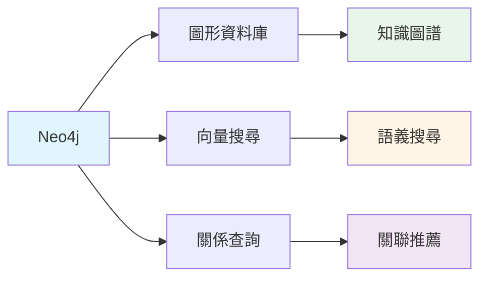

# 6.6 Neo4j 配置與部署

> **對應章節**: Day21, Day22
> **對應範例**: `chapter6-memory-vector`
> **難度**: ⭐⭐⭐☆☆

---

## 📚 本章概要

Neo4j 是一個強大的圖形資料庫,從 5.x 版本開始支援向量搜尋功能,非常適合用於知識圖譜和 AI 記憶系統。

**學習目標**:
- 了解 Neo4j 向量搜尋功能
- 掌握 Docker 部署 Neo4j
- 學會配置向量索引
- 了解效能優化技巧

---

## 🎯 為什麼選擇 Neo4j?

### Neo4j 的優勢



**核心優勢**:
- ✅ **圖譜 + 向量**: 既能表示關係,又能做語義搜尋
- ✅ **統一儲存**: 不需要多個資料庫
- ✅ **強大查詢**: Cypher 語言靈活強大
- ✅ **企業級**: 成熟穩定,廣泛應用

---

## 🐳 Docker 部署

### 基本部署

```yaml
# docker-compose.yml
version: '3.8'

services:
  neo4j:
    image: neo4j:5.13-community
    container_name: neo4j-vector
    ports:
      - "7474:7474"  # HTTP (瀏覽器介面)
      - "7687:7687"  # Bolt (應用連線)
    environment:
      # 認證設定
      NEO4J_AUTH: neo4j/your-password

      # 記憶體設定
      NEO4J_dbms_memory_heap_initial__size: 512m
      NEO4J_dbms_memory_heap_max__size: 2G
      NEO4J_dbms_memory_pagecache_size: 1G

      # 啟用 APOC 插件
      NEO4J_PLUGINS: '["apoc"]'
      NEO4J_apoc_export_file_enabled: 'true'
      NEO4J_apoc_import_file_enabled: 'true'

    volumes:
      - neo4j_data:/data
      - neo4j_logs:/logs
      - neo4j_import:/var/lib/neo4j/import

    healthcheck:
      test: ["CMD", "cypher-shell", "-u", "neo4j", "-p", "your-password", "RETURN 1"]
      interval: 30s
      timeout: 10s
      retries: 5

volumes:
  neo4j_data:
  neo4j_logs:
  neo4j_import:
```

### 啟動與驗證

```bash
# 啟動服務
docker-compose up -d neo4j

# 檢查狀態
docker-compose ps
docker-compose logs -f neo4j

# 等待啟動完成 (約 30 秒)
sleep 30

# 訪問 Web 介面
open http://localhost:7474
# 登入: neo4j / your-password
```

---

## 🔧 向量索引配置

### 創建向量索引

```cypher
-- 創建向量索引
CREATE VECTOR INDEX documentEmbeddings IF NOT EXISTS
FOR (d:Document)
ON (d.embedding)
OPTIONS {
  indexConfig: {
    `vector.dimensions`: 1536,
    `vector.similarity_function`: 'cosine'
  }
};

-- 查看索引狀態
SHOW INDEXES;

-- 等待索引建立完成
CALL db.awaitIndexes();
```

### 相似度函數選擇

```cypher
-- Cosine 相似度 (推薦)
OPTIONS { `vector.similarity_function`: 'cosine' }

-- 歐氏距離
OPTIONS { `vector.similarity_function`: 'euclidean' }
```

**選擇建議**:
- ✅ **Cosine**: 適合大多數場景,不受向量長度影響
- ⚠️ **Euclidean**: 適合絕對距離有意義的場景

---

## 💻 Spring AI 配置

### application.yml

```yaml
spring:
  neo4j:
    uri: bolt://localhost:7687
    authentication:
      username: neo4j
      password: your-password

  ai:
    vectorstore:
      neo4j:
        # 向量索引名稱
        index-name: documentEmbeddings
        # 標籤名稱
        label: Document
        # 嵌入屬性名稱
        embedding-property: embedding
        # 向量維度
        dimensions: 1536
        # 相似度函數
        distance-type: COSINE
```

### Java 配置

```java
@Configuration
public class Neo4jVectorStoreConfig {

    @Bean
    public VectorStore neo4jVectorStore(
            Driver neo4jDriver,
            EmbeddingModel embeddingModel) {

        return Neo4jVectorStore.builder()
            .driver(neo4jDriver)
            .embeddingModel(embeddingModel)
            .indexName("documentEmbeddings")
            .label("Document")
            .embeddingProperty("embedding")
            .dimensions(1536)
            .distanceType(Neo4jVectorStore.Neo4jDistanceType.COSINE)
            .initializeSchema(true)  // 自動創建索引
            .build();
    }
}
```

---

## 📊 資料操作

### 新增文檔

```java
@Service
public class DocumentService {

    @Autowired
    private VectorStore vectorStore;

    public void addDocuments(List<String> texts) {
        List<Document> documents = texts.stream()
            .map(text -> new Document(
                text,
                Map.of(
                    "source", "knowledge-base",
                    "timestamp", LocalDateTime.now().toString()
                )
            ))
            .collect(Collectors.toList());

        vectorStore.add(documents);
    }
}
```

**對應的 Cypher 查詢**:
```cypher
-- Spring AI 自動執行的操作
CREATE (d:Document {
  id: randomUUID(),
  content: $content,
  embedding: $embedding,
  source: $source,
  timestamp: $timestamp
})
```

### 語義搜尋

```java
public List<Document> search(String query, int topK) {
    return vectorStore.similaritySearch(
        SearchRequest.query(query)
            .withTopK(topK)
            .withSimilarityThreshold(0.75)
    );
}
```

**對應的 Cypher 查詢**:
```cypher
-- 向量相似度搜尋
CALL db.index.vector.queryNodes(
  'documentEmbeddings',
  $topK,
  $queryEmbedding
)
YIELD node, score
WHERE score >= $threshold
RETURN node.content, score
ORDER BY score DESC
```

---

## 🎯 效能優化

### 1. 記憶體配置

```yaml
# docker-compose.yml
environment:
  # Heap 記憶體 (用於查詢處理)
  NEO4J_dbms_memory_heap_initial__size: 2G
  NEO4J_dbms_memory_heap_max__size: 4G

  # Page Cache (用於資料快取)
  NEO4J_dbms_memory_pagecache_size: 2G
```

**配置建議**:
- **小型** (<10萬文檔): Heap 2G, PageCache 1G
- **中型** (<100萬): Heap 4G, PageCache 2G
- **大型** (>100萬): Heap 8G, PageCache 4G+

### 2. 索引優化

```cypher
-- 創建複合索引
CREATE INDEX document_metadata IF NOT EXISTS
FOR (d:Document)
ON (d.source, d.timestamp);

-- 檢查索引使用情況
PROFILE
MATCH (d:Document)
WHERE d.source = 'knowledge-base'
RETURN d;
```

### 3. 批次操作

```java
public void addDocumentsBatch(List<String> texts) {
    // 批次大小
    int batchSize = 100;

    for (int i = 0; i < texts.size(); i += batchSize) {
        List<String> batch = texts.subList(
            i,
            Math.min(i + batchSize, texts.size())
        );

        List<Document> docs = batch.stream()
            .map(text -> new Document(text))
            .collect(Collectors.toList());

        vectorStore.add(docs);

        // 避免記憶體爆炸
        if (i % 1000 == 0) {
            log.info("Processed {} documents", i);
        }
    }
}
```

---

## 🔍 實用 Cypher 查詢

### 資料統計

```cypher
-- 文檔數量
MATCH (d:Document)
RETURN count(d) as totalDocuments;

-- 按來源分組統計
MATCH (d:Document)
RETURN d.source, count(d) as count
ORDER BY count DESC;
```

### 清理資料

```cypher
-- 刪除所有文檔
MATCH (d:Document)
DELETE d;

-- 刪除特定來源
MATCH (d:Document)
WHERE d.source = 'old-data'
DELETE d;
```

### 備份與還原

```bash
# 備份
docker exec neo4j-vector neo4j-admin database dump neo4j \
  --to-path=/backups/neo4j-backup.dump

# 還原
docker exec neo4j-vector neo4j-admin database load neo4j \
  --from-path=/backups/neo4j-backup.dump
```

---

## 🐛 常見問題

### Q1: 連線失敗

```
Error: Unable to connect to bolt://localhost:7687
```

**解決方案**:
```bash
# 檢查服務狀態
docker-compose ps

# 查看日誌
docker-compose logs neo4j

# 等待服務完全啟動
sleep 30
```

### Q2: 記憶體不足

```
Error: OutOfMemoryError: Java heap space
```

**解決方案**:
```yaml
environment:
  NEO4J_dbms_memory_heap_max__size: 4G  # 增加 Heap
```

### Q3: 索引建立失敗

```
Error: Index already exists
```

**解決方案**:
```cypher
-- 刪除舊索引
DROP INDEX documentEmbeddings IF EXISTS;

-- 重新創建
CREATE VECTOR INDEX documentEmbeddings ...
```

---

## 📝 重點回顧

### Neo4j 向量搜尋
✅ 圖形資料庫 + 向量搜尋
✅ 統一儲存,簡化架構
✅ Cypher 查詢語言強大

### 部署要點
- Docker Compose 快速部署
- 記憶體配置很重要
- 向量索引需手動創建

### 效能優化
1. 合理配置 Heap 和 PageCache
2. 使用批次操作
3. 創建必要的索引

---

## 🚀 下一步

👉 [6.7 VectorStoreChatMemoryAdvisor](./6.7-VectorStoreChatMemoryAdvisor.md) - 向量記憶實戰

---

**相關章節**:
- ← 上一章: [6.5 向量資料庫選擇指南](./6.5-向量資料庫選擇指南.md)
- → 下一章: [6.7 VectorStoreChatMemoryAdvisor](./6.7-VectorStoreChatMemoryAdvisor.md)
