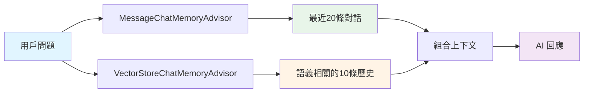

# 6.7 VectorStoreChatMemoryAdvisor

> **對應章節**: Day22
> **對應範例**: `chapter6-memory-vector`
> **難度**: ⭐⭐⭐⭐☆

---

## 📚 本章概要

VectorStoreChatMemoryAdvisor 將對話歷史儲存到向量資料庫,實現長期記憶和語義搜尋功能,讓 AI 能夠記住更長時間、更多內容的對話。

**學習目標**:
- 理解向量記憶 vs 傳統記憶的差異
- 掌握 VectorStoreChatMemoryAdvisor 配置
- 學會實現混合記憶架構
- 了解適用場景與限制

---

## 🎯 向量記憶 vs 傳統記憶

### 傳統記憶的限制

```java
// MessageChatMemoryAdvisor - 傳統短期記憶
✅ 保留完整對話結構
✅ 順序明確
❌ 容量限制 (通常 20-50 條)
❌ 無法跨會話搜尋
❌ 無語義搜尋
```

**問題場景**:
```
用戶在第1次對話: "我喜歡吃披薩"
用戶在第100次對話: "推薦適合我的餐廳"

傳統記憶: 第1次對話已被清除,無法推薦披薩餐廳
```

### 向量記憶的優勢

```java
// VectorStoreChatMemoryAdvisor - 長期記憶
✅ 無容量限制
✅ 語義搜尋
✅ 跨會話記憶
❌ 順序可能不準確
```

**解決方案**:
```
所有對話都儲存在向量資料庫
問: "推薦適合我的餐廳"
→ 語義搜尋找到: "我喜歡吃披薩"
→ AI: "推薦披薩餐廳..."
```

---

## 💻 基本配置

### Spring AI 配置

```java
@Configuration
public class VectorMemoryConfig {

    @Bean
    public ChatClient vectorMemoryChatClient(
            ChatClient.Builder builder,
            VectorStore vectorStore) {

        return builder
            .defaultAdvisors(
                VectorStoreChatMemoryAdvisor.builder(vectorStore)
                    .maxRetrievalSize(10)  // 檢索最多10條相關對話
                    .build()
            )
            .build();
    }
}
```

### 使用方式

```java
@Service
public class VectorMemoryService {

    @Autowired
    private ChatClient vectorMemoryChatClient;

    public String chat(String conversationId, String message) {
        return vectorMemoryChatClient.prompt()
            .advisors(a -> a.param(
                VectorStoreChatMemoryAdvisor.CONVERSATION_ID,
                conversationId
            ))
            .user(message)
            .call()
            .content();
    }
}
```

---

## 🔀 混合記憶架構

### 短期 + 長期記憶

最佳實踐是結合兩種記憶:



### 實現方式

```java
@Configuration
public class HybridMemoryConfig {

    @Bean
    public ChatClient hybridMemoryChatClient(
            ChatClient.Builder builder,
            ChatMemory chatMemory,
            VectorStore vectorStore) {

        return builder
            .defaultAdvisors(
                // 順序1: 短期記憶 (最近對話)
                MessageChatMemoryAdvisor.builder(chatMemory)
                    .order(1)
                    .build(),

                // 順序2: 長期記憶 (語義相關)
                VectorStoreChatMemoryAdvisor.builder(vectorStore)
                    .maxRetrievalSize(5)
                    .order(2)
                    .build()
            )
            .build();
    }
}
```

### 配置說明

```yaml
app:
  memory:
    # 短期記憶
    short-term:
      enabled: true
      max-messages: 20

    # 長期記憶
    long-term:
      enabled: true
      vector-store: neo4j
      max-retrieval: 10
      similarity-threshold: 0.75
```

---

## 🎬 實戰範例

### 1. 客戶服務助手

```java
@Service
public class CustomerSupportService {

    @Autowired
    private ChatClient hybridMemoryChatClient;

    public SupportResponse handleQuery(String customerId, String query) {
        // 混合記憶: 最近對話 + 歷史相關問題
        String response = hybridMemoryChatClient.prompt()
            .system("""
                你是客服助手,請根據:
                1. 最近的對話記錄
                2. 歷史相關的服務記錄
                提供專業的回答。
                """)
            .advisors(a -> a.param(
                VectorStoreChatMemoryAdvisor.CONVERSATION_ID,
                customerId
            ))
            .user(query)
            .call()
            .content();

        return SupportResponse.builder()
            .answer(response)
            .customerId(customerId)
            .timestamp(LocalDateTime.now())
            .build();
    }
}
```

### 2. 個人知識助手

```java
@Service
public class PersonalAssistantService {

    public String askPersonalQuestion(String userId, String question) {
        return hybridMemoryChatClient.prompt()
            .system("""
                你是個人助手,了解用戶的:
                - 興趣愛好
                - 工作習慣
                - 個人偏好

                請根據這些資訊提供個性化建議。
                """)
            .advisors(a -> a.param(
                VectorStoreChatMemoryAdvisor.CONVERSATION_ID,
                userId
            ))
            .user(question)
            .call()
            .content();
    }
}
```

### 3. 學習進度追蹤

```java
@Service
public class LearningTrackerService {

    public String provideLearningGuidance(String studentId, String topic) {
        return hybridMemoryChatClient.prompt()
            .system("""
                你是學習導師,請根據學生的:
                1. 最近學習的內容
                2. 歷史問過的問題
                3. 遇到的困難

                提供有針對性的指導。
                """)
            .advisors(a -> a.param(
                VectorStoreChatMemoryAdvisor.CONVERSATION_ID,
                studentId
            ))
            .user(topic)
            .call()
            .content();
    }
}
```

---

## 🔧 進階配置

### 自定義記憶模板

```java
@Bean
public ChatClient customTemplateChatClient(
        ChatClient.Builder builder,
        VectorStore vectorStore) {

    PromptTemplate customTemplate = new PromptTemplate("""
        {instructions}

        【相關歷史記錄】
        {long_term_memory}

        【最近對話】
        {short_term_memory}

        請綜合考慮以上資訊回答問題。
        """);

    return builder
        .defaultAdvisors(
            VectorStoreChatMemoryAdvisor.builder(vectorStore)
                .promptTemplate(customTemplate)
                .build()
        )
        .build();
}
```

### 相似度閾值調整

```java
@Bean
public VectorStoreChatMemoryAdvisor customThresholdAdvisor(
        VectorStore vectorStore) {

    return VectorStoreChatMemoryAdvisor.builder(vectorStore)
        .maxRetrievalSize(10)
        .searchRequest(SearchRequest.defaults()
            .withSimilarityThreshold(0.80)  // 提高相似度要求
            .withTopK(10))
        .build();
}
```

---

## ⚠️ 適用場景與限制

### ✅ 適合的場景

1. **長期客戶關係**
   - 記住客戶偏好
   - 追蹤服務歷史

2. **個人化服務**
   - 學習進度追蹤
   - 個人知識管理

3. **知識庫整合**
   - 企業FAQ
   - 技術支援

### ❌ 不適合的場景

1. **嚴格順序要求**
   - 向量搜尋可能打亂順序
   - 使用 MessageChatMemoryAdvisor

2. **即時上下文依賴**
   - 當前對話的立即回應
   - 使用短期記憶

3. **精確指令記憶**
   - 需要精確記住每個細節
   - 考慮結構化儲存

---

## 🔄 記憶同步機制

### 自動同步

```java
@Service
public class MemorySyncService {

    @Autowired
    private ChatMemory shortTermMemory;

    @Autowired
    private VectorStore longTermMemory;

    @Scheduled(fixedDelay = 60000)  // 每分鐘同步
    public void syncMemories() {
        // 獲取所有對話ID
        Set<String> conversationIds = getActiveConversations();

        for (String id : conversationIds) {
            // 獲取短期記憶
            List<Message> messages = shortTermMemory.get(id);

            // 轉換為文檔
            List<Document> docs = messages.stream()
                .map(msg -> new Document(
                    msg.getContent(),
                    Map.of(
                        "conversationId", id,
                        "timestamp", LocalDateTime.now().toString(),
                        "type", msg.getClass().getSimpleName()
                    )
                ))
                .collect(Collectors.toList());

            // 儲存到向量資料庫
            longTermMemory.add(docs);
        }
    }
}
```

---

## 📝 重點回顧

### 向量記憶優勢
✅ 無容量限制,可存大量歷史
✅ 語義搜尋,找到相關對話
✅ 跨會話記憶,長期追蹤

### 混合架構
- **短期**: MessageChatMemoryAdvisor
- **長期**: VectorStoreChatMemoryAdvisor
- **最佳**: 兩者結合

### 配置要點
1. 設定 maxRetrievalSize
2. 調整 similarityThreshold
3. 自定義記憶模板

---

## 🚀 下一步

👉 [6.8 智能記憶摘要系統](./6.8-智能記憶摘要系統.md) - 進階記憶優化

---

**相關章節**:
- ← 上一章: [6.6 Neo4j 配置與部署](./6.6-Neo4j-配置與部署.md)
- → 下一章: [6.8 智能記憶摘要系統](./6.8-智能記憶摘要系統.md)
