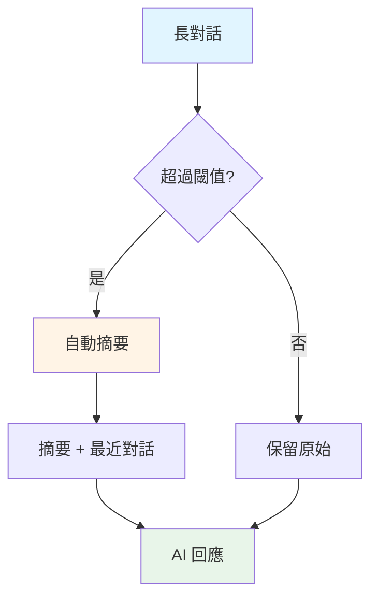

# 6.8 智能記憶摘要系統

> **對應章節**: Day18
> **對應範例**: `chapter6-memory-advanced`
> **難度**: ⭐⭐⭐⭐⭐

---

## 📚 本章概要

當對話變得很長時,即使有記憶管理,仍會面臨 Token 成本和效能問題。智能記憶摘要系統透過自動摘要、混合策略和對話分析來優化記憶管理。

**學習目標**:
- 理解智能摘要的必要性
- 掌握 SmartMemoryAdvisor 設計
- 學會實現混合記憶策略
- 了解對話分析與優化技術

---

## 🎯 為什麼需要智能摘要?

### 長對話的問題

```
第1輪: "你好"
第2輪: "介紹Spring AI"
...
第50輪: 累積 5000 tokens
第100輪: 累積 10000 tokens ← 超過模型限制!
```

**問題**:
- 💰 **成本爆炸**: Token 費用線性增長
- 🐌 **回應變慢**: 處理時間增加
- ❌ **超出限制**: 超過模型上下文視窗

### 智能摘要解決方案



---

## 💻 SmartMemoryAdvisor 設計

### 核心概念

```java
// 對應範例: chapter6-memory-advanced/.../advisor/SmartMemoryAdvisor.java

@Component
public class SmartMemoryAdvisor implements CallAdvisor {

    private final ChatMemory chatMemory;
    private final ChatClient summarizerClient;

    private static final int SUMMARY_THRESHOLD = 50;  // 觸發摘要的閾值
    private static final int KEEP_RECENT = 20;        // 保留最近N條

    @Override
    public ChatClientResponse adviseCall(
            ChatClientRequest request,
            CallAdvisorChain chain) {

        String conversationId = getConversationId(request);
        List<Message> history = chatMemory.get(conversationId);

        // 檢查是否需要摘要
        if (history.size() > SUMMARY_THRESHOLD) {
            optimizeMemory(conversationId, history);
        }

        return chain.nextCall(request);
    }

    /**
     * 優化記憶: 摘要舊對話,保留最近對話
     */
    private void optimizeMemory(String conversationId, List<Message> history) {
        // 1. 分割: 舊對話 vs 最近對話
        int splitPoint = history.size() - KEEP_RECENT;
        List<Message> oldMessages = history.subList(0, splitPoint);
        List<Message> recentMessages = history.subList(splitPoint, history.size());

        // 2. 摘要舊對話
        String summary = summarizeConversation(oldMessages);

        // 3. 重建記憶
        chatMemory.clear(conversationId);

        // 添加摘要作為系統訊息
        chatMemory.add(conversationId,
            new SystemMessage("對話摘要: " + summary));

        // 添加最近對話
        chatMemory.addAll(conversationId, recentMessages);

        log.info("Memory optimized for conversation: {}. " +
                 "Old: {} → Summary, Recent: {}",
            conversationId, oldMessages.size(), recentMessages.size());
    }

    /**
     * 使用 AI 生成對話摘要
     */
    private String summarizeConversation(List<Message> messages) {
        String conversation = messages.stream()
            .map(msg -> {
                String role = msg instanceof UserMessage ? "用戶" : "助手";
                return role + ": " + msg.getContent();
            })
            .collect(Collectors.joining("\n"));

        return summarizerClient.prompt()
            .user("""
                請簡潔摘要以下對話的重點:

                %s

                摘要應包含:
                1. 主要討論話題
                2. 重要決定或結論
                3. 待辦事項或後續行動

                請用3-5句話總結。
                """.formatted(conversation))
            .call()
            .content();
    }

    @Override
    public String getName() {
        return "SmartMemoryAdvisor";
    }

    @Override
    public int getOrder() {
        return 1;
    }
}
```

---

## 🔀 混合記憶策略

### HybridMemoryService

```java
// 對應範例: chapter6-memory-advanced/.../service/HybridMemoryService.java

@Service
public class HybridMemoryService {

    @Autowired
    private ChatMemory shortTermMemory;

    @Autowired
    private VectorStore longTermMemory;

    @Autowired
    private ChatClient chatClient;

    /**
     * 動態選擇記憶策略
     */
    public String chat(String conversationId, String message) {
        MemoryStrategy strategy = selectStrategy(conversationId);

        return switch (strategy) {
            case SHORT_TERM_ONLY -> useShortTermMemory(conversationId, message);
            case LONG_TERM_ONLY -> useLongTermMemory(conversationId, message);
            case HYBRID -> useHybridMemory(conversationId, message);
            case SMART_SUMMARY -> useSmartSummary(conversationId, message);
        };
    }

    /**
     * 選擇策略: 根據對話長度和類型
     */
    private MemoryStrategy selectStrategy(String conversationId) {
        long messageCount = shortTermMemory.count(conversationId);

        if (messageCount < 10) {
            return MemoryStrategy.SHORT_TERM_ONLY;  // 短對話
        } else if (messageCount < 50) {
            return MemoryStrategy.HYBRID;            // 中等對話
        } else {
            return MemoryStrategy.SMART_SUMMARY;     // 長對話
        }
    }

    /**
     * 混合記憶: 結合短期和長期
     */
    private String useHybridMemory(String conversationId, String message) {
        // 1. 獲取短期記憶 (最近對話)
        List<Message> recentMessages = shortTermMemory
            .getRecent(conversationId, 20);

        // 2. 語義搜尋長期記憶
        List<Document> relevantHistory = longTermMemory.similaritySearch(
            SearchRequest.query(message)
                .withTopK(5)
                .withSimilarityThreshold(0.75)
                .withFilterExpression(String.format(
                    "conversationId == '%s'", conversationId
                ))
        );

        // 3. 組合上下文
        String context = buildHybridContext(recentMessages, relevantHistory);

        // 4. 調用 AI
        return chatClient.prompt()
            .system(context)
            .user(message)
            .call()
            .content();
    }

    private String buildHybridContext(
            List<Message> recent,
            List<Document> relevant) {

        StringBuilder context = new StringBuilder();

        // 相關歷史
        if (!relevant.isEmpty()) {
            context.append("【相關歷史記錄】\n");
            relevant.forEach(doc ->
                context.append("- ").append(doc.getContent()).append("\n")
            );
            context.append("\n");
        }

        // 最近對話
        context.append("【最近對話】\n");
        recent.forEach(msg -> {
            String role = msg instanceof UserMessage ? "用戶" : "助手";
            context.append(role).append(": ")
                   .append(msg.getContent()).append("\n");
        });

        return context.toString();
    }
}

enum MemoryStrategy {
    SHORT_TERM_ONLY,   // 僅短期記憶
    LONG_TERM_ONLY,    // 僅長期記憶
    HYBRID,            // 混合策略
    SMART_SUMMARY      // 智能摘要
}
```

---

## 📊 對話分析功能

### ConversationSummaryService

```java
@Service
public class ConversationSummaryService {

    @Autowired
    private ChatClient chatClient;

    @Autowired
    private ChatMemory chatMemory;

    /**
     * 生成對話摘要
     */
    public ConversationSummary summarize(String conversationId) {
        List<Message> messages = chatMemory.get(conversationId);

        // 1. 基本統計
        ConversationStats stats = calculateStats(messages);

        // 2. AI 生成摘要
        String summary = generateSummary(messages);

        // 3. 提取主題
        List<String> topics = extractTopics(messages);

        // 4. 識別待辦事項
        List<String> todos = extractTodos(messages);

        return ConversationSummary.builder()
            .conversationId(conversationId)
            .summary(summary)
            .topics(topics)
            .todos(todos)
            .stats(stats)
            .build();
    }

    /**
     * 計算對話統計
     */
    private ConversationStats calculateStats(List<Message> messages) {
        long userMessages = messages.stream()
            .filter(m -> m instanceof UserMessage)
            .count();

        long aiMessages = messages.stream()
            .filter(m -> m instanceof AssistantMessage)
            .count();

        int totalTokens = messages.stream()
            .mapToInt(m -> estimateTokens(m.getContent()))
            .sum();

        return ConversationStats.builder()
            .totalMessages(messages.size())
            .userMessages(userMessages)
            .aiMessages(aiMessages)
            .estimatedTokens(totalTokens)
            .build();
    }

    /**
     * 提取對話主題
     */
    private List<String> extractTopics(List<Message> messages) {
        String conversation = formatConversation(messages);

        String prompt = """
            請分析以下對話,提取3-5個主要話題:

            %s

            以列表形式返回話題,每個話題一行。
            """.formatted(conversation);

        String response = chatClient.prompt()
            .user(prompt)
            .call()
            .content();

        return Arrays.stream(response.split("\n"))
            .filter(line -> !line.trim().isEmpty())
            .map(String::trim)
            .collect(Collectors.toList());
    }

    /**
     * 識別待辦事項
     */
    private List<String> extractTodos(List<Message> messages) {
        String conversation = formatConversation(messages);

        String prompt = """
            請從以下對話中識別所有待辦事項或後續行動:

            %s

            以清單形式返回,每個事項一行。如果沒有,返回"無"。
            """.formatted(conversation);

        String response = chatClient.prompt()
            .user(prompt)
            .call()
            .content();

        if (response.contains("無")) {
            return Collections.emptyList();
        }

        return Arrays.stream(response.split("\n"))
            .filter(line -> !line.trim().isEmpty())
            .map(String::trim)
            .collect(Collectors.toList());
    }

    private int estimateTokens(String text) {
        // 簡化估算: 1 token ≈ 4 字符
        return text.length() / 4;
    }
}

@Builder
@Data
class ConversationSummary {
    private String conversationId;
    private String summary;
    private List<String> topics;
    private List<String> todos;
    private ConversationStats stats;
}

@Builder
@Data
class ConversationStats {
    private long totalMessages;
    private long userMessages;
    private long aiMessages;
    private int estimatedTokens;
}
```

---

## 🎯 記憶優化技術

### 1. MessageWindowChatMemory

```java
// 對應範例: chapter6-memory-core/.../memory/MessageWindowChatMemory.java

public class MessageWindowChatMemory implements ChatMemory {

    private final ChatMemory delegate;
    private final int maxMessages;

    @Override
    public List<Message> get(String conversationId) {
        List<Message> all = delegate.get(conversationId);

        // 只返回最近的訊息
        if (all.size() <= maxMessages) {
            return all;
        }

        return new ArrayList<>(
            all.subList(all.size() - maxMessages, all.size())
        );
    }
}
```

### 2. 自動清理策略

```java
@Component
public class MemoryCleanupService {

    @Autowired
    private ChatMemory chatMemory;

    @Scheduled(cron = "0 0 2 * * ?")  // 每天凌晨2點
    public void cleanupOldConversations() {
        Set<String> conversationIds = getAllConversationIds();

        for (String id : conversationIds) {
            if (shouldCleanup(id)) {
                chatMemory.clear(id);
                log.info("Cleaned up conversation: {}", id);
            }
        }
    }

    private boolean shouldCleanup(String conversationId) {
        // 超過30天未活動的對話
        LocalDateTime lastActivity = getLastActivity(conversationId);
        return lastActivity.isBefore(
            LocalDateTime.now().minusDays(30)
        );
    }
}
```

### 3. 記憶壓縮

```java
public class MemoryCompressor {

    /**
     * 壓縮對話: 移除冗餘資訊
     */
    public List<Message> compress(List<Message> messages) {
        return messages.stream()
            .map(this::compressMessage)
            .collect(Collectors.toList());
    }

    private Message compressMessage(Message message) {
        String content = message.getContent();

        // 移除多餘空白
        content = content.replaceAll("\\s+", " ").trim();

        // 如果是 UserMessage,保持原樣
        if (message instanceof UserMessage) {
            return new UserMessage(content);
        }

        // 如果是 AssistantMessage,可以進一步壓縮
        return new AssistantMessage(content);
    }
}
```

---

## 📝 重點回顧

### 智能摘要核心
✅ 自動偵測長對話
✅ AI 生成摘要
✅ 保留最近對話

### 混合策略
- 根據對話長度動態選擇
- 結合短期、長期、摘要
- 優化 Token 使用

### 對話分析
- 生成對話摘要
- 提取主要話題
- 識別待辦事項
- 統計資訊

---

## 🚀 下一步

恭喜!你已經完成第6章所有內容。接下來可以:

👉 [第7章 RAG 基礎](../../chapter7/README.md) - 深入 RAG 系統
👉 回到 [第6章導覽](./README.md) - 複習本章內容

---

**相關章節**:
- ← 上一章: [6.7 VectorStoreChatMemoryAdvisor](./6.7-VectorStoreChatMemoryAdvisor.md)
- → 下一章: [第7章 RAG 基礎](../../chapter7/README.md)
