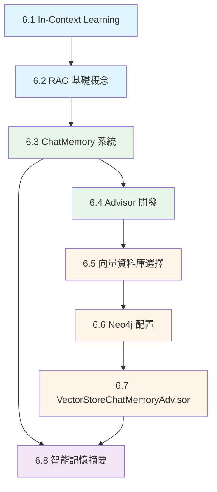

# 第6章 AI 記憶增強系統

> 從基礎概念到企業級應用的完整記憶管理系統

---

## 📖 章節概覽

本章涵蓋 Spring AI 記憶管理的完整知識體系,從基礎的 In-Context Learning 到企業級的智能記憶摘要系統,幫助你建構強大的 AI 對話應用。

**對應原文章**: Day16-Day22
**對應範例**: `chapter6-ai-memory/` 三大模組

---

## 🗺️ 學習路徑



---

## 📚 章節導覽

### 🌟 基礎篇 (6.1-6.2)

#### [6.1 In-Context Learning](./6.1-In-Context-Learning.md)
**難度**: ⭐⭐☆☆☆ | **時間**: 30分鐘

理解 AI 記憶的基礎 - 為什麼 AI 需要上下文?如何實現?

**核心內容**:
- In-Context Learning 核心概念
- 三種上下文注入方式
- System Message 最佳實踐
- Spring AI 1.1 改進

**對應範例**: `chapter6-memory-core`

**學習成果**: 能夠為 AI 提供背景知識,實現簡單的記憶功能

---

#### [6.2 RAG 基礎概念](./6.2-RAG-基礎概念.md)
**難度**: ⭐⭐⭐☆☆ | **時間**: 45分鐘

檢索增強生成 - 讓 AI 能夠基於企業知識庫回答問題

**核心內容**:
- RAG 工作流程詳解
- RAG vs Fine-tuning 對比
- 手動實現 vs QuestionAnswerAdvisor
- 實際應用場景

**對應範例**: `chapter6-memory-core`

**學習成果**: 理解 RAG 原理,能夠實現簡單的知識庫問答系統

---

### 🚀 進階篇 (6.3-6.4)

#### [6.3 ChatMemory 短期記憶系統](./6.3-ChatMemory-短期記憶系統.md)
**難度**: ⭐⭐⭐☆☆ | **時間**: 45分鐘

企業級對話記憶管理 - 解決土炮記憶的所有問題

**核心內容**:
- ChatMemory 架構設計
- InMemoryChatMemory 實現
- MessageWindowChatMemory 滑動視窗
- 多種儲存後端 (JDBC, Redis)
- MessageChatMemoryAdvisor vs PromptChatMemoryAdvisor

**對應範例**: `chapter6-memory-core`

**學習成果**: 能夠配置和使用企業級記憶系統,支援對話隔離和容量管理

---

#### [6.4 Advisor 自定義開發](./6.4-Advisor-自定義開發.md)
**難度**: ⭐⭐⭐⭐☆ | **時間**: 60分鐘

Spring AI 插件系統 - 開發自己的 Advisor

**核心內容**:
- Advisor 責任鏈模式
- CallAdvisor vs StreamAdvisor
- 新版 API 完整指南
- TokenUsageLogAdvisor 實戰
- 執行順序控制

**對應範例**: `chapter6-memory-core`

**學習成果**: 能夠開發自定義 Advisor,實現日誌、監控、過濾等功能

---

### 💾 向量記憶篇 (6.5-6.7)

#### [6.5 向量資料庫選擇指南](./6.5-向量資料庫選擇指南.md)
**難度**: ⭐⭐⭐☆☆ | **時間**: 30分鐘

20+ 向量資料庫完整對比與選擇建議

**核心內容**:
- 向量資料庫基本概念
- Spring AI 支援的所有選項
- 選擇決策樹
- Docker Compose 快速部署
- 性能對比分析

**對應範例**: `chapter6-memory-vector`

**學習成果**: 能夠根據需求選擇合適的向量資料庫方案

---

#### [6.6 Neo4j 配置與部署](./6.6-Neo4j-配置與部署.md)
**難度**: ⭐⭐⭐☆☆ | **時間**: 40分鐘

圖形資料庫 + 向量搜尋的完美結合

**核心內容**:
- Neo4j 向量搜尋功能
- Docker 部署與配置
- 向量索引創建
- 效能優化技巧
- 實用 Cypher 查詢

**對應範例**: `chapter6-memory-vector`

**學習成果**: 能夠部署和配置 Neo4j 向量資料庫,創建向量索引

---

#### [6.7 VectorStoreChatMemoryAdvisor](./6.7-VectorStoreChatMemoryAdvisor.md)
**難度**: ⭐⭐⭐⭐☆ | **時間**: 50分鐘

長期記憶系統 - 無容量限制的語義搜尋記憶

**核心內容**:
- 向量記憶 vs 傳統記憶
- VectorStoreChatMemoryAdvisor 配置
- 混合記憶架構 (短期+長期)
- 適用場景與限制
- 記憶同步機制

**對應範例**: `chapter6-memory-vector`

**學習成果**: 能夠實現混合記憶系統,結合短期和長期記憶優勢

---

### 🎓 專家篇 (6.8)

#### [6.8 智能記憶摘要系統](./6.8-智能記憶摘要系統.md)
**難度**: ⭐⭐⭐⭐⭐ | **時間**: 60分鐘

企業級記憶優化 - 自動摘要、混合策略、對話分析

**核心內容**:
- SmartMemoryAdvisor 設計
- 自動摘要機制
- HybridMemoryService 混合策略
- ConversationSummaryService 對話分析
- 記憶優化技術

**對應範例**: `chapter6-memory-advanced`

**學習成果**: 能夠實現智能記憶管理系統,優化 Token 使用和效能

---

## 🎯 學習建議

### 初學者路徑 (2-3天)

```
Day 1: 基礎概念
  └─ 6.1 In-Context Learning (30min)
  └─ 6.2 RAG 基礎概念 (45min)
  └─ 6.3 ChatMemory 系統 (45min)
  └─ 實作: chapter6-memory-core 範例

Day 2: 進階功能
  └─ 6.4 Advisor 開發 (60min)
  └─ 6.5 向量資料庫選擇 (30min)
  └─ 6.6 Neo4j 配置 (40min)
  └─ 實作: chapter6-memory-vector 範例

Day 3: 專家級應用
  └─ 6.7 VectorStoreChatMemoryAdvisor (50min)
  └─ 6.8 智能記憶摘要 (60min)
  └─ 實作: chapter6-memory-advanced 範例
```

### 專業開發者路徑 (1天速成)

```
上午 (4小時):
  └─ 快速瀏覽 6.1-6.4 概念
  └─ 深入研究 6.5-6.6 向量資料庫
  └─ 實作: 部署 Neo4j 環境

下午 (4小時):
  └─ 實作 6.7 混合記憶系統
  └─ 研究 6.8 智能摘要
  └─ 整合到實際專案
```

---

## 🗂️ 對應範例專案

### chapter6-memory-core (基礎記憶)
```
📦 功能:
  ✅ In-Context Learning
  ✅ ChatMemory 短期記憶
  ✅ MessageChatMemoryAdvisor
  ✅ 自定義 Advisor 開發
  ✅ 多種儲存後端

📁 位置: code-examples/chapter6-ai-memory/chapter6-memory-core/

🚀 啟動:
  cd chapter6-memory-core
  mvn spring-boot:run

🔗 端口: 8080
```

### chapter6-memory-vector (向量記憶)
```
📦 功能:
  ✅ Neo4j 向量資料庫
  ✅ VectorStoreChatMemoryAdvisor
  ✅ 混合記憶架構
  ✅ 語義搜尋

📁 位置: code-examples/chapter6-ai-memory/chapter6-memory-vector/

🐳 前置: docker-compose up -d neo4j

🚀 啟動:
  cd chapter6-memory-vector
  mvn spring-boot:run

🔗 端口: 8081
```

### chapter6-memory-advanced (進階管理)
```
📦 功能:
  ✅ SmartMemoryAdvisor
  ✅ HybridMemoryService
  ✅ ConversationSummaryService
  ✅ 自動摘要與優化

📁 位置: code-examples/chapter6-ai-memory/chapter6-memory-advanced/

🚀 啟動:
  cd chapter6-memory-advanced
  mvn spring-boot:run

🔗 端口: 8082
```

---

## 📊 核心概念對照表

| 概念 | 章節 | 對應範例 | 難度 |
|------|------|---------|------|
| In-Context Learning | 6.1 | core | ⭐⭐ |
| RAG 基礎 | 6.2 | core | ⭐⭐⭐ |
| ChatMemory | 6.3 | core | ⭐⭐⭐ |
| Advisor 開發 | 6.4 | core | ⭐⭐⭐⭐ |
| 向量資料庫 | 6.5-6.6 | vector | ⭐⭐⭐ |
| 向量記憶 | 6.7 | vector | ⭐⭐⭐⭐ |
| 智能摘要 | 6.8 | advanced | ⭐⭐⭐⭐⭐ |

---

## 🔗 相關資源

### 官方文檔
- [Spring AI Documentation](https://docs.spring.io/spring-ai/reference/)
- [Spring AI Advisors](https://docs.spring.io/spring-ai/reference/api/advisors.html)
- [Spring AI Vector Stores](https://docs.spring.io/spring-ai/reference/api/vectordbs.html)

### 向量資料庫
- [Neo4j Vector Search](https://neo4j.com/docs/cypher-manual/current/indexes-for-vector-search/)
- [pgvector](https://github.com/pgvector/pgvector)
- [Qdrant](https://qdrant.tech/documentation/)

### 原始文章
- [Day16-Day22 iThelp 鐵人賽](https://ithelp.ithome.com.tw/users/20161290/ironman/)

---

## ❓ 常見問題

### Q1: 應該選擇哪個 Advisor?

```
場景決定方案:
  - 短期對話(<20條): MessageChatMemoryAdvisor
  - 需要保留順序: MessageChatMemoryAdvisor
  - 長期記憶: VectorStoreChatMemoryAdvisor
  - 最佳方案: 混合使用 (6.7)
```

### Q2: 向量資料庫怎麼選?

```
根據規模選擇:
  - 開發測試: InMemory, Chroma
  - 中小企業: pgvector, Qdrant
  - 大規模: Milvus, Qdrant Cluster
  - 雲端: Pinecone, Weaviate Cloud

詳見: 6.5 章節
```

### Q3: Token 成本太高怎麼辦?

```
優化策略:
  1. 使用 MessageWindowChatMemory (6.3)
  2. 實現智能摘要 (6.8)
  3. 調整 maxMessages 參數
  4. 使用混合策略 (6.8)
```

---

## ✅ 學習檢查清單

完成本章後,你應該能夠:

- [ ] 解釋 In-Context Learning 的工作原理
- [ ] 實現簡單的 RAG 系統
- [ ] 配置和使用 ChatMemory
- [ ] 開發自定義 Advisor
- [ ] 選擇合適的向量資料庫
- [ ] 部署和配置 Neo4j
- [ ] 實現混合記憶架構
- [ ] 優化長對話的記憶管理

---

## 🚀 下一步

完成第6章後,你可以:

1. **深入 RAG**: 👉 [第7章 RAG 基礎](../../chapter7/README.md)
2. **實戰專案**: 將所學應用到實際專案
3. **進階優化**: 研究記憶優化和成本控制

---

**最後更新**: 2025-10-28
**章節維護**: Kevin Tsai
**對應版本**: Spring AI 1.0.0 GA+
