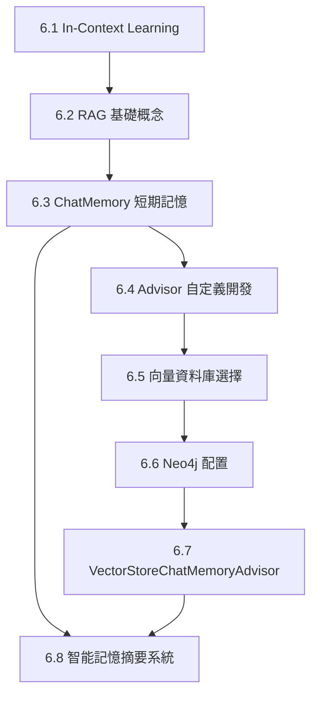

# 第6章文檔結構規劃

> 建立日期: 2025-10-28
> 目的: 將原文章Day16-22重新整理為以說明為主的技術文檔,程式碼改為重點片段

---

## 📁 文檔結構

```
docs/chapter6/
├── README.md                           # 章節導覽與學習路徑
├── 6.1-In-Context-Learning.md         # In-Context Learning 核心概念
├── 6.2-RAG-基礎概念.md                 # RAG 原理與實現方式
├── 6.3-ChatMemory-短期記憶系統.md      # ChatMemory 架構與使用
├── 6.4-Advisor-自定義開發.md           # Advisor 開發完整指南
├── 6.5-向量資料庫選擇指南.md           # 20+向量資料庫比較
├── 6.6-Neo4j-配置與部署.md             # Neo4j 部署與優化
├── 6.7-VectorStoreChatMemoryAdvisor.md # 向量記憶系統實現
└── 6.8-智能記憶摘要系統.md              # 進階記憶管理技術
```

---

## 📖 各文檔內容規劃

### 6.1 In-Context Learning (Day16)

**對應範例**: `chapter6-memory-core`

**內容重點**:
1. In-Context Learning 概念與原理
2. 為什麼AI需要上下文
3. 實現方式:
   - 簡單的上下文注入
   - System Message 使用
   - 企業知識庫注入
4. Spring AI 1.1 的改進
5. 實際應用場景

**程式碼片段**:
- 基礎上下文注入範例 (5-10行)
- System Message 配置範例 (10-15行)
- 對應到 `chapter6-memory-core/src/main/java/.../controller/InContextController.java`

---

### 6.2 RAG 基礎概念 (Day16)

**對應範例**: `chapter6-memory-core`

**內容重點**:
1. RAG (檢索增強生成) 核心概念
2. RAG 基本流程
3. 簡單 RAG 實現
4. 使用 QuestionAnswerAdvisor
5. RAG vs Fine-tuning 比較

**程式碼片段**:
- 簡單文檔檢索範例 (15-20行)
- QuestionAnswerAdvisor 配置 (10-15行)
- 對應到 `chapter6-memory-core/src/main/java/.../service/DocumentRAGService.java`

---

### 6.3 ChatMemory 短期記憶系統 (Day17)

**對應範例**: `chapter6-memory-core`

**內容重點**:
1. 為什麼需要ChatMemory
2. ChatMemory 架構設計
3. MessageChatMemoryAdvisor vs PromptChatMemoryAdvisor
4. 多種儲存後端選擇:
   - InMemory (開發環境)
   - JDBC (生產環境)
   - Cassandra (大規模)
5. 記憶容量管理

**程式碼片段**:
- ChatMemory 配置 (10-15行)
- MessageChatMemoryAdvisor 使用 (5-10行)
- 不同儲存後端配置 (10-15行)
- 對應到 `chapter6-memory-core/src/main/java/.../config/ChatMemoryConfig.java`

---

### 6.4 Advisor 自定義開發 (Day19, Day20)

**對應範例**: `chapter6-memory-core`

**內容重點**:
1. Advisor 責任鏈模式
2. Spring AI 1.0+ 新版API:
   - CallAdvisor (非串流)
   - StreamAdvisor (串流)
3. 新舊API對比與遷移
4. 自定義Advisor開發步驟
5. Advisor執行順序控制
6. 實戰: TokenUsageLogAdvisor

**程式碼片段**:
- CallAdvisor 介面實現 (20-30行)
- StreamAdvisor 介面實現 (15-20行)
- TokenUsageLogAdvisor 完整範例 (30-40行)
- Advisor 執行順序配置 (10-15行)
- 對應到 `chapter6-memory-core/src/main/java/.../advisor/TokenUsageLogAdvisor.java`

---

### 6.5 向量資料庫選擇指南 (Day21)

**對應範例**: `chapter6-memory-vector`

**內容重點**:
1. 向量資料庫基本概念
2. Spring AI 1.1 支援的20+向量資料庫
3. 向量資料庫分類:
   - 專用向量資料庫 (Pinecone, Qdrant, Weaviate, Milvus)
   - 傳統資料庫+向量擴展 (pgvector, Redis)
   - 圖形資料庫 (Neo4j)
4. Docker Compose 部署環境
5. 選擇決策樹:
   - 開發測試: InMemory
   - 中小企業: pgvector
   - 大規模: Qdrant, Milvus
   - 雲端: Pinecone, Weaviate

**程式碼片段**:
- Docker Compose 配置 (重點部分, 30-40行)
- 動態向量資料庫配置 (20-25行)
- 性能基準測試範例 (15-20行)
- 對應到 `chapter6-memory-vector/docker/docker-compose.yml`

---

### 6.6 Neo4j 配置與部署 (Day21-22)

**對應範例**: `chapter6-memory-vector`

**內容重點**:
1. 為什麼選擇Neo4j
2. Neo4j 向量搜尋功能
3. Docker 部署步驟
4. 向量索引創建
5. 效能調優:
   - 記憶體配置
   - 索引類型選擇
   - 查詢優化
6. 監控與維護

**程式碼片段**:
- Neo4j Docker配置 (15-20行)
- Neo4j連接配置 (10-15行)
- 向量索引創建 (Cypher範例, 10行)
- 對應到 `chapter6-memory-vector/src/main/resources/application.yml`

---

### 6.7 VectorStoreChatMemoryAdvisor (Day22)

**對應範例**: `chapter6-memory-vector`

**內容重點**:
1. 向量記憶 vs 傳統記憶
2. VectorStoreChatMemoryAdvisor 原理
3. 語義搜尋實現
4. 混合記憶架構:
   - 短期記憶 (MessageChatMemoryAdvisor)
   - 長期記憶 (VectorStoreChatMemoryAdvisor)
5. 記憶同步機制
6. 適用場景與限制

**程式碼片段**:
- VectorStoreChatMemoryAdvisor 配置 (10-15行)
- 混合記憶架構實現 (20-25行)
- 自定義記憶模板 (10-15行)
- 對應到 `chapter6-memory-vector/src/main/java/.../service/VectorMemoryService.java`

---

### 6.8 智能記憶摘要系統 (Day18)

**對應範例**: `chapter6-memory-advanced`

**內容重點**:
1. 為什麼需要智能摘要
2. SmartMemoryAdvisor 設計
3. 自動摘要機制
4. 混合記憶策略:
   - 動態策略選擇
   - 記憶融合算法
5. 對話分析功能:
   - 主題提取
   - 待辦事項識別
   - 對話統計
6. 記憶優化技術:
   - MessageWindowChatMemory
   - 自動清理策略
   - 生命週期管理

**程式碼片段**:
- SmartMemoryAdvisor 實現 (30-40行)
- HybridMemoryService 核心邏輯 (20-25行)
- ConversationSummaryService 範例 (15-20行)
- 對應到 `chapter6-memory-advanced/src/main/java/.../advisor/SmartMemoryAdvisor.java`

---

## 📝 文檔撰寫原則

### 1. 內容比例
- **概念說明**: 60%
- **程式碼片段**: 30%
- **實作建議**: 10%

### 2. 說明風格
- 以概念理解為主
- 著重「為什麼」而非「怎麼做」
- 提供清晰的架構圖
- 包含實際應用場景

### 3. 程式碼片段原則
- **精簡**: 每個片段10-40行
- **重點**: 只展示關鍵程式碼
- **註解**: 程式碼需有中文註解
- **對應**: 標註對應的完整範例位置

### 4. 範例程式碼引用格式
```java
// 對應範例: chapter6-memory-core/src/main/java/.../ChatService.java:45
@Service
public class ChatService {
    // 重點程式碼片段...
}
```

---

## 🔗 文檔間的關聯



---

## ✅ 檢查清單

每個文檔完成後需確認:

- [ ] 包含清晰的概念說明
- [ ] 程式碼片段不超過40行
- [ ] 標註對應的完整範例位置
- [ ] 包含實際應用場景
- [ ] 提供架構圖或流程圖 (mermaid)
- [ ] 中文註解完整
- [ ] 與相關章節有適當連結

---

## 📚 參考資源

### 原文章
- Day16-22 iThelp 鐵人賽文章

### 完整範例
- `code-examples/chapter6-ai-memory/chapter6-memory-core/`
- `code-examples/chapter6-ai-memory/chapter6-memory-vector/`
- `code-examples/chapter6-ai-memory/chapter6-memory-advanced/`

### 官方文檔
- [Spring AI Documentation](https://docs.spring.io/spring-ai/reference/)
- [Spring AI Advisors](https://docs.spring.io/spring-ai/reference/api/advisors.html)

---

**下一步**: 開始撰寫各章節文檔,從 6.1 開始
