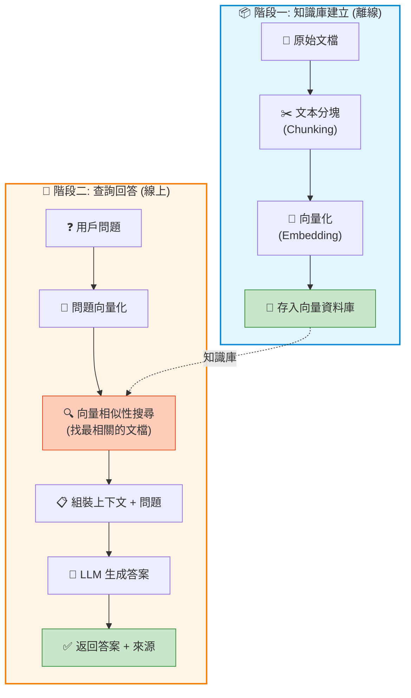

# 7.1 RAG 流程詳解

> **對應章節**: Day18-19
> **對應範例**: `chapter7-rag-basic`
> **難度**: ⭐⭐⭐⭐☆

---

## 📚 本章概要

RAG (Retrieval-Augmented Generation, 檢索增強生成) 是目前最實用的 AI 應用技術之一。它讓 AI 能夠基於**你的私有知識庫**來回答問題,而不僅僅依賴訓練時的舊資料。

**學習目標**:
- 理解 RAG 的工作原理和價值
- 掌握 Spring AI 的 RAG 實現方式
- 學會使用 QuestionAnswerAdvisor
- 建立第一個 RAG 應用

---

## 🎯 為什麼需要 RAG?

### 傳統 LLM 的局限

```
問題: "公司 2024 年 Q4 的銷售數據?"
傳統 LLM: "抱歉,我的訓練資料只到 2023 年..."
```

傳統 LLM 有三大問題:
1. ❌ **知識過時**: 訓練資料有時間限制
2. ❌ **沒有私有資料**: 無法知道你公司的內部資料
3. ❌ **幻覺問題**: 可能編造不存在的資訊

### RAG 的解決方案

```
問題: "公司 2024 年 Q4 的銷售數據?"
RAG 系統:
  1. 從知識庫檢索 → 找到 Q4 銷售報告
  2. 結合報告內容 → 生成答案
  3. 附上資料來源 → 可追溯、可信賴

答案: "根據 Q4 銷售報告,營收成長 15%... (來源: sales-report-q4.pdf)"
```

**RAG 的優勢**:
- ✅ **即時更新**: 更新知識庫即可,無需重新訓練
- ✅ **私有資料**: 支援企業內部文檔
- ✅ **可追溯**: 答案附帶來源,提高可信度
- ✅ **成本低**: 相比 Fine-tuning 便宜很多

---

## 🏗️ RAG 完整流程

### 兩階段工作流程



---

## 💻 Spring AI RAG 實現

### QuestionAnswerAdvisor - 自動 RAG

Spring AI 提供了 `QuestionAnswerAdvisor`,它會**自動執行整個 RAG 流程**,你只需要配置好向量資料庫即可。

```java
// 對應範例: chapter7-rag-basic/.../config/RAGConfig.java:48

@Bean
public ChatClient ragChatClient(
        ChatModel chatModel,
        VectorStore vectorStore) {

    return ChatClient.builder(chatModel)
        .defaultAdvisors(
            new QuestionAnswerAdvisor(
                vectorStore,
                SearchRequest.defaults()
                    .withTopK(5)              // 檢索前 5 個相關文檔
                    .withSimilarityThreshold(0.7)  // 相似度閾值
            )
        )
        .build();
}
```

**QuestionAnswerAdvisor 自動處理**:
1. 🔢 將用戶問題向量化
2. 🔍 從 `VectorStore` 搜尋最相關的文檔 (Top-K)
3. 📋 自動組裝 Prompt: `Context: <檢索到的文檔> \n Question: <用戶問題>`
4. 🤖 調用 LLM 生成答案

這樣你就**不需要手動寫檢索邏輯**了!

### RAG 服務實現

```java
// 對應範例: chapter7-rag-basic/.../service/RAGService.java:32

@Service
@RequiredArgsConstructor
@Slf4j
public class RAGService {

    private final ChatClient ragChatClient;
    private final VectorStore vectorStore;

    /**
     * RAG 查詢 - 就這麼簡單!
     */
    public RAGResponse query(String question) {
        log.debug("Processing RAG query: {}", question);

        // QuestionAnswerAdvisor 自動處理一切
        String response = ragChatClient.prompt()
            .user(question)
            .call()
            .content();

        return RAGResponse.builder()
            .question(question)
            .answer(response)
            .timestamp(LocalDateTime.now())
            .build();
    }

    /**
     * 添加文檔到知識庫
     */
    public void addDocuments(List<Resource> resources) {
        List<Document> documents = new ArrayList<>();

        for (Resource resource : resources) {
            // 1. 讀取文檔
            TextReader reader = new TextReader(resource);
            List<Document> docs = reader.read();

            // 2. 文本分塊
            TokenTextSplitter splitter = new TokenTextSplitter(800, 200);
            List<Document> chunks = splitter.apply(docs);

            documents.addAll(chunks);
        }

        // 3. 存入向量資料庫 (自動向量化)
        vectorStore.add(documents);

        log.info("Added {} document chunks to knowledge base", documents.size());
    }
}
```

**關鍵步驟說明**:
- `TextReader`: 讀取文檔內容
- `TokenTextSplitter(800, 200)`:
  - 800 tokens 一塊
  - 200 tokens 重疊 (保證上下文連貫性)
- `vectorStore.add()`: Spring AI 自動向量化並存儲

---

## 🗄️ 向量資料庫配置

### Neo4j Vector Store 設定

```yaml
# 對應範例: chapter7-rag-basic/src/main/resources/application.yml

spring:
  ai:
    # OpenAI 配置
    openai:
      api-key: ${OPENAI_API_KEY}
      chat:
        model: gpt-4o
      embedding:
        model: text-embedding-3-small  # 1536 維向量

    # Neo4j 向量資料庫
    vectorstore:
      neo4j:
        uri: bolt://localhost:7687
        username: neo4j
        password: ${NEO4J_PASSWORD}
        database-name: neo4j
        index-name: document-embeddings    # 索引名稱
        embedding-dimension: 1536           # 必須與 Embedding Model 一致
        distance-type: COSINE               # 餘弦相似度
```

### 啟動 Neo4j

```bash
docker run -d \
  --name neo4j-rag \
  -p 7474:7474 -p 7687:7687 \
  -e NEO4J_AUTH=neo4j/test1234 \
  neo4j:5.15
```

---

## 🎬 完整使用流程

### Step 1: 上傳文檔建立知識庫

```bash
curl -X POST http://localhost:8080/api/rag/documents \
  -F "files=@spring-ai-guide.pdf" \
  -F "files=@company-handbook.txt"
```

**內部流程**:
```
spring-ai-guide.pdf
  → TextReader 讀取
  → TokenTextSplitter 分塊 (800 tokens/chunk, 200 overlap)
  → OpenAI Embedding (每塊 → 1536 維向量)
  → Neo4j 存儲 (文本 + 向量)
```

### Step 2: RAG 查詢

```bash
curl -X POST http://localhost:8080/api/rag/query \
  -H "Content-Type: application/json" \
  -d '{
    "question": "什麼是 Spring AI 的 Advisor?",
    "topK": 5
  }'
```

**QuestionAnswerAdvisor 自動執行**:
```
1. 向量化問題: "什麼是 Spring AI 的 Advisor?"
   → OpenAI Embedding → [0.1, 0.3, ..., 0.5] (1536維)

2. 向量搜尋: Neo4j 找出最相似的 5 個文檔塊
   → Similarity Score: [0.92, 0.89, 0.87, 0.85, 0.83]

3. 組裝 Prompt:
   """
   Context:
   <檢索到的文檔塊 1>
   <檢索到的文檔塊 2>
   ...

   Question: 什麼是 Spring AI 的 Advisor?

   請根據 Context 回答 Question。
   """

4. GPT-4o 生成答案

5. 返回: 答案 + 來源文檔
```

---

## 🔧 文本分塊策略

### 為什麼要分塊?

```
問題: 一本 200 頁的 PDF → 一整個向量?

1. ❌ 太長:
   - LLM 有 Token 限制 (4K, 8K, 128K...)
   - 單一向量無法精確表示所有內容

2. ❌ 不精確:
   - 用戶問"第 5 章的內容" → 但向量包含全書
   - 相似性分數不準確

解決方案: 分塊!
   200 頁 PDF → 切成 500 個小塊
   → 每塊都有自己的向量
   → 搜尋時只返回最相關的塊
```

### TokenTextSplitter 設定

```java
// 對應範例: chapter7-rag-basic/.../config/RAGConfig.java:60

@Bean
public TokenTextSplitter tokenTextSplitter() {
    return new TokenTextSplitter(
        800,    // chunkSize: 每塊 800 tokens
        200,    // overlapSize: 重疊 200 tokens (避免切斷句子)
        10,     // minChunkSize: 最小塊大小
        10000,  // maxNumChunks: 最大塊數量
        true    // keepSeparator: 保留分隔符
    );
}
```

**重疊 (Overlap) 的重要性**:
```
沒有重疊:
  Chunk 1: "Spring AI 提供了多種功能"
  Chunk 2: "包括聊天、嵌入、圖像生成"
  ❌ 上下文斷裂

有重疊 200 tokens:
  Chunk 1: "Spring AI 提供了多種功能,包括聊天"
  Chunk 2: "提供了多種功能,包括聊天、嵌入、圖像生成"
  ✅ 上下文保持連貫
```

---

## 📊 RAG 效能調校

### Top-K 和相似度閾值

```java
SearchRequest.defaults()
    .withTopK(5)                    // 返回最相關的 5 個文檔
    .withSimilarityThreshold(0.7);  // 只返回相似度 > 0.7 的結果
```

**如何選擇 Top-K?**

| Top-K | 優點 | 缺點 | 適用場景 |
|-------|-----|------|---------|
| **K=3** | 精準、快速 | 可能遺漏相關資訊 | 答案集中在少數文檔 |
| **K=5** | ⭐ 平衡 | - | **通用推薦** |
| **K=10** | 資訊完整 | 可能引入雜訊 | 複雜問題、需要綜合多份文檔 |

**相似度閾值**:
- `0.9+`: 幾乎完全匹配 (可能太嚴格)
- `0.7-0.8`: ⭐ **推薦範圍**
- `0.5-0.6`: 相關性較弱 (可能引入無關內容)

### 動態過濾條件

```java
// 對應範例: chapter7-rag-basic/.../service/RAGService.java:58

public String queryWithFilter(String question, String category) {
    return ragChatClient.prompt()
        .user(question)
        .advisors(a -> a.param(
            QuestionAnswerAdvisor.FILTER_EXPRESSION,
            "category == '" + category + "'"  // 只搜尋特定類別
        ))
        .call()
        .content();
}
```

**使用場景**:
```
問題: "最新的產品規格?"

不加過濾: 可能搜到舊版本、測試版、草稿...
加過濾: category == 'official' AND version == '2024'
→ 只搜尋官方、最新版本
```

---

## 🎯 REST API 設計

### RAG Controller

```java
// 對應範例: chapter7-rag-basic/.../controller/RAGController.java:26

@RestController
@RequestMapping("/api/rag")
@RequiredArgsConstructor
@Slf4j
public class RAGController {

    private final RAGService ragService;

    /**
     * RAG 查詢
     */
    @PostMapping("/query")
    public ResponseEntity<RAGResponse> query(@RequestBody RAGQueryRequest request) {
        try {
            RAGResponse response = ragService.query(request.getQuestion());
            return ResponseEntity.ok(response);
        } catch (Exception e) {
            log.error("RAG query failed", e);
            return ResponseEntity.badRequest()
                .body(RAGResponse.builder()
                    .question(request.getQuestion())
                    .error("查詢失敗: " + e.getMessage())
                    .build());
        }
    }

    /**
     * 上傳文檔
     */
    @PostMapping("/documents")
    public ResponseEntity<ApiResponse> addDocuments(
            @RequestParam("files") List<MultipartFile> files) {

        try {
            List<Resource> resources = files.stream()
                .map(this::convertToResource)
                .collect(Collectors.toList());

            ragService.addDocuments(resources);

            return ResponseEntity.ok(
                ApiResponse.success("成功添加 " + files.size() + " 個文檔到知識庫")
            );
        } catch (Exception e) {
            log.error("Failed to add documents", e);
            return ResponseEntity.badRequest()
                .body(ApiResponse.error("文檔添加失敗: " + e.getMessage()));
        }
    }
}
```

---

## 📝 重點回顧

### RAG 核心概念
✅ RAG = Retrieval + Augmented + Generation
✅ 解決 LLM 知識過時、無私有資料的問題
✅ 成本低、易更新、可追溯

### Spring AI 實現
✅ `QuestionAnswerAdvisor` 自動處理 RAG 流程
✅ `VectorStore` 統一介面(Neo4j, Chroma, Pinecone...)
✅ `TokenTextSplitter` 智能分塊

### 最佳實踐
✅ 分塊大小: 800 tokens + 200 overlap
✅ Top-K: 5 個文檔(通用推薦)
✅ 相似度閾值: 0.7 - 0.8
✅ 添加過濾條件提高精準度

---

## 🚀 下一步

👉 [7.2 內容向量化](./7.2-內容向量化.md) - 深入理解 Embedding 技術

---

**相關資源**:
- 對應範例: [`chapter7-rag-basic`](../../code-examples/chapter7-rag/chapter7-rag-basic/)
- [Spring AI RAG 官方文檔](https://docs.spring.io/spring-ai/reference/api/vectordbs.html)
- [RAG 論文](https://arxiv.org/abs/2005.11401)
