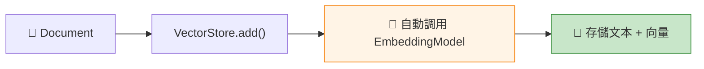

# 7.2 內容向量化

> **對應章節**: Day19
> **對應範例**: `chapter7-rag-basic`
> **難度**: ⭐⭐⭐☆☆

---

## 📚 本章概要

向量化 (Embedding) 是 RAG 的核心技術。它將文字轉換成數字向量,讓電腦能「理解」文字的語義,並計算相似度。

**學習目標**:
- 理解向量化的原理和意義
- 掌握 Spring AI 的 Embedding 模型
- 學會選擇合適的向量模型
- 了解向量品質評估方法

---

## 🎯 什麼是向量化?

### 從文字到數字

```
傳統方式:
"Spring AI" → 字串比對 → 只能找到完全相同的文字

向量化:
"Spring AI"     → [0.2, -0.1, 0.8, ..., 0.5] (1536維)
"Spring框架"    → [0.18, -0.08, 0.82, ..., 0.52] (1536維)
"Java框架"      → [0.15, -0.05, 0.75, ..., 0.48] (1536維)

→ 計算相似度 → 找出語義相近的文字!
```

### 向量化的威力

**範例: 語義相似性**

```java
// 這三句話意思相同,但文字完全不同
String text1 = "Spring AI 很好用";
String text2 = "Spring AI 非常實用";
String text3 = "Spring AI is very useful";

// 向量化後,相似度都很高!
similarity(text1, text2) = 0.92  // 92% 相似
similarity(text1, text3) = 0.89  // 跨語言也能識別!
```

**數學原理**:
- **餘弦相似度 (Cosine Similarity)**: 常用方法

```
相似度 = cos(θ) = (A · B) / (||A|| × ||B||)

範圍: -1 到 1
- 1.0  = 完全相同
- 0.8+ = 非常相似
- 0.0  = 無關
```

---

## 🔧 Spring AI Embedding 模型

### OpenAI Embeddings (推薦)

Spring AI 預設使用 OpenAI 的 Embedding 模型:

```yaml
# application.yml
spring:
  ai:
    openai:
      api-key: ${OPENAI_API_KEY}
      embedding:
        model: text-embedding-3-small  # 推薦模型
        # model: text-embedding-3-large  # 高精度版本
```

**模型比較**:

| 模型 | 向量維度 | 成本 | 適用場景 |
|------|---------|------|---------|
| **text-embedding-3-small** | 1536 | $0.02/1M tokens | ⭐ 通用推薦 |
| **text-embedding-3-large** | 3072 | $0.13/1M tokens | 高精度需求 |
| text-embedding-ada-002 | 1536 | $0.10/1M tokens | 舊版(穩定) |

**選擇建議**:
- 💰 **預算有限**: text-embedding-3-small (性價比最高)
- 🎯 **追求精度**: text-embedding-3-large (準確度最高)
- 🚀 **快速啟動**: text-embedding-3-small (新專案首選)

### 本地模型 (Ollama)

如果不想依賴 OpenAI,可以使用本地模型:

```yaml
spring:
  ai:
    ollama:
      base-url: http://localhost:11434
      embedding:
        model: nomic-embed-text  # 本地 Embedding 模型
```

**Ollama 模型**:
- `nomic-embed-text`: 768 維,適合英文
- `mxbai-embed-large`: 1024 維,多語言支援

**優缺點**:
- ✅ 免費、隱私、離線可用
- ❌ 精度較 OpenAI 稍低
- ❌ 需要本地運算資源

---

## 💻 Spring AI 向量化實現

### 自動向量化 (推薦)

**最簡單的方式**: Spring AI 會自動處理!

```java
// 對應範例: chapter7-rag-basic/.../service/RAGService.java:161

@Service
public class RAGService {

    private final VectorStore vectorStore;

    public void addDocuments(List<Resource> resources) {
        List<Document> documents = new ArrayList<>();

        for (Resource resource : resources) {
            // 1. 讀取文檔
            TextReader reader = new TextReader(resource);
            List<Document> docs = reader.read();

            // 2. 文本分塊
            TokenTextSplitter splitter = new TokenTextSplitter(800, 200);
            List<Document> chunks = splitter.apply(docs);

            documents.addAll(chunks);
        }

        // 3. VectorStore 會自動向量化!
        vectorStore.add(documents);  // ← Spring AI 自動調用 Embedding API

        log.info("Added {} documents (auto-embedded)", documents.size());
    }
}
```

**內部流程**:


### 手動向量化 (進階)

如果需要更多控制,可以手動向量化:

```java
@Service
public class ManualEmbeddingService {

    private final EmbeddingModel embeddingModel;

    /**
     * 單一文本向量化
     */
    public float[] embedText(String text) {
        // 調用 Embedding Model
        EmbeddingResponse response = embeddingModel.embedForResponse(List.of(text));

        // 提取向量
        return response.getResults().get(0)
            .getOutput()
            .stream()
            .mapToDouble(Double::doubleValue)
            .toArray();
    }

    /**
     * 批次向量化 (效率更高)
     */
    public List<float[]> embedTexts(List<String> texts) {
        EmbeddingResponse response = embeddingModel.embedForResponse(texts);

        return response.getResults().stream()
            .map(result -> result.getOutput())
            .map(list -> list.stream()
                .mapToDouble(Double::doubleValue)
                .toArray())
            .collect(Collectors.toList());
    }
}
```

---

## 📊 向量品質評估

### 如何評估向量好壞?

**測試方法: 語義相似性測試**

```java
@Test
public void testEmbeddingQuality() {
    // 準備測試文本
    String text1 = "Spring AI 是 Java 開發框架";
    String text2 = "Spring AI is a Java framework";
    String text3 = "Python 是程式語言";

    // 向量化
    float[] vec1 = embeddingService.embedText(text1);
    float[] vec2 = embeddingService.embedText(text2);
    float[] vec3 = embeddingService.embedText(text3);

    // 計算相似度
    double sim12 = cosineSimilarity(vec1, vec2);
    double sim13 = cosineSimilarity(vec1, vec3);

    // 驗證結果
    assertTrue(sim12 > 0.8);  // 相同意思,應該很相似
    assertTrue(sim13 < 0.5);  // 不同主題,應該不相似
}
```

### 向量品質檢查

```java
public class VectorQualityChecker {

    /**
     * 檢查向量是否正常
     */
    public boolean isVectorValid(float[] vector) {
        // 1. 檢查維度
        if (vector.length != 1536) {
            log.warn("Wrong dimension: {}", vector.length);
            return false;
        }

        // 2. 檢查是否為零向量
        boolean allZeros = Arrays.stream(vector)
            .allMatch(v -> Math.abs(v) < 1e-6);
        if (allZeros) {
            log.warn("Zero vector detected");
            return false;
        }

        // 3. 檢查數值範圍
        double max = Arrays.stream(vector).max().orElse(0);
        double min = Arrays.stream(vector).min().orElse(0);
        if (max > 10.0 || min < -10.0) {
            log.warn("Abnormal values: [{}, {}]", min, max);
            return false;
        }

        return true;
    }
}
```

---

## 🔍 相似度計算方法

### 餘弦相似度 (最常用)

```java
/**
 * 計算兩個向量的餘弦相似度
 */
public double cosineSimilarity(float[] vec1, float[] vec2) {
    if (vec1.length != vec2.length) {
        throw new IllegalArgumentException("Vector dimensions must match");
    }

    double dotProduct = 0.0;
    double norm1 = 0.0;
    double norm2 = 0.0;

    for (int i = 0; i < vec1.length; i++) {
        dotProduct += vec1[i] * vec2[i];
        norm1 += vec1[i] * vec1[i];
        norm2 += vec2[i] * vec2[i];
    }

    return dotProduct / (Math.sqrt(norm1) * Math.sqrt(norm2));
}
```

**相似度解讀**:

| 相似度範圍 | 意義 | 應用場景 |
|-----------|------|---------|
| **0.9 - 1.0** | 幾乎相同 | 去重、精確匹配 |
| **0.7 - 0.9** | 高度相關 | ⭐ RAG 檢索推薦閾值 |
| **0.5 - 0.7** | 有一定關聯 | 相關推薦 |
| **< 0.5** | 關聯性弱 | 不建議使用 |

### 歐幾里得距離

```java
/**
 * 歐幾里得距離 (越小越相似)
 */
public double euclideanDistance(float[] vec1, float[] vec2) {
    double sum = 0.0;
    for (int i = 0; i < vec1.length; i++) {
        sum += Math.pow(vec1[i] - vec2[i], 2);
    }
    return Math.sqrt(sum);
}
```

**餘弦 vs 歐氏距離**:
- **餘弦相似度**: 關注方向,不關注長度 → RAG 首選
- **歐氏距離**: 關注實際距離 → 圖像、聲音處理常用

---

## 💰 向量化成本優化

### 批次處理

**❌ 低效做法**: 逐一向量化
```java
// 每次調用 API = 每次計費
for (Document doc : documents) {
    float[] vector = embeddingModel.embed(doc.getContent());
    // 1000 個文檔 = 1000 次 API 調用!
}
```

**✅ 高效做法**: 批次向量化
```java
// 一次調用處理 100 個
List<String> texts = documents.stream()
    .map(Document::getContent)
    .collect(Collectors.toList());

// 批次處理,減少 API 調用次數
List<List<String>> batches = partition(texts, 100);
for (List<String> batch : batches) {
    embeddingModel.embedForResponse(batch);
}
// 1000 個文檔 = 10 次 API 調用 → 省 90% 時間和成本!
```

### 快取策略

**避免重複向量化**:

```java
@Service
public class CachedEmbeddingService {

    private final Map<String, float[]> cache = new ConcurrentHashMap<>();
    private final EmbeddingModel embeddingModel;

    public float[] embedText(String text) {
        // 使用文本 hash 作為 key
        String cacheKey = DigestUtils.md5Hex(text);

        // 檢查快取
        if (cache.containsKey(cacheKey)) {
            log.debug("Cache hit for: {}", text.substring(0, 30));
            return cache.get(cacheKey);
        }

        // 快取未命中,調用 API
        float[] vector = embeddingModel.embed(text);
        cache.put(cacheKey, vector);

        return vector;
    }
}
```

**成本節省**:
```
場景: 重複處理同一份文檔
- 無快取: 每次都調用 API → $0.02/次
- 有快取: 第一次調用 API,之後免費 → 省 99% 成本!
```

---

## 🌍 多語言支援

### OpenAI 多語言能力

OpenAI Embeddings **天生支援多語言**:

```java
@Test
public void testMultilingualEmbedding() {
    String zh = "Spring AI 是一個強大的框架";
    String en = "Spring AI is a powerful framework";
    String ja = "Spring AI は強力なフレームワークです";

    float[] vecZh = embeddingModel.embed(zh);
    float[] vecEn = embeddingModel.embed(en);
    float[] vecJa = embeddingModel.embed(ja);

    // 跨語言相似度檢測
    double simZhEn = cosineSimilarity(vecZh, vecEn);
    double simZhJa = cosineSimilarity(vecZh, vecJa);

    assertTrue(simZhEn > 0.85);  // 中英相似度高
    assertTrue(simZhJa > 0.85);  // 中日相似度高
}
```

**跨語言 RAG**:
```
知識庫: 英文文檔
用戶問題: 中文

→ OpenAI Embedding 自動處理跨語言語義匹配!
```

---

## 🎯 實戰技巧

### 1. 文本預處理

```java
/**
 * 向量化前的文本清理
 */
public String preprocessText(String text) {
    return text
        .trim()
        .replaceAll("\\s+", " ")           // 標準化空白
        .replaceAll("[\\r\\n]+", " ")      // 移除換行
        .substring(0, Math.min(text.length(), 8000));  // 限制長度
}
```

### 2. 向量維度選擇

```yaml
# OpenAI 支援自定義維度
spring:
  ai:
    openai:
      embedding:
        model: text-embedding-3-small
        options:
          dimensions: 512  # 可選: 512, 1024, 1536
```

**維度權衡**:
- **高維度 (1536)**: 精度高,但儲存空間大
- **低維度 (512)**: 儲存省空間,但精度略降

**建議**: 除非儲存空間極度受限,否則使用預設 1536 維

### 3. 向量歸一化

Neo4j VectorStore 自動處理歸一化,你不需要手動做:

```java
// Spring AI + Neo4j 會自動歸一化向量
vectorStore.add(documents);  // ← 內部已處理
```

---

## 📝 重點回顧

### 核心概念
✅ 向量化將文字轉為數字,讓電腦理解語義
✅ 餘弦相似度是最常用的相似度計算方法
✅ OpenAI text-embedding-3-small 是性價比首選

### Spring AI 實現
✅ VectorStore 自動向量化,無需手動調用
✅ 支援批次處理,提高效率
✅ 天生支援多語言

### 最佳實踐
✅ 使用批次處理節省成本
✅ 實施快取避免重複計算
✅ RAG 相似度閾值建議 0.7-0.8
✅ 預設維度 1536 已足夠,無需調整

---

## 🚀 下一步

👉 [7.3 ETL(上)-知識來源](./7.3-ETL上-知識來源.md) - 學習多種資料來源整合

---

**相關資源**:
- 對應範例: [`chapter7-rag-basic`](../../code-examples/chapter7-rag/chapter7-rag-basic/)
- [OpenAI Embeddings API](https://platform.openai.com/docs/guides/embeddings)
- [向量相似度計算](https://www.pinecone.io/learn/vector-similarity/)
