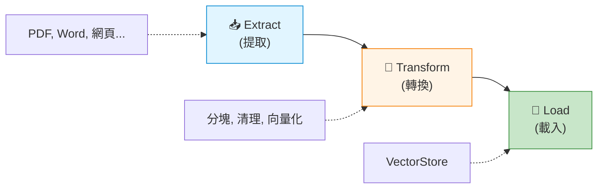

# 7.3 ETL(上) - 知識來源

> **對應章節**: Day20
> **對應範例**: `chapter7-rag-etl-pipeline`
> **難度**: ⭐⭐⭐⭐☆

---

## 📚 本章概要

RAG 系統的知識來源千變萬化: PDF、Word、網頁、資料庫...。Spring AI 提供了統一的 **DocumentReader** 介面,讓你輕鬆整合各種資料來源。

**學習目標**:
- 理解 Spring AI ETL 三階段流程
- 掌握各種 DocumentReader 的使用
- 學會設計可擴展的ETL管道
- 實現多格式文檔處理

---

## 🎯 什麼是 ETL?

### ETL 三階段



**ETL vs 傳統資料處理**:

| 階段 | 傳統 ETL | RAG ETL |
|------|---------|---------|
| **Extract** | 從資料庫提取結構化資料 | 從文檔提取**非結構化文字** |
| **Transform** | 資料清理、格式轉換 | 文本分塊、**向量化** |
| **Load** | 載入關聯式資料庫 | 載入**向量資料庫** |

---

## 🏗️ Spring AI ETL 架構

### 三大核心介面

Spring AI 提供了函數式介面,設計優雅:

```java
/**
 * DocumentReader: 讀取資料來源
 */
@FunctionalInterface
public interface DocumentReader extends Supplier<List<Document>> {
    // 就是一個 Supplier,返回文檔列表
}

/**
 * DocumentTransformer: 轉換文檔
 */
@FunctionalInterface
public interface DocumentTransformer extends Function<List<Document>, List<Document>> {
    // 輸入文檔列表,輸出轉換後的文檔列表
}

/**
 * DocumentWriter: 寫入目標
 */
@FunctionalInterface
public interface DocumentWriter extends Consumer<List<Document>> {
    // 消費文檔列表
}
```

**函數式組合**:

```java
// 函數式風格的 ETL Pipeline
DocumentReader reader = new PdfReader(resource);
DocumentTransformer splitter = new TokenTextSplitter();
DocumentWriter writer = vectorStore::add;

// 組合執行
writer.accept(splitter.apply(reader.get()));

// 更簡潔的寫法
vectorStore.add(
    new TokenTextSplitter()
        .apply(new PdfReader(resource).get())
);
```

---

## 📄 PDF 文檔處理

### PagePdfDocumentReader (按頁分割)

**依賴配置**:
```xml
<dependency>
    <groupId>org.springframework.ai</groupId>
    <artifactId>spring-ai-pdf-document-reader</artifactId>
</dependency>
```

**基本使用**:

```java
// 對應範例: chapter7-rag-etl-pipeline/.../service/PdfDocumentService.java

@Service
public class PdfDocumentService {

    /**
     * 讀取 PDF (每頁一個 Document)
     */
    public List<Document> readPdf(Resource pdfResource) {
        PagePdfDocumentReader reader = new PagePdfDocumentReader(pdfResource);
        return reader.read();
    }

    /**
     * 進階配置
     */
    public List<Document> readPdfAdvanced(Resource pdfResource) {
        PdfDocumentReaderConfig config = PdfDocumentReaderConfig.builder()
            .withPageTopMargin(50)     // 上邊距 (跳過頁首)
            .withPageBottomMargin(50)  // 下邊距 (跳過頁尾)
            .withPagesPerDocument(3)   // 每3頁合併成一個 Document
            .withPageExtractedTextFormatter(
                ExtractedTextFormatter.builder()
                    .withNumberOfTopTextLinesToDelete(2)    // 刪除前2行 (標題/頁碼)
                    .withNumberOfBottomTextLinesToDelete(1) // 刪除最後1行 (頁碼)
                    .build()
            )
            .build();

        return new PagePdfDocumentReader(pdfResource, config).read();
    }
}
```

**輸出範例**:
```
PDF: 10頁

→ PagePdfDocumentReader (預設)
  └→ 10 個 Document (每頁一個)

→ PagePdfDocumentReader (pagesPerDocument=3)
  └→ 4 個 Document (3頁, 3頁, 3頁, 1頁)
```

### ParagraphPdfDocumentReader (按段落分割)

**更智能的分割方式**:

```java
public List<Document> readPdfByParagraph(Resource pdfResource) {
    ParagraphPdfDocumentReader reader = new ParagraphPdfDocumentReader(pdfResource);
    return reader.read();
}
```

**Page vs Paragraph**:

```
同一份 10頁 PDF:

PagePdfDocumentReader:
  → 10 個 Document (固定按頁分割)
  → 可能在句子中間切斷

ParagraphPdfDocumentReader:
  → 25 個 Document (按段落分割)
  → 保持段落完整性 ← 更適合 RAG!
```

---

## 📝 Office 文檔處理 (Tika)

### TikaDocumentReader (萬能讀取器)

Apache Tika 可以處理 **300+ 種格式**!

**依賴配置**:
```xml
<dependency>
    <groupId>org.springframework.ai</groupId>
    <artifactId>spring-ai-tika-document-reader</artifactId>
</dependency>
```

**支援格式**:
- 📘 Word: `.doc`, `.docx`
- 📊 Excel: `.xls`, `.xlsx`
- 📽️ PowerPoint: `.ppt`, `.pptx`
- 🖼️ 圖像: `.jpg`, `.png` (需OCR)
- 🗜️ 壓縮檔: `.zip`, `.tar`
- ...還有 290+ 種!

**使用方式**:

```java
@Service
public class OfficeDocumentService {

    /**
     * Word 文檔
     */
    public List<Document> readWord(Resource wordFile) {
        TikaDocumentReader reader = new TikaDocumentReader(wordFile);
        return reader.read();
    }

    /**
     * PowerPoint 文檔
     */
    public List<Document> readPowerPoint(Resource pptFile) {
        TikaDocumentReader reader = new TikaDocumentReader(pptFile);
        List<Document> docs = reader.read();

        // 添加元資料
        docs.forEach(doc -> {
            doc.getMetadata().put("doc_type", "POWERPOINT");
            doc.getMetadata().put("source", pptFile.getFilename());
        });

        return docs;
    }

    /**
     * 自動識別格式
     */
    public List<Document> readAnyFormat(Resource file) {
        // Tika 自動檢測文件類型!
        TikaDocumentReader reader = new TikaDocumentReader(file);
        return reader.read();
    }
}
```

---

## 📃 文本文件處理

### TextReader (純文本)

```java
@Service
public class TextDocumentService {

    /**
     * 讀取 TXT 文件
     */
    public List<Document> readTextFile(Resource textFile) {
        TextReader reader = new TextReader(textFile);
        reader.setCharset(StandardCharsets.UTF_8);  // 設定編碼

        // 添加自定義元資料
        reader.getCustomMetadata().put("filename", textFile.getFilename());

        return reader.read();
    }
}
```

### MarkdownDocumentReader

```java
/**
 * 讀取 Markdown 文件
 */
public List<Document> readMarkdown(Resource mdFile) {
    MarkdownDocumentReaderConfig config = MarkdownDocumentReaderConfig.builder()
        .withHorizontalRuleCreateDocument(true)  // 用 --- 分割文檔
        .withIncludeCodeBlock(true)              // 包含程式碼區塊
        .withIncludeBlockquote(true)             // 包含引用區塊
        .build();

    MarkdownDocumentReader reader = new MarkdownDocumentReader(mdFile, config);
    return reader.read();
}
```

**Markdown 分割範例**:
```markdown
# 第一章
內容...

---

# 第二章
內容...
```

→ `withHorizontalRuleCreateDocument(true)`
→ 2 個 Document (按 `---` 分割)

### JsonReader

```java
/**
 * 讀取 JSON 文件
 */
public List<Document> readJson(Resource jsonFile) {
    // 只提取 "content" 和 "description" 欄位
    JsonReader reader = new JsonReader(jsonFile, "content", "description");
    return reader.read();
}

/**
 * JSON Pointer 指定路徑
 */
public List<Document> readJsonWithPointer(Resource jsonFile) {
    JsonReader reader = new JsonReader(jsonFile, "title", "body");

    // 只讀取 /articles 下的內容
    return reader.get("/articles");
}
```

**JSON 範例**:
```json
{
  "articles": [
    {"title": "Spring AI", "body": "Spring AI 介紹..."},
    {"title": "RAG 系統", "body": "RAG 系統介紹..."}
  ]
}
```

→ `reader.get("/articles")`
→ 2 個 Document

---

## 🌐 網頁內容處理

### JsoupDocumentReader (HTML)

**依賴**: Spring AI 已內建 Jsoup

```java
@Service
public class WebDocumentService {

    /**
     * 讀取 HTML 文件
     */
    public List<Document> readHtml(Resource htmlFile) {
        JsoupDocumentReaderConfig config = JsoupDocumentReaderConfig.builder()
            .selector("article, div.content")  // CSS 選擇器
            .charset("UTF-8")
            .includeLinkUrls(false)             // 不包含超連結
            .build();

        JsoupDocumentReader reader = new JsoupDocumentReader(htmlFile, config);
        return reader.read();
    }

    /**
     * 讀取網頁 URL
     */
    public List<Document> readWebPage(String url) {
        try {
            Resource urlResource = new UrlResource(url);

            JsoupDocumentReaderConfig config = JsoupDocumentReaderConfig.builder()
                .selector("body")                // 提取整個 body
                .metadataTags(List.of("title", "description", "keywords"))
                .build();

            return new JsoupDocumentReader(urlResource, config).read();

        } catch (Exception e) {
            log.error("Failed to read URL: {}", url, e);
            return Collections.emptyList();
        }
    }
}
```

**CSS 選擇器範例**:
```java
// 提取文章內容
.selector("article")

// 提取多個區域
.selector("article, div.content, section.main")

// 排除廣告
.selector("article:not(.ad)")
```

---

## 🔄 ETL Pipeline 設計

### 完整 ETL 流程

```java
// 對應範例: chapter7-rag-etl-pipeline/.../service/EtlPipelineService.java

@Service
@Slf4j
public class EtlPipelineService {

    private final VectorStore vectorStore;

    /**
     * 完整 ETL 管道
     */
    public void processDocuments(List<Resource> resources) {
        log.info("Starting ETL pipeline with {} resources", resources.size());

        // 1. Extract - 讀取文檔
        List<Document> documents = extractDocuments(resources);
        log.info("Extracted {} documents", documents.size());

        // 2. Transform - 轉換處理
        List<Document> transformed = transformDocuments(documents);
        log.info("Transformed to {} chunks", transformed.size());

        // 3. Load - 載入向量資料庫
        loadDocuments(transformed);
        log.info("ETL pipeline completed");
    }

    /**
     * Extract: 根據文件類型選擇 Reader
     */
    private List<Document> extractDocuments(List<Resource> resources) {
        List<Document> allDocs = new ArrayList<>();

        for (Resource resource : resources) {
            DocumentReader reader = createReader(resource);
            allDocs.addAll(reader.read());
        }

        return allDocs;
    }

    /**
     * 工廠模式: 創建對應的 Reader
     */
    private DocumentReader createReader(Resource resource) {
        String filename = resource.getFilename();
        if (filename == null) {
            throw new IllegalArgumentException("Filename is null");
        }

        String lower = filename.toLowerCase();

        if (lower.endsWith(".pdf")) {
            return new PagePdfDocumentReader(resource);
        } else if (lower.matches(".*\\.(docx?|pptx?|xlsx?)$")) {
            return new TikaDocumentReader(resource);
        } else if (lower.endsWith(".txt")) {
            return new TextReader(resource);
        } else if (lower.endsWith(".md")) {
            return new MarkdownDocumentReader(resource);
        } else if (lower.endsWith(".json")) {
            return new JsonReader(resource);
        } else if (lower.endsWith(".html")) {
            return new JsoupDocumentReader(resource);
        }

        throw new IllegalArgumentException("Unsupported file type: " + filename);
    }

    /**
     * Transform: 文本分塊
     */
    private List<Document> transformDocuments(List<Document> documents) {
        TokenTextSplitter splitter = new TokenTextSplitter(800, 200);
        return splitter.apply(documents);
    }

    /**
     * Load: 寫入向量資料庫
     */
    private void loadDocuments(List<Document> documents) {
        vectorStore.add(documents);
    }
}
```

### DocumentReader 工廠模式

更優雅的設計:

```java
@Component
public class DocumentReaderFactory {

    private final Map<String, Function<Resource, DocumentReader>> readerMap;

    public DocumentReaderFactory() {
        readerMap = Map.of(
            ".pdf", PagePdfDocumentReader::new,
            ".txt", TextReader::new,
            ".md", MarkdownDocumentReader::new,
            ".json", resource -> new JsonReader(resource),
            ".html", resource -> new JsoupDocumentReader(resource)
        );
    }

    public DocumentReader createReader(Resource resource) {
        String filename = resource.getFilename();
        if (filename == null) {
            throw new IllegalArgumentException("Filename is null");
        }

        String extension = filename.substring(filename.lastIndexOf('.'));

        Function<Resource, DocumentReader> constructor = readerMap.get(extension);
        if (constructor == null) {
            // Office 文檔統一用 Tika
            if (extension.matches("\\.(docx?|pptx?|xlsx?)")) {
                return new TikaDocumentReader(resource);
            }
            throw new UnsupportedOperationException("Unsupported: " + extension);
        }

        return constructor.apply(resource);
    }
}
```

---

## 📊 元資料增強

### 為什麼需要元資料?

```
沒有元資料:
  Document("Spring AI 是一個框架...")
  → RAG 查詢時無法過濾來源、日期等

有元資料:
  Document("Spring AI 是一個框架...", {
    "source_file": "spring-ai-guide.pdf",
    "page_number": 5,
    "category": "技術文檔",
    "version": "1.0.0",
    "author": "Spring Team",
    "created_at": "2024-01-01"
  })
  → 可以按來源、類別、日期過濾!
```

### 添加元資料

```java
@Service
public class MetadataEnrichmentService {

    /**
     * 添加自定義元資料
     */
    public List<Document> enrichMetadata(List<Document> documents, Resource source) {
        String filename = source.getFilename();
        String fileType = getFileExtension(filename);

        documents.forEach(doc -> {
            Map<String, Object> metadata = doc.getMetadata();

            // 基本資訊
            metadata.put("source_file", filename);
            metadata.put("file_type", fileType);
            metadata.put("processed_at", LocalDateTime.now().toString());

            // 分類
            metadata.put("category", detectCategory(doc.getContent()));

            // 語言
            metadata.put("language", detectLanguage(doc.getContent()));
        });

        return documents;
    }

    private String detectCategory(String content) {
        // 簡單關鍵字匹配
        if (content.contains("Spring") || content.contains("Java")) {
            return "技術文檔";
        } else if (content.contains("公司") || content.contains("政策")) {
            return "公司政策";
        }
        return "其他";
    }

    private String detectLanguage(String content) {
        // 簡化判斷
        return content.matches(".*[\\u4e00-\\u9fa5]+.*") ? "zh-TW" : "en";
    }
}
```

---

## 🎯 REST API 整合

### ETL Controller

```java
@RestController
@RequestMapping("/api/etl")
@RequiredArgsConstructor
public class EtlController {

    private final EtlPipelineService etlService;

    /**
     * 批次上傳文檔
     */
    @PostMapping("/upload")
    public ResponseEntity<EtlResponse> uploadDocuments(
            @RequestParam("files") List<MultipartFile> files) {

        try {
            List<Resource> resources = files.stream()
                .map(this::convertToResource)
                .collect(Collectors.toList());

            etlService.processDocuments(resources);

            return ResponseEntity.ok(EtlResponse.builder()
                .success(true)
                .message("成功處理 " + files.size() + " 個文檔")
                .filesProcessed(files.size())
                .build());

        } catch (Exception e) {
            log.error("ETL failed", e);
            return ResponseEntity.badRequest()
                .body(EtlResponse.builder()
                    .success(false)
                    .error(e.getMessage())
                    .build());
        }
    }

    private Resource convertToResource(MultipartFile file) {
        try {
            return new ByteArrayResource(file.getBytes()) {
                @Override
                public String getFilename() {
                    return file.getOriginalFilename();
                }
            };
        } catch (IOException e) {
            throw new RuntimeException("Failed to convert file", e);
        }
    }
}
```

---

## 📝 重點回顧

### Spring AI ETL 架構
✅ DocumentReader, Transformer, Writer 三大介面
✅ 函數式設計,易於組合
✅ 工廠模式實現多格式支援

### 支援的文件格式
✅ PDF: PagePdfDocumentReader, ParagraphPdfDocumentReader
✅ Office: TikaDocumentReader (Word, Excel, PPT)
✅ 文本: TextReader, MarkdownDocumentReader, JsonReader
✅ 網頁: JsoupDocumentReader (HTML, URL)

### 最佳實踐
✅ 使用 ParagraphPdfDocumentReader 保持段落完整性
✅ 實施元資料增強提高檢索精準度
✅ 工廠模式統一管理 Reader 創建
✅ 添加錯誤處理和日誌記錄

---

## 🚀 下一步

👉 [7.4 ETL(中)-進階文件](./7.4-ETL中-進階文件.md) - OCR、壓縮檔案處理

---

**相關資源**:
- 對應範例: [`chapter7-rag-etl-pipeline`](../../code-examples/chapter7-rag/chapter7-rag-etl-pipeline/)
- [Spring AI DocumentReader](https://docs.spring.io/spring-ai/reference/api/etl-pipeline.html)
- [Apache Tika](https://tika.apache.org/)
