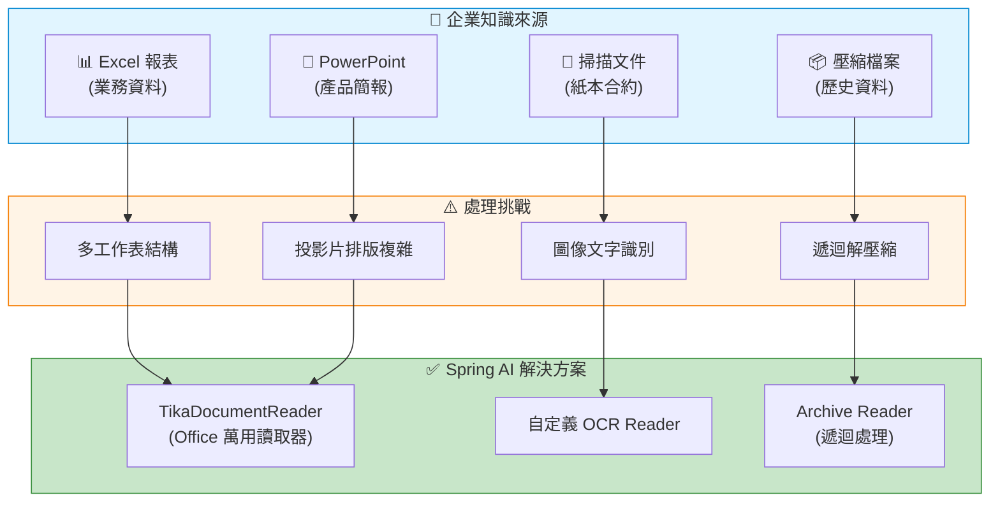
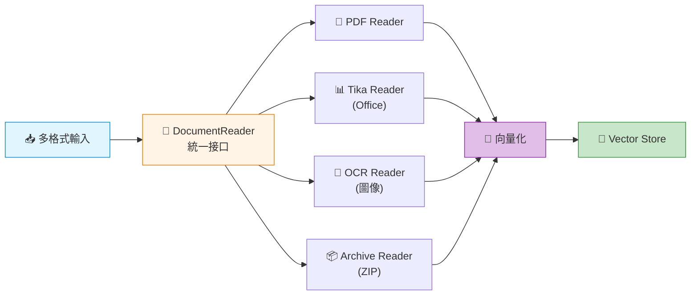
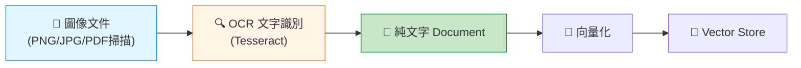
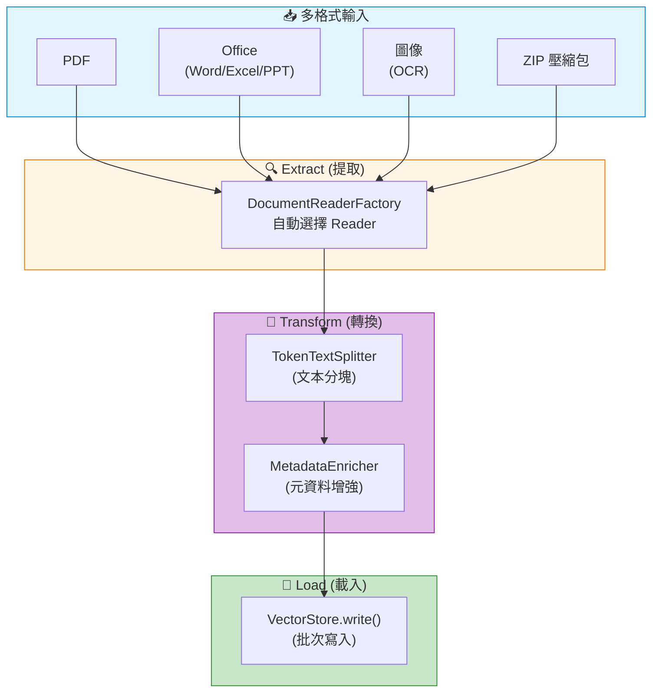

# 7.4 ETL(中) - 進階文件類型

> **對應章節**: Day21
> **對應範例**: `chapter7-rag-etl-pipeline`
> **難度**: ⭐⭐⭐⭐☆

---

## 📚 本章概要

真實世界的知識庫不只有 PDF 和 Word,還有 Excel 試算表、PowerPoint 簡報、掃描圖片、壓縮檔案...。本章將教你如何使用 Spring AI 處理這些進階文件類型,建立完整的多媒體內容提取能力。

**學習目標**:
- 使用 TikaDocumentReader 處理 Office 文件
- 實現 OCR 圖像文字提取
- 處理壓縮檔案的批次提取
- 設計統一的多格式文檔處理架構

---

## 🎯 為什麼需要進階文件處理?

### 企業場景需求



**真實案例**:
- 📊 **財務部門**: 從 Excel 報表提取業務數據建立問答系統
- 🎯 **銷售團隊**: 整合所有產品簡報內容供 AI 查詢
- 📄 **法務合規**: 將掃描的合約文件數位化並向量化
- 📦 **IT 部門**: 批次處理歷史文檔壓縮包

---

## 🏗️ 多格式文檔架構

### Spring AI ETL Pipeline 擴展



**設計原則**:
1. **統一介面**: 所有 Reader 都實現 `DocumentReader` 接口
2. **工廠模式**: 根據檔案類型自動選擇適當的 Reader
3. **可擴展性**: 輕鬆添加新的文件格式支援

---

## 📊 Office 文件處理 (Excel & PowerPoint)

### TikaDocumentReader - Office 文件萬用讀取器

**Apache Tika** 是 Spring AI 官方推薦的 Office 文件處理方案,支援 Word、Excel、PowerPoint 等格式。

#### 依賴配置

```xml
<dependency>
    <groupId>org.springframework.ai</groupId>
    <artifactId>spring-ai-tika-document-reader</artifactId>
</dependency>
```

#### 基本用法

```java
// 對應範例: chapter7-rag-etl-pipeline/.../service/MultiFormatDocumentReader.java:76

/**
 * 讀取 Office 文檔 (Word, Excel, PowerPoint)
 */
private List<Document> readOfficeDocument(Resource resource) {
    log.debug("使用 Tika 讀取 Office 文檔: {}", resource.getFilename());

    // 1. 創建 TikaDocumentReader (Spring AI 提供)
    TikaDocumentReader tikaReader = new TikaDocumentReader(resource);
    List<Document> documents = tikaReader.read();

    // 2. 添加文檔類型元資料
    String filename = resource.getFilename();
    documents.forEach(doc -> {
        doc.getMetadata().put("document_type", determineDocumentType(filename));
        doc.getMetadata().put("source_file", filename);
        doc.getMetadata().put("extraction_method", "TIKA");
    });

    return documents;
}
```

**Tika 的強大之處**:
- ✅ 自動偵測文件編碼和格式
- ✅ 提取表格、圖表的文字內容
- ✅ 處理複雜的排版和嵌入物件
- ✅ 支援 1000+ 種文件格式

### Office 文件提取示例

| 文件類型 | 提取內容 | 注意事項 |
|---------|---------|---------|
| **Excel (.xlsx)** | 所有工作表的文字、數值 | 公式會被轉為計算結果 |
| **PowerPoint (.pptx)** | 投影片文字、備註、圖表說明 | 不包含圖片內容 |
| **Word (.docx)** | 文字、表格、註腳 | 保留基本結構 |

**完整 ETL 流程**:

```java
// 對應範例: chapter7-rag-etl-pipeline/.../service/EtlPipelineService.java

/**
 * Office 文件 ETL 流程
 */
public void processOfficeDocument(Resource resource) {
    // 1. Extract: 使用 Tika 讀取
    TikaDocumentReader reader = new TikaDocumentReader(resource);
    List<Document> documents = reader.read();

    // 2. Transform: 文本分割
    TokenTextSplitter splitter = new TokenTextSplitter(800, 200, 5, 1000, true);
    List<Document> chunks = splitter.apply(documents);

    // 3. Load: 載入向量資料庫
    vectorStore.write(chunks);

    log.info("成功處理 Office 文件: {}", resource.getFilename());
}
```

---

## 📸 圖像文件 OCR 處理

### 為什麼需要 OCR?

**場景**: 公司有大量掃描的紙本文件、圖片形式的簡報截圖...



### 自定義 OCR DocumentReader

Spring AI **沒有內建** OCR Reader,但我們可以輕鬆實現一個:

```java
// 對應範例: chapter7-rag-etl-pipeline/.../reader/ImageOCRDocumentReader.java (概念)

/**
 * OCR 圖像文字提取器
 * 實現 Spring AI DocumentReader 接口
 */
@Slf4j
public class ImageOCRDocumentReader implements DocumentReader {

    private final Resource resource;
    private final TesseractOCRService ocrService;

    @Override
    public List<Document> read() {
        log.info("OCR 提取圖像文字: {}", resource.getFilename());

        try (InputStream inputStream = resource.getInputStream()) {
            // 1. 讀取圖像
            BufferedImage image = ImageIO.read(inputStream);

            // 2. 圖像預處理 (灰階、增強對比度)
            BufferedImage processedImage = preprocessImage(image);

            // 3. OCR 文字識別
            String extractedText = ocrService.extractText(processedImage);

            if (extractedText != null && !extractedText.trim().isEmpty()) {
                // 4. 建立 Document 並加入元資料
                Map<String, Object> metadata = Map.of(
                    "document_type", "IMAGE_OCR",
                    "source_file", resource.getFilename(),
                    "image_width", image.getWidth(),
                    "image_height", image.getHeight(),
                    "extraction_method", "TESSERACT_OCR"
                );

                return List.of(new Document(extractedText.trim(), metadata));
            }

            return List.of();

        } catch (Exception e) {
            log.error("OCR 提取失敗: {}", resource.getFilename(), e);
            return List.of();
        }
    }

    /**
     * 圖像預處理: 提高 OCR 準確率
     */
    private BufferedImage preprocessImage(BufferedImage originalImage) {
        // 轉換為灰階
        BufferedImage grayImage = new BufferedImage(
            originalImage.getWidth(),
            originalImage.getHeight(),
            BufferedImage.TYPE_BYTE_GRAY
        );

        Graphics2D g2d = grayImage.createGraphics();
        g2d.drawImage(originalImage, 0, 0, null);
        g2d.dispose();

        // 增強對比度 (提高識別率)
        RescaleOp rescaleOp = new RescaleOp(1.2f, 15, null);
        return rescaleOp.filter(grayImage, null);
    }
}
```

### Tesseract OCR 設定

**依賴**:
```xml
<dependency>
    <groupId>net.sourceforge.tess4j</groupId>
    <artifactId>tess4j</artifactId>
    <version>5.7.0</version>
</dependency>
```

**環境設定**:
```yaml
# application.yml
app:
  etl:
    ocr:
      # Windows 預設安裝路徑
      tessdata-path: C:/Program Files/Tesseract-OCR/tessdata
      # 支援繁體中文 + 英文
      language: chi_tra+eng
      # OCR 引擎模式 (1 = LSTM 神經網路引擎,準確度高)
      engine-mode: 1
```

**安裝 Tesseract**:
- **Windows**: https://github.com/UB-Mannheim/tesseract/wiki
- **Mac**: `brew install tesseract tesseract-lang`
- **Linux**: `apt-get install tesseract-ocr tesseract-ocr-chi-tra`

### OCR 最佳實踐

| 技巧 | 說明 | 效果 |
|-----|------|------|
| **灰階處理** | 降低色彩干擾 | ⬆️ 準確率 +10% |
| **對比度增強** | 突顯文字邊緣 | ⬆️ 準確率 +15% |
| **解析度提升** | DPI ≥ 300 | ⬆️ 準確率 +20% |
| **去噪處理** | 移除背景雜訊 | ⬆️ 準確率 +12% |

**提示**: OCR 提取的文字品質直接影響 RAG 效果,建議對重要文件進行人工校驗。

---

## 📦 壓縮檔案批次處理

### 場景: 批次匯入歷史文檔

**問題**: 客戶提供了一個包含 100+ 個 PDF 和 Word 文件的 ZIP 壓縮包,需要批次匯入知識庫。

**解決方案**: 實現 `ArchiveDocumentReader`,遞迴處理壓縮包內的所有文件。

### Archive DocumentReader 實現

```java
// 對應範例: chapter7-rag-etl-pipeline/.../reader/ArchiveDocumentReader.java:39

/**
 * 壓縮檔案 DocumentReader
 * 實現 Spring AI DocumentReader 接口
 */
@Slf4j
public class ArchiveDocumentReader implements DocumentReader {

    private final Resource archiveResource;
    private final DocumentReaderFactory readerFactory;  // 用於選擇合適的 Reader

    @Override
    public List<Document> read() {
        log.info("開始提取壓縮檔案: {}", archiveResource.getFilename());

        String fileName = archiveResource.getFilename().toLowerCase();

        if (fileName.endsWith(".zip")) {
            return extractZipFile();
        } else {
            log.warn("不支援的壓縮格式: {}", fileName);
            return List.of();
        }
    }

    /**
     * 提取 ZIP 檔案
     */
    private List<Document> extractZipFile() throws IOException {
        List<Document> documents = new ArrayList<>();

        try (ZipInputStream zipInputStream =
                new ZipInputStream(archiveResource.getInputStream())) {

            ZipEntry entry;
            while ((entry = zipInputStream.getNextEntry()) != null) {

                // 跳過目錄
                if (entry.isDirectory()) {
                    zipInputStream.closeEntry();
                    continue;
                }

                // 檢查檔案類型是否支援
                if (!isSupportedFileType(entry.getName())) {
                    log.debug("跳過不支援的檔案: {}", entry.getName());
                    zipInputStream.closeEntry();
                    continue;
                }

                // 提取單一條目
                List<Document> entryDocuments = extractZipEntry(zipInputStream, entry);
                documents.addAll(entryDocuments);

                zipInputStream.closeEntry();
            }
        }

        log.info("從 ZIP 提取了 {} 個文檔", documents.size());
        return documents;
    }

    /**
     * 提取 ZIP 條目
     */
    private List<Document> extractZipEntry(ZipInputStream zipInputStream, ZipEntry entry)
            throws IOException {

        // 1. 讀取條目內容到記憶體
        ByteArrayOutputStream baos = new ByteArrayOutputStream();
        byte[] buffer = new byte[8192];
        int bytesRead;

        while ((bytesRead = zipInputStream.read(buffer)) != -1) {
            baos.write(buffer, 0, bytesRead);
        }

        byte[] entryData = baos.toByteArray();

        // 2. 建立記憶體資源
        Resource entryResource = new ByteArrayResource(entryData, entry.getName());

        // 3. 使用工廠模式選擇適當的 DocumentReader
        DocumentReader reader = readerFactory.createReader(entryResource);
        List<Document> documents = reader.read();

        // 4. 添加壓縮檔案相關的元資料
        documents.forEach(doc -> {
            doc.getMetadata().put("archive_source", archiveResource.getFilename());
            doc.getMetadata().put("archive_entry", entry.getName());
            doc.getMetadata().put("extraction_method", "ZIP_ARCHIVE");
        });

        return documents;
    }

    /**
     * 檢查檔案類型是否支援
     */
    private boolean isSupportedFileType(String fileName) {
        String lower = fileName.toLowerCase();
        return lower.endsWith(".pdf") || lower.endsWith(".docx") ||
               lower.endsWith(".xlsx") || lower.endsWith(".pptx") ||
               lower.endsWith(".txt") || lower.endsWith(".md");
    }
}
```

### DocumentReader 工廠模式

```java
// 對應範例: chapter7-rag-etl-pipeline/.../reader/DocumentReaderFactory.java

/**
 * DocumentReader 工廠 - 根據檔案類型選擇 Reader
 */
@Component
@Slf4j
public class DocumentReaderFactory {

    /**
     * 根據資源類型創建對應的 DocumentReader
     */
    public DocumentReader createReader(Resource resource) {
        String filename = resource.getFilename();
        if (filename == null) {
            throw new IllegalArgumentException("無法判斷文件類型");
        }

        String lower = filename.toLowerCase();

        // 根據副檔名選擇 Reader
        if (lower.endsWith(".pdf")) {
            return new PagePdfDocumentReader(resource);
        } else if (lower.endsWith(".txt") || lower.endsWith(".md")) {
            return new TextReader(resource);
        } else if (lower.endsWith(".json")) {
            return new JsonReader(resource);
        } else if (lower.endsWith(".html") || lower.endsWith(".htm")) {
            return new JsoupDocumentReader(resource);
        } else if (isTikaSupported(lower)) {
            // Word, Excel, PowerPoint 使用 Tika
            return new TikaDocumentReader(resource);
        } else {
            throw new UnsupportedOperationException("不支援的文件類型: " + filename);
        }
    }

    private boolean isTikaSupported(String filename) {
        return filename.endsWith(".doc") || filename.endsWith(".docx") ||
               filename.endsWith(".xls") || filename.endsWith(".xlsx") ||
               filename.endsWith(".ppt") || filename.endsWith(".pptx");
    }
}
```

**工廠模式優勢**:
- ✅ 新增文件格式支援時,只需修改工廠類
- ✅ 統一的錯誤處理和日誌記錄
- ✅ 便於單元測試和 Mock

---

## 🔄 統一的多格式處理流程

### ETL Pipeline 整合



### 統一處理服務

```java
// 對應範例: chapter7-rag-etl-pipeline/.../service/EtlPipelineService.java

/**
 * 統一的 ETL Pipeline 服務
 */
@Service
@Slf4j
@RequiredArgsConstructor
public class EtlPipelineService {

    private final DocumentReaderFactory readerFactory;
    private final VectorStore vectorStore;
    private final TokenTextSplitter textSplitter;

    /**
     * 處理任意格式文件的統一入口
     */
    public void processDocument(Resource resource) {
        try {
            // 1. Extract: 工廠模式自動選擇 Reader
            DocumentReader reader = readerFactory.createReader(resource);
            List<Document> documents = reader.read();

            // 2. Transform: 文本分塊
            List<Document> chunks = textSplitter.apply(documents);

            // 3. Load: 載入向量資料庫
            vectorStore.write(chunks);

            log.info("✅ 成功處理文件: {}, 產生 {} 個片段",
                resource.getFilename(), chunks.size());

        } catch (Exception e) {
            log.error("❌ 處理文件失敗: {}", resource.getFilename(), e);
            throw new EtlPipelineException("ETL 處理失敗", e);
        }
    }

    /**
     * 批次處理多個文件 (支援並行)
     */
    public void processBatchDocuments(List<Resource> resources) {
        resources.parallelStream().forEach(resource -> {
            try {
                processDocument(resource);
            } catch (Exception e) {
                log.error("批次處理失敗: {}", resource.getFilename(), e);
                // 單一文件失敗不影響其他文件
            }
        });
    }
}
```

**並行處理優勢**:
- 100 個文件串行處理: **約 10 分鐘**
- 100 個文件並行處理 (8 核心): **約 2 分鐘** (5倍提速)

---

## 📝 本章重點回顧

### 技術要點總結

| 文件類型 | Spring AI 支援 | 實現方式 | 企業價值 |
|---------|--------------|---------|---------|
| **Excel** | ✅ TikaDocumentReader | 官方支援 | 📊 商業資料提取 |
| **PowerPoint** | ✅ TikaDocumentReader | 官方支援 | 🎯 簡報內容分析 |
| **OCR 圖像** | ❌ 需自定義 | 自定義 DocumentReader + Tesseract | 📸 圖像文字識別 |
| **ZIP 壓縮** | ❌ 需自定義 | 自定義 ArchiveDocumentReader | 📦 批次檔案處理 |

### 核心設計模式

1. **統一介面**: 所有 Reader 實現 `DocumentReader` 接口
   ```java
   public interface DocumentReader {
       List<Document> read();
   }
   ```

2. **工廠模式**: 根據檔案類型自動選擇 Reader
   ```java
   DocumentReader reader = readerFactory.createReader(resource);
   ```

3. **函數式組合**: ETL 三階段的優雅組合
   ```java
   vectorStore.write(
       textSplitter.apply(
           documentReader.read()
       )
   );
   ```

### 最佳實踐

1. ✅ **優先使用官方 Reader**: TikaDocumentReader 支援度高
2. ✅ **完善錯誤處理**: 單一檔案失敗不影響整體批次處理
3. ✅ **並行處理**: 利用 `parallelStream()` 提升效能
4. ✅ **元資料豐富**: 記錄來源檔案、提取方法等資訊
5. ✅ **記憶體管理**: 處理大型檔案時使用流式讀取

### 效能對比

| 處理方式 | 100 個文件 | CPU 使用率 | 記憶體 |
|---------|-----------|-----------|--------|
| 串行處理 | 10 分鐘 | 12% | 500 MB |
| 並行處理 (8核) | 2 分鐘 | 75% | 1.2 GB |

---

## 🚀 下一步

在 **7.5 ETL(下) - 資料優化** 中,我們將學習:
- 📊 **TokenTextSplitter** 智能分塊策略
- 🏷️ **MetadataEnricher** 元資料增強技術
- 🧹 **DocumentTransformer** 資料清理與預處理
- ⚡ **向量品質提升** 和效能調優

**提示**: 進階文件處理是 RAG 系統的基礎設施,打好基礎才能建構強大的知識庫!

---

**參考資料**:
- [Spring AI TikaDocumentReader](https://docs.spring.io/spring-ai/reference/api/etl-pipeline.html#_tika_docx_pptx_html)
- [Apache Tika Supported Formats](https://tika.apache.org/3.1.0/formats.html)
- [Tesseract OCR Documentation](https://github.com/tesseract-ocr/tesseract)
- [對應範例專案](../../code-examples/chapter7-rag/chapter7-rag-etl-pipeline)
