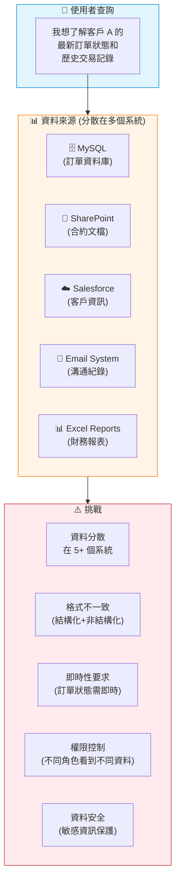
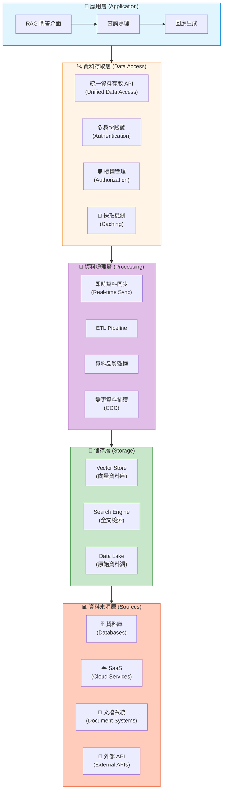
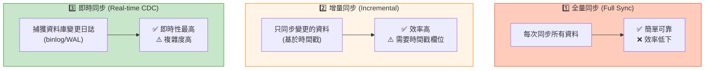
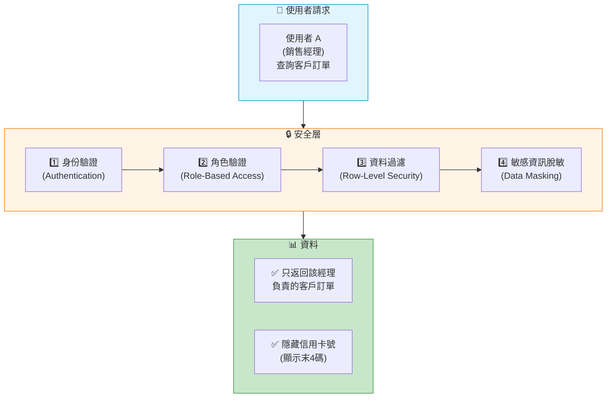
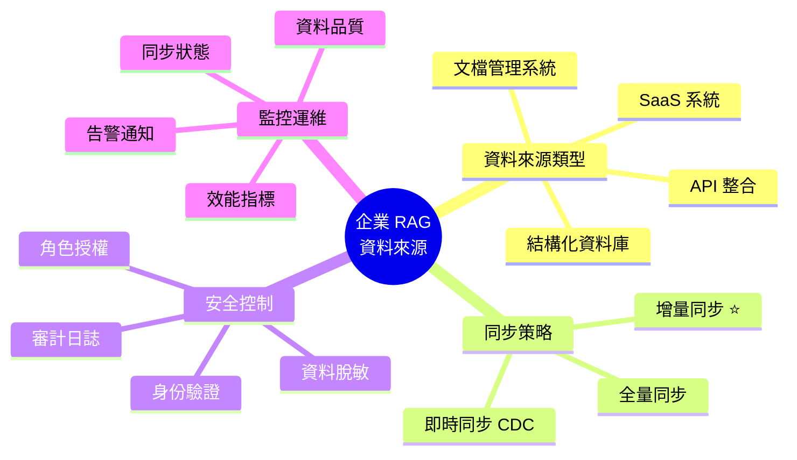

# 7.6 企業 RAG 真正的資料來源

> **對應章節**: Day23
> **對應範例**: `chapter7-rag` (概念架構)
> **難度**: ⭐⭐⭐⭐⭐

---

## 📚 本章概要

前面章節我們學習了如何處理**靜態文檔** (PDF、Word、Excel)。但在真實企業環境中,知識庫的資料來源遠不止這些:資料庫、API、SaaS 系統、內部文檔系統...。本章將帶你了解如何整合這些**動態、分散的企業資料來源**。

**學習目標**:
- 理解企業資料來源的複雜性
- 掌握多資料源整合架構
- 了解即時資料同步策略
- 學習資料安全與權限控制

---

## 🎯 企業 RAG 的資料挑戰

### 真實場景



### 企業資料來源類型

| 資料來源類型 | 範例 | 資料特性 | 整合難度 |
|------------|------|---------|---------|
| **結構化資料庫** | MySQL, PostgreSQL, Oracle | 結構化,查詢快 | ⭐⭐☆☆☆ |
| **NoSQL 資料庫** | MongoDB, Elasticsearch | 半結構化,靈活 | ⭐⭐⭐☆☆ |
| **SaaS 系統** | Salesforce, HubSpot, Zendesk | 透過 API 存取 | ⭐⭐⭐⭐☆ |
| **文檔管理系統** | SharePoint, Google Drive, Confluence | 非結構化文檔 | ⭐⭐⭐☆☆ |
| **郵件與通訊** | Email, Slack, Teams | 溝通紀錄 | ⭐⭐⭐⭐☆ |
| **ERP/CRM 系統** | SAP, Oracle ERP | 複雜業務邏輯 | ⭐⭐⭐⭐⭐ |

**關鍵差異**:
- 📄 **靜態文檔**: 一次性匯入,較少更新
- 🔄 **企業系統**: 資料持續變化,需要**即時或定期同步**

---

## 🏗️ 企業資料整合架構

### 多層架構設計



### 資料來源管理服務 (概念)

```java
// 對應範例: 企業級架構概念

/**
 * 企業資料來源管理器
 */
@Service
@Slf4j
public class EnterpriseDataSourceManager {

    private final Map<String, DataSourceConnector> connectors = new ConcurrentHashMap<>();

    /**
     * 註冊資料來源
     */
    public void registerDataSource(DataSourceConfig config) {
        log.info("註冊資料來源: {}", config.getName());

        // 1. 驗證配置
        validateConfig(config);

        // 2. 安全檢查
        validateSecurity(config);

        // 3. 建立連接器
        DataSourceConnector connector = createConnector(config);

        // 4. 測試連接
        if (!connector.testConnection()) {
            throw new DataSourceException("連接測試失敗");
        }

        // 5. 註冊到系統
        connectors.put(config.getName(), connector);

        log.info("✅ 資料來源註冊成功: {}", config.getName());
    }

    /**
     * 建立對應類型的連接器
     */
    private DataSourceConnector createConnector(DataSourceConfig config) {
        return switch (config.getType()) {
            case MYSQL -> new MySQLConnector(config);
            case POSTGRESQL -> new PostgreSQLConnector(config);
            case MONGODB -> new MongoDBConnector(config);
            case REST_API -> new RestApiConnector(config);
            case SALESFORCE -> new SalesforceConnector(config);
            case SHAREPOINT -> new SharePointConnector(config);
            default -> throw new UnsupportedOperationException(
                "不支援的資料來源類型: " + config.getType()
            );
        };
    }
}

/**
 * 資料來源配置
 */
@Data
@Builder
public class DataSourceConfig {
    private String name;                    // 資料來源名稱
    private DataSourceType type;            // 類型
    private String connectionString;        // 連接字串
    private SecurityConfig security;        // 安全配置
    private SyncConfig sync;                // 同步配置

    @Data
    @Builder
    public static class SecurityConfig {
        private String username;
        private String password;
        private boolean sslEnabled;
        private String certificatePath;
    }

    @Data
    @Builder
    public static class SyncConfig {
        private boolean enabled;            // 是否啟用同步
        private Duration interval;          // 同步間隔
        private SyncMode mode;              // 同步模式
    }
}

enum DataSourceType {
    MYSQL, POSTGRESQL, MONGODB,            // 資料庫
    REST_API, GRAPHQL_API,                 // API
    SALESFORCE, HUBSPOT, ZENDESK,          // SaaS
    SHAREPOINT, GOOGLE_DRIVE, CONFLUENCE   // 文檔系統
}

enum SyncMode {
    FULL_SYNC,          // 全量同步 (適合小量資料)
    INCREMENTAL_SYNC,   // 增量同步 (只同步變更)
    REAL_TIME_SYNC      // 即時同步 (使用 CDC)
}
```

---

## 🔄 資料同步策略

### 三種同步模式對比



| 同步模式 | 延遲時間 | 資源消耗 | 實現難度 | 適用場景 |
|---------|---------|---------|---------|---------|
| **全量同步** | 分鐘-小時級 | 高 | ⭐☆☆☆☆ | 小型資料集,低更新頻率 |
| **增量同步** | 分鐘級 | 中 | ⭐⭐⭐☆☆ | **推薦**,大部分企業場景 |
| **即時同步 (CDC)** | 秒級 | 低 | ⭐⭐⭐⭐⭐ | 高即時性需求 (如訂單系統) |

### 增量同步實現 (推薦方案)

```java
/**
 * 增量資料同步服務
 */
@Service
@Slf4j
@RequiredArgsConstructor
public class IncrementalSyncService {

    private final DataSourceConnector dataSource;
    private final VectorStore vectorStore;
    private final SyncStateRepository syncStateRepository;

    /**
     * 執行增量同步
     */
    @Scheduled(fixedDelay = 300000)  // 每 5 分鐘執行一次
    public void performIncrementalSync() {
        log.info("🔄 開始增量同步...");

        try {
            // 1. 取得上次同步時間
            LocalDateTime lastSyncTime = syncStateRepository.getLastSyncTime("orders");
            log.debug("上次同步時間: {}", lastSyncTime);

            // 2. 查詢變更資料 (SQL 示例)
            String query = """
                SELECT * FROM orders
                WHERE updated_at > ?
                ORDER BY updated_at ASC
                """;

            List<OrderRecord> changedRecords = dataSource.query(query, lastSyncTime);
            log.info("📊 發現 {} 筆變更資料", changedRecords.size());

            if (changedRecords.isEmpty()) {
                return;  // 沒有變更,直接返回
            }

            // 3. 轉換為 Document
            List<Document> documents = changedRecords.stream()
                .map(this::convertToDocument)
                .toList();

            // 4. ETL Transform (分塊、增強元資料)
            documents = performTransform(documents);

            // 5. 寫入向量資料庫
            vectorStore.write(documents);

            // 6. 更新同步狀態
            LocalDateTime newSyncTime = changedRecords.get(changedRecords.size() - 1)
                .getUpdatedAt();
            syncStateRepository.updateLastSyncTime("orders", newSyncTime);

            log.info("✅ 增量同步完成: {} 筆資料", documents.size());

        } catch (Exception e) {
            log.error("❌ 增量同步失敗", e);
            // 記錄失敗,稍後重試
        }
    }

    /**
     * 將資料庫記錄轉換為 Document
     */
    private Document convertToDocument(OrderRecord record) {
        String content = String.format("""
            訂單編號: %s
            客戶: %s
            產品: %s
            金額: %s
            狀態: %s
            備註: %s
            """,
            record.getOrderId(),
            record.getCustomerName(),
            record.getProductName(),
            record.getAmount(),
            record.getStatus(),
            record.getNotes()
        );

        Map<String, Object> metadata = Map.of(
            "document_type", "ORDER",
            "order_id", record.getOrderId(),
            "customer_id", record.getCustomerId(),
            "created_at", record.getCreatedAt().toString(),
            "updated_at", record.getUpdatedAt().toString(),
            "status", record.getStatus(),
            "source", "mysql_orders_table"
        );

        return new Document(content, metadata);
    }

    /**
     * ETL Transform 處理
     */
    private List<Document> performTransform(List<Document> documents) {
        // 1. 文本分塊 (如果需要)
        // 2. 元資料增強
        // 3. 敏感資訊脫敏
        return documents;  // 簡化示例
    }
}

/**
 * 同步狀態存儲
 */
@Repository
public interface SyncStateRepository {
    LocalDateTime getLastSyncTime(String tableName);
    void updateLastSyncTime(String tableName, LocalDateTime syncTime);
}
```

**增量同步關鍵點**:
1. ✅ **時間戳欄位**: 表必須有 `updated_at` 或 `modified_date` 欄位
2. ✅ **索引優化**: 在時間戳欄位建立索引,提升查詢效能
3. ✅ **冪等性**: 確保重複執行不會產生重複資料
4. ✅ **狀態管理**: 記錄上次同步時間,避免遺漏

---

## 🔒 資料安全與權限控制

### 多層安全架構



### 權限控制實現 (概念)

```java
/**
 * 資料存取權限控制
 */
@Service
@RequiredArgsConstructor
public class DataAccessControlService {

    private final UserService userService;

    /**
     * 根據使用者角色過濾查詢結果
     */
    public SearchRequest applyAccessControl(SearchRequest request, String userId) {
        User user = userService.getUserById(userId);

        // 根據角色添加過濾條件
        String filterExpression = buildFilterExpression(user);

        return SearchRequest.from(request)
            .withFilterExpression(filterExpression)
            .build();
    }

    /**
     * 建立過濾表達式
     */
    private String buildFilterExpression(User user) {
        StringBuilder filter = new StringBuilder();

        // 基於角色的過濾
        switch (user.getRole()) {
            case SALES_MANAGER:
                // 只能看到自己團隊的資料
                filter.append("team_id == '").append(user.getTeamId()).append("'");
                break;

            case CUSTOMER_SERVICE:
                // 只能看到客服相關資料
                filter.append("department == 'CS'");
                break;

            case ADMIN:
                // 管理員可以看所有資料
                break;

            default:
                // 預設:只能看公開資料
                filter.append("visibility == 'public'");
        }

        return filter.toString();
    }

    /**
     * 敏感資訊脫敏
     */
    public List<Document> maskSensitiveData(List<Document> documents, User user) {
        // 不是管理員就脫敏
        if (user.getRole() != Role.ADMIN) {
            return documents.stream()
                .map(this::maskDocument)
                .toList();
        }
        return documents;
    }

    private Document maskDocument(Document doc) {
        String content = doc.getContent();

        // 信用卡號脫敏
        content = content.replaceAll(
            "\\b\\d{4}[-\\s]?\\d{4}[-\\s]?\\d{4}[-\\s](\\d{4})\\b",
            "**** **** **** $1"
        );

        // 身分證號脫敏
        content = content.replaceAll(
            "\\b([A-Z])(\\d{8})(\\d)\\b",
            "$1********$3"
        );

        // 電話號碼脫敏
        content = content.replaceAll(
            "\\b(\\d{2,4})[-\\s]?(\\d{3,4})[-\\s]?(\\d{3,4})\\b",
            "$1-****-$3"
        );

        return new Document(content, doc.getMetadata());
    }
}
```

**安全最佳實踐**:
- ✅ **最小權限原則**: 預設拒絕,明確授權
- ✅ **資料脫敏**: 根據角色自動脫敏敏感資訊
- ✅ **審計日誌**: 記錄所有資料存取行為
- ✅ **加密傳輸**: 使用 HTTPS/TLS 保護資料傳輸

---

## 📊 資料同步監控

### 監控指標

```java
/**
 * 資料同步監控服務
 */
@Service
@RequiredArgsConstructor
public class SyncMonitoringService {

    private final MeterRegistry meterRegistry;

    /**
     * 記錄同步指標
     */
    public void recordSyncMetrics(SyncResult result) {
        // 1. 同步成功/失敗計數
        if (result.isSuccess()) {
            meterRegistry.counter("data_sync.success",
                "source", result.getSourceName()
            ).increment();
        } else {
            meterRegistry.counter("data_sync.failures",
                "source", result.getSourceName()
            ).increment();
        }

        // 2. 同步記錄數
        meterRegistry.counter("data_sync.records_processed",
            "source", result.getSourceName()
        ).increment(result.getRecordsProcessed());

        // 3. 同步耗時
        meterRegistry.timer("data_sync.duration",
            "source", result.getSourceName()
        ).record(result.getDuration());

        // 4. 資料延遲 (最新資料的時間戳 vs 當前時間)
        Duration dataLag = Duration.between(result.getLatestDataTime(), LocalDateTime.now());
        meterRegistry.gauge("data_sync.lag_seconds",
            List.of(Tag.of("source", result.getSourceName())),
            dataLag.getSeconds()
        );
    }
}
```

**監控告警規則**:
- ⚠️ 同步失敗率 > 5%
- ⚠️ 資料延遲 > 10 分鐘
- ⚠️ 同步耗時 > 5 分鐘

---

## 📝 本章重點回顧

### 企業資料來源整合關鍵



### 實施建議

| 階段 | 重點任務 | 預期成果 |
|-----|---------|---------|
| **第一階段** | 整合 1-2 個核心資料庫 | 基礎資料同步 |
| **第二階段** | 實現增量同步機制 | 效能提升 3-5倍 |
| **第三階段** | 添加權限控制 | 資料安全合規 |
| **第四階段** | 整合更多 SaaS 系統 | 完整知識庫 |

### 技術選型建議

**資料庫整合**:
- ✅ **JDBC**: 最成熟,支援所有關聯式資料庫
- ✅ **Spring Data**: 簡化開發,推薦使用

**API 整合**:
- ✅ **RestTemplate/WebClient**: Spring 官方推薦
- ✅ **Feign**: 宣告式 API 客戶端

**即時同步 (CDC)**:
- ✅ **Debezium**: 業界標準,支援多種資料庫
- ✅ **Maxwell**: MySQL binlog 解析,輕量級

---

## 🚀 下一步

在 **7.7 最後一哩路** 中,我們將學習:
- 🎯 **混合檢索**: 結合向量檢索和全文檢索
- 📊 **結果重排序 (Reranking)**: 提升檢索精準度
- ⚡ **效能優化**: 快取策略和查詢優化
- 📈 **監控與評估**: RAG 系統品質指標

**提示**: 企業級 RAG 系統的成功,70% 取決於資料整合的品質!

---

**參考資料**:
- [Debezium CDC Platform](https://debezium.io/)
- [Spring Data Documentation](https://spring.io/projects/spring-data)
- [Salesforce API](https://developer.salesforce.com/docs/apis)
- [對應範例專案](../../code-examples/chapter7-rag)
