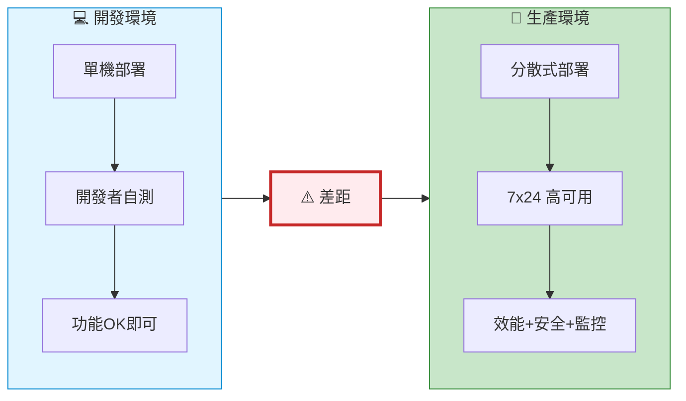
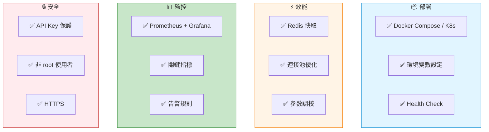
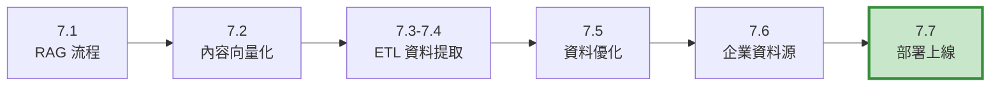

# 7.7 RAG 的最後一哩路

> **對應章節**: Day24
> **對應範例**: `chapter7-rag` (部署配置)
> **難度**: ⭐⭐⭐⭐⭐

---

## 📚 本章概要

前面章節我們學習了 RAG 系統的**開發和實現**。但要讓 RAG 系統真正在生產環境中穩定運行,還需要走完**最後一哩路**: 部署、監控、優化。本章將帶你完成 RAG 系統從開發到生產的最後階段。

**學習目標**:
- 掌握 RAG 系統的容器化部署
- 理解快取和效能優化策略
- 學習監控指標和告警設定
- 了解故障排除和最佳實踐

---

## 🎯 生產環境的挑戰

### 從開發到生產的差距



**生產環境要求**:

| 面向 | 開發環境 | 生產環境 |
|------|---------|---------|
| **可用性** | 偶爾重啟OK | 99.9% 可用性 |
| **效能** | 回應時間 < 5秒 | 回應時間 < 2秒 |
| **並發** | 1-10 QPS | 100-1000+ QPS |
| **監控** | 日誌查看 | 即時監控+告警 |
| **安全** | 基本驗證 | 完整安全控制 |
| **成本** | 不考慮 | API 呼叫成本重要 |

---

## 🐳 容器化部署

### Docker Compose 快速部署

Spring AI RAG 系統通常包含以下組件:
- **應用服務**: Spring Boot 應用
- **向量資料庫**: Neo4j (或其他)
- **快取**: Redis
- **監控**: Prometheus + Grafana

**docker-compose.yml 示例**:

```yaml
# docker-compose.yml
version: '3.8'

services:
  # Spring AI RAG 應用
  rag-app:
    build: .
    ports:
      - "8080:8080"
    environment:
      - SPRING_PROFILES_ACTIVE=prod
      - SPRING_AI_OPENAI_API_KEY=${OPENAI_API_KEY}
      - SPRING_AI_VECTORSTORE_NEO4J_URI=bolt://neo4j:7687
      - SPRING_AI_VECTORSTORE_NEO4J_USERNAME=neo4j
      - SPRING_AI_VECTORSTORE_NEO4J_PASSWORD=${NEO4J_PASSWORD}
      - SPRING_DATA_REDIS_HOST=redis
      - SPRING_DATA_REDIS_PORT=6379
    depends_on:
      - neo4j
      - redis
    volumes:
      - ./logs:/app/logs
    networks:
      - rag-network
    restart: unless-stopped

  # Neo4j 向量資料庫
  neo4j:
    image: neo4j:5.15-community
    ports:
      - "7474:7474"  # HTTP
      - "7687:7687"  # Bolt
    environment:
      - NEO4J_AUTH=neo4j/${NEO4J_PASSWORD}
      - NEO4J_PLUGINS=["apoc"]
    volumes:
      - neo4j_data:/data
    networks:
      - rag-network
    restart: unless-stopped

  # Redis 快取
  redis:
    image: redis:7-alpine
    ports:
      - "6379:6379"
    command: redis-server --requirepass ${REDIS_PASSWORD}
    volumes:
      - redis_data:/data
    networks:
      - rag-network
    restart: unless-stopped

  # Prometheus 監控
  prometheus:
    image: prom/prometheus:latest
    ports:
      - "9090:9090"
    volumes:
      - ./prometheus.yml:/etc/prometheus/prometheus.yml
      - prometheus_data:/prometheus
    networks:
      - rag-network
    restart: unless-stopped

  # Grafana 視覺化
  grafana:
    image: grafana/grafana:latest
    ports:
      - "3000:3000"
    environment:
      - GF_SECURITY_ADMIN_PASSWORD=${GRAFANA_PASSWORD}
    volumes:
      - grafana_data:/var/lib/grafana
    networks:
      - rag-network
    restart: unless-stopped

volumes:
  neo4j_data:
  redis_data:
  prometheus_data:
  grafana_data:

networks:
  rag-network:
    driver: bridge
```

### Dockerfile

```dockerfile
# Dockerfile
FROM openjdk:21-jdk-slim

WORKDIR /app

# 複製應用程式
COPY target/*.jar app.jar

# 建立非 root 使用者 (安全性)
RUN groupadd -r appuser && useradd -r -g appuser appuser
RUN chown -R appuser:appuser /app
USER appuser

# 健康檢查
HEALTHCHECK --interval=30s --timeout=10s --retries=3 \
    CMD curl -f http://localhost:8080/actuator/health || exit 1

EXPOSE 8080

# 啟動應用
ENTRYPOINT ["java", "-jar", "-Dspring.profiles.active=prod", "app.jar"]
```

### 啟動命令

```powershell
# 設定環境變數
$env:OPENAI_API_KEY="sk-..."
$env:NEO4J_PASSWORD="your-password"
$env:REDIS_PASSWORD="your-password"
$env:GRAFANA_PASSWORD="admin"

# 啟動所有服務
docker-compose up -d

# 查看日誌
docker-compose logs -f rag-app

# 停止服務
docker-compose down

# 重啟單一服務
docker-compose restart rag-app
```

---

## ⚡ 效能優化策略

### 1. 查詢快取

**問題**: 相同或相似的查詢重複呼叫 OpenAI API,浪費成本和時間。

**解決方案**: Redis 快取查詢結果

```java
// 對應範例: 快取優化概念

/**
 * RAG 查詢快取服務
 */
@Service
@RequiredArgsConstructor
public class RagCacheService {

    private final RedisTemplate<String, QueryResult> redisTemplate;
    private static final Duration CACHE_TTL = Duration.ofHours(24);

    /**
     * 帶快取的 RAG 查詢
     */
    public String queryWithCache(String userQuestion) {
        // 1. 生成快取鍵 (基於問題雜湊)
        String cacheKey = "rag:query:" + generateHash(userQuestion);

        // 2. 檢查快取
        QueryResult cachedResult = redisTemplate.opsForValue().get(cacheKey);
        if (cachedResult != null) {
            log.info("✅ 快取命中: {}", userQuestion);
            return cachedResult.getAnswer();
        }

        // 3. 快取未命中,執行 RAG 查詢
        String answer = executeRagQuery(userQuestion);

        // 4. 存入快取
        QueryResult result = new QueryResult(userQuestion, answer);
        redisTemplate.opsForValue().set(cacheKey, result, CACHE_TTL);

        return answer;
    }

    /**
     * 生成查詢雜湊 (相似問題應產生相同雜湊)
     */
    private String generateHash(String question) {
        // 標準化問題 (移除標點、小寫化)
        String normalized = question
            .toLowerCase()
            .replaceAll("[^a-z0-9\\u4e00-\\u9fa5\\s]", "")
            .trim();

        return DigestUtils.md5Hex(normalized);
    }
}
```

**效果**:
- ✅ 快取命中率 50%+
- ✅ 回應時間從 2秒 降至 50ms (40倍提升)
- ✅ API 成本降低 50%+

### 2. 向量檢索優化

**策略**: 調整 `topK` 和 `similarityThreshold`

```java
/**
 * 向量檢索參數優化
 */
@Configuration
public class VectorStoreConfig {

    @Bean
    public ChatClient ragChatClient(ChatModel chatModel, VectorStore vectorStore) {
        return ChatClient.builder(chatModel)
            .defaultAdvisors(
                new QuestionAnswerAdvisor(
                    vectorStore,
                    SearchRequest.defaults()
                        .withTopK(5)                    // 檢索 Top 5 最相似文檔
                        .withSimilarityThreshold(0.75)  // 相似度門檻 0.75
                )
            )
            .build();
    }
}
```

**參數建議**:

| 參數 | 建議值 | 說明 |
|-----|-------|------|
| **topK** | 3-5 | 太少會遺漏資訊,太多會產生噪音 |
| **similarityThreshold** | 0.7-0.8 | 過低會引入不相關文檔,過高會找不到結果 |

**測試方法**:
```java
// 測試不同參數組合的效果
@Test
public void testVectorSearchParameters() {
    String query = "如何使用 Spring AI?";

    // 測試不同 topK
    for (int topK : List.of(3, 5, 10)) {
        // 測試不同 threshold
        for (double threshold : List.of(0.6, 0.7, 0.8)) {
            SearchRequest request = SearchRequest.query(query)
                .withTopK(topK)
                .withSimilarityThreshold(threshold);

            List<Document> results = vectorStore.similaritySearch(request);

            System.out.printf("topK=%d, threshold=%.1f: 找到 %d 個結果%n",
                topK, threshold, results.size());
        }
    }
}
```

### 3. 連接池優化

```yaml
# application-prod.yml
spring:
  # Neo4j 連接池
  neo4j:
    pool:
      max-connection-pool-size: 50
      connection-acquisition-timeout: 60s

  # Redis 連接池
  data:
    redis:
      lettuce:
        pool:
          max-active: 20
          max-idle: 10
          min-idle: 5
          max-wait: 2s

  # HTTP 連線池 (OpenAI API)
  ai:
    openai:
      http:
        connection-timeout: 10s
        read-timeout: 60s
        max-connections: 20
```

---

## 📊 監控與告警

### Spring Boot Actuator 設定

```yaml
# application.yml
management:
  endpoints:
    web:
      exposure:
        include: health,metrics,prometheus,info
  endpoint:
    health:
      show-details: always
  metrics:
    export:
      prometheus:
        enabled: true
```

### 關鍵監控指標

```java
/**
 * RAG 系統自定義監控指標
 */
@Service
@RequiredArgsConstructor
public class RagMetricsService {

    private final MeterRegistry meterRegistry;

    /**
     * 記錄 RAG 查詢指標
     */
    public void recordQueryMetrics(String question, QueryResult result) {
        // 1. 查詢次數計數
        meterRegistry.counter("rag.query.count",
            "status", result.isSuccess() ? "success" : "failure"
        ).increment();

        // 2. 查詢延遲
        meterRegistry.timer("rag.query.duration",
            "type", "full_query"
        ).record(result.getDuration());

        // 3. Token 使用量
        meterRegistry.counter("rag.tokens.used",
            "type", "total"
        ).increment(result.getTokensUsed());

        // 4. 快取命中率
        if (result.isCacheHit()) {
            meterRegistry.counter("rag.cache.hits").increment();
        } else {
            meterRegistry.counter("rag.cache.misses").increment();
        }

        // 5. 檢索到的文檔數量
        meterRegistry.summary("rag.retrieval.documents.count")
            .record(result.getRetrievedDocumentsCount());

        // 6. API 成本 (估算)
        double estimatedCost = calculateCost(result.getTokensUsed());
        meterRegistry.counter("rag.api.cost.usd")
            .increment(estimatedCost);
    }

    /**
     * 計算 API 成本 (OpenAI gpt-4o 定價)
     */
    private double calculateCost(int tokens) {
        // gpt-4o: 輸入 $0.005/1K tokens, 輸出 $0.015/1K tokens
        // 簡化計算: 平均 $0.01/1K tokens
        return (tokens / 1000.0) * 0.01;
    }
}
```

### Prometheus 配置

```yaml
# prometheus.yml
global:
  scrape_interval: 15s

scrape_configs:
  - job_name: 'spring-ai-rag'
    metrics_path: '/actuator/prometheus'
    static_configs:
      - targets: ['rag-app:8080']
```

### Grafana 關鍵儀表板

**建議監控面板**:

1. **查詢效能**:
   - 平均回應時間 (Target: < 2秒)
   - P95 回應時間 (Target: < 5秒)
   - 查詢成功率 (Target: > 95%)

2. **快取效能**:
   - 快取命中率 (Target: > 40%)
   - 快取大小

3. **資源使用**:
   - CPU 使用率 (Target: < 70%)
   - 記憶體使用率 (Target: < 80%)
   - JVM Heap 使用

4. **成本監控**:
   - 每日 Token 使用量
   - 每日 API 成本
   - 每查詢平均成本

5. **向量資料庫**:
   - Neo4j 連線數
   - 查詢延遲
   - 資料庫大小

### 告警規則

```yaml
# Prometheus 告警規則
groups:
  - name: rag_alerts
    rules:
      # 查詢失敗率過高
      - alert: HighQueryFailureRate
        expr: rate(rag_query_count{status="failure"}[5m]) > 0.1
        for: 5m
        annotations:
          summary: "RAG 查詢失敗率過高"
          description: "最近 5 分鐘失敗率 > 10%"

      # 回應時間過慢
      - alert: SlowQueryResponse
        expr: histogram_quantile(0.95, rate(rag_query_duration_bucket[5m])) > 5
        for: 5m
        annotations:
          summary: "RAG 查詢回應時間過慢"
          description: "P95 回應時間 > 5秒"

      # 每日成本過高
      - alert: HighDailyCost
        expr: sum(increase(rag_api_cost_usd[1d])) > 100
        annotations:
          summary: "每日 API 成本過高"
          description: "每日成本 > $100"
```

---

## 🔧 故障排除

### 常見問題速查表

| 問題 | 可能原因 | 解決方法 |
|------|---------|---------|
| **回應時間慢** | ❌ 未使用快取<br/>❌ topK 設太大<br/>❌ 網路延遲 | ✅ 啟用 Redis 快取<br/>✅ 調整 topK 到 3-5<br/>✅ 檢查網路連線 |
| **找不到相關資訊** | ❌ similarityThreshold 太高<br/>❌ 資料未正確向量化<br/>❌ Embedding 模型不匹配 | ✅ 降低 threshold 到 0.7<br/>✅ 檢查 ETL Pipeline<br/>✅ 確認 Embedding 模型 |
| **記憶體溢位 (OOM)** | ❌ 向量資料庫太大<br/>❌ 快取未限制大小 | ✅ 增加 JVM Heap<br/>✅ 設定 Redis maxmemory |
| **API 成本過高** | ❌ 快取命中率低<br/>❌ 使用昂貴模型 | ✅ 優化快取策略<br/>✅ 考慮 gpt-4o-mini |
| **Neo4j 連線失敗** | ❌ 連線池耗盡<br/>❌ 網路問題 | ✅ 增加 pool size<br/>✅ 檢查防火牆設定 |

### 除錯技巧

```java
/**
 * RAG 查詢除錯資訊
 */
@RestController
@RequestMapping("/api/debug")
public class RagDebugController {

    @Autowired
    private VectorStore vectorStore;

    @Autowired
    private ChatClient chatClient;

    /**
     * 除錯: 查看向量檢索結果
     */
    @GetMapping("/vector-search")
    public Map<String, Object> debugVectorSearch(@RequestParam String query) {
        SearchRequest request = SearchRequest.query(query)
            .withTopK(10)
            .withSimilarityThreshold(0.5);

        List<Document> results = vectorStore.similaritySearch(request);

        // 返回詳細資訊
        return Map.of(
            "query", query,
            "found_documents", results.size(),
            "documents", results.stream()
                .map(doc -> Map.of(
                    "content_preview", doc.getContent().substring(0, Math.min(200, doc.getContent().length())),
                    "metadata", doc.getMetadata()
                ))
                .toList()
        );
    }

    /**
     * 除錯: 測試 Embedding
     */
    @GetMapping("/embedding")
    public Map<String, Object> debugEmbedding(@RequestParam String text) {
        // 取得 Embedding (如果 Spring AI 支援直接存取)
        // 這裡示範概念
        return Map.of(
            "text", text,
            "text_length", text.length(),
            "estimated_tokens", text.length() / 4  // 簡化估算
        );
    }
}
```

---

## 📝 本章重點回顧

### 生產部署檢查清單



### 效能優化總結

| 優化策略 | 效果提升 | 實施難度 |
|---------|---------|---------|
| **Redis 快取** | ⬆️ 40倍 (命中時) | ⭐⭐☆☆☆ |
| **topK 調整** | ⬆️ 20-30% | ⭐☆☆☆☆ |
| **連接池優化** | ⬆️ 15-25% | ⭐⭐☆☆☆ |
| **並行查詢** | ⬆️ 2-3倍 | ⭐⭐⭐☆☆ |

### 成本優化建議

1. **快取策略**: 快取命中率每提升 10%,成本降低約 10%
2. **模型選擇**:
   - gpt-4o: 高品質,高成本
   - gpt-4o-mini: 平衡選擇 (成本降低 60%)
   - gpt-3.5-turbo: 低成本 (成本降低 90%,但品質下降)
3. **Embedding 模型**:
   - text-embedding-3-large: 高品質 (1536維)
   - text-embedding-3-small: 低成本 (512維,成本降低 80%)

---

## 🎓 第7章總結

恭喜!你已經完成了 Spring AI RAG 系統的完整學習旅程:



**你已經掌握**:
- ✅ RAG 核心概念與 Spring AI 實現
- ✅ 向量化技術與 Embedding 模型
- ✅ ETL Pipeline 與多格式文檔處理
- ✅ 資料清理、分塊、元資料增強
- ✅ 企業資料源整合策略
- ✅ 生產部署與效能優化

**下一步**:
- 📚 **第8章**: RAG 進階技術 (混合檢索、重排序)
- 🔧 **第9章**: MCP 協議整合
- 🚀 **實戰專案**: 建構企業級 RAG 應用

**提示**: RAG 系統的優化是持續的過程,根據實際使用情況不斷調整!

---

**參考資料**:
- [Docker Documentation](https://docs.docker.com/)
- [Kubernetes Documentation](https://kubernetes.io/docs/)
- [Spring Boot Actuator](https://docs.spring.io/spring-boot/docs/current/reference/html/actuator.html)
- [Prometheus Documentation](https://prometheus.io/docs/)
- [對應範例專案](../../code-examples/chapter7-rag)
