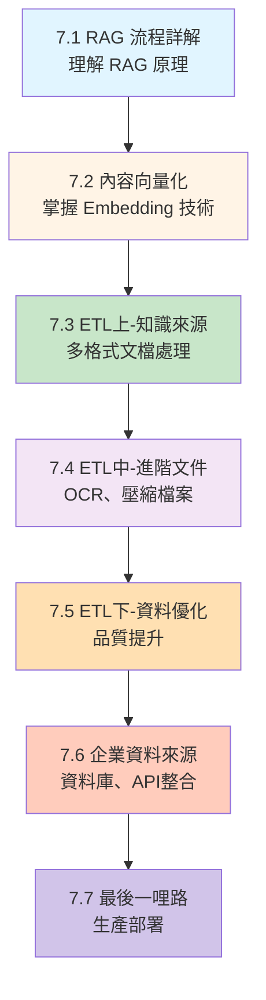
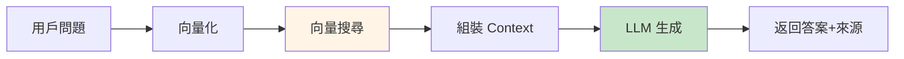

# 第7章: RAG 系統建構完整指南

> 從零開始,建立企業級 RAG (檢索增強生成) 系統

---

## 📚 章節總覽

| 章節 | 標題 | 難度 | 對應範例 | 重點內容 |
|------|------|------|---------|---------|
| **7.1** | [RAG 流程詳解](./7.1-RAG-流程詳解.md) | ⭐⭐⭐⭐ | `chapter7-rag-basic` | RAG 原理、QuestionAnswerAdvisor、基礎實現 |
| **7.2** | [內容向量化](./7.2-內容向量化.md) | ⭐⭐⭐ | `chapter7-rag-basic` | Embedding 模型、向量化技術、品質評估 |
| **7.3** | [ETL(上)-知識來源](./7.3-ETL上-知識來源.md) | ⭐⭐⭐⭐ | `chapter7-rag-etl-pipeline` | DocumentReader、多格式文檔處理、ETL Pipeline |
| **7.4** | ETL(中)-進階文件 | ⭐⭐⭐⭐ | `chapter7-rag-etl-pipeline` | OCR 處理、壓縮檔案、特殊格式 |
| **7.5** | ETL(下)-資料優化 | ⭐⭐⭐⭐⭐ | `chapter7-rag-vector-enhancement` | 文本清理、元資料增強、向量品質提升 |
| **7.6** | 企業資料來源 | ⭐⭐⭐⭐⭐ | `chapter7-rag-vector-enhancement` | 資料庫整合、API 串接、資料安全 |
| **7.7** | 最後一哩路 | ⭐⭐⭐⭐⭐ | `chapter7-rag-vector-enhancement` | 生產部署、監控告警、效能優化 |

---

## 🎯 學習路線圖



---

## 🚀 快速開始

### 環境準備

**必要條件**:
- ☕ Java 21+
- 📦 Maven 3.9+
- 🐳 Docker (Neo4j)
- 🔑 OpenAI API Key

### 啟動 Neo4j 向量資料庫

```bash
docker run -d \
  --name neo4j-rag \
  -p 7474:7474 -p 7687:7687 \
  -e NEO4J_AUTH=neo4j/test1234 \
  neo4j:5.15
```

### 執行基礎範例

```powershell
# 設定 Java 21
$env:JAVA_HOME="D:\java\jdk-21"
$env:Path="D:\java\jdk-21\bin;$env:Path"

# 設定 OpenAI API Key
$env:OPENAI_API_KEY="your-api-key-here"

# 編譯執行
cd code-examples/chapter7-rag/chapter7-rag-basic
mvn clean spring-boot:run
```

### 測試 RAG 功能

```bash
# 1. 上傳文檔
curl -X POST http://localhost:8080/api/rag/documents \
  -F "files=@your-document.pdf"

# 2. RAG 查詢
curl -X POST http://localhost:8080/api/rag/query \
  -H "Content-Type: application/json" \
  -d '{"question": "什麼是 Spring AI?"}'
```

---

## 📦 專案結構

```
chapter7-rag/
├── chapter7-rag-basic/              # 7.1-7.2: RAG 基礎系統
│   ├── src/main/java/
│   │   └── com/example/rag/basic/
│   │       ├── config/              # RAG 配置
│   │       ├── service/             # RAG 服務
│   │       ├── controller/          # REST API
│   │       └── model/               # 資料模型
│   └── src/main/resources/
│       └── application.yml          # Neo4j、OpenAI 配置
│
├── chapter7-rag-etl-pipeline/       # 7.3-7.4: ETL 管道系統
│   ├── src/main/java/
│   │   └── com/example/etl/
│   │       ├── service/
│   │       │   ├── PdfDocumentService.java        # PDF 處理
│   │       │   ├── OfficeDocumentService.java     # Office 文檔
│   │       │   ├── WebDocumentService.java        # 網頁處理
│   │       │   └── EtlPipelineService.java        # ETL 管道
│   │       ├── reader/
│   │       │   ├── ImageOCRDocumentReader.java    # OCR 處理
│   │       │   └── ArchiveDocumentReader.java     # 壓縮檔案
│   │       └── config/
│   │           └── EtlConfig.java
│   └── README.md
│
└── chapter7-rag-vector-enhancement/ # 7.5-7.7: 向量品質增強與部署
    ├── src/main/java/
    │   └── com/example/enhancement/
    │       ├── service/
    │       │   ├── TextCleaningService.java       # 文本清理
    │       │   ├── MetadataEnrichmentService.java # 元資料增強
    │       │   ├── VectorQualityService.java      # 向量品質
    │       │   └── EnterpriseDataSourceManager.java # 企業資料源
    │       └── config/
    │           ├── SecurityConfig.java
    │           └── MonitoringConfig.java
    ├── docker/
    │   └── docker-compose.yml                     # 生產環境部署
    └── README.md
```

---

## 🎓 核心概念速查

### RAG 工作流程 (7.1)



**關鍵組件**:
- **QuestionAnswerAdvisor**: 自動 RAG 處理
- **VectorStore**: 向量資料庫抽象層
- **TokenTextSplitter**: 智能文本分塊

### Embedding 模型選擇 (7.2)

| 模型 | 維度 | 成本 | 推薦場景 |
|------|------|------|---------|
| text-embedding-3-small | 1536 | $0.02/1M tokens | ⭐ 通用首選 |
| text-embedding-3-large | 3072 | $0.13/1M tokens | 高精度需求 |
| nomic-embed-text (Ollama) | 768 | 免費 | 本地部署 |

### Spring AI DocumentReader (7.3)

```java
// 函數式 ETL Pipeline
DocumentReader reader = new PagePdfDocumentReader(resource);
DocumentTransformer splitter = new TokenTextSplitter();
DocumentWriter writer = vectorStore::add;

// 組合執行
writer.accept(splitter.apply(reader.get()));
```

**支援格式**:
- 📄 PDF: `PagePdfDocumentReader`, `ParagraphPdfDocumentReader`
- 📘 Office: `TikaDocumentReader` (Word, Excel, PPT)
- 📝 文本: `TextReader`, `MarkdownDocumentReader`, `JsonReader`
- 🌐 網頁: `JsoupDocumentReader`

---

## 💡 最佳實踐總結

### 效能優化

1. **文本分塊**:
   ```java
   new TokenTextSplitter(
       800,    // 每塊 800 tokens
       200     // 重疊 200 tokens (保持上下文)
   )
   ```

2. **Top-K 設定**:
   - K=3: 精準查詢
   - K=5: ⭐ 通用推薦
   - K=10: 複雜問題

3. **相似度閾值**:
   - 0.7-0.8: ⭐ RAG 推薦範圍
   - 0.9+: 精確匹配
   - <0.5: 可能不相關

### 成本優化

1. **批次向量化**:
   ```java
   // ✅ 批次處理 100 個文檔 = 1 次 API 調用
   embeddingModel.embedForResponse(texts);

   // ❌ 逐一處理 100 個文檔 = 100 次 API 調用
   ```

2. **向量快取**:
   - 避免重複向量化相同文本
   - 使用 Redis/本地快取

3. **選擇合適模型**:
   - 預算有限: text-embedding-3-small
   - 離線環境: Ollama 本地模型

### 品質保證

1. **元資料增強**:
   ```java
   doc.getMetadata().put("source_file", filename);
   doc.getMetadata().put("category", "技術文檔");
   doc.getMetadata().put("version", "1.0.0");
   ```

2. **過濾查詢**:
   ```java
   advisors(a -> a.param(
       QuestionAnswerAdvisor.FILTER_EXPRESSION,
       "category == 'official' AND version == '2024'"
   ))
   ```

3. **向量品質檢查**:
   - 檢查維度是否正確
   - 檢查是否為零向量
   - 檢查數值範圍是否正常

---

## 🔧 故障排除

### 常見問題

**Q1: Neo4j 連接失敗**
```bash
# 檢查 Docker 容器狀態
docker ps

# 查看 Neo4j 日誌
docker logs neo4j-rag

# 確認密碼正確 (預設: test1234)
```

**Q2: OpenAI API 錯誤**
```
錯誤: 401 Unauthorized
→ 檢查 API Key 是否正確
→ 確認環境變數已設定: $env:OPENAI_API_KEY

錯誤: 429 Rate Limit
→ API 調用過於頻繁,需要升級方案或使用批次處理
```

**Q3: 文檔上傳失敗**
```java
// 檢查文件大小限制
spring:
  servlet:
    multipart:
      max-file-size: 50MB      # 增加限制
      max-request-size: 100MB
```

**Q4: 向量搜尋無結果**
```java
// 降低相似度閾值
SearchRequest.defaults()
    .withSimilarityThreshold(0.5)  // 從 0.7 降到 0.5
```

---

## 📊 效能基準

### RAG 查詢效能

| 階段 | 時間 | 優化方法 |
|------|------|---------|
| **向量化問題** | ~100ms | 使用快取 |
| **向量搜尋** | ~200ms | 優化 Neo4j 索引 |
| **LLM 生成** | ~800ms | 使用 GPT-4o-mini |
| **總計** | ~1.2s | ⭐ 目標: <2s |

### 文檔處理效能

| 文件類型 | 處理時間 | 備註 |
|---------|---------|------|
| PDF (10頁) | ~2s | PagePdfDocumentReader |
| Word (5頁) | ~1.5s | TikaDocumentReader |
| 網頁 | ~3s | 含網路請求 |
| 批次 (100個) | ~45s | 含向量化 |

---

## 📚 相關資源

### 官方文檔
- [Spring AI 官方文檔](https://docs.spring.io/spring-ai/reference/)
- [OpenAI Embeddings API](https://platform.openai.com/docs/guides/embeddings)
- [Neo4j Vector Search](https://neo4j.com/docs/cypher-manual/current/indexes-for-vector-search/)

### 論文與文章
- [RAG 原始論文](https://arxiv.org/abs/2005.11401)
- [Retrieval-Augmented Generation for Knowledge-Intensive NLP Tasks](https://arxiv.org/abs/2005.11401)

### 開源專案
- [Spring AI Examples](https://github.com/spring-projects/spring-ai-examples)
- [LangChain RAG Tutorial](https://python.langchain.com/docs/tutorials/rag/)

---

## 🎯 下一步學習

完成第7章後,你已經掌握:
- ✅ RAG 完整流程和原理
- ✅ Spring AI RAG 實現方式
- ✅ 多格式文檔處理
- ✅ 向量品質優化
- ✅ 生產環境部署

**建議繼續學習**:
1. **第8章: RAG 進階技術** - HyDE、Re-ranking、Multi-query
2. **第9章: MCP 整合** - Model Context Protocol
3. **實戰專案**: 建立企業知識庫助手

---

## 🤝 貢獻與反饋

如有問題或建議,歡迎:
- 📧 提交 Issue
- 💬 參與討論
- 🌟 Star 專案

---

**最後更新**: 2025-01-28
**Spring AI 版本**: 1.0.0-M5
**Spring Boot 版本**: 3.4.1
