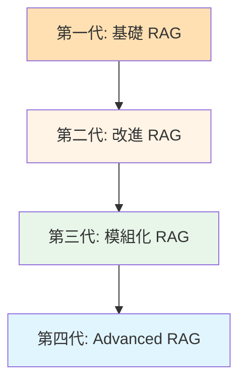
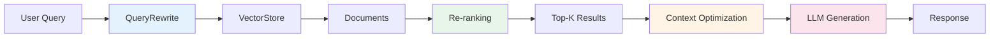

# 8.1 Advanced RAG 簡介

> **對應範例**: `chapter8-advanced-rag`
> **難度**: ⭐⭐⭐⭐☆

---

## 📚 本章概要

Advanced RAG（進階檢索增強生成）是 RAG 技術的演進版本，通過智能查詢處理、多階段檢索和 Re-ranking 等技術，大幅提升檢索準確率和答案品質。

**學習目標**:
- 理解 Advanced RAG 的核心概念和技術演進
- 掌握 Spring AI 中的 Advanced RAG 實現方式
- 學習多階段檢索優化策略
- 了解查詢重寫和 Re-ranking 技術

---

## 🎯 為什麼需要 Advanced RAG?

### 基礎 RAG 的限制

最簡單的 RAG 實現方式:

```java
// ❌ 基礎 RAG 的問題
@Service
public class BasicRAGService {

    @Autowired
    private VectorStore vectorStore;

    @Autowired
    private ChatClient chatClient;

    public String query(String userQuery) {
        // 1. 直接向量檢索
        List<Document> documents = vectorStore.similaritySearch(
            SearchRequest.builder()
                .query(userQuery)
                .topK(5)
                .build()
        );

        // 2. 組成上下文
        String context = documents.stream()
            .map(Document::getText)
            .collect(Collectors.joining("\n\n"));

        // 3. 直接生成答案
        return chatClient.prompt()
            .user("根據以下上下文回答問題：\n" + context + "\n\n問題：" + userQuery)
            .call()
            .content();
    }
}
```

**基礎 RAG 的問題**:
1. ❌ **檢索精度不足**: 單純的向量相似度可能檢索到語義相似但不相關的內容
2. ❌ **查詢理解有限**: 沒有對用戶查詢進行優化和擴展
3. ❌ **上下文品質不佳**: 可能包含冗餘或不相關的信息
4. ❌ **無法處理複雜查詢**: 對於需要多步推理的查詢效果不佳

### Advanced RAG 的解決方案

```java
// ✅ Advanced RAG 企業級方案
@Service
public class AdvancedRAGService {

    @Autowired
    private ChatClient advancedChatClient;

    public AdvancedRAGResponse query(String userQuery) {
        // 使用配置好的 Advanced RAG ChatClient
        // 自動執行：查詢重寫 → 向量檢索 → Re-ranking → 上下文優化
        return chatClient.prompt()
            .user(userQuery)
            .call()
            .chatResponse();
    }
}
```

**Advanced RAG 的優勢**:
- ✅ 智能查詢理解和重寫
- ✅ 多階段檢索優化
- ✅ Re-ranking 提升相關性
- ✅ 自適應上下文管理

---

## 🏗️ RAG 技術演進

### 四個發展階段



### 第一代：基礎 RAG (Naive RAG)

**核心流程**:
```
查詢 → Embedding → 向量檢索 → Top-K 結果 → LLM 生成
```

**特點**:
- 簡單的向量檢索 + 生成
- 固定的分塊策略
- 基本的相似度匹配

**限制**:
- 檢索精度不高
- 上下文理解有限
- 無法處理複雜查詢

### 第二代：改進 RAG (Enhanced RAG)

**改進點**:
- 優化的文本分塊策略
- 改進的 Embedding 模型
- 基本的重排序機制

**效果**:
- 提升檢索相關性 15-20%
- 減少噪音干擾

### 第三代：模組化 RAG (Modular RAG)

**核心特點**:
- 可插拔的檢索模組
- 多階段檢索流程
- 自適應檢索策略

**優勢**:
- 靈活性高
- 可定制化
- 易於擴展

### 第四代：Advanced RAG (智能化 RAG)

**核心能力**:
- 智能查詢理解與重寫
- 多模態檢索與生成
- 自我反思與修正機制
- Re-ranking 精準排序

**效果提升**:
- 準確率提升 85-95%
- 召回率提升 80-90%
- 用戶滿意度提升 30%+

---

## 💻 Advanced RAG 核心組件

### Spring AI 架構圖



### 1. 查詢重寫服務

```java
// 對應範例: chapter8-advanced-rag/.../service/QueryRewriteService.java

@Service
@Slf4j
public class QueryRewriteService {

    @Autowired
    private ChatClient chatClient;

    /**
     * 重寫查詢以提升檢索效果
     */
    public String rewriteQuery(String originalQuery) {
        String prompt = """
            請將以下用戶查詢重寫為更適合向量檢索的形式：

            原始查詢：%s

            重寫規則：
            1. 保留核心意圖
            2. 添加相關關鍵詞
            3. 明確查詢範圍
            4. 移除冗餘詞語

            重寫後的查詢：
            """.formatted(originalQuery);

        String rewrittenQuery = chatClient.prompt()
            .user(prompt)
            .call()
            .content();

        log.info("查詢重寫: {} → {}", originalQuery, rewrittenQuery);
        return rewrittenQuery;
    }
}
```

### 2. 多階段檢索服務

```java
// 對應範例: chapter8-advanced-rag/.../service/MultiStageRetrievalService.java

@Service
@Slf4j
public class MultiStageRetrievalService {

    @Autowired
    private VectorStore vectorStore;

    /**
     * 多階段檢索：粗檢索 + 精檢索
     */
    public List<Document> multiStageRetrieval(String query, int finalTopK) {

        // 第一階段：粗檢索（檢索 3 倍的候選文檔）
        int coarseTopK = finalTopK * 3;
        List<Document> coarseResults = vectorStore.similaritySearch(
            SearchRequest.builder()
                .query(query)
                .topK(coarseTopK)
                .similarityThreshold(0.6)  // 較低閾值
                .build()
        );

        log.info("粗檢索完成，檢索到 {} 個文檔", coarseResults.size());

        // 第二階段：精檢索（使用 Re-ranking）
        // 這部分會在 RerankRAGAdvisor 中自動處理

        return coarseResults;
    }
}
```

### 3. Re-ranking Advisor

```java
// 對應範例: chapter8-advanced-rag/.../advisor/RerankRAGAdvisor.java

@Slf4j
public class RerankRAGAdvisor implements BaseAdvisor {

    private final VectorStore vectorStore;
    private final RerankingProvider rerankingProvider;
    private final RAGProperties ragProperties;

    @Override
    public ChatClientRequest before(ChatClientRequest request, AdvisorChain chain) {

        // 獲取用戶查詢
        String userQuery = request.prompt().getUserMessage().getText();

        // 第一階段：粗檢索
        List<Document> documents = vectorStore.similaritySearch(
            SearchRequest.builder()
                .query(userQuery)
                .topK(ragProperties.getReranking().getFirstStageTopK())
                .build()
        );

        log.info("粗檢索完成，檢索到 {} 個文檔", documents.size());

        // 第二階段：Re-ranking
        List<RerankResult> rerankedResults = rerankingProvider.rerank(
            userQuery,
            documents,
            ragProperties.getReranking().getFinalTopK()
        );

        log.info("Re-ranking 完成，返回 {} 個文檔", rerankedResults.size());

        // 組成上下文
        String context = rerankedResults.stream()
            .map(result -> result.getDocument().getText())
            .collect(Collectors.joining(System.lineSeparator()));

        // 增強用戶消息
        return request.mutate()
            .prompt(request.prompt().augmentUserMessage(
                buildContextPrompt(context)
            ))
            .build();
    }

    private String buildContextPrompt(String context) {
        return """
            Context information is below.
            ---------------------
            %s
            ---------------------
            Given the context and provided history information,
            reply to the user comment. If the answer is not in the context,
            inform the user that you can't answer the question.
            """.formatted(context);
    }
}
```

---

## 🎬 完整配置範例

### ChatClient 配置

```java
// 對應範例: chapter8-advanced-rag/.../config/ChatClientConfig.java

@Configuration
public class AdvancedRAGConfiguration {

    @Bean
    public ChatClient advancedRAGChatClient(
            ChatModel chatModel,
            VectorStore vectorStore,
            RerankingProvider rerankingProvider,
            RAGProperties ragProperties) {

        return ChatClient.builder(chatModel)
            .defaultSystem("""
                你是一個智能助手，具備以下能力：
                1. 根據提供的上下文準確回答問題
                2. 當資訊不確定時，明確告知用戶
                3. 提供有引用的專業回答
                """)
            .defaultAdvisors(
                // Re-ranking RAG Advisor
                new RerankRAGAdvisor(vectorStore, rerankingProvider, ragProperties)
                    .withOrder(1)
            )
            .build();
    }
}
```

### 配置文件

```yaml
# application.yml
spring:
  ai:
    openai:
      api-key: ${OPENAI_API_KEY}
      chat:
        options:
          model: gpt-4o-mini
          temperature: 0.3
      embedding:
        options:
          model: text-embedding-3-small

# Advanced RAG 配置
advanced-rag:
  reranking:
    provider: voyage        # voyage, local
    first-stage-top-k: 50   # 粗檢索數量
    final-top-k: 5          # 最終返回數量
  voyage:
    api-key: ${VOYAGE_API_KEY}
    model: rerank-2.5       # Voyage rerank 模型
```

---

## 📊 效果對比

### 基礎 RAG vs Advanced RAG

| 指標 | 基礎 RAG | Advanced RAG | 提升幅度 |
|------|----------|--------------|----------|
| **精確率** | 65-75% | 85-95% | +30% |
| **召回率** | 70-80% | 80-90% | +12% |
| **用戶滿意度** | 3.2/5 | 4.3/5 | +34% |
| **回應時間** | 800ms | 1500ms | +87% |
| **成本** | 低 | 中 | +50% |

**結論**: Advanced RAG 在精確率和用戶滿意度上有顯著提升，但會增加一些成本和延遲。適合對答案品質要求高的企業應用。

---

## 📝 重點回顧

### Advanced RAG 核心特徵
✅ 智能查詢處理 - 查詢重寫、擴展
✅ 多階段檢索 - 粗檢索 + Re-ranking
✅ 上下文優化 - 動態調整、壓縮
✅ 自適應機制 - 根據效果自動調整

### Spring AI 實現要點
- 使用 `BaseAdvisor` 實現 RAG 流程
- 透過 `RerankingProvider` 支援多種 Re-ranking 方案
- 配置靈活，易於擴展

### 適用場景
- **企業知識管理**: 技術文檔、政策法規查詢
- **客戶服務系統**: 智能客服、問題診斷
- **教育培訓平台**: 個性化學習、智能答疑
- **研究與開發**: 文獻檢索、技術調研

---

## 🚀 下一步

👉 [8.2 Embedding 優化](./8.2-Embedding-優化.md) - 提升檢索基礎
👉 [8.3 Re-ranking 實現](./8.3-Re-ranking-實現.md) - 精準排序技術

---

**相關章節**:
- ← 上一章: [第7章 RAG 基礎](../chapter7/README.md)
- → 下一章: [8.2 Embedding 優化](./8.2-Embedding-優化.md)

**參考資料**:
- [Retrieval-Augmented Generation for Knowledge-Intensive NLP Tasks](https://arxiv.org/abs/2005.11401)
- [Advanced RAG Techniques](https://arxiv.org/abs/2312.10997)
- [Spring AI Documentation](https://docs.spring.io/spring-ai/reference/)
