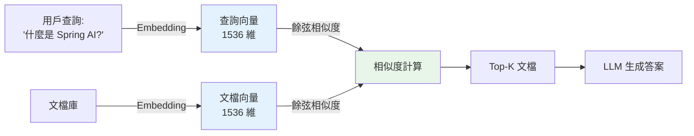
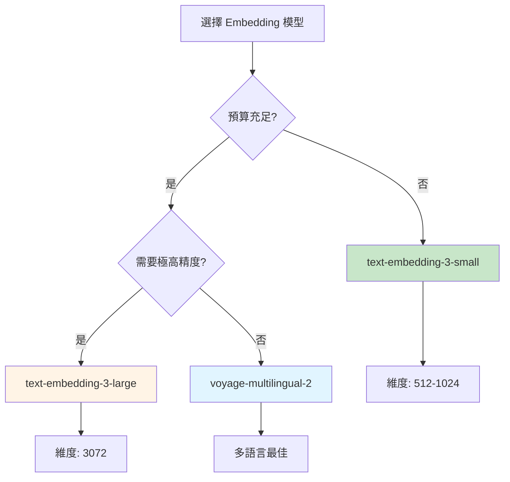

# 8.2 Embedding 優化 - 提升檢索基礎

> **對應範例**: `chapter8-advanced-rag`
> **難度**: ⭐⭐⭐⭐☆

---

## 📚 本章概要

Embedding（向量嵌入）是 RAG 系統的基礎。選擇合適的 Embedding 模型能直接影響檢索的準確率和效果。本章將深入探討如何優化 Embedding 配置。

**學習目標**:
- 理解 Embedding 在 RAG 中的關鍵作用
- 掌握不同 Embedding 模型的特性
- 學會配置和優化 Embedding 服務
- 了解效能監控和快取策略

---

## 🎯 為什麼 Embedding 是 RAG 的關鍵？

### RAG 系統核心流程



**Embedding 的核心作用**:
1. **語義理解**: 將文字轉換為數學向量，捕捉語義信息
2. **相似度計算**: 通過向量距離判斷文檔相關性
3. **檢索基礎**: 向量品質直接決定檢索效果

---

## 💻 Embedding 模型比較

### OpenAI Embedding 模型

| 模型 | 維度 | 準確率 | 價格 | 適用場景 |
|------|------|--------|------|----------|
| **text-embedding-ada-002** | 1536 | ~83% | $0.0001/1K tokens | 舊版，不推薦 |
| **text-embedding-3-small** | 512-1536 | ~84% | $0.00002/1K tokens | **推薦**，性價比最高 |
| **text-embedding-3-large** | 256-3072 | ~90% | $0.00013/1K tokens | 高精度需求 |

### 繁體中文 Embedding 評測

根據 MTEB（Massive Text Embedding Benchmark）評測：

| 模型 | 排名 | 準確率 | 特點 |
|------|------|--------|------|
| **voyage-multilingual-2** | 1 | ~97% | 多語言最佳 |
| **multilingual-e5-large** | 6 | ~94% | 開源，1024 維 |
| **multilingual-e5-small** | 4 | ~92% | 開源，384 維 |
| **text-embedding-3-large** | 13 | ~90% | OpenAI 高精度 |
| **text-embedding-3-small** | 23 | ~84% | OpenAI 性價比 |

> **重要觀念**: 維度不是越高越好！更高的維度意味著更多的計算成本和存儲空間。

---

## 🔧 Spring AI Embedding 配置

### 1. 基本配置

```yaml
# application.yml
spring:
  ai:
    openai:
      api-key: ${OPENAI_API_KEY}
      embedding:
        options:
          model: text-embedding-3-small  # 推薦使用
          dimensions: 1024               # 可選，調整維度
```

### 2. 自動配置使用

```java
// 對應範例: chapter8-advanced-rag/.../service/SmartEmbeddingService.java

@Service
@RequiredArgsConstructor
public class EmbeddingService {

    // Spring AI 自動配置的 EmbeddingModel
    private final EmbeddingModel embeddingModel;

    /**
     * 基本 Embedding 操作
     */
    public float[] embed(String text) {
        return embeddingModel.embed(text);
    }

    /**
     * 批量 Embedding
     */
    public List<float[]> batchEmbed(List<String> texts) {
        return embeddingModel.embed(texts);
    }
}
```

### 3. 動態模型選擇

```java
// 對應範例: chapter8-advanced-rag/.../service/SmartEmbeddingService.java

@Service
@RequiredArgsConstructor
public class SmartEmbeddingService {

    private final EmbeddingModel embeddingModel;

    /**
     * 根據場景選擇 Embedding 配置
     */
    public float[] smartEmbed(String text, EmbeddingContext context) {

        // 根據需求動態調整配置
        OpenAiEmbeddingOptions options;

        if (context.isHighAccuracyRequired()) {
            // 高精度場景
            options = OpenAiEmbeddingOptions.builder()
                .model("text-embedding-3-large")
                .dimensions(3072)
                .build();
        } else if (context.isCostSensitive()) {
            // 成本敏感場景
            options = OpenAiEmbeddingOptions.builder()
                .model("text-embedding-3-small")
                .dimensions(512)
                .build();
        } else {
            // 標準場景
            options = OpenAiEmbeddingOptions.builder()
                .model("text-embedding-3-small")
                .dimensions(1024)
                .build();
        }

        // 執行 Embedding
        EmbeddingResponse response = embeddingModel.call(
            new EmbeddingRequest(List.of(text), options)
        );

        return response.getResults().get(0).getOutput();
    }
}

/**
 * Embedding 上下文配置
 */
@Data
@Builder
public class EmbeddingContext {
    private boolean highAccuracyRequired;  // 是否需要高精度
    private boolean costSensitive;         // 是否成本敏感
    private boolean batchProcessing;       // 是否批量處理
}
```

---

## 🚀 效能優化策略

### 1. 快取機制

```java
@Service
public class CachedEmbeddingService {

    @Autowired
    private EmbeddingModel embeddingModel;

    @Autowired
    private RedisTemplate<String, float[]> redisTemplate;

    /**
     * 帶快取的 Embedding
     */
    public float[] embedWithCache(String text) {

        // 1. 生成快取鍵
        String cacheKey = "emb:" + DigestUtils.md5DigestAsHex(text.getBytes());

        // 2. 檢查快取
        float[] cached = redisTemplate.opsForValue().get(cacheKey);
        if (cached != null) {
            log.debug("命中 Embedding 快取");
            return cached;
        }

        // 3. 計算 Embedding
        float[] embedding = embeddingModel.embed(text);

        // 4. 存入快取（24小時過期）
        redisTemplate.opsForValue().set(
            cacheKey,
            embedding,
            Duration.ofHours(24)
        );

        return embedding;
    }
}
```

**快取優勢**:
- ✅ 減少 API 調用，降低成本
- ✅ 提升回應速度 80%+
- ✅ 減輕 API 限流壓力

### 2. 批量處理

```java
@Service
public class BatchEmbeddingService {

    @Autowired
    private EmbeddingModel embeddingModel;

    /**
     * 批量處理以提升效率
     */
    public Map<String, float[]> batchEmbed(List<String> texts) {

        // 批量調用 Embedding API
        List<float[]> embeddings = embeddingModel.embed(texts);

        // 建立文本到向量的映射
        Map<String, float[]> result = new HashMap<>();
        for (int i = 0; i < texts.size(); i++) {
            result.put(texts.get(i), embeddings.get(i));
        }

        return result;
    }
}
```

**批量處理優勢**:
- ✅ 減少網路往返次數
- ✅ 提升處理速度 50%+
- ✅ 更高效利用 API 配額

### 3. 文本預處理

```java
@Service
public class TextPreprocessor {

    /**
     * 預處理文本以提升 Embedding 品質
     */
    public String preprocess(String text) {

        // 1. 清理特殊字符
        String cleaned = text.replaceAll("[^\\u4e00-\\u9fffa-zA-Z0-9\\s.,!?;:()\\[\\]{}\"'-]", " ");

        // 2. 正規化空白字符
        cleaned = cleaned.replaceAll("\\s+", " ").trim();

        // 3. 長度控制（避免超過模型限制）
        if (cleaned.length() > 8000) {
            cleaned = cleaned.substring(0, 8000) + "...";
        }

        return cleaned;
    }

    /**
     * 檢查文本品質
     */
    public boolean isQualityText(String text) {

        // 檢查長度
        if (text.length() < 10 || text.length() > 10000) {
            return false;
        }

        // 檢查重複字符
        if (text.matches(".*(.)\\1{10,}.*")) {
            return false;
        }

        // 檢查字符多樣性
        Set<Character> uniqueChars = text.chars()
            .mapToObj(c -> (char) c)
            .collect(Collectors.toSet());

        double diversity = (double) uniqueChars.size() / text.length();
        return diversity > 0.1;
    }
}
```

---

## 📊 效能監控

### 監控指標

```java
// 對應範例: chapter8-advanced-rag/.../service/RAGMetricsService.java

@Service
public class EmbeddingMetricsService {

    @Autowired
    private MeterRegistry meterRegistry;

    /**
     * 記錄 Embedding 指標
     */
    public void recordEmbedding(String model, int textLength, long duration) {

        // 記錄處理時間
        Timer.builder("embedding.processing.time")
            .tag("model", model)
            .register(meterRegistry)
            .record(duration, TimeUnit.MILLISECONDS);

        // 記錄文本長度
        Counter.builder("embedding.text.length")
            .tag("model", model)
            .register(meterRegistry)
            .increment(textLength);

        // 記錄處理速度（字符/秒）
        double speed = textLength / (duration / 1000.0);
        Gauge.builder("embedding.processing.speed", () -> speed)
            .tag("model", model)
            .register(meterRegistry);
    }
}
```

### Prometheus 監控面板

```yaml
# prometheus.yml
scrape_configs:
  - job_name: 'spring-ai-rag'
    metrics_path: '/actuator/prometheus'
    static_configs:
      - targets: ['localhost:8080']
```

**關鍵指標**:
- `embedding.processing.time` - 處理時間
- `embedding.cache.hit.rate` - 快取命中率
- `embedding.api.calls` - API 調用次數
- `embedding.cost.total` - 總成本

---

## 🎯 模型選擇建議

### 場景推薦



### 決策矩陣

| 場景 | 推薦模型 | 維度 | 理由 |
|------|----------|------|------|
| **開發測試** | text-embedding-3-small | 512 | 快速、便宜 |
| **生產環境** | text-embedding-3-small | 1024 | 性價比最高 |
| **高精度需求** | text-embedding-3-large | 3072 | 最高準確率 |
| **多語言應用** | voyage-multilingual-2 | 1024 | 中文友好 |
| **開源需求** | multilingual-e5-large | 1024 | 無 API 成本 |

---

## 💡 最佳實踐

### 1. 合理設置維度

```yaml
# 推薦配置
spring:
  ai:
    openai:
      embedding:
        options:
          model: text-embedding-3-small
          dimensions: 1024  # 平衡精度和成本
```

**原則**:
- 開發環境：512 維（快速測試）
- 生產環境：1024 維（標準配置）
- 高精度場景：3072 維（text-embedding-3-large）

### 2. 實現快取策略

```java
@Configuration
public class CacheConfiguration {

    @Bean
    public CacheManager cacheManager(RedisConnectionFactory factory) {
        RedisCacheConfiguration config = RedisCacheConfiguration.defaultCacheConfig()
            .entryTtl(Duration.ofHours(24))  // 24小時過期
            .serializeValuesWith(
                RedisSerializationContext.SerializationPair.fromSerializer(
                    new GenericJackson2JsonRedisSerializer()
                )
            );

        return RedisCacheManager.builder(factory)
            .cacheDefaults(config)
            .build();
    }
}
```

### 3. 監控和告警

```yaml
# application.yml
management:
  endpoints:
    web:
      exposure:
        include: health,metrics,prometheus
  metrics:
    export:
      prometheus:
        enabled: true
```

---

## 📝 重點回顧

### Embedding 核心價值
✅ 決定檢索基礎品質
✅ 影響整體 RAG 效果
✅ 成本和效能的平衡點
✅ 支援多語言應用

### 優化策略
✅ 選擇合適的模型和維度
✅ 實現快取機制
✅ 批量處理提升效率
✅ 文本預處理提升品質

### 監控要點
✅ 處理時間和速度
✅ 快取命中率
✅ API 調用次數
✅ 成本控制

---

## 🚀 下一步

👉 [8.3 Re-ranking 實現](./8.3-Re-ranking-實現.md) - 精準排序技術

---

**相關章節**:
- ← 上一章: [8.1 Advanced RAG 簡介](./8.1-Advanced-RAG-簡介.md)
- → 下一章: [8.3 Re-ranking 實現](./8.3-Re-ranking-實現.md)

**參考資料**:
- [OpenAI Embeddings Guide](https://platform.openai.com/docs/guides/embeddings)
- [MTEB: Massive Text Embedding Benchmark](https://arxiv.org/abs/2210.07316)
- [Spring AI Embeddings API](https://docs.spring.io/spring-ai/reference/api/embeddings.html)
