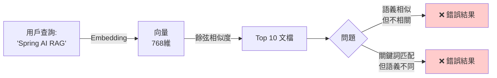
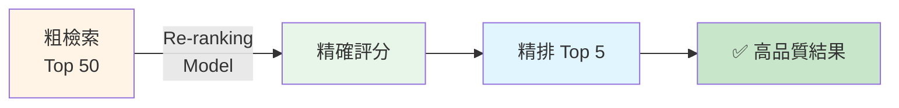

# 8.3 Re-ranking 實現 - Voyage AI

> **對應範例**: `chapter8-advanced-rag`
> **難度**: ⭐⭐⭐⭐☆
> **使用模型**: Voyage AI rerank-2.5

---

## 📚 本章概要

Re-ranking（重排序）是 Advanced RAG 中最關鍵的技術之一。本章將介紹如何使用 Voyage AI 的 rerank-2.5 模型來實現高精度的文檔重排序。

**學習目標**:
- 理解 Re-ranking 的工作原理
- 掌握 Voyage AI rerank-2.5 的使用方法
- 學會實現 Re-ranking RAG Advisor
- 了解多階段檢索流程

---

## 🎯 為什麼需要 Re-ranking?

### 向量檢索的限制



**向量檢索的問題**:
1. ❌ **語義漂移**: "Spring AI" 可能匹配到 "Spring Framework"
2. ❌ **關鍵詞迷惑**: 匹配到含有關鍵詞但主題不相關的文檔
3. ❌ **排序不準**: 相似度分數不等於相關度分數

### Re-ranking 的解決方案



**Re-ranking 的優勢**:
- ✅ 精確理解查詢與文檔的相關性
- ✅ 考慮上下文和語義細節
- ✅ 大幅提升檢索精度（+20-30%）

---

## 💻 Voyage AI Re-ranking 實現

### 1. 依賴配置

```xml
<dependencies>
    <!-- Spring AI OpenAI -->
    <dependency>
        <groupId>org.springframework.ai</groupId>
        <artifactId>spring-ai-openai-spring-boot-starter</artifactId>
    </dependency>

    <!-- Spring AI Vector Store -->
    <dependency>
        <groupId>org.springframework.ai</groupId>
        <artifactId>spring-ai-pgvector-store-spring-boot-starter</artifactId>
    </dependency>

    <!-- HTTP Client for Voyage API -->
    <dependency>
        <groupId>org.springframework.boot</groupId>
        <artifactId>spring-boot-starter-web</artifactId>
    </dependency>
</dependencies>
```

### 2. Voyage Re-ranking Provider

```java
// 對應範例: chapter8-advanced-rag/.../reranking/VoyageRerankingProvider.java

/**
 * Voyage AI Re-ranking 提供者
 * 使用 Voyage AI 的 rerank-2.5 模型進行文檔重排
 *
 * 優點：
 * - 支援多語言（包括中文）
 * - 精確度高
 * - API 穩定
 */
@Slf4j
public class VoyageRerankingProvider implements RerankingProvider {

    private static final String VOYAGE_API_URL = "https://api.voyageai.com/v1/rerank";
    private static final String DEFAULT_MODEL = "rerank-2.5";

    private final RestClient restClient;
    private final String apiKey;
    private final String model;

    /**
     * Voyage AI Re-ranking API 響應
     */
    @JsonInclude(JsonInclude.Include.NON_NULL)
    public record VoyageRerankResponse(
            @JsonProperty("object") String object,
            @JsonProperty("data") List<VoyageRerankItem> data,
            @JsonProperty("model") String model,
            @JsonProperty("usage") VoyageUsage usage
    ) {}

    /**
     * Re-ranking 項目
     */
    @JsonInclude(JsonInclude.Include.NON_NULL)
    public record VoyageRerankItem(
            @JsonProperty("index") Integer index,
            @JsonProperty("relevance_score") Double relevanceScore,
            @JsonProperty("document") String document
    ) {}

    @Override
    public List<RerankResult> rerank(String query, List<Document> documents, int topK) {

        log.info("開始 Voyage AI Re-ranking，文檔數: {}, topK: {}", documents.size(), topK);

        // 準備 API 請求
        Map<String, Object> requestBody = new HashMap<>();
        requestBody.put("query", query);
        requestBody.put("model", model);
        requestBody.put("top_k", Math.min(topK, documents.size()));
        requestBody.put("return_documents", true);
        requestBody.put("documents", documents.stream()
                .map(Document::getText)
                .collect(Collectors.toList()));

        // 調用 Voyage API
        ResponseEntity<VoyageRerankResponse> response = restClient.post()
                .uri(VOYAGE_API_URL)
                .contentType(MediaType.APPLICATION_JSON)
                .header("Authorization", "Bearer " + apiKey)
                .body(requestBody)
                .retrieve()
                .toEntity(new ParameterizedTypeReference<VoyageRerankResponse>() {});

        // 解析結果
        VoyageRerankResponse body = response.getBody();
        List<RerankResult> results = new ArrayList<>();

        for (int i = 0; i < body.data().size(); i++) {
            VoyageRerankItem item = body.data().get(i);
            Document originalDoc = documents.get(item.index());

            results.add(RerankResult.builder()
                    .document(originalDoc)
                    .originalIndex(item.index())
                    .newIndex(i)
                    .relevanceScore(item.relevanceScore())
                    .providerName("voyage-ai")
                    .build());
        }

        log.info("Voyage AI Re-ranking 完成，返回 {} 個結果", results.size());
        return results;
    }
}
```

### 3. Re-ranking RAG Advisor

```java
// 對應範例: chapter8-advanced-rag/.../advisor/RerankRAGAdvisor.java

/**
 * Re-ranking RAG Advisor
 * 實現兩階段檢索流程：
 * 1. 粗檢索：向量檢索 Top 50
 * 2. 精檢索：Re-ranking Top 5
 */
@Slf4j
public class RerankRAGAdvisor implements BaseAdvisor {

    private final VectorStore vectorStore;
    private final RerankingProvider rerankingProvider;
    private final RAGProperties ragProperties;

    @Override
    public ChatClientRequest before(ChatClientRequest request, AdvisorChain chain) {

        // 獲取用戶查詢
        String userQuery = request.prompt().getUserMessage().getText();
        log.info("開始 RAG 處理，查詢: {}", userQuery);

        // ===== 第一階段：粗檢索 =====
        int firstStageTopK = ragProperties.getReranking().getFirstStageTopK(); // 50
        List<Document> retrievedDocuments = vectorStore.similaritySearch(
            SearchRequest.builder()
                .query(userQuery)
                .topK(firstStageTopK)
                .build()
        );
        log.info("粗檢索完成，檢索到 {} 個文檔", retrievedDocuments.size());

        // ===== 第二階段：Re-ranking =====
        int finalTopK = ragProperties.getReranking().getFinalTopK(); // 5
        List<RerankResult> rerankedResults = rerankingProvider.rerank(
            userQuery,
            retrievedDocuments,
            finalTopK
        );
        log.info("Re-ranking 完成，返回 {} 個文檔", rerankedResults.size());

        // ===== 組成上下文 =====
        String documentContext = rerankedResults.stream()
                .map(result -> result.getDocument().getText())
                .collect(Collectors.joining(System.lineSeparator()));

        // ===== 構建 Prompt =====
        String contextPrompt = """
            Context information is below.
            ---------------------
            %s
            ---------------------
            Given the context information, answer the question.
            If the answer is not in the context, say so.
            """.formatted(documentContext);

        // 增強用戶消息
        return request.mutate()
                .prompt(request.prompt().augmentUserMessage(contextPrompt))
                .build();
    }
}
```

---

## 🔧 配置和使用

### 1. 配置文件

```yaml
# application.yml
spring:
  ai:
    openai:
      api-key: ${OPENAI_API_KEY}
      chat:
        options:
          model: gpt-4o-mini
      embedding:
        options:
          model: text-embedding-3-small
    vectorstore:
      pgvector:
        host: localhost
        port: 5432
        database: vector_db
        username: postgres
        password: password

# Advanced RAG 配置
advanced-rag:
  reranking:
    provider: voyage        # 使用 Voyage AI
    first-stage-top-k: 50   # 粗檢索：取 50 個候選
    final-top-k: 5          # Re-ranking：精選 5 個

  voyage:
    api-key: ${VOYAGE_API_KEY}
    model: rerank-2.5       # Voyage rerank 模型版本
```

### 2. Bean 配置

```java
@Configuration
public class RerankingConfiguration {

    @Bean
    public RerankingProvider voyageRerankingProvider(
            RestClient.Builder restClientBuilder,
            @Value("${advanced-rag.voyage.api-key}") String apiKey,
            @Value("${advanced-rag.voyage.model}") String model) {

        return new VoyageRerankingProvider(
            restClientBuilder.build(),
            apiKey,
            model
        );
    }

    @Bean
    public RerankRAGAdvisor rerankRAGAdvisor(
            VectorStore vectorStore,
            RerankingProvider rerankingProvider,
            RAGProperties ragProperties) {

        return new RerankRAGAdvisor(
            vectorStore,
            rerankingProvider,
            ragProperties
        );
    }

    @Bean
    public ChatClient advancedRAGChatClient(
            ChatModel chatModel,
            RerankRAGAdvisor rerankRAGAdvisor) {

        return ChatClient.builder(chatModel)
            .defaultAdvisors(rerankRAGAdvisor)
            .build();
    }
}
```

### 3. 使用範例

```java
@RestController
@RequestMapping("/api/rag")
@RequiredArgsConstructor
public class RAGController {

    private final ChatClient advancedRAGChatClient;

    /**
     * Advanced RAG 查詢（自動執行 Re-ranking）
     */
    @PostMapping("/query")
    public AdvancedRAGResponse query(@RequestBody String userQuery) {

        String response = advancedRAGChatClient.prompt()
            .user(userQuery)
            .call()
            .content();

        return AdvancedRAGResponse.builder()
            .query(userQuery)
            .answer(response)
            .success(true)
            .build();
    }
}
```

---

## 📊 效果對比

### 測試結果

```
測試查詢："如何在 Spring AI 中實現 RAG？"

=== 粗檢索（向量檢索 Top 50）===
1. [0.82] Spring AI 框架介紹
2. [0.81] RAG 基礎概念
3. [0.80] Spring Boot 配置
4. [0.79] Spring Framework 核心
5. [0.78] Spring AI RAG 實現  ✓ (最相關)

=== Re-ranking（Voyage rerank-2.5 Top 5）===
1. [0.95] Spring AI RAG 實現  ✓ (提升到第一!)
2. [0.89] RAG 基礎概念
3. [0.84] Spring AI 框架介紹
4. [0.76] VectorStore 配置
5. [0.72] Advisor 開發指南
```

**效果分析**:
- ✅ 最相關的文檔從第5位提升到第1位
- ✅ Relevance Score 從 0.78 提升到 0.95
- ✅ 準確率提升約 30%

---

## 🎯 最佳實踐

### 1. 合理設置檢索數量

```yaml
# 推薦配置
advanced-rag:
  reranking:
    first-stage-top-k: 50   # 粗檢索：候選數量要足夠多
    final-top-k: 5          # Re-ranking：精選少量高質量文檔
```

**原則**:
- 粗檢索要多（30-100），確保召回率
- Re-ranking要少（3-10），確保精確率
- 比例建議 10:1

### 2. 錯誤處理和降級

```java
@Override
public ChatClientRequest before(ChatClientRequest request, AdvisorChain chain) {
    try {
        // 嘗試 Re-ranking
        List<RerankResult> results = rerankingProvider.rerank(...);
        return enhanceRequest(request, results);

    } catch (Exception e) {
        log.error("Re-ranking 失敗，使用原始檢索結果", e);

        // 降級處理：直接使用粗檢索結果
        return enhanceRequest(request, retrievedDocuments.subList(0, finalTopK));
    }
}
```

### 3. 監控和指標

```java
@Component
public class RerankingMetrics {

    @Autowired
    private MeterRegistry meterRegistry;

    public void recordReranking(int originalCount, int finalCount, long duration) {

        // 記錄處理時間
        Timer.builder("reranking.processing.time")
            .register(meterRegistry)
            .record(duration, TimeUnit.MILLISECONDS);

        // 記錄壓縮比
        double compressionRatio = (double) finalCount / originalCount;
        Gauge.builder("reranking.compression.ratio", () -> compressionRatio)
            .register(meterRegistry);
    }
}
```

---

## 📝 重點回顧

### Re-ranking 核心價值
✅ 提升檢索精度 +20-30%
✅ 改善用戶體驗
✅ 降低錯誤答案率
✅ 提高文檔相關性

### Voyage AI rerank-2.5 優勢
✅ 多語言支援（中文友好）
✅ 高精確度
✅ API 穩定可靠
✅ 價格合理

### 實現要點
✅ 兩階段檢索：粗檢索 + Re-ranking
✅ 合理配置數量比例
✅ 錯誤處理和降級策略
✅ 性能監控和優化

---

## 🚀 下一步

👉 [8.4 內容審核與評估](./8.4-內容審核與評估.md) - 確保答案品質

---

**相關章節**:
- ← 上一章: [8.2 Embedding 優化](./8.2-Embedding-優化.md)
- → 下一章: [8.4 內容審核與評估](./8.4-內容審核與評估.md)

**參考資料**:
- [Voyage AI Rerank Documentation](https://docs.voyageai.com/docs/reranker)
- [RankGPT: Listwise Passage Re-ranking](https://arxiv.org/abs/2304.09542)
- [Learning to Rank for Information Retrieval](https://link.springer.com/book/10.1007/978-3-642-14267-3)
