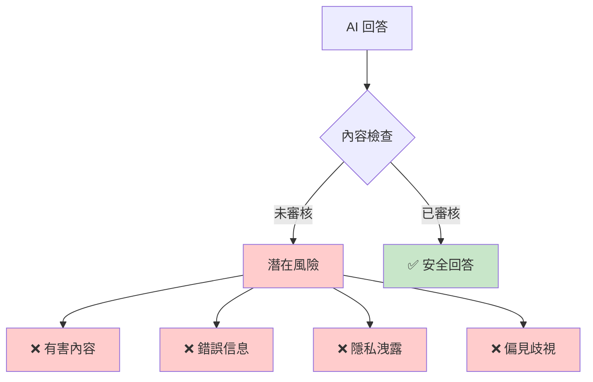
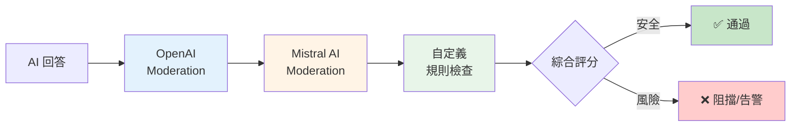
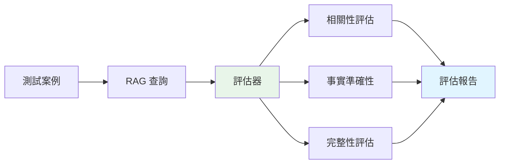

# 8.4 內容審核與評估測試

> **對應範例**: `chapter8-advanced-rag`
> **難度**: ⭐⭐⭐⭐☆

---

## 📚 本章概要

在企業級 AI 應用中，內容安全和品質保證至關重要。本章將介紹如何建立完整的內容審核和評估測試系統。

**學習目標**:
- 理解 AI 內容安全的重要性
- 掌握多層審核策略
- 學會建立 RAG 評估測試框架
- 了解持續監控和優化方法

---

## 🎯 為什麼需要內容審核與評估？

### AI 系統的風險



**主要風險**:
1. ❌ **有害內容**: 暴力、色情、仇恨言論
2. ❌ **錯誤信息**: 事實錯誤、誤導性內容
3. ❌ **隱私洩露**: 個人信息、商業機密
4. ❌ **偏見歧視**: 性別、種族、年齡歧視

---

## 💻 多層內容審核系統

### 審核架構



### 1. OpenAI Moderation

```java
// 對應範例: chapter8-advanced-rag/.../service/ContentModerationService.java

@Service
@RequiredArgsConstructor
public class ContentModerationService {

    private final OpenAiModerationModel openAiModerationModel;

    /**
     * OpenAI 內容審核
     */
    public ModerationResult moderateWithOpenAI(String content) {

        // 調用 OpenAI Moderation API
        ModerationPrompt prompt = new ModerationPrompt(content);
        ModerationResponse response = openAiModerationModel.call(prompt);

        Moderation moderation = response.getResult().getOutput();
        ModerationResult result = moderation.getResults().get(0);

        // 檢查各類別
        boolean isFlagged = result.isFlagged();
        Map<String, Boolean> categories = extractCategories(result);
        Map<String, Double> scores = extractScores(result);

        log.info("OpenAI 審核完成，是否標記: {}", isFlagged);

        return ModerationResult.builder()
            .provider("OpenAI")
            .flagged(isFlagged)
            .categories(categories)
            .scores(scores)
            .build();
    }

    private Map<String, Boolean> extractCategories(ModerationResult result) {
        Categories cat = result.getCategories();
        return Map.of(
            "sexual", cat.isSexual(),
            "hate", cat.isHate(),
            "harassment", cat.isHarassment(),
            "self_harm", cat.isSelfHarm(),
            "violence", cat.isViolence()
        );
    }

    private Map<String, Double> extractScores(ModerationResult result) {
        CategoryScores scores = result.getCategoryScores();
        return Map.of(
            "sexual", scores.getSexual(),
            "hate", scores.getHate(),
            "harassment", scores.getHarassment(),
            "self_harm", scores.getSelfHarm(),
            "violence", scores.getViolence()
        );
    }
}
```

**OpenAI Moderation 檢查類別**:
- `sexual` - 色情內容
- `hate` - 仇恨言論
- `harassment` - 騷擾內容
- `self-harm` - 自殘內容
- `violence` - 暴力內容

### 2. 自定義規則檢查

```java
// 對應範例: chapter8-advanced-rag/.../service/CustomRuleModerationService.java

@Service
public class CustomRuleModerationService {

    /**
     * 自定義規則審核
     */
    public ModerationResult customModeration(String content) {

        Map<String, Boolean> violations = new HashMap<>();

        // 1. 敏感詞檢查
        boolean hasSensitiveWords = checkSensitiveWords(content);
        violations.put("sensitive_words", hasSensitiveWords);

        // 2. 個人信息檢查（PII）
        boolean containsPII = checkPersonalInfo(content);
        violations.put("personal_info", containsPII);

        // 3. 企業政策檢查
        boolean violatesPolicy = checkEnterprisePolicy(content);
        violations.put("enterprise_policy", violatesPolicy);

        boolean isFlagged = violations.values().stream().anyMatch(v -> v);

        return ModerationResult.builder()
            .provider("CustomRules")
            .flagged(isFlagged)
            .categories(violations)
            .build();
    }

    /**
     * 檢查敏感詞
     */
    private boolean checkSensitiveWords(String content) {
        List<String> sensitiveWords = List.of(
            "機密", "內部資料", "密碼", "個資"
        );

        return sensitiveWords.stream()
            .anyMatch(word -> content.toLowerCase().contains(word.toLowerCase()));
    }

    /**
     * 檢查個人信息（台灣）
     */
    private boolean checkPersonalInfo(String content) {

        // 身份證號碼（台灣）
        Pattern idPattern = Pattern.compile("[A-Z]\\d{9}");
        if (idPattern.matcher(content).find()) {
            return true;
        }

        // 電話號碼
        Pattern phonePattern = Pattern.compile("\\b\\d{4}-\\d{6}\\b|\\b09\\d{8}\\b");
        if (phonePattern.matcher(content).find()) {
            return true;
        }

        // 電子郵件
        Pattern emailPattern = Pattern.compile("\\b[A-Za-z0-9._%+-]+@[A-Za-z0-9.-]+\\.[A-Z|a-z]{2,}\\b");
        if (emailPattern.matcher(content).find()) {
            return true;
        }

        return false;
    }

    private boolean checkEnterprisePolicy(String content) {
        // 根據企業政策進行檢查
        return false;
    }
}
```

### 3. 綜合審核服務

```java
@Service
@RequiredArgsConstructor
public class ComprehensiveModerationService {

    private final ContentModerationService openAIModeration;
    private final CustomRuleModerationService customModeration;

    /**
     * 多層審核
     */
    public FinalModerationResult comprehensiveModerate(String content) {

        List<ModerationResult> results = new ArrayList<>();

        // 1. OpenAI 審核
        try {
            results.add(openAIModeration.moderateWithOpenAI(content));
        } catch (Exception e) {
            log.warn("OpenAI 審核失敗: {}", e.getMessage());
        }

        // 2. 自定義規則審核
        results.add(customModeration.customModeration(content));

        // 3. 綜合評估
        return evaluateResults(results);
    }

    private FinalModerationResult evaluateResults(List<ModerationResult> results) {

        // 計算風險分數（加權平均）
        double totalRiskScore = 0.0;
        double openAIWeight = 0.6;
        double customWeight = 0.4;

        for (ModerationResult result : results) {
            if (result.isFlagged()) {
                double weight = "OpenAI".equals(result.getProvider()) ?
                    openAIWeight : customWeight;
                totalRiskScore += weight;
            }
        }

        // 判斷是否阻擋
        boolean shouldBlock = totalRiskScore >= 0.5;

        return FinalModerationResult.builder()
            .passed(!shouldBlock)
            .riskScore(totalRiskScore)
            .results(results)
            .recommendation(shouldBlock ? "建議阻擋" : "內容安全")
            .build();
    }
}
```

---

## 📊 RAG 系統評估測試

### 評估架構



### 1. 評估測試服務

```java
// 對應範例: chapter8-advanced-rag/.../service/RAGEvaluationService.java

@Service
@RequiredArgsConstructor
public class RAGEvaluationService {

    private final ChatClient ragChatClient;
    private final VectorStore vectorStore;

    /**
     * 評估 RAG 系統
     */
    public EvaluationReport evaluateRagSystem(List<TestCase> testCases) {

        List<EvaluationResult> results = new ArrayList<>();

        for (TestCase testCase : testCases) {
            try {
                // 執行查詢
                String response = ragChatClient.prompt()
                    .user(testCase.getQuestion())
                    .call()
                    .content();

                // 評估結果
                EvaluationResult result = evaluateResponse(
                    testCase,
                    response
                );

                results.add(result);

            } catch (Exception e) {
                log.error("評估測試案例失敗: {}", testCase.getId(), e);
            }
        }

        return generateReport(results);
    }

    /**
     * 評估單一回應
     */
    private EvaluationResult evaluateResponse(TestCase testCase, String response) {

        // 1. 相關性評估
        double relevancyScore = evaluateRelevancy(
            testCase.getQuestion(),
            response
        );

        // 2. 完整性評估
        double completenessScore = evaluateCompleteness(
            testCase.getExpectedKeywords(),
            response
        );

        // 3. 連貫性評估
        double coherenceScore = evaluateCoherence(response);

        return EvaluationResult.builder()
            .testCaseId(testCase.getId())
            .question(testCase.getQuestion())
            .response(response)
            .relevancyScore(relevancyScore)
            .completenessScore(completenessScore)
            .coherenceScore(coherenceScore)
            .build();
    }

    /**
     * 相關性評估
     */
    private double evaluateRelevancy(String question, String response) {
        // 簡單的關鍵詞匹配
        String[] queryWords = question.toLowerCase().split("\\s+");
        String lowerResponse = response.toLowerCase();

        long matchCount = Arrays.stream(queryWords)
            .filter(lowerResponse::contains)
            .count();

        return (double) matchCount / queryWords.length;
    }

    /**
     * 完整性評估
     */
    private double evaluateCompleteness(List<String> keywords, String response) {
        if (keywords.isEmpty()) {
            return 1.0;
        }

        long matchCount = keywords.stream()
            .filter(keyword -> response.toLowerCase().contains(keyword.toLowerCase()))
            .count();

        return (double) matchCount / keywords.size();
    }

    /**
     * 連貫性評估
     */
    private double evaluateCoherence(String response) {
        String[] sentences = response.split("\\.");

        if (sentences.length <= 1) {
            return 1.0;
        }

        // 簡單的句子長度變異度檢查
        double avgLength = Arrays.stream(sentences)
            .mapToInt(String::length)
            .average()
            .orElse(0.0);

        double variance = Arrays.stream(sentences)
            .mapToDouble(s -> Math.pow(s.length() - avgLength, 2))
            .average()
            .orElse(0.0);

        return Math.max(0.0, 1.0 - (variance / (avgLength * avgLength)));
    }

    /**
     * 生成評估報告
     */
    private EvaluationReport generateReport(List<EvaluationResult> results) {

        double avgRelevancy = results.stream()
            .mapToDouble(EvaluationResult::getRelevancyScore)
            .average()
            .orElse(0.0);

        double avgCompleteness = results.stream()
            .mapToDouble(EvaluationResult::getCompletenessScore)
            .average()
            .orElse(0.0);

        double avgCoherence = results.stream()
            .mapToDouble(EvaluationResult::getCoherenceScore)
            .average()
            .orElse(0.0);

        double overallScore = (avgRelevancy + avgCompleteness + avgCoherence) / 3.0;

        return EvaluationReport.builder()
            .totalTests(results.size())
            .avgRelevancyScore(avgRelevancy)
            .avgCompletenessScore(avgCompleteness)
            .avgCoherenceScore(avgCoherence)
            .overallScore(overallScore)
            .results(results)
            .timestamp(Instant.now())
            .build();
    }
}
```

### 2. 測試案例定義

```java
/**
 * 測試案例
 */
@Data
@Builder
public class TestCase {
    private String id;
    private String question;                    // 測試問題
    private List<String> expectedKeywords;      // 期望包含的關鍵詞
    private String expectedAnswer;              // 期望答案（可選）
    private String category;                    // 類別
}
```

### 3. 測試案例範例

```json
// test-cases/basic-qa.json
[
  {
    "id": "test-1",
    "question": "什麼是 Spring AI？",
    "expectedKeywords": ["Spring", "AI", "框架", "人工智慧"],
    "category": "basic"
  },
  {
    "id": "test-2",
    "question": "如何配置 OpenAI？",
    "expectedKeywords": ["OpenAI", "配置", "API", "application.yml"],
    "category": "configuration"
  },
  {
    "id": "test-3",
    "question": "RAG 是什麼意思？",
    "expectedKeywords": ["RAG", "檢索", "增強", "生成"],
    "category": "concept"
  }
]
```

---

## 🔄 持續監控與自動化

### 定期評估服務

```java
@Service
@RequiredArgsConstructor
public class ContinuousEvaluationService {

    private final RAGEvaluationService evaluationService;
    private final TestCaseRepository testCaseRepository;

    /**
     * 定期執行評估（每小時）
     */
    @Scheduled(fixedRate = 3600000)
    public void performContinuousEvaluation() {

        log.info("開始定期評估...");

        // 載入測試案例
        List<TestCase> testCases = testCaseRepository.findActiveTestCases();

        // 執行評估
        EvaluationReport report = evaluationService.evaluateRagSystem(testCases);

        // 檢查品質閾值
        checkQualityThresholds(report);

        // 儲存報告
        saveReport(report);

        log.info("定期評估完成，總體分數: {}", report.getOverallScore());
    }

    private void checkQualityThresholds(EvaluationReport report) {

        // 相關性閾值
        if (report.getAvgRelevancyScore() < 0.8) {
            log.warn("相關性分數過低: {}", report.getAvgRelevancyScore());
            // 發送告警
        }

        // 完整性閾值
        if (report.getAvgCompletenessScore() < 0.7) {
            log.warn("完整性分數過低: {}", report.getAvgCompletenessScore());
        }

        // 總體分數閾值
        if (report.getOverallScore() < 0.75) {
            log.error("總體品質分數過低: {}", report.getOverallScore());
            // 發送緊急告警
        }
    }

    private void saveReport(EvaluationReport report) {
        // 儲存到資料庫或文件系統
        try {
            ObjectMapper mapper = new ObjectMapper();
            String json = mapper.writeValueAsString(report);

            Path reportPath = Paths.get("reports",
                "evaluation-" + Instant.now().toString() + ".json");

            Files.createDirectories(reportPath.getParent());
            Files.writeString(reportPath, json);

        } catch (Exception e) {
            log.error("儲存報告失敗", e);
        }
    }
}
```

---

## 📈 監控面板

### Prometheus 指標

```java
@Component
public class RAGMetricsService {

    @Autowired
    private MeterRegistry meterRegistry;

    /**
     * 記錄評估指標
     */
    public void recordEvaluation(EvaluationReport report) {

        // 相關性分數
        Gauge.builder("rag.evaluation.relevancy", () -> report.getAvgRelevancyScore())
            .register(meterRegistry);

        // 完整性分數
        Gauge.builder("rag.evaluation.completeness", () -> report.getAvgCompletenessScore())
            .register(meterRegistry);

        // 連貫性分數
        Gauge.builder("rag.evaluation.coherence", () -> report.getAvgCoherenceScore())
            .register(meterRegistry);

        // 總體分數
        Gauge.builder("rag.evaluation.overall", () -> report.getOverallScore())
            .register(meterRegistry);
    }
}
```

---

## 📝 重點回顧

### 內容審核
✅ 多層審核策略（OpenAI + 自定義）
✅ 風險分數計算
✅ 自動化阻擋/告警
✅ 個人信息保護

### RAG 評估
✅ 相關性評估
✅ 完整性評估
✅ 連貫性評估
✅ 持續監控

### 品質保證
✅ 自動化測試
✅ 定期評估
✅ 閾值告警
✅ 報告存檔

---

## 🚀 下一步

👉 返回 [第8章總覽](./README.md)

---

**相關章節**:
- ← 上一章: [8.3 Re-ranking 實現](./8.3-Re-ranking-實現.md)
- ↑ 返回: [第8章總覽](./README.md)

**參考資料**:
- [OpenAI Moderation API](https://platform.openai.com/docs/guides/moderation)
- [Content Moderation Best Practices](https://openai.com/blog/using-gpt-3-for-content-moderation)
- [Spring AI Advisors](https://docs.spring.io/spring-ai/reference/api/advisors.html)
